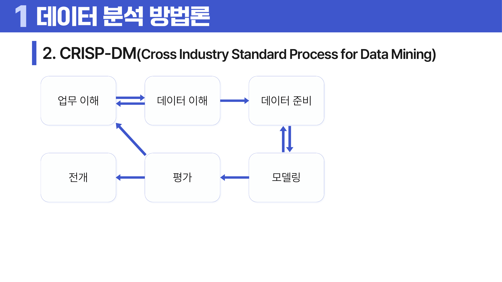
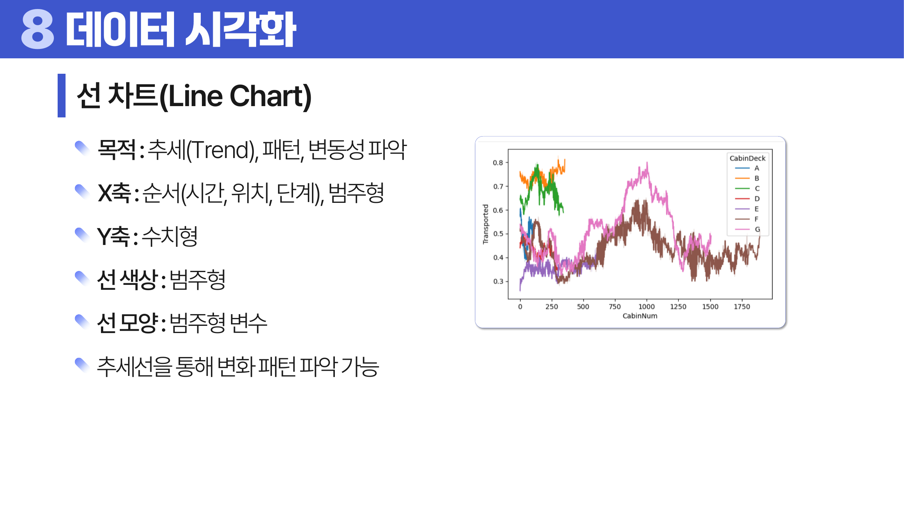
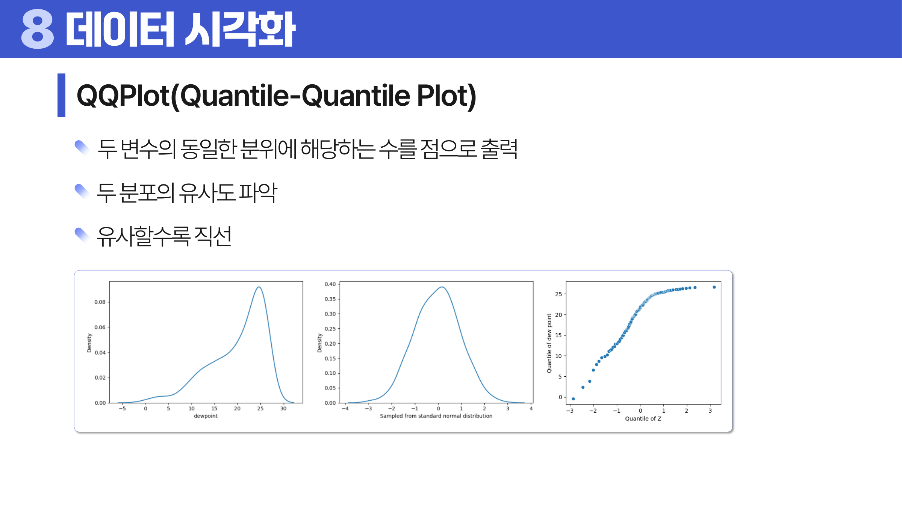
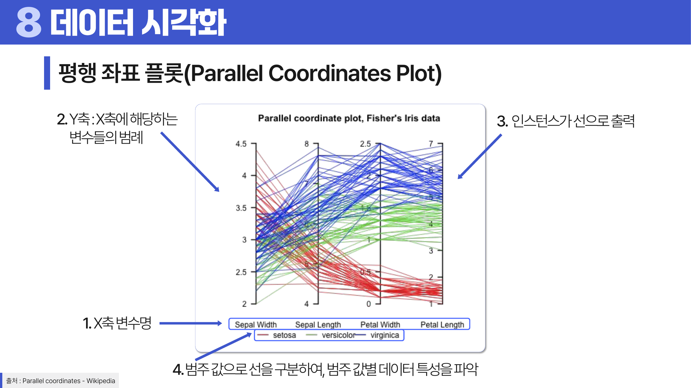

# 01. 데이터의 이해

## 학습 목표

이 차시를 마치면 다음을 쉬운 말로 설명할 수 있으면 충분하다.

- 데이터 표에서 행과 열이 무엇을 뜻하는지 말할 수 있다.
- 숫자처럼 보이는 값도 수치형이 아닐 수 있음을 설명할 수 있다.
- 정형, 반정형, 비정형 데이터를 예로 구분할 수 있다.
- 선 차트, QQ plot, 평행 좌표 플롯이 각각 무엇을 보려는 그림인지 말할 수 있다.
- KDD와 CRISP-DM을 “분석 프로젝트의 진행 순서”로 이해할 수 있다.

## 오늘의 한 줄

데이터 분석의 첫 단계는 모델을 고르는 것이 아니라, **표의 한 행과 한 열이 현실의 무엇을 뜻하는지 이해하는 것**이다.

## 오늘 반드시 이해할 3가지

1. 데이터 분석은 모델부터 시작하지 않고, **한 행이 무엇을 뜻하는지** 확인하는 일에서 시작한다.
2. 숫자로 저장된 값이 모두 수치형 변수는 아니다. **측정 척도와 변수 역할**을 먼저 봐야 한다.
3. 시각화는 결과 장식이 아니라, 모델링 전에 **데이터 구조와 위험을 눈으로 점검하는 도구**다.

## 이 차시 전에 알면 좋은 것

- **표**: 데이터를 행과 열로 놓고 읽는 기본 형태
- **질문**: 분석은 답할 질문이 있어야 시작된다
- **변수**: 관측 대상의 특징을 적은 칸

## 개념 지도

데이터 분석은 보통 다음 흐름을 가진다.

```text
문제 정의
→ 분석 대상과 단위 정의
→ 데이터 형태와 변수 구조 파악
→ 품질과 결측, 이상치 확인
→ 탐색적 시각화
→ 모델링 가능성 판단
```

1차시의 핵심은 “데이터가 있다”는 말을 더 정확하게 바꾸는 것이다. 어떤 데이터든 바로 모델에 넣을 수 있는 것이 아니라, 먼저 다음 질문에 답해야 한다.

- 한 행은 무엇을 의미하는가?
- 한 열은 무엇을 측정하는가?
- 각 값은 어떤 단위와 척도로 기록되었는가?
- 이 데이터는 어떤 분석 질문에 답할 수 있고, 어떤 질문에는 답할 수 없는가?
- 시각화는 무엇을 보여 주며, 무엇을 숨기는가?

## 학습 우선순위

- **필수**: 행, 열, 관측치, 변수의 차이, 정량/정성 데이터 구분, 질문에 맞는 시각화 선택
- **심화**: 척도와 변수 역할을 모델링 관점으로 연결
- **확장**: 빅데이터 5V를 실제 프로젝트 진단에 적용

## 이 차시에서 꼭 붙잡을 설명 방식

이 자료는 “정형 데이터는 표 형태다”처럼 결론만 외우게 하지 않는다. 항상 이유를 함께 본다.

예를 들어 “고객 ID는 숫자로 저장되어도 평균을 내면 안 된다”는 말의 이유는 다음과 같다.

1. 평균은 숫자 사이의 크기 차이가 의미 있다고 가정한다.
2. 고객 ID `1001`과 `1002`의 차이 1은 고객 특성의 차이가 아니다.
3. 따라서 ID의 평균은 현실에서 해석할 대상이 없다.
4. 그래서 숫자로 저장되어도 분석에서는 식별자로 다룬다.

## 핵심 이론

### 먼저 잡는 직관

- **KDD/CRISP-DM**: 분석 프로젝트가 어디서 시작해서 어디로 돌아오는지 보여 주는 지도.
- **데이터 형태**: 데이터가 얼마나 바로 표처럼 읽히는지에 대한 구분.
- **변수와 단위**: 데이터프레임에서 행과 열이 실제 세계의 무엇을 뜻하는지 정하는 약속.
- **시각화**: 데이터의 모양을 먼저 보고, 어떤 통계나 모델을 써도 되는지 점검하는 과정.

### 1. KDD와 CRISP-DM

처음에는 약어를 외우려고 하지 않아도 된다. 둘 다 “<a id="ref-01-데이터"></a>[데이터](#note-01-데이터) 분석 프로젝트가 보통 어떤 순서로 진행되는지”를 정리한 지도라고 보면 된다.

**KDD(Knowledge Discovery in Database/Databases)**는 데이터베이스 안에서 유용한 지식을 발견하는 과정이다. 자료에 따라 `Database`와 `Databases` 표기가 함께 쓰인다. 일반적인 단계는 다음과 같다.

| 단계 | 의미 |
|---|---|
| 데이터셋 선택 | 분석 목적과 관련 있는 데이터를 고른다. |
| 전처리 | 결측, 오류, 중복, 이상치를 점검한다. |
| 변환 | 분석에 적합한 변수와 표현으로 바꾼다. |
| 데이터 마이닝 | 패턴, 규칙, 모델을 찾는다. |
| 해석과 평가 | 발견된 결과가 의미 있고 쓸 수 있는지 판단한다. |

**CRISP-DM(Cross Industry Standard Process for Data Mining)**은 비즈니스 문제 해결을 더 명시적으로 포함한다.



> **그림 읽기**: 업무 이해에서 시작해 데이터 이해, 준비, 모델링, 평가, 전개로 이어지는 순환을 본다. 분석은 한 번 실행하고 끝나는 일이 아니라 문제 정의로 다시 돌아오며 개선된다.

| 단계 | 의미 |
|---|---|
| 업무 이해 | 풀어야 할 문제, 성공 기준, 제약을 정의한다. |
| 데이터 이해 | 사용 가능한 데이터의 범위와 품질을 파악한다. |
| 데이터 준비 | 모델링 가능한 형태로 정제하고 변환한다. |
| 모델링 | 분석 모델을 만들고 학습한다. |
| 평가 | 모델이 업무 목적에 맞는지 검증한다. |
| 전개 | 실제 의사결정이나 서비스에 적용한다. |

둘의 차이는 강조점이다. KDD는 “데이터에서 지식을 발견한다”에 가깝고, CRISP-DM은 “업무 문제를 데이터로 해결한다”에 가깝다. 실제 프로젝트에서는 한 번에 직선으로 끝나지 않는다. 모델링 단계에서 데이터 품질 문제가 보이면 다시 데이터 준비로 돌아간다.

### 2. 데이터 형태

데이터 형태는 “이 데이터를 바로 표처럼 읽을 수 있는가?”를 묻는 기준이다.

데이터는 구조화 정도에 따라 나눌 수 있다.

| 구분 | 특징 | 예 |
|---|---|---|
| 정형 데이터 | 행과 열, 스키마가 명확하다. 검색, 집계, 조인이 쉽다. | 데이터프레임, DB 테이블 |
| 반정형 데이터 | 고정된 테이블은 아니지만 태그나 키-값 구조가 있다. | JSON, XML, HTML |
| 비정형 데이터 | 명시적 행과 열이 없고 의미 추출이 필요하다. | 이미지, 음성, 문서, 동영상 |

중요한 점은 저장 형태에 따라 준비 과정이 달라진다는 것이다. 비정형 데이터도 임베딩, 라벨, 특징 추출을 거치면 정형 데이터처럼 모델에 입력될 수 있다. 반대로 정형 데이터라도 <a id="ref-01-변수"></a>[변수](#note-01-변수) 정의가 부정확하면 분석 가치가 낮다.

### 3. 정량적 데이터와 정성적 데이터

**<a id="ref-01-정량적-데이터"></a>[정량적 데이터](#note-01-정량적-데이터)**는 수치로 크기, 빈도, 정도를 표현한다. 예를 들어 수면 시간, 매출, 온도, 클릭 수가 여기에 해당한다. 평균, 분산, 상관계수 같은 통계량을 계산하기 좋다.

**정성적 데이터**는 속성, 의미, 감정, 범주, 의견을 표현한다. 리뷰 텍스트, 색상, 장르, 고객 불만 유형이 여기에 해당한다. 이유와 맥락을 설명하는 데 강하지만, 분석을 위해서는 범주화, 인코딩, 텍스트 처리 같은 변환이 필요하다.

정량적 데이터가 항상 더 객관적인 것은 아니다. “만족도 5점”도 설문 문항의 표현, 응답자의 해석, 표본 구성에 영향을 받는다. 수치가 있다고 해서 곧바로 정확한 측정이라고 볼 수 없다.

### 4. 단위, 변수, 관측치

초심자에게 가장 중요한 부분이다. 데이터 표를 볼 때는 값을 계산하기 전에 “한 행이 무엇인가?”부터 확인한다.

데이터프레임을 해석할 때 가장 먼저 볼 것은 행과 열의 의미다.

| 개념 | 의미 | 예 |
|---|---|---|
| 단위(Unit) | 관찰의 기본 대상 | 고객 1명, 거래 1건, 상품 1개, 환자 1명 |
| 변수(Variable) | 단위에 대해 측정한 속성 | 나이, 구매액, 진단명, 클릭 수 |
| 관측치(Observation/Record) | 특정 단위 하나에 대해 기록된 한 행 | 고객 A 한 명의 기록 |
| 관측값(Value) | 특정 단위에서 특정 변수에 기록된 한 칸의 값 | 고객 A의 나이 32 |
| 메타데이터 | 변수의 이름, 단위, 타입, 의미, 생성 방식 | `purchase_amount`: 원화 기준 결제액 |

같은 데이터라도 단위를 잘못 잡으면 분석 질문이 바뀐다.

예를 들어 거래 데이터에서 한 행이 “거래 1건”이면 고객별 구매 성향을 보려면 고객 단위로 집계해야 한다. 이유는 간단하다. 거래가 많은 고객은 표에 여러 번 등장하고, 거래가 적은 고객은 한두 번만 등장한다. 이 상태에서 고객 이탈을 예측하면 “고객 1명”이 아니라 “거래 1건”을 기준으로 판단하게 된다. 즉, 자주 산 사람이 분석에서 더 큰 목소리를 갖게 된다.

반대로 한 행이 “고객 1명”이면 거래 순서나 재구매 간격 같은 시간 구조는 이미 사라졌을 수 있다. 그래서 분석 질문에 맞게 행의 단위를 먼저 확인해야 한다.

### 5. 변수의 역할과 척도

변수는 고정된 본질보다 분석 목적에 따라 역할이 달라진다.

| 역할 | 설명 |
|---|---|
| 식별자 | 행을 구분하지만 보통 예측 정보로 쓰지 않는다. 예: 고객 ID |
| 설명 변수 | 모델의 입력으로 쓰는 변수다. |
| 목표 변수 | 예측하거나 설명하려는 대상이다. |
| 시간 변수 | 순서, 주기, 지연 효과를 정의한다. |
| 그룹 변수 | 집단 비교나 층화에 쓰인다. |

<a id="ref-01-척도"></a>[척도](#note-01-척도)도 중요하다.

| 척도 | 예 | 가능한 해석 |
|---|---|---|
| 명목 척도 | 혈액형, 지역, 상품군 | 같음/다름 |
| 순서 척도 | 만족도 등급, 위험 등급 | 순서 |
| 등간 척도 | 섭씨 온도 | 차이 |
| 비율 척도 | 키, 매출, 시간 | 차이와 비율 |

우편번호나 상품 코드는 숫자로 저장되어도 수치형 변수가 아니다. 평균을 내거나 거리 계산에 넣으면 의미가 왜곡된다.

왜냐하면 평균과 거리는 “숫자 사이의 차이”가 실제 차이를 뜻할 때만 의미가 있기 때문이다. 키 170cm와 180cm의 차이 10cm는 실제 키 차이다. 하지만 상품 코드 170과 180의 차이 10은 상품이 10만큼 더 크거나 비싸다는 뜻이 아니다.

### 6. 변수의 수와 시간 구조

데이터를 이해할 때는 변수의 타입뿐 아니라 변수의 수와 시간 구조도 봐야 한다.

| 구분 | 질문 | 예 |
|---|---|---|
| 일변량 | 한 변수의 분포는 어떤가? | 고객 연령 분포, 월 매출 분포 |
| 이변량 | 두 변수는 어떤 관계인가? | 광고비와 매출, 결실율과 수확량 |
| 다변량 | 여러 변수가 함께 어떤 구조를 만드는가? | 고객 세그먼트, 질병 위험 요인 조합 |

시간 구조도 분석 방법을 바꾼다.

| 구분 | 의미 | 주의점 |
|---|---|---|
| 횡단면 데이터 | 한 시점에 여러 단위를 관찰한다. | 집단 차이는 볼 수 있지만 변화는 직접 보기 어렵다. |
| 시계열 데이터 | 한 단위를 여러 시점에 관찰한다. | 추세, 계절성, 자기상관을 고려해야 한다. |
| 패널 데이터 | 여러 단위를 여러 시점에 반복 관찰한다. | 단위 간 차이와 시간 변화를 함께 다룬다. |

예를 들어 고객별 현재 구독 상태만 있으면 횡단면 분석에 가깝다. 고객별 월별 결제 이력이 있으면 패널 데이터가 되며, 이탈 직전의 행동 변화처럼 시간적 패턴을 볼 수 있다.

### 7. 빅데이터의 3V와 5V

빅데이터는 단순히 “큰 데이터”가 아니다. 보통 다음 특성으로 설명한다.

처음에는 Volume, Velocity, Variety를 묶어 3V라고 보고, 여기에 Veracity와 Value를 더해 5V로 확장해서 이해한다.

| 요소 | 의미 | 분석상 위험 |
|---|---|---|
| Volume | 데이터 양이 많다. | 저장과 연산 비용이 커진다. |
| Velocity | 생성과 처리 속도가 빠르다. | 지연, 실시간 품질 관리가 문제가 된다. |
| Variety | 형식이 다양하다. | 서로 다른 스키마와 의미를 맞춰야 한다. |
| Veracity | 신뢰성과 품질 문제가 있다. | 노이즈가 많으면 큰 데이터도 잘못된 결론을 만든다. |
| Value | 쓸모 있는 가치가 있어야 한다. | 분석 결과가 의사결정과 연결되지 않으면 비용만 증가한다. |

큰 데이터는 표본오차를 줄일 수 있지만, 편향을 자동으로 해결하지 않는다. 수집 경로가 편향되어 있으면 데이터가 클수록 잘못된 결론을 더 확신하게 된다.

이유는 데이터가 많아져도 “빠진 사람”은 계속 빠져 있기 때문이다. 예를 들어 특정 앱 사용자만 모은 데이터가 1억 건이어도, 그 앱을 쓰지 않는 사람의 행동은 들어오지 않는다. 크기는 커졌지만 대표성 문제는 그대로 남는다.

### 8. 시각화는 변수 타입과 질문의 함수다

처음에는 차트 이름을 모두 외우지 않아도 된다. “시간을 보는가, 분포를 보는가, 관계를 보는가”만 구분하면 된다.

차트는 예쁜 그림이 아니라 질문에 맞는 요약 방식이다.

| 질문 | 적합한 차트 | 주의점 |
|---|---|---|
| 시간에 따른 추세는? | 선 차트, 이동평균 | 계절성, 기준 시점, 축 왜곡 |
| 두 범주의 조합에 따라 추세가 달라지는가? | 상호작용 차트 | 선이 교차하거나 기울기가 다르면 상호작용 가능성 |
| 범주별 크기 비교는? | 막대 차트, 파레토 차트 | 정렬 기준, 비율과 절대값 구분 |
| 범주의 구성비는? | 파이 차트, 누적 막대 차트 | 범주가 많으면 비교가 어렵다. |
| 한 수치 변수의 분포는? | 히스토그램, KDE, 박스 플롯, 바이올린 플롯 | 구간 폭, 꼬리, 이상치 |
| 두 수치 변수의 관계는? | 산점도, 등고선 그래프 | 상관과 인과 혼동 |
| 두 분포가 비슷한가? | QQ plot | 직선에서 벗어나는 패턴 해석 |
| 두 범주형 변수의 패턴은? | 히트맵, 교차표, 상호작용 차트 | 표본 수가 작은 셀 주의 |
| 많은 변수의 패턴은? | 평행 좌표 플롯 | 변수 스케일을 맞추지 않으면 해석이 어렵다. |
| 작은 수치 표본을 직접 읽고 싶은가? | 줄기-잎 그림 | 큰 데이터에는 부적합하다. |

시간에 따른 변화는 선 차트로 먼저 본다. 선은 “순서가 있는 축” 위에서 패턴을 보여 준다.



> **그림 읽기**: x축의 순서와 y축의 변화를 먼저 본다. 점 하나보다 이어지는 방향과 기울기가 추세를 말해 준다.

선 차트에서 x축은 시간, 위치, 단계처럼 순서가 있는 값이 자연스럽고, y축은 매출이나 온도처럼 수치형 값이 온다. 선 색상이나 선 모양은 집단을 구분할 때 쓴다. 이동평균 같은 추세선은 현재 기준점 전후의 값을 평균내어 들쭉날쭉한 변동을 줄이고 큰 흐름을 보게 해 준다.

상호작용 차트는 두 범주형 변수가 대상 변수에 함께 어떤 영향을 주는지 볼 때 쓴다. x축에는 시간, 위치, 단계 또는 범주를 두고, y축에는 수치형 대상 변수를 둔다. 선 색상은 범주를 나타낸다. 특정 범주의 선만 전체 추세와 다르게 움직이거나 선들이 서로 교차하면, 두 조건이 따로따로가 아니라 함께 작용할 가능성을 의심한다.

막대 차트는 범주별 값을 비교하거나 범주의 분포 형태를 볼 때 쓴다. x축은 범주, 시간, 순서가 될 수 있고 y축은 수치형 값이다. 막대의 길이는 값의 크기이고, 막대 색상은 범주를 추가로 구분할 때 쓴다.

파레토 차트는 막대를 큰 값부터 정렬하고 누적 비율을 함께 보면서 “어느 소수의 원인이 대부분의 결과를 만드는가”를 확인하는 데 쓴다. 파레토 법칙은 결과의 80%가 원인의 20%에서 나온다는 경험적 표현이다. 실제 분석에서는 80:20이 항상 정확하다는 뜻보다, 큰 원인부터 우선순위를 정한다는 뜻으로 이해한다.

두 분포가 비슷한지 보려면 QQ plot을 쓴다. 점들이 직선에 가까우면 두 분포의 분위가 비슷하다고 해석한다.



> **그림 읽기**: 점들이 대각선에 가까울수록 두 분포가 비슷하다고 읽는다. 양끝이 휘면 꼬리나 이상치가 다르다는 신호다.

박스 플롯에서 IQR은 `Q3 - Q1`이다. 일반적인 이상치 기준은 `Q1 - 1.5 × IQR`보다 작거나 `Q3 + 1.5 × IQR`보다 큰 값이다. 이 기준은 자동 삭제 규칙이 아니라 “확인할 후보”를 찾는 규칙이다.

히스토그램은 x축을 구간으로 나누고 y축에 각 구간의 빈도를 놓는다. 막대가 붙어 있는 이유는 수치 구간이 이어져 있기 때문이다. KDE plot은 연속형 변수의 분포를 부드러운 밀도 곡선으로 추정한다. 곡선 색상으로 범주를 나누면 집단별 분포 차이를 볼 수 있다.

산점도는 두 수치형 변수의 패턴, 상관관계, 분포, 이상치를 볼 때 쓴다. x축과 y축은 수치형 변수이고, 점 하나가 관측치 하나다. 점의 크기는 다른 수치형 변수, 점의 색상과 모양은 범주형 변수, 점의 진하기는 밀도를 표현하는 데 쓸 수 있다. 추세선을 함께 그리면 두 변수의 평균적 변화 방향을 더 쉽게 볼 수 있지만, 추세선이 있다고 해서 인과관계가 증명되는 것은 아니다.

파이 차트는 범주형 변수의 구성비를 보여 준다. 조각의 각도와 면적이 비율을 나타내고, 레이블과 색상은 범주를 나타낸다. 다만 범주가 많거나 비슷한 비율을 비교해야 할 때는 막대 차트가 더 읽기 쉽다.

히트맵은 두 범주형 변수의 조합별 패턴을 색상으로 보여 준다. x축과 y축은 범주형 변수이고, 셀의 색상은 해당 위치의 값이다. 색상 스케일을 어떻게 잡는지에 따라 차이가 과장되거나 약해 보일 수 있다.

등고선 그래프는 두 연속형 변수에 따른 대상 변수의 패턴을 본다. x축과 y축은 연속형 변수이고, 색상이나 등고선은 값의 정도를 나타낸다. 지형도에서 같은 높이를 선으로 연결하듯이, 같은 수준의 값을 가진 위치를 연결해 패턴을 읽는다.

변수가 많고 집단별 패턴을 한 번에 보고 싶다면 평행 좌표 플롯을 쓸 수 있다. 단, 변수별 스케일이 다르면 선의 모양이 왜곡되어 보인다.



> **그림 읽기**: 각 세로축이 하나의 변수이고 한 선이 하나의 관측치다. 선들이 특정 축에서 갈라지는지 보면 집단 차이를 찾을 수 있다.

바이올린 플롯은 박스 플롯의 사분위수 정보에 분포의 밀도 모양을 함께 보여 준다. 가운데 축 주변의 폭이 넓을수록 그 근처에 데이터가 많이 모여 있다는 뜻이다. 범주형 변수를 축에 배치하면 범주별 연속형 변수의 분포 차이를 비교할 수 있고, 이진 변수에 따라 좌우를 나누어 한 바이올린 안에서 두 집단을 비교할 수도 있다.

줄기-잎 그림은 값을 줄기와 잎으로 나누어 작은 표본의 분포를 숫자 그대로 보여 준다. 예를 들어 47은 줄기 4와 잎 7로 나눌 수 있다. 두 표본집단의 분포를 나란히 비교하기 좋지만, 데이터가 많으면 화면이 복잡해져 적합하지 않다.

평행 좌표 플롯은 x축에 변수명을 놓고 y축에 각 변수의 값 범위를 둔다. 하나의 인스턴스는 여러 변수 축을 지나가는 선으로 출력된다. 선을 범주값으로 색칠하면 범주별 데이터 특성이 어느 변수에서 갈라지는지 볼 수 있다.

### 9. 표 구조와 차트 선택

이 차시에서는 KDD, CRISP-DM, 데이터 형태, 변수 타입, 시각화를 한 번에 묶는다. 이 범위의 핵심은 “데이터가 무엇인가”를 추상적으로 외우는 것이 아니라, 실제 표에서 단위, 변수, 관측치, 변수명, 변수 설명, 측정 단위를 분리해 읽는 것이다.

KDD는 데이터 안에서 지식을 발견하는 절차에 가깝고, CRISP-DM은 업무 이해에서 시작해 전개까지 가는 문제 해결 절차에 가깝다. 둘 다 한 방향으로만 가는 직선 절차가 아니라, 앞 단계의 문제가 발견되면 다시 돌아가 보완하는 반복 구조다.

시각화는 변수 타입과 질문에 맞춰 고른다. 시간 흐름은 선 차트, 범주 비교는 막대 차트, 구성비는 파이 차트보다 막대나 누적 막대가 더 읽기 쉬울 때가 많다. 분포는 히스토그램, KDE, 박스 플롯, 바이올린 플롯으로 보고, 두 변수 관계는 산점도, QQ plot, 히트맵, 평행좌표처럼 목적에 맞는 도구를 고른다.

## 판단 기준

데이터를 처음 받았을 때 다음 순서로 판단한다.

1. 분석 질문을 문장으로 쓴다.
2. 행의 단위가 질문과 맞는지 확인한다.
3. 목표 변수와 설명 변수를 구분한다.
4. 각 변수의 타입, 단위, 척도를 확인한다.
5. 변수의 수와 시간 구조를 확인한다.
6. 결측, 중복, 이상치가 분석 질문에 어떤 의미인지 생각한다.
7. 질문에 맞는 <a id="ref-01-시각화"></a>[시각화](#note-01-시각화)를 고른다.
8. 시각화 결과가 모델링 가능성을 높이는지, 오히려 가정을 깨는지 판단한다.

예를 들어 “고객 이탈을 예측하고 싶다”는 질문에서는 고객 단위 데이터가 필요하다. 거래 단위 데이터만 있다면 고객별 최근 구매일, 구매 빈도, 평균 구매액 같은 변수로 재구성해야 한다. 이 변환 없이 거래 행을 그대로 모델에 넣으면 같은 고객이 여러 번 등장하여 평가가 왜곡될 수 있다.

## 오해와 반례

### 오해 1. 정형 데이터면 분석 준비가 끝난 것이다.

정형 데이터는 저장과 집계가 쉬울 뿐이다. 변수 정의, 단위, 결측 원인, 중복 기준이 불명확하면 모델링에는 부적합할 수 있다.

### 오해 2. 숫자로 되어 있으면 수치형 변수다.

상품 코드, 우편번호, 병원 코드처럼 숫자로 저장된 식별자는 수치형이 아니다. 거리, 평균, 표준편차를 계산하면 의미 없는 값이 된다.

### 오해 3. 데이터가 많으면 편향은 사라진다.

데이터 수가 많아지면 무작위 오차는 줄 수 있지만, 수집 방식의 편향은 남는다. 특정 앱 사용자 데이터로 전체 인구를 말하면 표본이 아무리 커도 모집단을 대표하지 못할 수 있다.

### 오해 4. 시각화는 분석 마지막에 결과를 보여 주는 장식이다.

시각화는 모델링 전 가정 점검 도구다. 분포가 심하게 비대칭인지, 범주 불균형이 있는지, 두 변수 관계가 선형인지, 이상치가 구조적인지 확인하는 데 먼저 쓰인다.

### 오해 5. CRISP-DM은 한 번씩 순서대로만 진행한다.

실제 분석은 반복적이다. 평가 단계에서 성능이 낮으면 모델링 문제가 아니라 데이터 준비나 업무 정의 문제일 수 있다.

### 오해 6. 시간 변수는 그냥 또 하나의 열이다.

시간 변수는 단순 입력 변수가 아니라 순서, 지연, 누적, 계절성을 만든다. 시간 구조를 무시하고 무작위로 데이터를 섞으면 미래 정보가 훈련 데이터에 새어 들어가 평가가 과대평가될 수 있다.

## 예시 풀이

### 예시 1. 고객 구매 데이터의 한 행이 거래 1건이라면?

고객 이탈을 예측하려면 분석 단위는 “고객 1명”이어야 한다. 거래 1건 단위 데이터를 그대로 쓰면 같은 고객이 여러 행에 반복되어 평가가 왜곡된다.

따라서 먼저 고객 단위로 다음과 같은 변수를 만든다.

- 최근 구매일: 마지막 구매가 얼마나 오래전인가?
- 구매 빈도: 일정 기간 동안 몇 번 구매했는가?
- 평균 구매액: 한 번 구매할 때 보통 얼마를 쓰는가?

핵심은 “데이터가 많다”가 아니라 “행의 단위가 질문과 맞다”다.

### 예시 2. 우편번호가 숫자로 되어 있으면 평균을 낼 수 있을까?

우편번호는 숫자처럼 보이지만 크기를 재는 값이 아니다. `12345`가 `12344`보다 1만큼 크다는 해석은 의미가 없다. 따라서 평균, 표준편차, 거리 계산에 넣으면 잘못된 분석이 된다.

이런 값은 보통 식별자 또는 범주형 변수로 다룬다.

## 오늘의 요약 5줄

1. 데이터 분석의 첫 질문은 “무슨 모델을 쓸까?”가 아니라 “한 행이 무엇인가?”다.
2. 정형, 반정형, 비정형은 분석 가능한 구조가 얼마나 명시적인지를 나누는 기준이다.
3. 정량적 데이터는 크기와 정도에 강하고, 정성적 데이터는 의미와 맥락에 강하다.
4. 변수의 역할, 척도, 시간 구조를 잘못 해석하면 모델링 이전에 결론이 틀어진다.
5. 시각화는 분포, 관계, 이상치, 시간 패턴을 확인하는 첫 번째 진단 도구다.

## 확인 문제

1. KDD와 CRISP-DM의 차이를 “데이터에서 시작하는가, 업무 문제에서 시작하는가”라는 관점으로 설명하라.
2. 고객 구매 데이터에서 한 행이 거래 1건일 때, 고객 이탈 예측을 위해 어떤 집계가 필요한지 3가지를 제시하라.
3. 우편번호가 숫자로 저장되어 있을 때 왜 평균을 내면 안 되는지 설명하라.
4. 리뷰 텍스트는 비정형 데이터다. 이를 지도학습 모델에 넣기 위해 어떤 변환이 필요한지 설명하라.
5. 횡단면 데이터, 시계열 데이터, 패널 데이터의 차이를 예와 함께 설명하라.
6. 히스토그램과 KDE는 모두 분포를 보여 준다. 두 방법의 차이와 각각의 주의점을 설명하라.
7. QQ plot에서 점들이 직선에서 체계적으로 벗어난다면 무엇을 의심할 수 있는가?
8. 빅데이터의 5V 중 Veracity와 Value가 빠졌을 때 어떤 분석 실패가 생길 수 있는지 예를 들어 설명하라.
9. 다음 변수들의 척도를 구분하라: 성별, 만족도 1~5점, 섭씨 온도, 월 매출, 고객 ID.
10. 왜 분석은 차트나 모델보다 “질문”에서 시작해야 하는가?
11. 왜 변수의 타입을 먼저 구분해야 하는가?
12. KDD와 CRISP-DM의 목적 차이를 설명하라.
13. 히스토그램, KDE, 박스 플롯, 바이올린 플롯을 각각 언제 쓰는지 설명하라.
14. 정형 데이터, 반정형 데이터, 비정형 데이터를 예와 함께 구분하라.
15. 빅데이터 5V에서 Veracity와 Value를 각각 설명하고, 둘을 혼동하면 어떤 문제가 생기는지 설명하라.
16. CRISP-DM의 순서를 쓰고, 왜 업무 이해가 먼저 오는지 설명하라.
17. QQ plot이 파레토 차트, 평행 좌표 플롯, 히스토그램과 구분되는 목적을 설명하라.

해설은 answers.md에 있다. 먼저 직접 말로 답한 뒤 확인한다.

## 다음 차시로 연결

데이터의 구조를 이해한 뒤에는 품질을 다뤄야 한다. 결측치와 이상치는 단순히 “비어 있거나 튀는 값”이 아니라, 데이터가 생성된 과정의 흔적일 수 있다. 다음 차시에서는 결측 메커니즘과 이상치 탐지를 중심으로 데이터 정제를 다룬다.

## 개념 주석

본문에서 연결된 개념을 잠깐 확인하는 공간이다. 용어를 누르면 본문에서 처음 표시된 위치로 돌아간다.

- <a id="note-01-데이터"></a>[데이터](#ref-01-데이터): 관찰하거나 기록한 사실.
- <a id="note-01-변수"></a>[변수](#ref-01-변수): 관측 대상의 특징을 적어 둔 열.
- <a id="note-01-정량적-데이터"></a>[정량적 데이터](#ref-01-정량적-데이터): 숫자 크기와 차이를 계산할 수 있는 데이터.
- <a id="note-01-척도"></a>[척도](#ref-01-척도): 값을 어떤 규칙과 수준으로 측정했는지 나타내는 기준.
- <a id="note-01-시각화"></a>[시각화](#ref-01-시각화): 숫자를 그래프나 그림으로 바꿔 보는 일.
