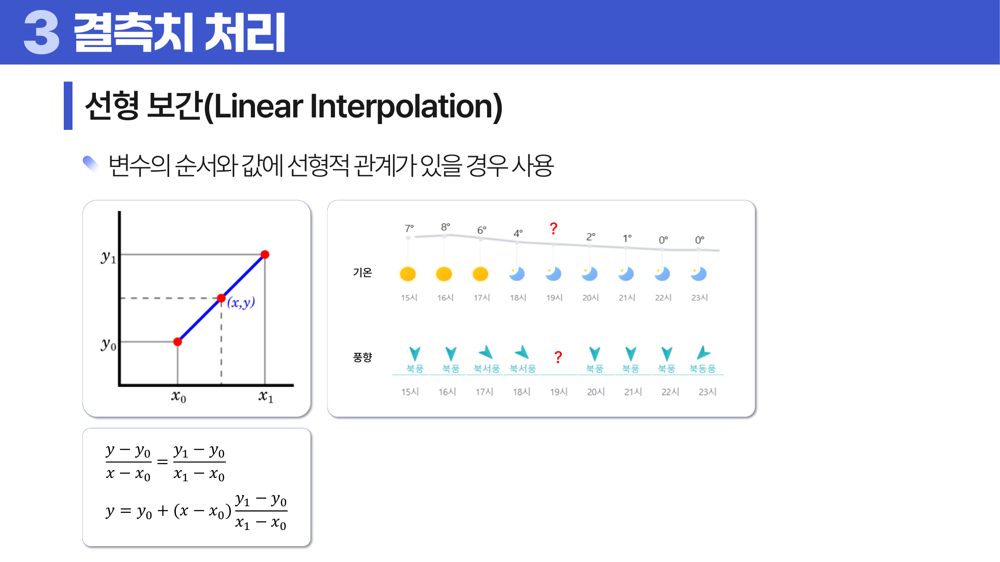
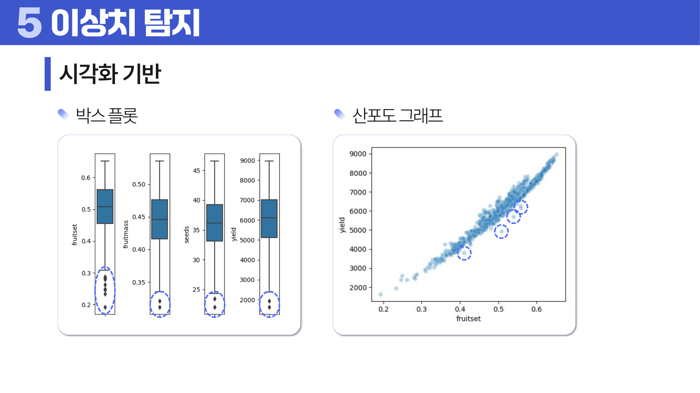
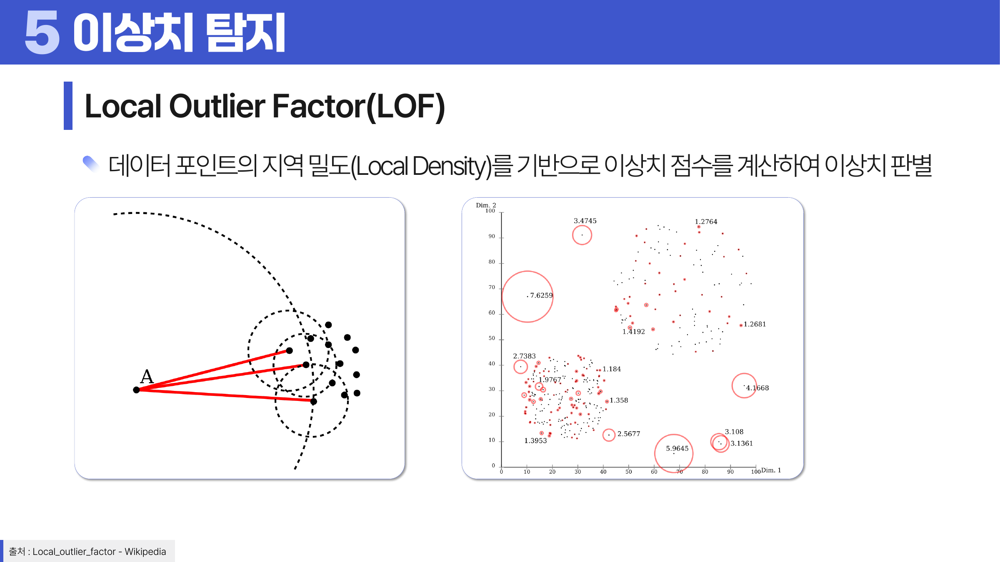
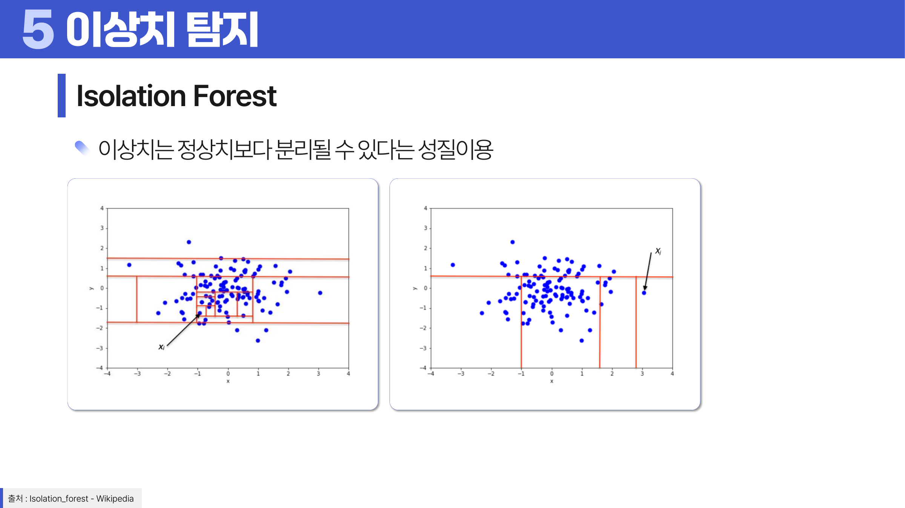
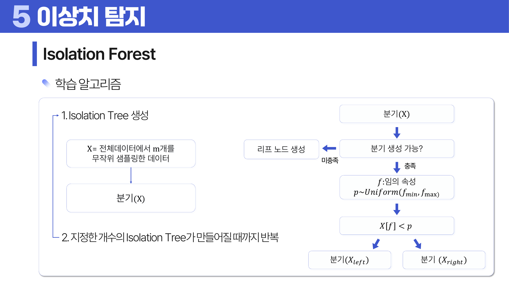

# 02. 데이터 정제

## 학습 목표

이 차시를 마치면 다음을 쉬운 말로 설명할 수 있으면 충분하다.

- 결측치를 “그냥 빈칸”이 아니라 이유가 있는 값으로 볼 수 있다.
- 이상치를 “무조건 삭제할 값”이 아니라 오류일 수도, 중요한 신호일 수도 있다고 설명할 수 있다.
- 평균 대치와 삭제가 왜 위험할 수 있는지 말할 수 있다.
- 결측 처리와 이상치 처리가 평균, 분산, 상관관계에 어떤 영향을 주는지 설명할 수 있다.
- 박스 플롯과 산점도로 이상치를 보는 이유를 설명할 수 있다.
- LOF와 Isolation Forest는 첫 학습 때 이름과 직관만 이해한다.

## 오늘의 한 줄

데이터 정제는 더러운 값을 지우는 일이 아니라, **값이 비거나 튄 이유를 생각하고 분석 결론이 왜곡되지 않게 조심하는 일**이다.

## 오늘 반드시 이해할 3가지

1. 결측치는 빈칸이 아니라 **왜 비었는지에 대한 정보**일 수 있다.
2. 이상치는 무조건 제거할 대상이 아니라 **오류인지 신호인지 구분해야 하는 값**이다.
3. 정제는 적용보다 검증이 중요하다. 처리 전후의 분포와 관계가 어떻게 바뀌었는지 확인해야 한다.

## 이 차시 전에 알면 좋은 것

- **행과 열**: 결측치와 이상치가 어디에 생겼는지 찾는 기준
- **변수 타입**: 수치형/범주형에 따라 정제 방법이 달라진다
- **분포 모양**: 튀는 값이 오류인지 신호인지 판단하는 단서
- **평균과 분산**: 정제 전후에 중심과 퍼짐이 바뀌었는지 확인하는 기준

## 개념 지도

데이터 정제는 모델링 전에 데이터를 “예쁘게” 만드는 작업이 아니다. 분석 질문에 맞게 데이터의 오류, 결측, 이상치를 해석하고, 정보 손실과 편향을 최소화하는 의사결정 과정이다.

```text
데이터 정제
├── 결측치 처리
│   ├── 결측 원인 파악: MCAR / MAR / MNAR
│   ├── 처리 전략: 제거 / 표시 / 대치 / 보간
│   └── 편향 점검: 어떤 집단이 더 많이 사라지는가?
├── 이상치 처리
│   ├── 원인 구분: 입력 오류 / 측정 오류 / 자연적 극단값
│   ├── 탐지 방법: 통계 / 시각화 / 모델 기반
│   └── 처리 전략: 제거 / 한정 / 대치 / 변환 / 보존
└── 데이터 정리
    ├── Tidy Data
    └── Long-Wide 구조 변환
```

핵심 질문은 세 가지다.

- 이 값이 비어 있거나 튀는 이유는 무엇인가?
- 이 값을 없애거나 바꾸면 어떤 정보가 손실되는가?
- 처리 결과가 분석 결론을 특정 방향으로 밀어 버리지는 않는가?

## 학습 우선순위

- **필수**: 결측치가 생긴 이유 구분, 이상치가 오류인지 신호인지 판단, 삭제/대치/표시 중 선택
- **심화**: LOF와 Isolation Forest의 직관
- **확장**: 모델 기반 이상치 점수를 운영 규칙으로 연결

## 이 차시에서 꼭 붙잡을 설명 방식

정제에서는 “삭제한다”, “대치한다” 같은 처리 이름보다 **왜 그 처리가 위험할 수 있는지**가 더 중요하다.

예를 들어 평균 <a id="ref-02-대치"></a>[대치](#note-02-대치)가 위험한 이유는 다음과 같다.

1. 평균 대치는 비어 있는 여러 칸을 모두 같은 값으로 채운다.
2. 같은 값이 반복해서 들어가면 데이터가 원래보다 덜 퍼져 보인다.
3. 그래서 분산이 작아지고, <a id="ref-02-변수"></a>[변수](#note-02-변수) 사이의 관계도 약해질 수 있다.
4. 결과적으로 모델이나 통계량이 실제보다 안정적인 것처럼 보일 수 있다.

예를 들어 결측값 100개를 모두 평균 50으로 채우면, 새로 채운 값들은 평균에서 전혀 떨어져 있지 않다. 분산은 “평균에서 떨어진 정도”를 보는 지표이므로 이런 값이 많이 들어오면 퍼짐이 줄어든다. 또 원래는 소득이 높을수록 구매액도 높았는데 구매액 결측을 모두 평균으로 채우면, 소득과 구매액의 관계가 약해져 보일 수 있다.

## 핵심 이론

### 먼저 잡는 직관

- **MCAR/MAR/MNAR**: 값이 비어 있는 이유를 세 단계로 나누는 기준.
- **대치**: 빈칸을 채우는 일이지만, 동시에 새로운 가정을 데이터에 넣는 일.
- **이상치 탐지**: “큰 값”을 찾는 것이 아니라, 전체 패턴에서 설명하기 어려운 값을 찾는 일.
- **Tidy Data**: 분석 도구가 데이터를 일관되게 읽을 수 있도록 행과 열의 의미를 정리하는 원칙.

### 1. 데이터 정제의 목적

처음에는 정제를 “청소”라고 생각하기 쉽다. 하지만 더 정확히는 “이 값을 그대로 믿어도 되는지 확인하는 과정”이다.

데이터 정제는 데이터의 오류를 바로잡아 정합성을 높이는 과정이다. 목적은 크게 세 가지다.

| 목적 | 의미 |
|---|---|
| 데이터 품질 향상 | 결측, 오류, 중복, 형식 불일치를 줄인다. |
| 모델 성능 향상 | 잘못된 입력 때문에 모델이 왜곡되는 것을 줄인다. |
| 업무 신뢰성 확보 | 분석 결과를 실제 의사결정에 사용할 수 있게 한다. |

정제에서 가장 위험한 태도는 “문제가 있는 행을 지우면 깨끗해진다”는 생각이다. 결측과 <a id="ref-02-이상치"></a>[이상치](#note-02-이상치)는 데이터 생성 과정의 흔적일 수 있다. 따라서 정제는 삭제 기술이 아니라 원인 추론과 <a id="ref-02-편향"></a>[편향](#note-02-편향) 관리에 가깝다.

초심자 단계에서는 정제의 영향을 세 숫자로 먼저 확인한다.

| 확인할 숫자 | 왜 보는가 |
|---|---|
| 행 수와 집단 비율 | 특정 집단이 많이 사라졌는지 본다. |
| 평균과 중앙값 | 중심 위치가 특정 방향으로 움직였는지 본다. |
| 분산과 표준편차 | 값의 퍼짐이 인위적으로 줄거나 커졌는지 본다. |

정제는 통계량을 바꾸는 작업이다. 그래서 “처리했다”에서 끝내지 않고, 처리 전후의 요약 통계와 시각화를 비교해야 한다.

### 2. 결측 메커니즘

결측 메커니즘은 말이 어렵지만, 질문은 단순하다. **왜 이 칸이 비었을까?**

결측은 값이 없다는 현상은 같아도 원인이 다르다.

| 구분 | 의미 | 예 | 삭제 위험 |
|---|---|---|---|
| MCAR | 완전 무작위 결측. 결측 여부가 관측값이나 미관측값과 관련 없다. | 설문 시스템 오류로 임의 응답이 누락됨 | 상대적으로 작음 |
| MAR | 조건부 무작위 결측. 결측 여부가 관측된 다른 변수와 관련 있다. | 여성이 남성보다 몸무게 응답을 덜 함 | 해당 조건을 무시하면 편향 |
| MNAR | 비무작위 결측. 결측 여부가 결측된 값 자체와 관련 있다. | 소득이 매우 높은 사람이 소득 응답을 피함 | 매우 큼 |

MCAR은 삭제해도 표본 대표성이 크게 깨지지 않을 수 있다. 그러나 MAR에서는 관측된 조건을 반영해야 한다. 예를 들어 성별에 따라 몸무게 미응답률이 다르면 전체 평균으로 대치하는 것보다 성별별 대치가 더 적절할 수 있다.

삭제가 위험한 이유는 특정 집단이 더 많이 사라질 수 있기 때문이다. 여성 응답자에게서 몸무게 결측이 많다면, 결측 행을 삭제하는 순간 여성 데이터가 더 많이 줄어든다. 그러면 남성 비율이 커지고, 전체 몸무게 평균도 실제보다 높아질 수 있다.

이런 왜곡은 표본 편향으로 이어진다. 결측이 특정 집단에 몰려 있는데 행을 삭제하면, 남은 표본은 더 이상 원래 모집단을 대표하지 못한다. 표본 수가 충분히 많아도 빠진 집단이 계속 빠져 있으면 추론은 한쪽으로 치우친다.

MNAR은 가장 어렵다. 결측된 값 자체가 결측의 원인이므로 데이터 안의 다른 변수만으로는 편향을 완전히 제거하기 어렵다. 예를 들어 소득이 높은 사람이 소득 응답을 피한다면, 관측된 소득만으로는 높은 소득 구간이 얼마나 빠졌는지 알기 어렵다. 이 경우 민감도 분석, 별도 조사, 결측 여부 자체의 모델링이 필요할 수 있다.

### 3. 결측 처리 방법

결측 처리 방법은 “값을 채우는가”보다 “어떤 가정을 추가하는가”로 구분해야 한다.

| 방법 | 설명 | 적합한 상황 | 위험 |
|---|---|---|---|
| 제거 / 완전 분석 | 결측이 있는 행이나 변수를 제거한다. | 결측이 매우 적고 MCAR에 가까울 때 | 표본 감소, 편향 |
| 결측 여부 보존 | 결측 여부를 별도 변수로 남긴다. | 결측 자체가 의미를 가질 때 | 원래 값의 부재는 여전히 남음 |
| 단순 대치 | 평균, 중앙값, 최빈값 등 대표값으로 채운다. | 빠른 기준선이 필요할 때 | 분산 축소, 관계 왜곡 |
| 회귀 대치 | 다른 변수로 결측 변수를 예측해 채운다. | 결측 변수가 다른 변수와 강하게 관련될 때 | 예측값이 과도하게 매끄러워짐 |
| 다중 대치 | 여러 가능한 대치 결과를 만들고 통합한다. | 결측 불확실성을 반영해야 할 때 | 구현과 해석이 복잡 |
| Hot deck | 유사한 관측치의 값을 이용해 채운다. | 유사 사례가 충분할 때 | 유사도 정의에 민감 |
| 선형 보간 | 앞뒤 순서의 값 사이를 직선으로 채운다. | 시간이나 순서가 있고 변화가 완만할 때 | 급격한 변화나 비선형 패턴을 놓침 |

회귀 대치는 다음과 같은 형태로 생각할 수 있다.

```text
결측 변수 = f(관측된 다른 변수들) + 오차
```

예를 들어 수학 점수가 결측이고 공부 시간과 출석률이 있다면, 관측된 학생들로 `math_score = b0 + b1 * study_hours + b2 * attendance`를 학습한 뒤 결측 점수를 예측할 수 있다. 하지만 이 방법은 예측 오차를 실제 변동성보다 작게 만들 수 있다.

왜 그럴까? 회귀 대치는 모델이 예상한 “그럴듯한 값”을 넣는다. 그런데 실제 학생 점수에는 컨디션, 시험 난이도, 실수처럼 모델이 모르는 흔들림이 있다. 예측값만 채우면 이런 흔들림이 줄어들어 데이터가 실제보다 매끈해 보일 수 있다.

Hot deck은 “비슷한 사람의 값을 빌려 온다”는 생각이다. 방식은 다음처럼 구분할 수 있다.

| Hot deck 유형 | 설명 | 주의점 |
|---|---|---|
| 무작위 유사 대치 | 유사한 후보들 중 하나를 무작위로 골라 채운다. | 실행할 때마다 결과가 달라질 수 있다. |
| 단순 유사 대치 | 가장 비슷한 하나의 관측치를 골라 그 값을 채운다. | 유사도 기준이 부적절하면 왜곡된다. |
| 순서 기반 유사 대치 | 정렬된 데이터에서 앞뒤 또는 가까운 순서의 값을 이용한다. | 정렬 순서가 실제 유사성을 가져야 한다. |
| 근접 이웃 기반 | 거리 기준으로 가까운 이웃의 값을 이용한다. | 스케일 차이가 크면 거리 계산이 왜곡된다. |

Hot deck은 평균 대치보다 실제 관측값을 유지한다는 장점이 있지만, “무엇을 비슷하다고 볼 것인가”가 핵심이다. 나이, 성별, 지역, 구매패턴처럼 결측 변수와 관련 있는 기준을 써야 한다.

대치 방법을 고를 때는 “값 하나를 맞히는가”보다 “분포와 관계를 보존하는가”를 본다. 중앙값 대치는 극단값에 덜 흔들리지만 모든 결측을 같은 값으로 만든다. 회귀 대치는 다른 변수와의 관계를 활용하지만 예측값이 지나치게 매끄러울 수 있다. 다중 대치는 여러 가능한 값을 만들어 불확실성을 남기지만 설명이 복잡하다.

선형 보간은 두 점 `(x0, y0)`, `(x1, y1)` 사이의 값을 다음처럼 채운다.

```text
y = y0 + (x - x0) * (y1 - y0) / (x1 - x0)
```

이 식은 두 점 사이의 변화가 직선이라고 가정한다. 기온처럼 짧은 시간 간격에서 완만히 변하는 값에는 쓸 수 있지만, 이벤트성 매출처럼 급격히 튀는 값에는 부적절할 수 있다.



> **그림 읽기**: 앞뒤 관측값을 직선으로 이어 빈 값을 채우는 생각을 본다. 순서가 의미 있고 변화가 급격하지 않을 때 자연스럽다.

### 4. 이상치의 의미

이상치는 정상 범주, 즉 데이터의 전체적 패턴에서 벗어난 값이다. 그러나 이상치가 항상 오류는 아니다.

| 구분 | 의미 | 예 | 처리 방향 |
|---|---|---|---|
| 비자연적 이상치 | 입력, 측정, 실험, 처리 과정에서 생긴 오류 | 키 17,000cm, 음수 나이 | 수정 또는 제거 |
| 자연적 이상치 | 실제로 드물지만 가능한 값 | 초고액 구매 고객, 극단적 폭우 | 보존하거나 별도 모델링 |

비자연적 이상치의 원인은 더 세분화해 볼 수 있다. 입력 실수, 측정 오류, 실험 오류, 의도적 이상치, 데이터 처리 오류, 표본 오류가 대표적이다. 예를 들어 키를 cm가 아니라 mm로 입력했거나, 센서가 고장 났거나, 특정 사용자가 일부러 잘못된 값을 넣은 경우다. 이런 값은 실제 현상이라기보다 데이터 생성 과정의 문제이므로, 원인을 확인한 뒤 수정하거나 제외하는 쪽이 자연스럽다.

자연적 이상치를 제거하면 분석에서 가장 중요한 신호를 잃을 수 있다. 예를 들어 보험 사기 탐지, 장애 감지, 고액 고객 분석에서는 이상치가 목표 자체일 수 있다.

### 5. 통계 기반 이상치 탐지

**IQR 기준**은 사분위 범위를 이용한다.

```text
IQR = Q3 - Q1
정상 후보 범위 = [Q1 - 1.5 * IQR, Q3 + 1.5 * IQR]
```

IQR은 중앙 50% 범위를 기준으로 하므로 극단값에 비교적 강하다. 다만 <a id="ref-02-분포"></a>[분포](#note-02-분포)가 원래 비대칭이거나 꼬리가 긴 경우 정상값도 이상치 후보로 표시될 수 있다.

**Z-score 기준**은 평균과 표준편차를 이용한다.

```text
Z = (X - mu) / sigma
```

Z-score는 값이 평균에서 표준편차 몇 개만큼 떨어져 있는지를 나타낸다. 보통 절댓값이 2 또는 3보다 큰 값을 이상치 후보로 보지만, 이 기준은 분포가 정규분포에 가깝다는 암묵적 기대가 있다. 평균과 표준편차 자체가 이상치에 민감하다는 점도 주의해야 한다.

IQR과 Z-score는 “한 변수 안에서 튀는 값”을 찾는 방법이다. 둘의 차이는 기준 중심이 다르다는 점이다. IQR은 분위수로 중앙 50%를 보고, Z-score는 평균과 표준편차를 본다. 꼬리가 긴 분포나 극단값이 많은 데이터에서는 평균과 표준편차가 흔들리므로 IQR이 더 안정적일 수 있다.

### 6. 시각화 기반 이상치 탐지

<a id="ref-02-시각화"></a>[시각화](#note-02-시각화)는 이상치의 원인을 해석하는 데 유용하다.

| 방법 | 보는 것 | 장점 |
|---|---|---|
| 박스 플롯 | 사분위수와 IQR 바깥의 점 | 단변량 이상치 확인이 빠르다. |
| 산점도 | 두 변수 관계에서 벗어난 점 | 관계 기반 이상치를 볼 수 있다. |
| 시계열 그래프 | 시간 흐름에서 갑자기 튀는 값 | 장애, 이벤트, 계절성을 함께 볼 수 있다. |



> **그림 읽기**: 박스플롯과 산점도에서 전체 흐름 밖으로 벗어난 점을 찾는다. 튀는 점이 오류인지 중요한 신호인지는 도메인 맥락으로 다시 판단한다.

위 그림의 왼쪽은 박스 플롯으로 단변량 이상치를 보는 예이고, 오른쪽은 산점도로 두 변수의 관계에서 벗어난 점을 보는 예다. 예를 들어 수확량만 보면 정상 범위에 있어도, 결실율 대비 수확량이 비정상적으로 낮다면 관계 기반 이상치일 수 있다. 이때는 수확량의 Z-score보다 “결실율로 예측한 수확량과 실제 수확량의 <a id="ref-02-잔차"></a>[잔차](#note-02-잔차)”가 더 적절한 기준이다.

이유는 이상치의 기준이 질문마다 달라지기 때문이다. “수확량이 너무 작은가?”를 묻는다면 수확량 하나만 보면 된다. 하지만 “결실율에 비해 수확량이 이상하게 낮은가?”를 묻는다면 두 변수의 관계에서 벗어났는지를 봐야 한다.

### 7. 모델 기반 이상치 탐지

모델 기반 방법은 단순히 한 변수의 크기가 큰지를 보지 않고, 여러 변수의 패턴 속에서 드문 점을 찾는다.

#### 이상치 탐지와 신규성 탐지

| 구분 | 이상치 탐지 | 신규성 탐지 |
|---|---|---|
| 데이터 구성 | 학습 데이터 안에 이상치가 섞여 있다. | 학습 데이터는 정상 데이터라고 가정한다. |
| 목적 | 기존 데이터 안의 이상한 점을 찾는다. | 새로 들어온 데이터가 정상 패턴 밖인지 판단한다. |
| 예 | 고객 데이터에서 비정상 거래 찾기 | 정상 장비 로그로 학습 후 신규 장애 감지 |

#### 심화: LOF(Local Outlier Factor)

첫 학습에서는 공식보다 직관만 잡으면 된다. LOF는 “내 주변이 다른 친구들 주변보다 유난히 듬성듬성한가?”를 보는 방법이다.

LOF는 지역 밀도를 기준으로 이상치를 판단한다. 어떤 점 주변의 밀도가 이웃들의 밀도보다 낮으면, 그 점은 주변 구조에서 고립되어 있다고 본다.



> **그림 읽기**: 한 점 주변의 밀도가 이웃에 비해 얼마나 낮은지 본다. 전체 기준이 아니라 지역적 외로움이 이상치 점수의 핵심이다.

핵심 흐름은 다음과 같다.

1. 각 점의 `k`개 이웃을 찾는다.
2. 이웃까지의 도달거리(reachability distance)를 계산한다.
3. 도달거리의 평균을 이용해 지역 도달 밀도(LRD)를 계산한다.
4. 내 밀도와 이웃들의 밀도를 비교해 LOF 점수를 만든다.

LOF 수식은 다음 흐름으로 읽으면 된다.

```text
N_k(x): x에서 k번째 이웃까지의 이웃 집합
d(x, y): x와 y 사이의 거리
k-distance(x): x의 k번째 가까운 이웃까지의 거리

RD_k(x, o) = max(k-distance(o), d(x, o))
LRD_k(x) = |N_k(x)| / sum_{o in N_k(x)} RD_k(x, o)
LOF_k(x) = (1 / |N_k(x)|) * sum_{o in N_k(x)} LRD_k(o) / LRD_k(x)
```

`RD_k(x, o)`는 너무 가까운 이웃 하나 때문에 밀도가 과장되지 않도록 거리의 하한을 둔다. `LRD_k(x)`는 도달거리가 작을수록 커지는 지역 밀도다. 마지막 `LOF_k(x)`는 이웃들의 밀도와 내 밀도를 비교한다. 내 밀도가 이웃보다 낮으면 분모가 작아져 LOF가 커지고, 이상치 가능성이 커진다.

해석은 다음과 같다.

| LOF 점수 | 의미 |
|---|---|
| 약 1 | 주변 이웃과 밀도가 비슷하다. |
| 1보다 훨씬 큼 | 주변보다 밀도가 낮아 이상치 가능성이 크다. |
| 1보다 작음 | 주변보다 더 조밀한 위치에 있다. |

LOF는 전체적으로는 정상 범위처럼 보여도, 특정 지역 구조 안에서 고립된 점을 찾는 데 강하다. 반면 `k` 값과 거리 <a id="ref-02-척도"></a>[척도](#note-02-척도)에 민감하다.

#### 심화: Isolation Forest

첫 학습에서는 “이상치는 혼자 떨어져 있어서 더 빨리 분리된다”는 그림만 이해하면 된다.

이름부터 풀어 보자. `Isolation`은 “고립시키기”, `Forest`는 “나무 여러 개가 모인 숲”이라는 뜻이다. 여기서 나무는 실제 나무가 아니라, 데이터를 계속 둘로 나누는 의사결정 나무를 말한다. 그래서 Isolation Forest는 “데이터 점을 혼자 남을 때까지 나누는 나무를 많이 만든 방법”이라는 이름이다.

왜 이런 이름이 붙었을까? 정상적인 점은 주변에 비슷한 점이 많아서 혼자 떼어 내려면 여러 번 잘라야 한다. 반대로 이상치는 무리에서 떨어져 있으므로 몇 번만 잘라도 금방 혼자 남는다. 즉, 이 방법은 점을 고립시키는 데 걸리는 횟수로 이상치 가능성을 본다.

Isolation Forest는 이상치가 정상치보다 더 쉽게 분리된다는 성질을 이용한다.



> **그림 읽기**: 이상치는 몇 번의 무작위 분기만으로도 빨리 혼자 떨어지는지 본다. isolate는 점을 따로 떼어 놓는다는 뜻이다.

아이디어는 단순하다.

1. 데이터를 무작위로 샘플링한다.
2. 임의의 변수를 고른다.
3. 그 변수의 임의 기준값으로 데이터를 나눈다.
4. 한 점이 고립될 때까지 반복한다.
5. 여러 트리에서 평균적으로 얼마나 빨리 고립되는지 본다.



> **그림 읽기**: 무작위 속성과 기준으로 데이터를 계속 나누는 흐름을 본다. 적은 분기 깊이로 리프에 도달하면 더 이상치답다고 해석한다.

이상치 점수는 대략 다음 구조를 가진다.

```text
s(x) = 2 ^ ( - h(x) / c(m) )
h(x) = (1 / t) * sum_i h_i(x)
c(m) = 2H(m - 1) - 2(m - 1) / m
H(i) = ln(i) + gamma,  gamma = 0.577215...
```

여기서 `h_i(x)`는 `i`번째 Isolation Tree에서 `x`가 고립되기까지의 분리 깊이이고, `h(x)`는 여러 트리의 평균 분리 깊이다. `c(m)`은 표본 크기 `m`에서 기대되는 평균 경로 길이이며, `gamma`는 오일러-마스케로니 상수다. 중요한 해석은 간단하다. `h(x)`가 작으면 적은 분기만으로 고립되므로 `s(x)`가 1에 가까워진다.

| 점수 | 의미 |
|---|---|
| 1에 가까움 | 매우 빨리 고립된다. 이상치 가능성이 크다. |
| 0.5 근처 | 뚜렷한 구분이 어렵다. |
| 0.5보다 작음 | 정상 패턴 안에 있을 가능성이 크다. |

Isolation Forest는 고차원 데이터에서도 비교적 잘 작동하지만, “왜 이상치인지”를 설명하는 데는 LOF나 시각화보다 직관이 약할 수 있다.

### 8. 이상치 처리 전략

이상치 탐지는 처리의 시작일 뿐이다. 처리 방식은 원인과 분석 목적에 따라 달라진다.

| 방법 | 의미 | 적합한 상황 | 위험 |
|---|---|---|---|
| 제거 | 행 또는 값을 제거한다. | 명백한 입력 오류, 측정 오류 | 중요한 극단 신호 손실 |
| 한정(Clipping) | 상한/하한으로 값을 자른다. | 극단값이 모델을 지나치게 흔들 때 | 꼬리 정보 손실 |
| 대치 | 대표값 또는 예측값으로 바꾼다. | 오류로 판단되지만 삭제가 어려울 때 | 변동성 축소 |
| 변환 | 로그, 제곱근 등으로 분포를 완화한다. | 우측 꼬리가 길고 값 자체는 유효할 때 | 해석 단위 변화 |
| 보존 + 표시 | 값을 유지하고 이상치 여부 변수를 추가한다. | 이상치 자체가 의미를 가질 때 | 모델 복잡도 증가 |

로그 변환은 우측 꼬리가 긴 변수에서 큰 값을 중앙 쪽으로 압축한다. 매출, 소득, 방문 수처럼 0 이상이고 극단적으로 큰 값이 있는 변수에서 자주 고려한다. 단, 로그 변환 후 계수나 차이를 해석할 때 원래 단위가 아니라 비율적 변화에 가까워진다는 점을 잊지 않아야 한다.

### 9. Tidy Data와 구조 정리

Tidy Data의 3원칙은 다음과 같다.

| 원칙 | 의미 |
|---|---|
| 각 변수는 하나의 열 | 키와 몸무게가 같은 열에 섞이면 안 된다. |
| 각 관측치는 하나의 행 | 한 사람의 한 시점 관측은 한 행이어야 한다. |
| 각 단위는 하나의 테이블 | 서로 다른 관찰 단위는 분리해야 한다. |

Long/Wide 변환은 분석 목적에 따라 구조를 바꾸는 작업이다.

| 변환 | 상황 | 예 |
|---|---|---|
| Long-to-Wide | 하나의 열에 여러 변수가 섞여 있을 때 | `항목=키/몸무게`, `값`을 `키`, `몸무게` 열로 펼침 |
| Wide-to-Long | 열 이름에 변수 값이 들어 있을 때 | `중간_국어`, `기말_국어`를 `시험`, `과목`, `점수`로 정리 |

정리되지 않은 데이터는 같은 정보가 들어 있어도 집계, 시각화, 모델링에서 계속 예외 처리를 만든다. 정제의 마지막 단계는 값만 고치는 것이 아니라 분석 가능한 구조로 바꾸는 것이다.

### 10. 결측 원인과 이상치 탐지법 선택

데이터 정제에서는 결측치와 이상치를 “지울 것인가 말 것인가”로만 보지 않는다. 결측이 완전히 무작위인지, 특정 집단이나 상황에서 더 자주 생기는지에 따라 삭제와 대치가 만드는 편향이 달라진다. 회귀 대치, Hot deck, 선형 보간은 각각 관계식, 유사 사례, 시간·순서 구조를 이용한다.

이상치는 통계 기반, 시각화 기반, 모델 기반 방법으로 볼 수 있다. IQR은 한 변수의 극단값을 빠르게 찾고, 산점도와 박스 플롯은 관계나 분포에서 벗어난 점을 보여 준다. LOF는 주변 밀도보다 낮은 점을 찾고, Isolation Forest는 적은 분기만으로 고립되는 점을 찾는다.

정제 뒤에는 항상 전후 비교가 필요하다. 행 수, 집단 비율, 평균, 중앙값, 분산, 분위수, 히스토그램, 박스 플롯, 산점도를 비교해 정제가 결론 자체를 바꾸지 않았는지 확인한다.

## 판단 기준

결측과 이상치를 처리할 때는 다음 순서로 판단한다.

1. 문제 값을 찾는다.
2. 값이 생긴 원인을 가정한다.
3. 원인이 데이터 수집 과정, 측정 과정, 실제 현상 중 어디에 가까운지 본다.
4. 삭제했을 때 어떤 집단이 더 많이 사라지는지 확인한다.
5. 대치했을 때 분산, 상관, 회귀계수가 어떻게 바뀔지 생각한다.
6. 처리 전후의 통계량과 시각화를 비교한다.
7. 처리 규칙을 기록한다.

결측 처리의 기준은 “빈칸을 없앴는가”가 아니라 “결측이 가진 정보를 왜곡하지 않았는가”다. 이상치 처리의 기준은 “튀는 점을 없앴는가”가 아니라 “오류와 신호를 구분했는가”다.

### 처리 후 검증

정제는 적용보다 검증이 중요하다. 처리 전후를 비교하지 않으면 정제가 분석 결과를 얼마나 바꿨는지 알 수 없다.

| 점검 항목 | 확인할 질문 |
|---|---|
| 행 수와 집단 비율 | 특정 집단이 과도하게 사라지지 않았는가? |
| 대표 통계량 | 평균, 중앙값, 분산, 분위수가 크게 변했는가? |
| 변수 간 관계 | 상관, 회귀계수, 그룹 차이가 인위적으로 약해지거나 강해졌는가? |
| 분포 모양 | 꼬리, 봉우리, 비대칭성이 과도하게 사라졌는가? |
| 모델 평가 | 정제 전후 성능 변화가 데이터 누수나 편향 때문은 아닌가? |

특히 평균 대치, 회귀 대치, clipping은 데이터가 더 깔끔해 보이게 만들지만 변동성과 꼬리 정보를 줄일 수 있다. 처리 규칙은 재현 가능하도록 문서화해야 하며, 분석 보고서에는 “어떤 값을 왜 바꿨는가”가 남아야 한다.

## 오해와 반례

### 오해 1. 결측이 있는 행은 삭제하면 된다.

MCAR이 아니면 삭제가 편향을 만든다. 특정 성별, 연령, 소득 집단에서 결측이 더 많다면 삭제 후 표본은 원래 모집단과 달라진다.

### 오해 2. 평균 대치는 안전한 기본값이다.

평균 대치는 분산을 줄이고 변수 간 관계를 약하게 만들 수 있다. 회귀나 상관 분석에서는 계수와 검정 결과가 왜곡될 수 있다.

### 오해 3. 이상치는 항상 제거해야 한다.

자연적 이상치는 중요한 신호일 수 있다. 고액 거래, 장애 로그, 희귀 질병 사례는 분석 대상 자체가 극단값인 경우가 많다.

### 오해 4. Z-score가 크면 무조건 오류다.

Z-score는 평균과 표준편차 기준에서 멀다는 뜻이다. 꼬리가 긴 분포에서는 정상적인 극단값도 큰 Z-score를 가질 수 있다.

### 오해 5. 모델 기반 이상치 탐지는 객관적이다.

LOF는 이웃 수와 거리 척도에 민감하고, Isolation Forest는 무작위 분할과 표본 설정에 영향을 받는다. 모델 기반 방법도 가정과 하이퍼파라미터를 가진다.

### 오해 6. 로그 변환은 이상치를 없애는 방법이다.

로그 변환은 큰 값의 영향력을 줄이는 방법이지 오류를 수정하는 방법이 아니다. 잘못 입력된 값은 변환 전에 수정하거나 제거해야 한다.

## 예시 풀이

### 예시 1. 여성 응답자에게서 몸무게 결측이 더 많다면?

이 결측은 완전 무작위 결측(MCAR)로 보기 어렵다. 결측 여부가 성별이라는 관측된 변수와 관련되기 때문이다. 따라서 전체 행을 삭제하면 여성 응답자가 더 많이 사라지고, 전체 몸무게 평균이나 분포가 왜곡될 수 있다.

더 나은 접근은 다음과 같다.

- 결측 여부 변수를 따로 남긴다.
- 성별별 결측률을 확인한다.
- 필요하면 성별별 중앙값 대치나 회귀 대치를 검토한다.
- 처리 전후 성별 비율과 몸무게 분포를 비교한다.

### 예시 2. 결실율 대비 수확량이 낮은 점은 왜 Z-score보다 잔차로 보는가?

수확량만 보면 아주 작지 않을 수 있다. 하지만 결실율이 높은데 수확량이 낮다면 “관계에서 벗어난 점”이다. 이때 필요한 기준은 수확량 단독 크기가 아니라, 결실율로 예상한 수확량과 실제 수확량의 차이다.

따라서 다음처럼 생각한다.

```text
잔차 = 실제 수확량 - 결실율로 예측한 수확량
```

잔차가 크게 음수이면 “결실율에 비해 수확량이 비정상적으로 낮다”고 판단할 수 있다.

## 오늘의 요약 5줄

1. 결측 처리는 결측 원인을 먼저 판단한 뒤 선택해야 한다.
2. 평균 대치는 쉽지만 분산과 변수 간 관계를 줄일 수 있다.
3. 이상치는 오류일 수도 있고 중요한 신호일 수도 있다.
4. IQR과 Z-score는 단변량 기준이고, 산점도와 모델 기반 방법은 관계 속 이상치를 볼 수 있다.
5. 정제 후에는 행 수, 집단 비율, 분포, 변수 간 관계가 어떻게 바뀌었는지 반드시 비교한다.

## 확인 문제

1. MCAR, MAR, MNAR을 각각 한 문장으로 정의하고 예를 하나씩 들어라.
2. 여성 응답자에게서 몸무게 결측이 더 많이 발생했다면, 완전 삭제가 왜 위험한지 설명하라.
3. 평균 대치가 분산과 상관관계에 어떤 영향을 줄 수 있는지 설명하라.
4. 회귀 대치와 다중 대치의 차이를 “불확실성 반영” 관점에서 설명하라.
5. 시간 순서가 있는 온도 데이터에 선형 보간을 쓸 수 있는 이유와, 매출 데이터에 위험할 수 있는 이유를 설명하라.
6. 비자연적 이상치와 자연적 이상치를 구분하고, 각각에 적절한 처리 전략을 제시하라.
7. IQR 기준과 Z-score 기준의 차이를 분포 가정과 강건성 관점에서 비교하라.
8. 수확량과 결실율의 관계에서 벗어난 점을 찾을 때, 수확량 단독 Z-score보다 잔차가 더 적절한 이유를 설명하라.
9. LOF가 “지역 밀도”를 비교한다는 말의 의미를 설명하라.
10. Isolation Forest에서 이상치가 더 짧은 경로 길이로 고립되는 이유를 설명하라.
11. 이상치 탐지와 신규성 탐지의 차이를 학습 데이터 구성 관점에서 설명하라.
12. 정제 전후에 반드시 비교해야 할 통계량과 시각화를 제시하라.
13. Tidy Data의 3원칙을 예시와 함께 설명하라.
14. 왜 결측치를 무조건 삭제하면 위험한가?
15. 왜 Isolation Forest는 “isolation”이라는 이름을 쓰는가?
16. 회귀 대치, Hot deck, 선형 보간이 각각 어떤 정보를 이용하는지 설명하라.
17. LOF와 Isolation Forest가 이상치를 보는 관점의 차이를 설명하라.
18. Hot deck의 네 가지 유형이 유사한 값을 고르는 방식을 비교하라.
19. LOF의 `RD`, `LRD`, `LOF` 수식이 각각 무엇을 의미하는지 설명하라.
20. Isolation Forest의 이상치 점수 `s(x)`에서 `h(x)`와 `c(m)`이 무엇을 뜻하는지 설명하라.
21. 평균 대치가 분산을 줄이는 이유를 “평균에서 떨어진 거리” 관점으로 설명하라.
22. 결측 행 삭제가 표본 편향을 만들 수 있는 상황을 예로 들어 설명하라.
23. 대치 방법을 고를 때 값 하나의 정확도보다 분포와 관계 보존을 함께 봐야 하는 이유를 설명하라.

해설은 answers.md에 있다. 먼저 직접 말로 답한 뒤 확인한다.

## 다음 차시로 연결

정제가 데이터의 오류와 구조 문제를 다뤘다면, 다음 차시는 분석과 모델링에 맞게 값을 의도적으로 바꾸는 **데이터 변환**을 다룬다. 스케일링, 인코딩, 분포 변환은 단순 전처리가 아니라 모델이 볼 수 있는 공간과 거리, 가설을 바꾸는 작업이다.

## 개념 주석

본문에서 연결된 개념을 잠깐 확인하는 공간이다. 용어를 누르면 본문에서 처음 표시된 위치로 돌아간다.

- <a id="note-02-대치"></a>[대치](#ref-02-대치): 빈 값을 다른 값으로 채우는 일.
- <a id="note-02-변수"></a>[변수](#ref-02-변수): 관측 대상의 특징을 적어 둔 열. ([처음 설명된 차시](../01-data-understanding/README.md#4-단위-변수-관측치))
- <a id="note-02-이상치"></a>[이상치](#ref-02-이상치): 전체 흐름에서 유난히 튀는 값.
- <a id="note-02-편향"></a>[편향](#ref-02-편향): 결과가 한쪽으로 치우치는 것.
- <a id="note-02-분포"></a>[분포](#ref-02-분포): 값들이 어떤 모양으로 퍼져 있는지.
- <a id="note-02-시각화"></a>[시각화](#ref-02-시각화): 숫자를 그래프나 그림으로 바꿔 보는 일. ([처음 설명된 차시](../01-data-understanding/README.md#8-시각화는-변수-타입과-질문의-함수다))
- <a id="note-02-잔차"></a>[잔차](#ref-02-잔차): 실제 값과 예상 값의 차이.
- <a id="note-02-척도"></a>[척도](#ref-02-척도): 값을 어떤 규칙과 수준으로 측정했는지 나타내는 기준. ([처음 설명된 차시](../01-data-understanding/README.md#5-변수의-역할과-척도))
