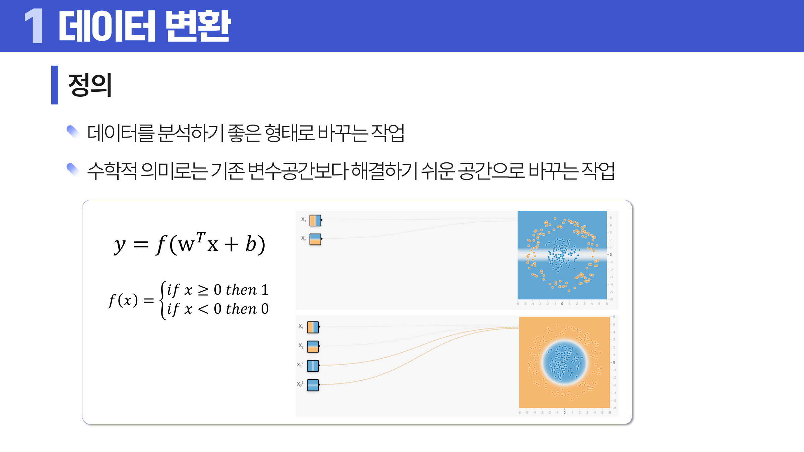
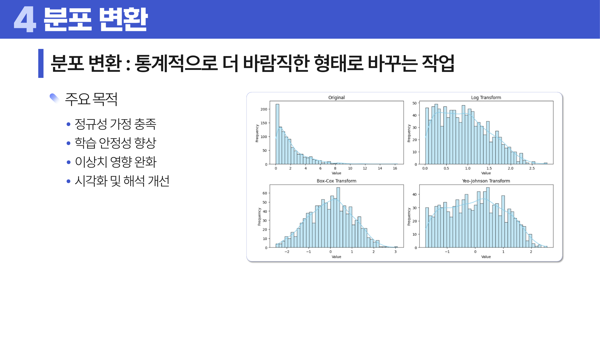
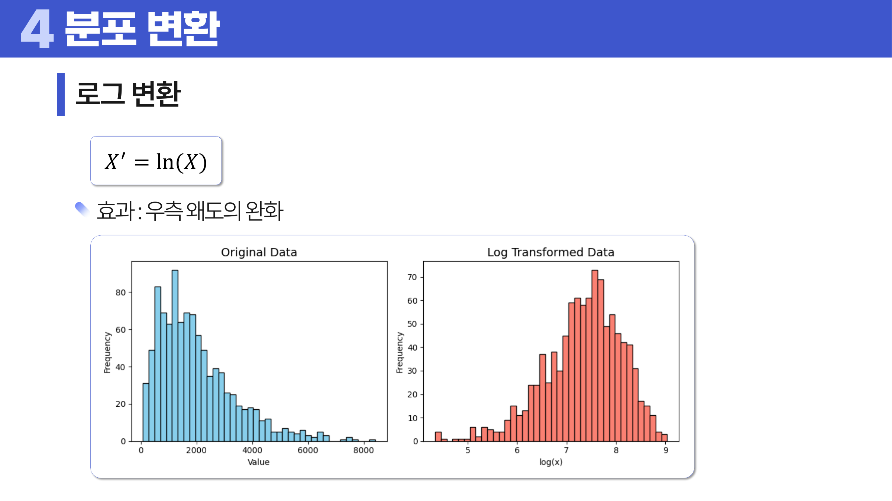
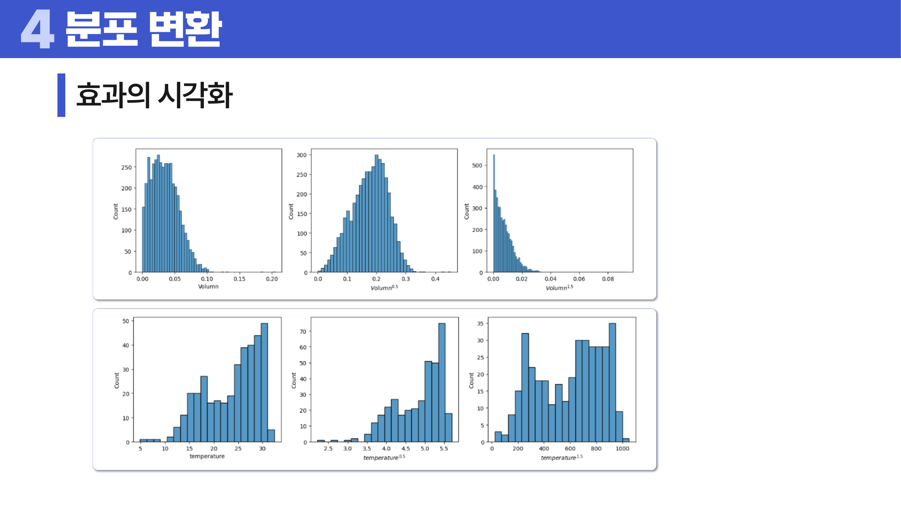
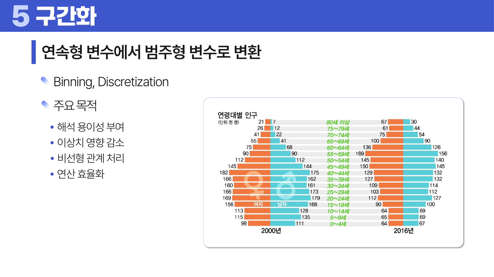

# 03. 데이터 변환

## 학습 목표

이 차시를 마치면 다음을 쉬운 말로 설명할 수 있으면 충분하다.

- 데이터 변환이 “값을 예쁘게 바꾸는 일”이 아니라 분석 질문에 맞게 표현을 바꾸는 일임을 설명할 수 있다.
- 정규화, 인코딩, 분포 변환, 구간화가 각각 왜 필요한지 말할 수 있다.
- 로그 변환이 오른쪽 꼬리가 긴 분포에 왜 도움이 되는지 설명할 수 있다.
- 타깃 인코딩과 평활화가 왜 데이터 누수와 과신 문제를 만들 수 있는지 말할 수 있다.
- 요약 변수와 파생 변수를 만들 때 어떤 논리가 필요한지 판단할 수 있다.

## 오늘의 한 줄

데이터 변환은 원래 값을 버리는 일이 아니라, **모델과 사람이 더 잘 이해할 수 있는 모양으로 값을 다시 표현하는 일**이다.

## 오늘 반드시 이해할 3가지

1. 변환은 값의 의미를 바꿀 수 있으므로, “무엇을 보존하고 무엇을 포기하는가”를 먼저 생각해야 한다.
2. 숫자 크기, 범주 이름, 분포 모양이 모델에 잘못된 신호를 주면 변환이 필요하다.
3. 변환 후에는 반드시 원래 단위에서 해석이 어떻게 달라졌는지 확인해야 한다.

## 이 차시 전에 알면 좋은 것

- **변수 타입**: 인코딩과 스케일링을 고르는 기준
- **이상치**: 변환이 튀는 값의 영향을 줄일 수 있다
- **분포 모양**: 로그/거듭제곱 변환의 필요성을 판단하는 기준

## 개념 지도

```text
데이터 변환
├── 정규화: 숫자의 스케일을 맞춘다.
├── 인코딩: 범주나 문자를 숫자로 바꾼다.
├── 분포 변환: 치우친 분포를 완화한다.
├── 구간화: 연속값을 해석 가능한 구간으로 나눈다.
└── 변수 생성: 요약 변수와 파생 변수를 만든다.
```

핵심 질문은 세 가지다.

- 지금 값의 형태가 분석 질문에 맞는가?
- 변환하면 어떤 정보가 더 잘 보이고, 어떤 정보가 사라지는가?
- 변환된 값을 다시 현실 언어로 해석할 수 있는가?

## 학습 우선순위

- **필수**: 정규화와 표준화 구분, 인코딩의 목적, 로그 변환이 오른쪽 꼬리를 줄이는 이유
- **심화**: Box-Cox, Yeo-Johnson 같은 거듭제곱 변환
- **나중**: 파생 변수를 모델 성능과 해석에 연결

## 이 차시에서 꼭 붙잡을 설명 방식

이 차시에서는 “<a id="ref-03-로그-변환"></a>[로그 변환](#note-03-로그-변환)은 오른쪽 꼬리를 줄인다”처럼 결론만 외우지 않는다. 왜 그런 일이 생기는지를 본다.

예를 들어 로그 변환이 큰 값을 압축하는 이유는 다음과 같다.

1. 로그 함수는 값이 커질수록 증가 속도가 느려진다.
2. 그래서 `10`과 `20`의 차이보다 `1000`과 `2000`의 차이를 훨씬 작게 표현한다.
3. 오른쪽 꼬리의 큰 값들이 중앙 쪽으로 당겨져 보인다.
4. 그래서 우측 왜도가 완화되고, 큰 값 몇 개가 모델을 흔드는 힘이 줄어든다.

## 핵심 이론

### 먼저 잡는 직관

- **정규화**: 키는 cm, 소득은 원, 나이는 년처럼 단위가 다르면 숫자 크기만으로 비교하기 어렵다.
- **인코딩**: 모델은 `서울`, `부산` 같은 글자를 바로 계산하지 못하므로 숫자 표현이 필요하다.
- **분포 변환**: 소득처럼 일부 큰 값이 긴 꼬리를 만들면 평균과 모델이 큰 값에 끌려간다.
- **구간화**: 나이 37세와 38세의 차이보다 “30대 후반”이라는 구간이 더 해석에 유용할 때가 있다.

### 1. 변환은 왜 필요한가?

데이터 변환은 데이터를 분석하기 좋은 형태로 바꾸는 작업이다. 수학적으로는 기존 <a id="ref-03-변수"></a>[변수](#note-03-변수) 공간보다 문제를 더 쉽게 풀 수 있는 공간으로 옮기는 일이라고 볼 수 있다.



> **그림 읽기**: 원래 공간에서 어려운 문제를 더 다루기 쉬운 공간으로 옮기는 장면을 본다. 변환은 값을 꾸미는 일이 아니라 분석 조건을 바꾸는 일이다.

그림에서 중요한 점은 “같은 데이터도 표현을 바꾸면 구분하기 쉬워질 수 있다”는 것이다. 처음 공간에서는 두 집단이 복잡하게 섞여 보이지만, 적절한 변환을 거치면 단순한 경계로 나눌 수 있다.

하지만 모든 변환은 대가가 있다. <a id="ref-03-정규화"></a>[정규화](#note-03-정규화)는 원래 단위를 흐리게 만들고, <a id="ref-03-구간화"></a>[구간화](#note-03-구간화)는 세밀한 차이를 버리며, <a id="ref-03-인코딩"></a>[인코딩](#note-03-인코딩)은 범주에 숫자 의미를 부여할 수 있다. 따라서 변환은 자동 적용 목록이 아니라 판단의 문제다.

### 2. 정규화와 표준화

정규화는 여러 변수의 스케일을 공통 기준으로 맞추는 일이다. 예를 들어 `나이`는 20~80 정도이고 `연소득`은 수천만 단위라면, 거리 기반 모델은 소득 차이를 훨씬 크게 본다. 이유는 단순하다. 숫자 차이가 큰 변수가 거리 계산을 대부분 차지하기 때문이다.

대표 방법은 다음과 같다.

| 방법 | 식 | 쉬운 의미 | 주의점 |
|---|---|---|---|
| Min-Max 정규화 | `(X - min) / (max - min)` | 최솟값을 0, 최댓값을 1로 맞춘다. | 최솟값과 최댓값 이상치에 민감하다. |
| Z-score 표준화 | `(X - mean) / std` | 평균에서 표준편차 몇 개만큼 떨어졌는지로 바꾼다. | 평균과 표준편차가 이상치에 흔들릴 수 있다. |
| 단위 벡터 정규화 | `x / ||x||` | 벡터의 길이를 1로 맞춘다. | 크기 정보보다 방향 정보가 중요할 때 적합하다. |

Min-Max 정규화는 “전체 범위 안에서 어디쯤인가”를 보여 준다. 값이 0.8이면 최솟값과 최댓값 사이에서 높은 쪽에 있다는 뜻이다. 하지만 극단적으로 큰 값 하나가 최댓값이 되면 나머지 대부분이 0 근처에 몰릴 수 있다.

Z-score <a id="ref-03-표준화"></a>[표준화](#note-03-표준화)는 “평균에서 얼마나 멀리 떨어졌는가”를 보여 준다. 값이 2라면 평균보다 표준편차 2개만큼 크다는 뜻이다. 이 방식은 단위가 달라도 상대적 위치를 비교하기 좋지만, 원래 단위의 직관은 약해진다.

### 3. 인코딩

인코딩은 비수치형 또는 범주형 데이터를 수치형 데이터로 바꾸는 과정이다. 이름 그대로 정보를 계산 가능한 코드로 바꾸는 일이다.

| 방법 | 설명 | 적합한 상황 | 위험 |
|---|---|---|---|
| 레이블 인코딩 | 범주에 0, 1, 2 같은 번호를 붙인다. | 트리 모델처럼 순서 오해가 작을 때 | 숫자 순서가 실제 순서처럼 해석될 수 있다. |
| 원-핫 인코딩 | 범주마다 별도 열을 만들고 해당 범주만 1로 표시한다. | 범주 사이 순서가 없을 때 | 범주가 많으면 열이 너무 많아진다. |
| 순서형 인코딩 | 낮음, 중간, 높음처럼 순서가 있는 범주를 숫자로 바꾼다. | 실제 순서가 있을 때 | 간격까지 같다고 오해할 수 있다. |
| 빈도 인코딩 | 범주를 등장 횟수나 비율로 바꾼다. | 자주 등장하는 정도가 의미 있을 때 | 빈도가 같은 다른 범주가 구분되지 않는다. |
| 타깃 인코딩 | 범주를 목표 변수의 평균이나 비율로 바꾼다. | 범주가 많고 목표와 관련이 있을 때 | 데이터 누수가 생기기 쉽다. |

레이블 인코딩이 위험한 이유는 숫자가 순서를 만들기 때문이다. `서울=0`, `부산=1`, `대구=2`로 바꾸면 모델은 대구가 서울보다 두 배 크다는 식의 잘못된 신호를 받을 수 있다. 이 범주들 사이에는 크기 순서가 없으므로 <a id="ref-03-원-핫-인코딩"></a>[원-핫 인코딩](#note-03-원-핫-인코딩)이 더 자연스러운 경우가 많다.

<a id="ref-03-타깃-인코딩"></a>[타깃 인코딩](#note-03-타깃-인코딩)은 강력하지만 조심해야 한다. 예를 들어 상품군별 구매율을 인코딩한다고 하자. 특정 상품군이 훈련 데이터에서 우연히 구매율이 높게 나왔을 수 있다. 이 값을 그대로 쓰면 모델은 우연을 진짜 규칙으로 외울 수 있다.

더 큰 위험은 데이터 누수다. 데이터 누수는 평가 데이터의 정답, 또는 실제 예측 시점에는 알 수 없는 미래 정보가 학습 과정에 새어 들어가는 일이다. 타깃 인코딩을 전체 데이터로 한 번에 계산하면, 평가 데이터의 정답 비율이 인코딩 값에 섞일 수 있다. 그러면 모델은 시험지를 미리 본 것처럼 성능이 좋아 보인다.

평활화는 이 문제를 줄이기 위해 등장한다.

```text
평활화된 값 = (n * 해당 범주 평균 + m * 전체 평균) / (n + m)
```

여기서 `n`은 해당 범주의 데이터 수이고, `m`은 전체 평균을 얼마나 강하게 섞을지 정하는 값이다. `m`이 클수록 작은 범주의 값은 전체 평균 쪽으로 더 많이 당겨진다.

왜 전체 평균을 섞을까? 표본 수가 적은 범주의 평균은 흔들림이 크기 때문이다. 한 명 중 한 명이 구매하면 구매율은 100%지만, 이것을 그 범주의 진짜 구매율이라고 믿기 어렵다. 전체 평균을 섞으면 작은 표본에서 나온 과한 결론을 부드럽게 낮출 수 있다.

### 4. 분포 변환

<a id="ref-03-분포-변환"></a>[분포 변환](#note-03-분포-변환)은 통계적으로 더 바람직한 형태로 값을 바꾸는 작업이다. 목적은 보통 네 가지다.

- 정규성 가정에 가까워지기
- 학습 안정성 높이기
- <a id="ref-03-이상치"></a>[이상치](#note-03-이상치) 영향 완화하기
- <a id="ref-03-시각화"></a>[시각화](#note-03-시각화)와 해석을 쉽게 만들기



> **그림 읽기**: 정규성, 안정성, 이상치 완화처럼 변환의 목적을 구분해서 본다. 어떤 변환을 쓸지는 분포 모양과 분석 목적이 정한다.

분포 변환은 특히 오른쪽 꼬리가 긴 데이터에서 자주 등장한다. 매출, 소득, 방문 수, 청구 금액처럼 대부분은 작고 일부만 매우 큰 변수들이 여기에 해당한다.

### 5. 로그 변환

로그 변환은 다음처럼 쓴다.

```text
X' = ln(X)
```



> **그림 읽기**: 오른쪽으로 긴 꼬리가 로그 후에 압축되는 모습을 본다. 큰 값일수록 더 많이 줄어드는 것이 핵심이다.

로그 변환이 오른쪽 꼬리를 줄이는 이유는 로그 함수의 증가 속도 때문이다. 원래 값에서는 `1000`과 `2000`의 차이가 1000이지만, 로그를 취하면 그 차이는 훨씬 작아진다. 큰 값일수록 더 많이 눌리므로 오른쪽 꼬리가 중앙 쪽으로 들어온다.

주의할 점도 있다. 로그는 0 이하의 값에 바로 적용할 수 없다. 값에 0이 포함되어 있으면 `log(X + 1)`처럼 바꾸기도 한다. 하지만 `+1`을 붙였다는 사실도 해석에 영향을 주므로 기록해야 한다.

### 6. 지수 변환과 거듭제곱 변환

지수 변환은 작은 차이를 크게 벌릴 수 있다.

```text
X' = e^X
```

로그 변환이 큰 값을 누르는 쪽이라면, 지수 변환은 큰 값을 더 크게 밀어 올리는 쪽이다. 그래서 왼쪽으로 긴 꼬리를 가진 분포를 완화하거나, 작은 차이를 크게 보이게 할 때 고려할 수 있다. 다만 값이 폭발적으로 커질 수 있어 조심해야 한다.

거듭제곱 변환은 다음처럼 쓴다.

```text
X' = X^lambda
```



> **그림 읽기**: 지수의 크기와 방향에 따라 분포 모양이 어떻게 달라지는지 비교한다. 같은 변수도 변환 후에는 치우침과 퍼짐이 달라진다.

`0 < lambda < 1`이면 큰 값이 압축된다. 제곱근 변환이 대표적이다. `lambda > 1`이면 큰 값이 더 강조된다. 따라서 변환 방향은 “꼬리를 줄일 것인가, 차이를 더 벌릴 것인가”에 따라 달라진다.

Box-Cox 변환과 Yeo-Johnson 변환은 적절한 `lambda`를 찾는 방식이다. Box-Cox는 양수 데이터에 주로 쓰이고, Yeo-Johnson은 0이나 음수가 있어도 쓸 수 있다는 차이가 있다. 첫 학습에서는 “적절한 거듭제곱을 자동으로 찾는 방법” 정도로 이해해도 충분하다.

### 7. 구간화

구간화는 연속형 변수를 범주형 변수로 바꾸는 일이다. `Binning`이라는 이름처럼 값을 여러 상자에 나누어 담는다.



> **그림 읽기**: 연속값을 여러 구간 상자에 나누어 담는 장면을 본다. 세밀한 숫자 대신 해석 가능한 범주가 필요할 때 쓴다.

구간화가 필요한 이유는 해석 때문이다. 나이 36세와 37세의 차이보다 “30대”, “40대”라는 구간이 의사결정에 더 유용할 수 있다. 또한 극단값의 영향을 줄이고 비선형 관계를 단순하게 표현할 수도 있다.

| 방법 | 의미 | 예 |
|---|---|---|
| 고정 너비 구간화 | 같은 폭으로 구간을 나눈다. | 0~10, 10~20, 20~30 |
| 분위 기반 구간화 | 각 구간에 비슷한 수의 데이터가 들어가게 나눈다. | 하위 25%, 25~50%, 50~75%, 상위 25% |
| 도메인 기반 구간화 | 업무 지식으로 경계를 정한다. | 0~18세, 19~64세, 65세 이상 |
| 클러스터 기반 구간화 | 데이터가 자연스럽게 모이는 구간을 찾는다. | 구매 패턴이 비슷한 금액대 |

구간화의 위험은 경계 근처에서 생긴다. 39세와 40세는 실제로는 비슷하지만, `30대`와 `40대`로 나누면 다른 집단처럼 보인다. 구간화는 해석을 쉽게 만드는 대신 세부 정보를 버리는 선택이다.

### 8. 요약 변수와 파생 변수

<a id="ref-03-요약-변수"></a>[요약 변수](#note-03-요약-변수)는 여러 행을 묶어서 만든 변수다. 예를 들어 거래 단위 데이터를 고객 단위로 바꿀 때 `최근 구매일`, `구매 빈도`, `총 구매액`을 만들 수 있다.

<a id="ref-03-파생-변수"></a>[파생 변수](#note-03-파생-변수)는 기존 변수를 조합해 새로 만든 변수다. 예를 들어 키와 몸무게로 BMI를 만들거나, 매출과 방문자 수로 방문자당 매출을 만들 수 있다.

| 구분 | 만드는 방식 | 예 |
|---|---|---|
| 요약 변수 | 여러 행을 묶는다. | 고객별 평균 구매액, 최근 구매 후 경과일 |
| 파생 변수 | 한 행 안의 변수를 조합한다. | BMI, 전환율, 단가 |

좋은 변수 생성에는 논리가 있어야 한다. 단순히 모델 성능이 조금 오른다고 해서 아무 조합이나 만들면 안 된다. 왜냐하면 우연히 훈련 데이터에만 맞는 변수가 만들어질 수 있기 때문이다. 좋은 파생 변수는 “이 변수가 현실에서 무엇을 뜻하는가?”라는 질문에 답할 수 있어야 한다.

## 판단 기준

변환을 적용할 때는 다음 순서로 판단한다.

1. 변수의 원래 의미와 단위를 확인한다.
2. 모델이나 분석 방법이 어떤 입력 형태를 기대하는지 확인한다.
3. 스케일, 범주, 분포, 시간 구조 중 무엇이 문제인지 구분한다.
4. 변환이 보존하는 정보와 버리는 정보를 적는다.
5. 변환 전후의 분포와 관계를 비교한다.
6. 변환된 값을 현실 언어로 해석할 수 있는지 확인한다.
7. 훈련 데이터와 평가 데이터 사이에 데이터 누수가 없는지 점검한다.

## 오해와 반례

### 오해 1. 정규화는 항상 해야 한다.

거리 기반 모델이나 경사 하강법 기반 모델에서는 도움이 되는 경우가 많다. 하지만 트리 기반 모델처럼 값의 순서와 분기 기준을 주로 쓰는 방법에서는 효과가 작을 수 있다.

### 오해 2. 원-핫 인코딩은 항상 안전하다.

범주가 수천 개면 열이 너무 많아지고 희소한 데이터가 된다. 희귀 범주는 묶거나 다른 인코딩을 고려해야 한다.

### 오해 3. 로그 변환은 이상치를 제거한다.

로그 변환은 큰 값의 영향력을 줄일 뿐이다. 잘못 입력된 값은 변환 전에 수정하거나 제거해야 한다.

### 오해 4. 구간화하면 정보가 더 명확해진다.

구간화는 해석을 쉽게 하지만 세밀한 숫자 차이를 버린다. 경계 근처의 값은 실제보다 더 다르게 보일 수 있다.

### 오해 5. 파생 변수는 많을수록 좋다.

근거 없는 파생 변수는 우연한 패턴을 모델이 외우게 만들 수 있다. 변수 생성은 업무 의미와 검증 가능성이 함께 있어야 한다.

## 예시 풀이

### 예시 1. 소득 데이터의 오른쪽 꼬리가 길다면?

대부분의 사람은 비슷한 범위의 소득을 갖지만 일부 고소득자가 매우 큰 값을 만들 수 있다. 이때 평균과 회귀 모델은 큰 값에 끌려갈 수 있다.

로그 변환을 쓰면 큰 값일수록 더 강하게 압축된다. 그래서 오른쪽 꼬리가 짧아지고, 분포가 더 안정적으로 보일 수 있다. 단, 로그 변환 후에는 “소득 1원 증가”가 아니라 “비율적 변화”에 가까운 해석이 된다는 점을 기록해야 한다.

### 예시 2. 지역명을 숫자로 바꿔야 한다면?

`서울`, `부산`, `대구`에는 크기 순서가 없다. 따라서 `서울=0`, `부산=1`, `대구=2`처럼 레이블 인코딩하면 모델이 순서를 오해할 수 있다.

이 경우 원-핫 인코딩이 더 자연스럽다. 다만 지역이 너무 많으면 열이 늘어나므로 희귀 지역을 `기타`로 묶거나 빈도 인코딩을 고려할 수 있다.

## 오늘의 요약 5줄

1. 데이터 변환은 표현을 바꾸는 일이며, 변환마다 얻는 것과 잃는 것이 있다.
2. 정규화는 스케일 차이 때문에 특정 변수가 모델을 지배하는 것을 줄인다.
3. 인코딩은 범주를 숫자로 바꾸지만, 숫자가 잘못된 순서나 크기 의미를 만들 수 있다.
4. 로그 변환은 큰 값을 더 많이 압축해 오른쪽 꼬리의 영향력을 줄인다.
5. 요약 변수와 파생 변수는 현실에서 해석 가능한 논리를 가져야 한다.

## 확인 문제

1. 데이터 변환이 필요한 이유를 “모델이 보는 숫자”와 “사람이 해석하는 의미” 관점에서 설명하라.
2. Min-Max 정규화와 Z-score 표준화의 차이를 설명하라.
3. Min-Max 정규화가 이상치에 민감한 이유를 설명하라.
4. 명목형 범주에 레이블 인코딩을 적용하면 어떤 오해가 생길 수 있는가?
5. 타깃 인코딩에서 데이터 누수가 생기는 이유와 이를 줄이는 방법을 설명하라.
6. 로그 변환이 오른쪽 꼬리를 완화하는 이유를 설명하라.
7. Box-Cox와 Yeo-Johnson 변환을 처음 배우는 사람에게 한 문장으로 설명하라.
8. 구간화의 장점과 정보 손실 위험을 예로 설명하라.
9. 요약 변수와 파생 변수의 차이를 고객 구매 데이터 예로 설명하라.
10. 왜 거리 기반 모델에서는 표준화가 중요할 수 있는가?
11. 왜 로그 변환은 오른쪽 꼬리가 긴 분포를 완화하는가?

## 개념 주석

본문에서 연결된 개념을 잠깐 확인하는 공간이다. 용어를 누르면 본문에서 처음 표시된 위치로 돌아간다.

- <a id="note-03-로그-변환"></a>[로그 변환](#ref-03-로그-변환): 큰 값을 더 강하게 압축하는 변환.
- <a id="note-03-변수"></a>[변수](#ref-03-변수): 관측 대상의 특징을 적어 둔 열. ([처음 설명된 차시](../01-data-understanding/README.md#4-단위-변수-관측치))
- <a id="note-03-정규화"></a>[정규화](#ref-03-정규화): 값의 범위를 보통 0과 1 사이로 맞추는 변환.
- <a id="note-03-구간화"></a>[구간화](#ref-03-구간화): 연속적인 값을 여러 구간 상자에 나누는 변환.
- <a id="note-03-인코딩"></a>[인코딩](#ref-03-인코딩): 범주나 문자를 모델이 읽을 수 있는 숫자 코드로 바꾸는 일.
- <a id="note-03-표준화"></a>[표준화](#ref-03-표준화): 평균을 0, 표준편차를 1 기준으로 맞추는 변환.
- <a id="note-03-원-핫-인코딩"></a>[원-핫 인코딩](#ref-03-원-핫-인코딩): 한 범주만 1이고 나머지는 0인 열을 만드는 방식.
- <a id="note-03-타깃-인코딩"></a>[타깃 인코딩](#ref-03-타깃-인코딩): 범주를 목표 변수의 평균이나 비율로 바꾸는 방식.
- <a id="note-03-분포-변환"></a>[분포 변환](#ref-03-분포-변환): 값들이 퍼진 모양을 바꾸는 일.
- <a id="note-03-이상치"></a>[이상치](#ref-03-이상치): 전체 흐름에서 유난히 튀는 값. ([처음 설명된 차시](../02-data-cleaning/README.md#4-이상치의-의미))
- <a id="note-03-시각화"></a>[시각화](#ref-03-시각화): 숫자를 그래프나 그림으로 바꿔 보는 일. ([처음 설명된 차시](../01-data-understanding/README.md#8-시각화는-변수-타입과-질문의-함수다))
- <a id="note-03-요약-변수"></a>[요약 변수](#ref-03-요약-변수): 여러 행을 묶어 만든 변수.
- <a id="note-03-파생-변수"></a>[파생 변수](#ref-03-파생-변수): 기존 변수를 조합해 새로 만든 변수.
