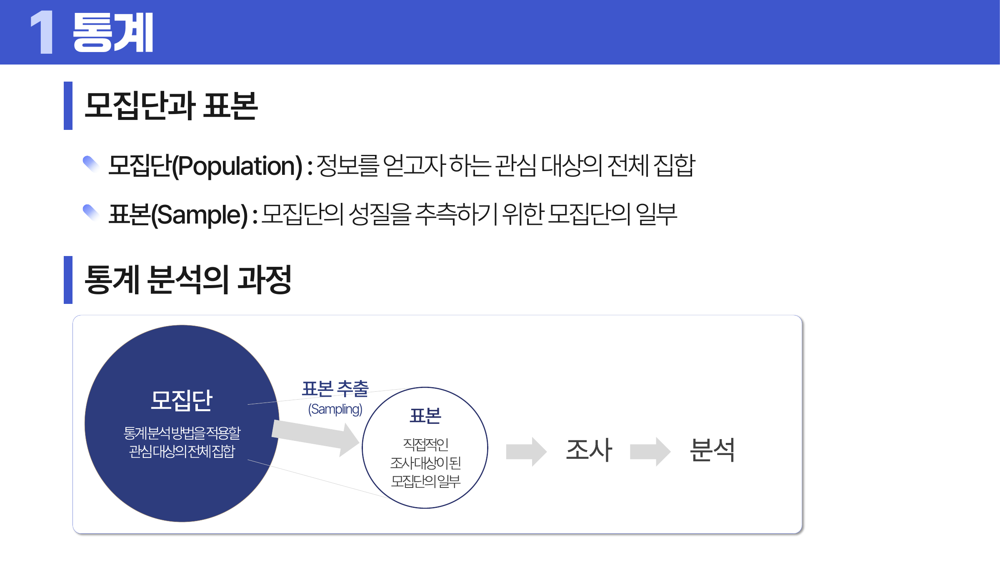
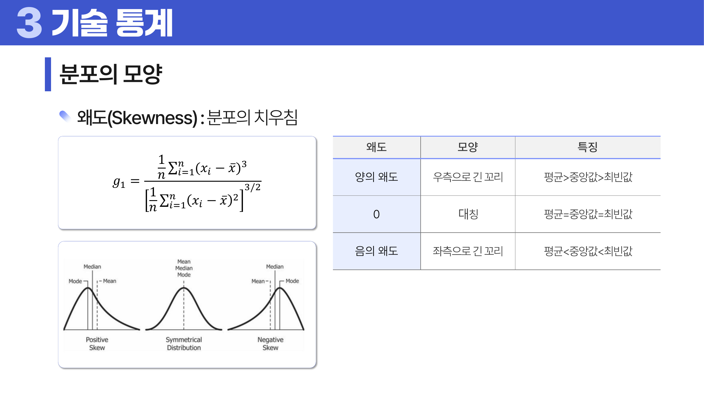
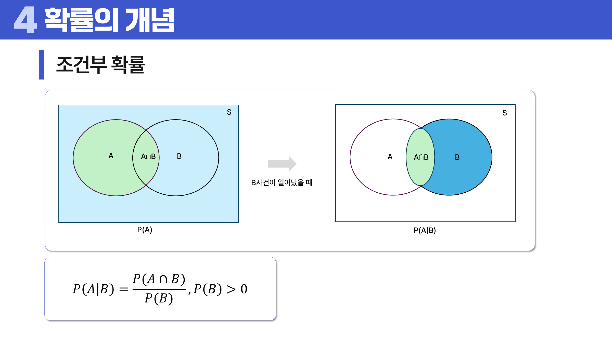
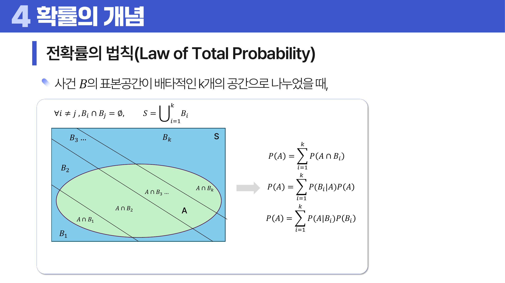
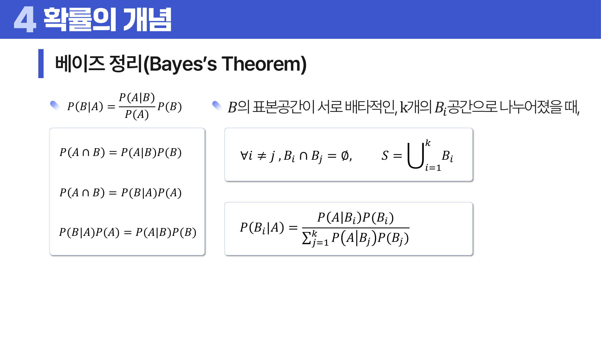

# 04. 통계와 확률

## 학습 목표

이 차시를 마치면 다음을 쉬운 말로 설명할 수 있으면 충분하다.

- 기술 통계와 추론 통계의 차이를 설명할 수 있다.
- 모집단과 표본이 왜 중요한지, 표본이 잘못 뽑히면 왜 결론이 틀어지는지 말할 수 있다.
- 평균, 중앙값, 최빈값이 분포 모양에 따라 왜 다른 위치에 놓이는지 설명할 수 있다.
- 분산, 표준편차, IQR이 각각 무엇을 보려는 지표인지 말할 수 있다.
- 조건부 확률, 전확률의 법칙, 베이즈 정리를 “관심 범위를 바꾸는 계산”으로 이해할 수 있다.

## 오늘의 한 줄

통계와 확률은 어려운 공식을 외우는 과목이 아니라, **일부 데이터로 전체를 조심스럽게 말하기 위한 언어**다.

## 오늘 반드시 이해할 3가지

1. 표본은 모집단을 대신해서 보는 작은 창이다. 창이 한쪽으로 치우치면 결론도 치우친다.
2. 평균, 중앙값, 최빈값은 모두 “중심”을 말하지만, 분포 모양에 따라 서로 다른 위치를 가리킨다.
3. 조건부 확률과 베이즈 정리는 확률을 볼 때 기준이 되는 세계를 바꾸는 방법이다.

## 이 차시 전에 알면 좋은 것

- **<a id="ref-04-표본"></a>[표본](#note-04-표본)**: 전체가 아니라 일부를 본다는 감각
- **<a id="ref-04-평균"></a>[평균](#note-04-평균)**: 대표값을 하나로 요약하는 방법
- **분포**: 값들이 어떤 모양으로 퍼졌는지 보는 관점

## 개념 지도

```text
통계와 확률
├── 통계
│   ├── 모집단과 표본
│   ├── 표본 추출과 표본오차
│   └── 기술 통계: 중심, 산포, 모양
└── 확률
    ├── 시행, 결과, 표본공간, 사건
    ├── 합사건, 여사건, 조건부 확률
    ├── 독립과 조건부 독립
    ├── 전확률의 법칙
    └── 베이즈 정리
```

## 학습 우선순위

- **필수**: <a id="ref-04-모집단"></a>[모집단](#note-04-모집단)과 표본 구분, 평균/중앙값/최빈값의 위치 이유, <a id="ref-04-조건부-확률"></a>[조건부 확률](#note-04-조건부-확률)의 의미
- **심화**: 전확률과 <a id="ref-04-베이즈-정리"></a>[베이즈 정리](#note-04-베이즈-정리)의 관계
- **나중**: 확률 법칙을 검정과 추정의 수식으로 확장

## 이 차시에서 꼭 붙잡을 설명 방식

이 차시의 핵심은 “공식이 왜 그렇게 생겼는가”를 설명하는 것이다. 예를 들어 평균, 중앙값, 최빈값의 관계는 다음처럼 이해한다.

1. 오른쪽 꼬리가 긴 히스토그램에서는 대부분의 값이 왼쪽 봉우리 근처에 모인다.
2. 최빈값은 가장 자주 나온 값이므로 봉우리 근처에 남는다.
3. 중앙값은 사람들을 키 순서로 세웠을 때 가운데 사람처럼, 개수 기준으로 가운데에 선다.
4. 평균은 모든 값을 더한 뒤 나누므로 오른쪽의 매우 큰 값들에게 끌려간다.
5. 그래서 보통 위치가 `최빈값 → 중앙값 → 평균` 순서가 된다.

반대로 왼쪽 꼬리가 길면 작은 값들이 평균을 왼쪽으로 끌어당긴다. 그래서 보통 `평균 → 중앙값 → 최빈값` 순서가 된다.

## 핵심 이론

### 먼저 잡는 직관

- **<a id="ref-04-통계"></a>[통계](#note-04-통계)**: 데이터가 말하는 것을 정리하는 언어다.
- **확률**: 아직 일어나지 않았거나 우연이 있는 일을 숫자로 표현하는 언어다.
- **표본**: 전체를 다 볼 수 없을 때 대신 보는 일부다.
- **<a id="ref-04-기술-통계"></a>[기술 통계](#note-04-기술-통계)**: 지금 가진 데이터를 요약한다.
- **<a id="ref-04-추론-통계"></a>[추론 통계](#note-04-추론-통계)**: 표본을 이용해 모집단을 추측한다.

### 1. 통계란 무엇인가?

통계는 데이터를 수집, 정리, 분석, 해석하여 결론을 도출하는 학문이다. 처음에는 “평균을 계산하는 것”처럼 보일 수 있지만, 더 정확히는 데이터를 근거로 주장하는 방법이다.

| 구분 | 의미 | 예 |
|---|---|---|
| 기술 통계 | 가지고 있는 데이터를 요약한다. | 이 반 학생 30명의 평균 키는 168cm다. |
| 추론 통계 | 일부 데이터로 전체에 대해 말한다. | 표본 1000명을 조사해 전체 유권자의 지지율을 추정한다. |

기술 통계는 비교적 직접적이다. 가진 데이터 안에서 계산한다. 추론 통계는 더 조심해야 한다. 표본이 모집단을 잘 대표하지 못하면 계산은 정확해 보여도 결론은 틀릴 수 있다.

### 2. 모집단과 표본

모집단은 정보를 얻고자 하는 관심 대상의 전체 집합이다. 표본은 모집단의 성질을 추측하기 위해 뽑은 일부다.



> **그림 읽기**: 관심 있는 전체와 실제 관측한 일부를 구분한다. 통계는 표본을 통해 모집단을 조심스럽게 추측하는 과정이다.

왜 표본이 필요할까? 전체를 모두 조사하기 어렵기 때문이다. 전국 모든 사람의 키를 재는 것은 비용과 시간이 너무 많이 든다. 그래서 일부를 뽑아 전체를 추측한다.

하지만 표본은 작은 창이다. 창이 모집단의 한쪽만 보여 주면 전체를 잘못 말하게 된다. 예를 들어 헬스장 이용자만 뽑아 “전체 성인의 평균 운동 시간”을 추정하면 실제보다 높게 나올 가능성이 크다.

### 3. 표본 추출

<a id="ref-04-표본-추출"></a>[표본 추출](#note-04-표본-추출)은 모집단에서 표본을 선택하는 과정이다. 중요한 질문은 “누가 표본에 들어갈 기회를 가졌는가?”다.

| 방법 | 쉬운 설명 | 장점 | 주의점 |
|---|---|---|---|
| 단순 무작위 추출 | 모두에게 같은 추첨 기회를 준다. | 편향이 작다. | 전체 명단이 필요하다. |
| 계통 추출 | 일정 간격마다 뽑는다. | 실행이 쉽다. | 목록에 주기가 있으면 편향된다. |
| 층화 추출 | 중요한 집단별로 나눈 뒤 각 집단에서 뽑는다. | 소수 집단도 대표되게 할 수 있다. | 층을 잘못 나누면 효과가 떨어진다. |
| 집락 추출 | 작은 집단 묶음 몇 개를 통째로 뽑는다. | 현장 조사 비용이 줄어든다. | 같은 집락 안 사람이 비슷하면 오차가 커질 수 있다. |

층화 추출과 집락 추출은 헷갈리기 쉽다. 층화 추출은 각 층에서 조금씩 뽑는다. 집락 추출은 집락 몇 개를 통째로 뽑는다. 층화는 대표성을 높이려는 목적이 강하고, 집락은 조사 비용을 줄이려는 목적이 강하다.

비확률 표본 추출은 각 대상이 뽑힐 확률을 정확히 계산하지 않는 방법이다. 빠르고 편하지만 표본오차를 정량적으로 말하기 어렵다.

### 4. 중심 경향

<a id="ref-04-중심-경향"></a>[중심 경향](#note-04-중심-경향)은 값들이 어느 위치에 모이는지 보는 지표다.

| 지표 | 쉬운 의미 | 잘 맞는 상황 |
|---|---|---|
| 산술 평균 | 모두 더해서 개수로 나눈 값 | 값들이 비교적 대칭일 때 |
| 중앙값 | 순서대로 세웠을 때 가운데 값 | 극단값이 있거나 꼬리가 길 때 |
| 최빈값 | 가장 자주 나온 값 | 범주형 데이터나 봉우리를 볼 때 |
| 가중 평균 | 중요도나 비중을 반영한 평균 | 과목별 학점, 포트폴리오 수익률 |
| 절사 평균 | 양쪽 끝 일부를 빼고 낸 평균 | 극단값 영향을 줄이고 싶을 때 |
| 조화 평균 | 역수 평균의 역수 | 속도, 비율처럼 “단위당 양”을 평균낼 때 |
| 기하 평균 | 곱셈 변화의 평균 | 성장률, 수익률처럼 복리 변화가 있을 때 |

평균은 모든 값을 같은 무게로 더한다. 그래서 극단값의 영향을 받는다. 중앙값은 순서의 가운데만 본다. 그래서 극단값 몇 개에는 덜 흔들린다. 최빈값은 빈도가 가장 높은 위치를 본다. 그래서 데이터가 가장 많이 몰린 봉우리를 알려 준다.



> **그림 읽기**: 꼬리가 긴 쪽으로 평균이 끌려가는 위치 관계를 본다. 중앙값과 최빈값은 평균보다 극단값에 덜 흔들린다.

오른쪽 꼬리가 긴 분포를 자세히 보자.

1. 대부분의 값은 왼쪽에 몰려 있으므로 최빈값은 왼쪽 봉우리 근처에 있다.
2. 중앙값은 개수 기준으로 가운데라서 봉우리보다 약간 오른쪽으로 갈 수 있다.
3. 평균은 큰 값의 크기를 모두 더하므로 오른쪽 꼬리의 큰 값들에게 가장 많이 끌려간다.
4. 그래서 보통 `최빈값 < 중앙값 < 평균`이 된다.

왼쪽 꼬리가 긴 분포에서는 반대다. 작은 값들이 평균을 왼쪽으로 끌어당기므로 보통 `평균 < 중앙값 < 최빈값`이 된다.

이 설명이 항상 완벽한 법칙은 아니다. 봉우리가 여러 개인 분포, 표본 수가 매우 작은 데이터, 극단값이 특이하게 섞인 데이터에서는 순서가 달라질 수 있다. 그래도 “평균은 크기에 끌리고, 중앙값은 순서에 의존하고, 최빈값은 빈도에 의존한다”는 원리는 유지된다.

### 5. 산포도

<a id="ref-04-산포도"></a>[산포도](#note-04-산포도)는 값들이 얼마나 퍼져 있는지를 본다. 평균이 같아도 퍼짐이 다르면 데이터의 의미는 완전히 달라질 수 있다.

| 지표 | 쉬운 의미 | 특징 |
|---|---|---|
| 분산 | 평균에서 떨어진 정도를 제곱해 평균낸 값 | 큰 차이를 더 크게 반영한다. |
| 표준편차 | 분산의 제곱근 | 원래 단위와 비슷하게 해석할 수 있다. |
| 평균 절대 편차 | 평균에서 떨어진 거리의 평균 | 제곱하지 않아 직관적이다. |
| 중앙값 절대 편차 | 중앙값에서 떨어진 거리의 중앙값 | 극단값에 강하다. |
| 변동계수 | 표준편차를 평균으로 나눈 비율 | 단위가 다른 변수의 상대적 변동성 비교에 쓴다. |
| IQR | 3사분위수와 1사분위수의 차이 | 중앙 50%의 퍼짐을 본다. |

분산은 왜 차이를 제곱할까? 첫째, 평균보다 큰 값과 작은 값의 차이가 서로 상쇄되지 않게 하기 위해서다. 둘째, 평균에서 멀리 떨어진 값을 더 크게 반영하기 위해서다. 하지만 제곱하면 단위도 제곱된다. 그래서 다시 제곱근을 취한 표준편차를 함께 사용한다.

표본분산에서 `n`이 아니라 `n - 1`로 나누는 이유도 있다. 표본평균은 표본 안에서 이미 계산된 값이라, 각 데이터가 평균에서 얼마나 떨어질지 정하는 데 자유도 하나를 사용한다. 그래서 `n`으로 나누면 모집단의 퍼짐을 조금 작게 추정하는 경향이 있다. `n - 1`은 그 과소추정을 보정하는 장치라고 이해하면 된다.

### 6. 분포의 모양

분포의 모양은 값들이 어느 쪽으로 치우쳤는지, 꼬리가 얼마나 두꺼운지를 본다.

| 지표 | 쉬운 의미 | 해석 |
|---|---|---|
| 왜도 | 좌우 비대칭 정도 | 양의 왜도는 오른쪽 꼬리, 음의 왜도는 왼쪽 꼬리 |
| 첨도 | 꼬리와 뾰족함의 정도 | 큰 값이나 작은 값이 얼마나 자주 나오는지와 관련 |

<a id="ref-04-왜도"></a>[왜도](#note-04-왜도)는 세제곱을 사용한다. 이유는 부호를 살리기 위해서다. 오른쪽으로 큰 차이는 양수, 왼쪽으로 큰 차이는 음수로 남는다. 그래서 어느 방향으로 꼬리가 긴지 볼 수 있다.

<a id="ref-04-첨도"></a>[첨도](#note-04-첨도)는 네제곱을 사용한다. 네제곱은 양쪽 극단값을 모두 크게 만든다. 그래서 방향보다 “꼬리의 두꺼움”과 극단값의 존재를 보는 데 쓰인다.

### 7. 확률의 기본 언어

확률을 배우기 전에 네 단어를 먼저 잡아야 한다.

| 용어 | 뜻 | 주사위 예 |
|---|---|---|
| 시행 | 우연이 포함된 실험이나 행위 | 주사위를 한 번 던짐 |
| 결과 | 시행 후 실제로 나온 하나의 결과 | 4가 나옴 |
| 표본공간 | 가능한 모든 결과의 모음 | `{1,2,3,4,5,6}` |
| 사건 | 관심 있는 결과의 묶음 | 짝수가 나옴 `{2,4,6}` |

수학적 확률은 이론적으로 계산한 확률이다. 모든 경우가 같은 가능성을 가진다면 다음처럼 계산한다.

```text
P(A) = A 사건의 경우의 수 / 전체 경우의 수
```

통계적 확률은 관찰을 통해 얻은 경험적 확률이다. 실험을 많이 반복할수록 안정될 가능성이 커진다.

### 8. 확률의 기본 성질

확률의 범위는 0에서 1 사이다. 일어날 수 없는 <a id="ref-04-사건"></a>[사건](#note-04-사건)의 확률은 0이고, <a id="ref-04-표본공간"></a>[표본공간](#note-04-표본공간) 전체의 확률은 1이다.

| 규칙 | 의미 |
|---|---|
| `P(A^c) = 1 - P(A)` | A가 안 일어날 확률은 전체에서 A를 뺀 값이다. |
| `P(A ∪ B) = P(A) + P(B) - P(A ∩ B)` | A 또는 B가 일어날 확률은 겹친 부분을 한 번 빼야 한다. |
| 배반이면 `P(A ∪ B) = P(A) + P(B)` | 겹치지 않으면 빼야 할 부분이 없다. |

합사건에서 교집합을 빼는 이유는 중복 계산 때문이다. A 확률과 B 확률을 더하면 A와 B가 동시에 일어난 부분이 두 번 들어간다. 그래서 한 번 빼야 한다.

### 9. 조건부 확률

조건부 확률은 어떤 사건이 이미 일어났다고 알고 난 뒤, 관심 범위를 그 사건 안으로 줄여 다시 계산한 확률이다.



> **그림 읽기**: B가 일어났다는 조건이 표본공간을 어떻게 줄이는지 본다. 분모가 전체가 아니라 조건 사건이라는 점이 핵심이다.

```text
P(A | B) = P(A ∩ B) / P(B)
```

왜 `P(B)`로 나눌까? 이제 전체 세계가 `S`가 아니라 `B가 일어난 세계`로 바뀌었기 때문이다. 그 안에서 A도 함께 일어난 부분이 얼마나 되는지를 보는 것이다.

독립은 B를 알게 되어도 A의 확률이 변하지 않는다는 뜻이다.

```text
P(A | B) = P(A)
```

조건부 독립은 더 조심해야 한다. 두 사건이 전체로 보면 관련 있어 보여도, 어떤 조건을 고정하면 관계가 사라질 수 있다. 예를 들어 질병이 증상과 검사 결과를 모두 만들었다면, 질병 여부를 알고 난 뒤에는 증상과 검사 결과의 직접 관련성이 줄어들 수 있다.

### 10. 전확률의 법칙

전확률의 법칙은 전체를 여러 경우로 나눈 뒤, 각 경우에서 A가 일어날 확률을 더하는 방법이다.



> **그림 읽기**: 전체 사건을 서로 겹치지 않는 조각으로 나누어 더하는 구조를 본다. 복잡한 확률을 조건별 확률의 합으로 계산한다.

예를 들어 전체 고객을 신규 고객과 기존 고객으로 나눌 수 있다고 하자. 전체 구매 확률은 다음처럼 생각한다.

```text
전체 구매 확률
= 신규 고객일 확률 * 신규 고객의 구매 확률
+ 기존 고객일 확률 * 기존 고객의 구매 확률
```

즉, 전확률의 법칙은 “어느 길로 A가 일어날 수 있는가?”를 경우별로 쪼개 더하는 규칙이다.

### 11. 베이즈 정리

베이즈 정리는 조건을 거꾸로 바꿔 생각하는 방법이다.



> **그림 읽기**: 사전 정보와 관측 정보를 결합해 조건을 뒤집는 흐름을 본다. 검사 양성일 확률과 실제 질병일 확률은 서로 다른 질문이다.

처음 배우는 사람에게 가장 중요한 문장은 이것이다.

```text
검사 양성일 때 실제 질병일 확률은
질병일 때 검사 양성일 확률과 다르다.
```

왜 다를까? 질병이 없는 사람이 훨씬 많으면, 거짓 양성도 많이 생길 수 있기 때문이다. 이때 기준이 되는 집단의 크기, 즉 기본 비율을 함께 봐야 한다.

예를 들어 마을 사람 10%가 감기에 걸려 있고, 감기인 사람은 90% 확률로 양성, 감기가 아닌 사람도 20% 확률로 양성이 나온다고 하자.

1000명으로 생각하면 쉽다.

| 집단 | 사람 수 | 양성 수 |
|---|---:|---:|
| 감기 있음 | 100명 | 90명 |
| 감기 없음 | 900명 | 180명 |
| 전체 양성 |  | 270명 |

양성 270명 중 실제 감기인 사람은 90명이다.

```text
P(감기 | 양성) = 90 / 270 = 1/3
```

결과는 약 33.3%다. 검사의 민감도 90%만 보고 “양성이면 거의 감기”라고 생각하면 기본 비율을 놓친 것이다.

## 판단 기준

통계와 확률 문제를 볼 때는 다음 순서로 판단한다.

1. 지금 가진 데이터가 모집단인지 표본인지 확인한다.
2. 표본이 어떻게 뽑혔는지 확인한다.
3. 평균만 볼지, 중앙값과 산포도까지 함께 볼지 결정한다.
4. 분포가 대칭인지, 꼬리가 긴지, 봉우리가 여러 개인지 본다.
5. 확률 문제에서는 표본공간과 사건을 먼저 적는다.
6. 조건부 확률에서는 기준이 되는 세계가 무엇으로 바뀌었는지 확인한다.
7. 베이즈 문제에서는 기본 비율을 반드시 포함한다.

## 오해와 반례

### 오해 1. 표본 수가 크면 표본은 자동으로 공정하다.

표본 수가 커도 수집 경로가 치우치면 편향은 남는다. 특정 앱 사용자 100만 명은 전체 국민을 대표하지 않을 수 있다.

### 오해 2. 평균은 언제나 대표값이다.

꼬리가 긴 분포에서는 평균이 극단값에 끌려간다. 소득처럼 우측 꼬리가 긴 데이터에서는 중앙값도 함께 봐야 한다.

### 오해 3. 표준편차가 작으면 항상 좋은 데이터다.

퍼짐이 작다는 뜻일 뿐이다. 평균 대치처럼 잘못된 처리 때문에 퍼짐이 인위적으로 줄어든 것일 수도 있다.

### 오해 4. `P(A | B)`와 `P(B | A)`는 비슷하다.

전혀 다를 수 있다. `질병일 때 양성`과 `양성일 때 질병`은 기준 집단이 다르다.

### 오해 5. 독립이면 아무 관계가 없다는 뜻이다.

확률적으로 한 사건을 알아도 다른 사건의 확률이 변하지 않는다는 뜻이다. 현실적, 인과적 무관계와 항상 같은 말은 아니다.

## 예시 풀이

### 예시 1. 오른쪽 꼬리가 긴 소득 분포의 중심은?

소득 분포는 보통 많은 사람이 낮거나 중간 소득 구간에 몰리고, 일부 고소득자가 오른쪽 꼬리를 만든다. 최빈값은 가장 사람이 많은 구간에 있다. 중앙값은 사람 수 기준 가운데라서 최빈값보다 오른쪽일 수 있다. 평균은 고소득자의 큰 숫자를 모두 더하므로 오른쪽으로 더 끌려간다.

따라서 보통 `최빈값 < 중앙값 < 평균` 순서가 된다. 이때 평균만 말하면 일반적인 사람의 소득보다 높게 느껴질 수 있으므로 중앙값을 함께 보는 것이 좋다.

### 예시 2. 양성 판정이 나왔을 때 실제 감기일 확률

감기인 사람 중 양성이 90%라는 말은 검사 성능의 일부다. 하지만 양성 판정자 안에는 감기가 아닌데도 양성이 나온 사람도 들어 있다. 감기가 아닌 사람이 훨씬 많다면 거짓 양성 수도 커진다.

그래서 `P(양성 | 감기)`가 아니라 `P(감기 | 양성)`을 계산해야 한다. 1000명 기준으로 감기 양성 90명, 비감기 양성 180명이므로 양성 중 실제 감기는 90/270, 약 33.3%다.

## 오늘의 요약 5줄

1. 통계는 데이터를 근거로 결론을 말하는 언어이고, 확률은 우연을 숫자로 다루는 언어다.
2. 표본이 모집단을 잘 대표하지 못하면 계산이 맞아도 결론은 틀릴 수 있다.
3. 평균은 크기에 끌리고, 중앙값은 순서에 의존하며, 최빈값은 빈도에 의존한다.
4. 산포도와 분포 모양을 보지 않으면 같은 평균도 완전히 다르게 해석될 수 있다.
5. 조건부 확률과 베이즈 정리는 기준이 되는 집단을 바꿔 다시 계산하는 방법이다.

## 확인 문제

1. 기술 통계와 추론 통계의 차이를 예와 함께 설명하라.
2. 모집단과 표본의 차이를 설명하고, 표본이 치우치면 어떤 문제가 생기는지 예를 들어 설명하라.
3. 층화 추출과 집락 추출의 차이를 설명하라.
4. 오른쪽 꼬리가 긴 분포에서 평균, 중앙값, 최빈값이 보통 어떤 순서가 되는지, 그 이유를 설명하라.
5. 분산에서 차이를 제곱하는 이유와 표준편차를 함께 쓰는 이유를 설명하라.
6. IQR이 극단값에 비교적 강한 이유를 설명하라.
7. 조건부 확률에서 `P(B)`로 나누는 이유를 설명하라.
8. `P(A | B)`와 `P(B | A)`가 다른 이유를 진단 검사 예로 설명하라.
9. 전확률의 법칙을 “전체를 경우별로 나누어 더한다”는 관점에서 설명하라.
10. 베이즈 정리에서 기본 비율을 무시하면 어떤 오해가 생기는지 설명하라.
11. 왜 오른쪽 꼬리가 긴 분포에서는 평균이 중앙값보다 오른쪽으로 움직이는가?
12. 왜 조건부 확률은 단순한 전체 확률과 다르게 읽어야 하는가?

## 개념 주석

본문에서 연결된 개념을 잠깐 확인하는 공간이다. 용어를 누르면 본문에서 처음 표시된 위치로 돌아간다.

- <a id="note-04-표본"></a>[표본](#ref-04-표본): 전체 대신 관찰한 일부 대상.
- <a id="note-04-평균"></a>[평균](#ref-04-평균): 모든 값을 더해 개수로 나눈 대표값.
- <a id="note-04-모집단"></a>[모집단](#ref-04-모집단): 알고 싶은 전체 대상.
- <a id="note-04-조건부-확률"></a>[조건부 확률](#ref-04-조건부-확률): 어떤 일이 일어났다고 알고 난 뒤 다시 계산한 확률.
- <a id="note-04-베이즈-정리"></a>[베이즈 정리](#ref-04-베이즈-정리): 조건을 거꾸로 바꿔 계산하는 규칙.
- <a id="note-04-통계"></a>[통계](#ref-04-통계): 데이터를 정리하고 해석해 결론을 내는 방법.
- <a id="note-04-기술-통계"></a>[기술 통계](#ref-04-기술-통계): 가지고 있는 데이터를 요약하는 방법.
- <a id="note-04-추론-통계"></a>[추론 통계](#ref-04-추론-통계): 일부 데이터로 전체에 대해 말하는 방법.
- <a id="note-04-표본-추출"></a>[표본 추출](#ref-04-표본-추출): 모집단에서 표본을 고르는 과정.
- <a id="note-04-중심-경향"></a>[중심 경향](#ref-04-중심-경향): 값들이 어느 위치에 모이는지.
- <a id="note-04-산포도"></a>[산포도](#ref-04-산포도): 값들이 얼마나 퍼져 있는지.
- <a id="note-04-왜도"></a>[왜도](#ref-04-왜도): 분포가 어느 한쪽으로 치우친 정도.
- <a id="note-04-첨도"></a>[첨도](#ref-04-첨도): 분포의 꼬리와 뾰족함의 정도.
- <a id="note-04-사건"></a>[사건](#ref-04-사건): 관심 있는 결과의 묶음
- <a id="note-04-표본공간"></a>[표본공간](#ref-04-표본공간): 가능한 모든 결과의 모음
