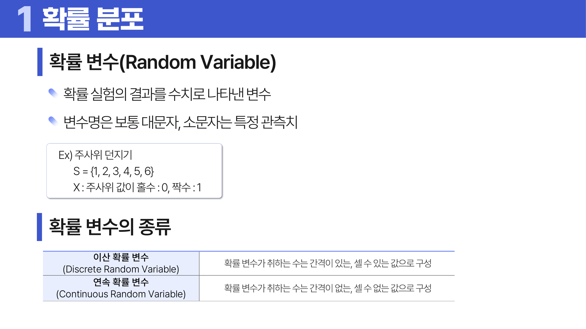
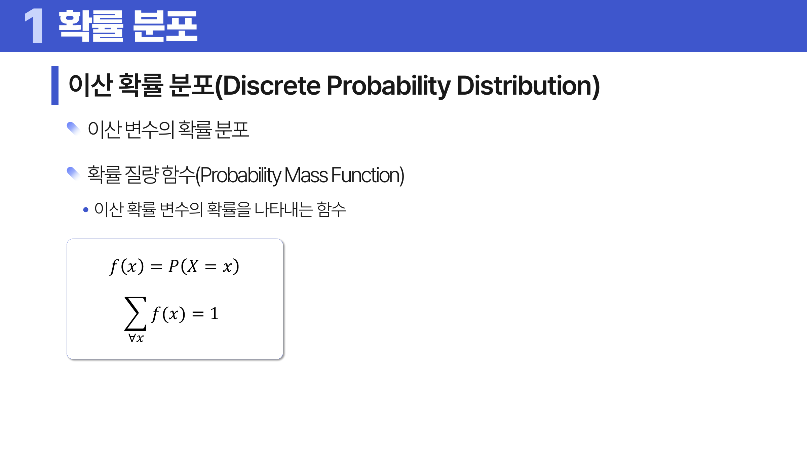
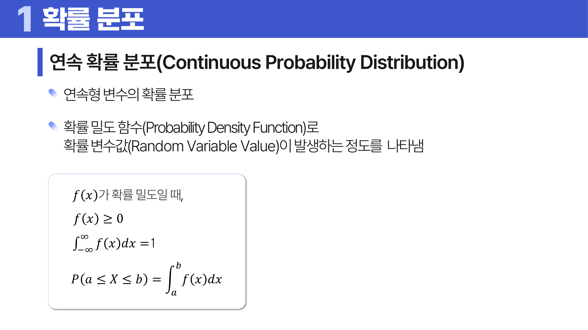
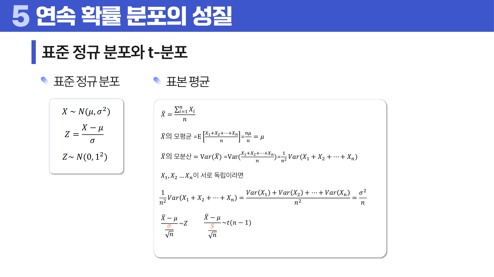

# 05. 확률 분포

## 학습 목표

이 차시를 마치면 다음을 쉬운 말로 설명할 수 있으면 충분하다.

- 확률변수는 우연한 결과를 숫자로 적은 것임을 이해한다.
- 이산 분포는 점의 확률, 연속 분포는 구간의 면적으로 확률을 읽는다는 차이를 설명한다.
- 대표 분포는 이름보다 “어떤 상황을 세는가”로 구분한다.

## 오늘의 한 줄

확률 분포는 우연한 결과가 어떤 값으로 얼마나 자주 나타나는지 그린 지도다.

## 오늘 반드시 이해할 3가지

1. 확률변수는 우연한 결과를 숫자로 적은 것임을 이해한다.
2. 이산 분포는 점의 확률, 연속 분포는 구간의 면적으로 확률을 읽는다는 차이를 설명한다.
3. 대표 분포는 이름보다 “어떤 상황을 세는가”로 구분한다.

## 이 차시 전에 알면 좋은 것

- **확률**: 일어날 가능성을 숫자로 표현하는 말
- **<a id="ref-05-평균"></a>[평균](#note-05-평균)과 <a id="ref-05-분산"></a>[분산](#note-05-분산)**: <a id="ref-05-분포"></a>[분포](#note-05-분포)의 중심과 퍼짐을 읽는 기준
- **<a id="ref-05-표본"></a>[표본](#note-05-표본)**: 표본평균의 분포를 이해하는 출발점

## 개념 지도

```text
확률 분포
├── 확률변수와 분포
├── 이산 분포와 연속 분포
├── 대표 분포를 상황으로 구분하기
├── 기대값, 분산, 중심극한정리
└── 확인 문제와 해설
```

## 학습 우선순위

- **필수**: <a id="ref-05-확률변수"></a>[확률변수](#note-05-확률변수)와 분포의 의미, 이산/<a id="ref-05-연속-분포"></a>[연속 분포](#note-05-연속-분포)의 차이, <a id="ref-05-중심극한정리"></a>[중심극한정리](#note-05-중심극한정리)가 표본평균에 대한 말임을 이해
- **심화**: t분포와 표준정규분포의 꼬리 차이
- **나중**: 적률과 분포 모양의 수식적 요약

## 이 차시에서 꼭 붙잡을 설명 방식

연속분포에서 “키가 정확히 170.000000cm일 확률”은 사실상 0이다. 가능한 실수 값이 너무 촘촘하기 때문이다. 그래서 한 점이 아니라 “169.5cm에서 170.5cm 사이”처럼 구간을 잡고, 곡선 아래 면적을 확률로 읽는다. 이 이유를 알아야 PDF의 확률밀도함수 식이 단순한 공식이 아니라 “면적으로 확률을 구하자”는 약속임을 이해할 수 있다.

## 핵심 이론

### 먼저 잡는 직관

- **확률변수와 분포**: 주사위 눈처럼 우연한 결과를 숫자 X로 적으면, 그 숫자가 어디에 얼마나 자주 나오는지 분포로 볼 수 있다.
- **<a id="ref-05-이산-분포"></a>[이산 분포](#note-05-이산-분포)와 연속 분포**: 셀 수 있는 값은 각 점의 확률을 더하고, 키나 시간처럼 이어진 값은 구간 아래 면적으로 확률을 읽는다.
- **대표 분포를 상황으로 구분하기**: 분포 이름을 먼저 외우기보다 성공 횟수, 사건 수, 기다리는 시간처럼 무엇을 세는지부터 묻는다.
- **<a id="ref-05-기대값"></a>[기대값](#note-05-기대값), 분산, 중심극한정리**: 기대값은 중심 위치, 분산은 흔들림, 중심극한정리는 표본평균이 왜 정규분포로 다뤄지는지 설명한다.

### 1. 확률변수와 분포

주사위를 던지면 결과는 눈의 개수다. 이 결과를 X라는 숫자 <a id="ref-05-변수"></a>[변수](#note-05-변수)로 적으면 확률변수가 된다. <a id="ref-05-확률분포"></a>[확률분포](#note-05-확률분포)는 X가 1, 2, 3 같은 값을 가질 가능성을 정리한 표나 곡선이다. 분석에서는 데이터 한 번의 결과보다 결과들이 반복될 때 어떤 모양을 만드는지가 더 중요하다.



> **그림 읽기**: 우연한 결과를 숫자로 바꾸고 그 숫자의 가능성을 분포로 정리하는 흐름을 본다. 확률변수는 결과를 계산 가능한 언어로 바꾼 것이다.

### 2. 이산 분포와 연속 분포

확률변수가 셀 수 있는 값만 가지면 이산 확률변수이고, 그 분포가 이산 분포다. 베르누이, 이항, 포아송처럼 개수를 세는 분포는 각 값마다 확률을 직접 붙일 수 있다. 확률변수가 키, 시간, 길이처럼 이어진 값을 가지면 연속 확률변수이고, 정규, 지수, 감마 같은 연속 분포에서는 곡선 아래 면적으로 확률을 읽는다. 그래서 PDF에서는 확률질량함수와 확률밀도함수를 구분한다.



> **그림 읽기**: 각 점에 확률이 붙어 있고 전체를 더하면 1이 되는 구조를 본다. 셀 수 있는 값에서는 점의 확률을 직접 읽는다.



> **그림 읽기**: 곡선의 높이보다 구간 아래 면적을 본다. 연속값에서는 한 점이 아니라 범위의 확률을 묻는다.

### 3. 대표 분포를 상황으로 구분하기

베르누이는 성공/실패 한 번, 이항은 성공/실패를 여러 번 반복했을 때 성공 횟수, 포아송은 일정 시간이나 공간에서 사건이 몇 번 일어났는지를 본다. 정규분포는 평균 주변에 값이 모이는 상황, 지수분포는 다음 사건까지 기다리는 시간, 카이제곱/t/F 분포는 추정과 검정에서 표본의 불확실성을 다룰 때 자주 등장한다.

### 4. 기대값, 분산, 중심극한정리

기대값은 오래 반복했을 때의 평균 위치이고, 분산은 그 주변의 퍼짐이다. 중심극한정리는 표본이 충분히 독립적이고 분산이 지나치게 이상하지 않은 조건에서, 원래 데이터가 꼭 정규분포가 아니어도 표본평균의 분포가 표본 수가 커질수록 정규분포에 가까워진다는 말이다. 이 원리 때문에 뒤에서 신뢰구간과 가설검정이 가능해진다.

아래 그림은 그 다음 단계에서 표본평균을 어떻게 표준화해 정규분포나 t분포 기준으로 읽는지 보여 준다. 즉 “표본평균이 하나의 분포를 가진다”는 생각이 있어야, 평균의 구간 추정과 가설검정이 같은 언어로 이어진다.



> **그림 읽기**: 표본평균을 표준화하면 기준 분포로 읽을 수 있음을 본다. 이 연결이 신뢰구간과 가설검정으로 이어진다.

## 판단 기준

1. 값이 개수인지 연속량인지 먼저 구분한다.
2. 무엇을 세는 분포인지 상황을 문장으로 쓴다.
3. 분포의 <a id="ref-05-모수"></a>[모수](#note-05-모수)가 평균, 성공확률, 발생률 중 무엇을 뜻하는지 확인한다.
4. 확률을 한 점에서 읽는지 구간의 면적으로 읽는지 구분한다.
5. 중심극한정리가 데이터 자체가 아니라 표본평균에 대한 말임을 확인한다.

## 오해와 반례

### 오해 1. 분포 이름을 외우면 충분하다.

분포는 상황과 가정이 핵심이다. “몇 번 성공했는가”, “다음 사건까지 얼마나 기다리는가”처럼 질문으로 구분해야 한다.

### 오해 2. 연속분포의 y값이 바로 확률이다.

연속분포의 y값은 밀도다. 확률은 구간 아래 면적으로 계산한다.

### 오해 3. 중심극한정리는 데이터 자체가 정규분포가 된다는 뜻이다.

표본평균의 분포가 정규분포에 가까워진다는 뜻이다.

## 예시 풀이

### 예시 1. 콜센터에 1시간 동안 전화가 몇 통 오는가?

일정 시간 안의 사건 수를 세므로 포아송 분포를 먼저 떠올릴 수 있다. 핵심 모수는 `λ(lambda)`, 즉 평균 발생 횟수다.

### 예시 2. 다음 버스가 올 때까지 기다리는 시간은?

다음 사건까지의 대기 시간이므로 지수분포를 생각할 수 있다. 지수분포는 이미 기다린 시간이 앞으로의 대기시간을 바꾸지 않는 무기억성을 가진다.

## 오늘의 요약 5줄

1. 확률 분포는 우연한 결과가 어떤 값으로 얼마나 자주 나타나는지 보여 주는 지도다.
2. 이산분포는 점의 확률, 연속분포는 구간 아래 면적으로 확률을 읽는다.
3. 베르누이, 이항, 포아송, 지수분포는 각각 “무엇을 세는가”로 구분하면 덜 헷갈린다.
4. 기대값은 평균적 위치이고 분산은 그 주변의 퍼짐이다.
5. 중심극한정리는 뒤의 신뢰구간과 가설검정이 작동하는 핵심 이유다.

## 확인 문제

1. 확률변수와 일반 변수의 차이를 설명하라.
2. 이산 확률분포와 연속 확률분포의 차이를 설명하라.
3. 확률밀도함수에서 한 점의 높이가 확률이 아닌 이유를 설명하라.
4. 베르누이 분포와 이항분포의 관계를 설명하라.
5. 포아송 분포가 어울리는 상황을 하나 들고 이유를 설명하라.
6. 지수분포의 무기억성을 쉬운 말로 설명하라.
7. t분포가 표준정규분포보다 꼬리가 두꺼운 이유를 설명하라.
8. 중심극한정리가 왜 추정과 검정의 기초가 되는지 설명하라.
9. 왜 연속분포에서는 한 점의 확률이 아니라 구간 면적을 보는가?
10. 왜 중심극한정리는 가설검정과 신뢰구간의 기초가 되는가?

## 개념 주석

본문에서 연결된 개념을 잠깐 확인하는 공간이다. 용어를 누르면 본문에서 처음 표시된 위치로 돌아간다.

- <a id="note-05-평균"></a>[평균](#ref-05-평균): 모든 값을 더해 개수로 나눈 대표값. ([처음 설명된 차시](../04-statistics-probability/README.md#4-중심-경향))
- <a id="note-05-분산"></a>[분산](#ref-05-분산): 기대값 주변에서 얼마나 퍼지는지.
- <a id="note-05-분포"></a>[분포](#ref-05-분포): 값들이 어떤 모양으로 흩어져 있는지 나타내는 구조.
- <a id="note-05-표본"></a>[표본](#ref-05-표본): 전체 대신 관찰한 일부 대상. ([처음 설명된 차시](../04-statistics-probability/README.md#2-모집단과-표본))
- <a id="note-05-확률변수"></a>[확률변수](#ref-05-확률변수): 우연한 결과를 숫자로 바꾼 변수.
- <a id="note-05-연속-분포"></a>[연속 분포](#ref-05-연속-분포): 구간 아래 면적으로 확률을 읽는 분포.
- <a id="note-05-중심극한정리"></a>[중심극한정리](#ref-05-중심극한정리): 일정 조건에서 표본평균이 표본 수가 커질수록 정규분포에 가까워진다는 원리.
- <a id="note-05-이산-분포"></a>[이산 분포](#ref-05-이산-분포): 셀 수 있는 값마다 확률이 붙는 분포.
- <a id="note-05-기대값"></a>[기대값](#ref-05-기대값): 오래 반복했을 때의 평균적인 결과.
- <a id="note-05-변수"></a>[변수](#ref-05-변수): 관측 대상의 특징을 적어 둔 열. ([처음 설명된 차시](../01-data-understanding/README.md#4-단위-변수-관측치))
- <a id="note-05-확률분포"></a>[확률분포](#ref-05-확률분포): 가능한 값과 그 값이 나올 가능성을 연결한 것.
- <a id="note-05-모수"></a>[모수](#ref-05-모수): 분포의 모양을 정하는 숫자.
