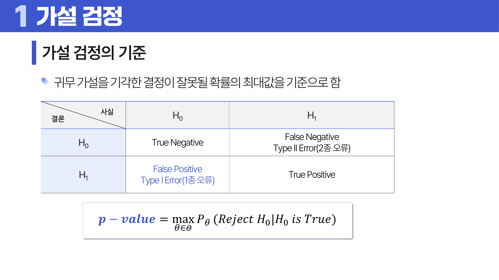
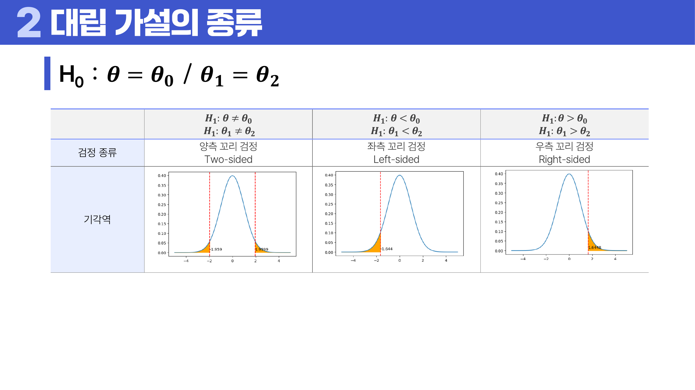
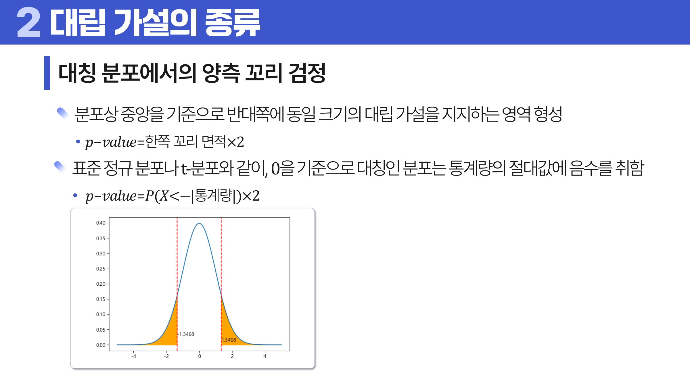

# 06. 가설 검정

## 학습 목표

이 차시를 마치면 다음을 쉬운 말로 설명할 수 있으면 충분하다.

- 귀무가설과 대립가설을 주장과 증거의 관계로 이해한다.
- p-value는 귀무가설이 맞다고 가정했을 때 지금보다 극단적인 결과가 나올 가능성임을 설명한다.
- 유의수준과 기각역이 결론을 자르는 기준이라는 점을 이해한다.

## 오늘의 한 줄

가설 검정은 표본이 보여 준 차이가 우연으로도 설명되는지 따져 보는 절차다.

## 오늘 반드시 이해할 3가지

1. 귀무가설과 대립가설을 주장과 증거의 관계로 이해한다.
2. p-value는 귀무가설이 맞다고 가정했을 때 지금보다 극단적인 결과가 나올 가능성임을 설명한다.
3. 유의수준과 기각역이 결론을 자르는 기준이라는 점을 이해한다.

## 이 차시 전에 알면 좋은 것

- **분포**: 검정통계량이 얼마나 드문지 판단하는 기준
- **표본평균**: 표본 결과를 하나의 판단 숫자로 바꾸는 재료
- **조건부 확률**: p-value를 “가정했을 때”의 확률로 읽는 감각 ([처음 설명된 차시](../04-statistics-probability/README.md#9-조건부-확률))

## 개념 지도

```text
가설 검정
├── 가설 검정의 출발점
├── p-value와 유의수준
├── 검정통계량과 기각역
├── 단측검정과 양측검정
└── 확인 문제와 해설
```

## 학습 우선순위

- **필수**: 귀무가설과 대립가설 구분, p-value와 유의수준의 의미, 단측/양측 검정을 질문에서 결정
- **심화**: 1종/2종 오류의 균형
- **나중**: 검정력과 표본수 설계

## 이 차시에서 꼭 붙잡을 설명 방식

<a id="ref-06-p-value"></a>[p-value](#note-06-p-value)를 “<a id="ref-06-귀무가설"></a>[귀무가설](#note-06-귀무가설)이 맞을 확률”로 해석하면 틀린다. p-value는 귀무가설이 맞다고 이미 가정한 뒤, 그런 세계에서 지금 같은 <a id="ref-06-표본"></a>[표본](#note-06-표본) 결과가 얼마나 드문지를 계산한다. 즉 방향이 반대다. 이 차이를 놓치면 0.03이라는 숫자를 “귀무가설이 3% 확률로 참”이라고 오해한다.

## 핵심 이론

### 먼저 잡는 직관

- **가설 검정의 출발점**: 검정은 “기본 주장이 맞다”고 일단 놓고, 표본이 그 주장을 얼마나 흔드는지 보는 절차다.
- **p-value와 유의수준**: p-value는 귀무가설이 맞는 세계에서 지금 결과가 얼마나 드문지이고, 유의수준은 그 드묾을 판단하는 기준선이다.
- **검정통계량과 기각역**: 표본 결과를 바로 비교하기 어렵기 때문에 하나의 판단 숫자로 바꾸고, 그 숫자가 기각역에 들어가는지 본다.
- **단측검정과 양측검정**: 관심이 한쪽 방향인지, 어느 방향이든 차이인지에 따라 꼬리를 보는 방식이 달라진다.

### 1. 가설 검정의 출발점

검정은 표본으로 <a id="ref-06-모집단"></a>[모집단](#note-06-모집단)의 주장에 답하는 방법이다. 예를 들어 우유 200ml가 실제로 부족한지 알고 싶다면, 먼저 “<a id="ref-06-평균"></a>[평균](#note-06-평균)은 200ml다”를 기본 주장으로 놓고 표본이 이 주장을 얼마나 흔드는지 본다.

### 2. p-value와 유의수준

p-value가 작다는 것은 귀무가설이 맞는 세계에서는 지금 결과가 드물다는 뜻이다. 유의수준 alpha는 “이 정도로 드물면 기본 주장을 버리자”는 기준이다. alpha가 0.05라면 p-value가 0.05보다 작을 때 기각한다.



> **그림 읽기**: 관측 결과보다 더 극단적인 영역의 면적을 본다. 귀무가설이 맞다고 놓았을 때 얼마나 드문 결과인지가 핵심이다.

### 3. 검정통계량과 기각역

표본평균, 표본분산, 표본비율은 그대로 비교하기 어렵다. 그래서 표준화된 <a id="ref-06-검정통계량"></a>[검정통계량](#note-06-검정통계량)으로 바꾼다. 기각역은 그 통계량이 어느 영역에 들어가면 귀무가설을 버릴지 미리 정한 구간이다.



> **그림 읽기**: 검정 방향에 따라 꼬리 영역이 달라지는 모습을 본다. 질문이 한쪽인지 양쪽인지가 기각역의 위치를 정한다.

### 4. 단측검정과 양측검정

작아졌는지만 보는 검정은 좌측 단측검정, 커졌는지만 보는 검정은 우측 단측검정이다. 달라졌는지만 보면 양측검정이다. 질문의 방향을 사후에 바꾸면 유리한 결론을 고르는 문제가 생긴다.



> **그림 읽기**: 중앙 기준 양쪽 꼬리를 함께 보는 이유를 본다. 방향을 특정하지 않으면 양쪽 극단이 모두 대립가설의 증거가 된다.

### 5. 원본 강의자료 보강: 검정통계량과 기준 분포

원본 PDF는 평균, 비율, 분산 검정마다 어떤 검정통계량과 분포를 쓰는지 구분한다. 표본에서 계산한 숫자는 혼자서는 의미가 없고, 귀무가설이 참일 때의 기준 분포와 비교해야 의미가 생긴다.

| 검정 대상 | 대표 검정통계량 | 기준 분포를 고를 때 보는 것 |
|---|---|---|
| 단일 모평균 | 표본평균을 표준오차로 나눈 값 | 모분산을 아는지, 표본 수가 충분한지 |
| 두 모평균 | 두 표본평균의 차이를 표준오차로 나눈 값 | 독립 표본인지 대응 표본인지 |
| 모비율 | 표본비율과 가설 비율의 차이 | 성공/실패 표본 수가 충분한지 |
| 모분산 | 표본분산을 모분산 가설값과 비교 | 카이제곱분포의 자유도 |

양측 검정은 “크거나 작거나 둘 다 이상한가”를 묻고, 단측 검정은 “특정 방향으로만 이상한가”를 묻는다. 비대칭 분포에서는 양쪽 꼬리를 단순히 좌우 대칭으로 나눌 수 없으므로, 기각역이 어떤 확률을 차지하는지 기준으로 봐야 한다.

## 판단 기준

1. 검정하려는 질문을 먼저 한 문장으로 쓴다.
2. 귀무가설과 <a id="ref-06-대립가설"></a>[대립가설](#note-06-대립가설)을 방향까지 포함해 정한다.
3. 검정통계량이 어떤 <a id="ref-06-분포"></a>[분포](#note-06-분포)를 기준으로 판단되는지 확인한다.
4. 유의수준은 데이터를 보기 전에 정하고 p-value와 비교한다.
5. 통계적 유의성과 실제 효과 크기를 분리해서 해석한다.

## 오해와 반례

### 오해 1. p-value는 귀무가설이 참일 확률이다.

p-value는 귀무가설이 참이라고 가정했을 때 표본 결과가 얼마나 드문지다.

### 오해 2. p-value가 작으면 효과가 크다.

표본 수가 크면 작은 효과도 유의할 수 있다. 실제 중요도는 효과 크기와 함께 봐야 한다.

### 오해 3. 유의수준 0.05는 항상 정답이다.

관례일 뿐이다. 의료, 안전처럼 비용이 큰 문제에서는 기준을 더 엄격하게 둘 수 있다.

## 예시 풀이

### 예시 1. 우유 용량이 200ml보다 작은가?

귀무가설은 평균이 200ml 이상 또는 200ml라고 둘 수 있고, 대립가설은 평균이 200ml보다 작다는 주장이다. 질문이 “작은가”이므로 좌측 단측검정이 자연스럽다.

### 예시 2. 새 교육법의 평균 점수가 기존과 다른가?

높아졌는지 낮아졌는지 방향을 정하지 않았다면 양측검정이다. 표본평균 차이를 검정통계량으로 바꾸고 양쪽 꼬리의 극단성을 본다.

## 오늘의 요약 5줄

1. 가설 검정은 표본의 차이가 우연으로도 충분히 설명되는지 따져 보는 절차다.
2. 귀무가설은 일단 맞다고 놓는 기본 주장이고, 대립가설은 데이터로 보이고 싶은 주장이다.
3. p-value는 귀무가설이 맞다고 가정한 세계에서 지금 결과가 얼마나 드문지를 뜻한다.
4. 유의수준과 기각역은 결론을 자르는 사전 기준이다.
5. 검정 방향은 데이터를 본 뒤 바꾸면 결론을 유리하게 고르는 오류가 생긴다.

## 확인 문제

1. 귀무가설과 대립가설의 역할을 설명하라.
2. p-value가 작은데 귀무가설을 기각하는 이유를 설명하라.
3. p-value를 귀무가설이 참일 확률로 해석하면 왜 틀리는가?
4. 유의수준과 기각역의 관계를 설명하라.
5. 단측검정과 양측검정을 구분하는 기준은 무엇인가?
6. 검정통계량이 필요한 이유를 설명하라.
7. 표본 수가 매우 크면 p-value 해석에서 무엇을 조심해야 하는가?
8. 가설은 왜 데이터를 보기 전에 정해야 하는가?
9. 왜 p-value를 “귀무가설이 참일 확률”이라고 말하면 안 되는가?
10. 왜 단측검정과 양측검정은 데이터를 보기 전에 정해야 하는가?
11. 검정통계량과 기준 분포가 함께 필요한 이유를 설명하라.
12. 독립 표본 평균 검정과 대응 표본 평균 검정의 차이를 설명하라.

## 개념 주석

본문에서 연결된 개념을 잠깐 확인하는 공간이다. 용어를 누르면 본문에서 처음 표시된 위치로 돌아간다.

- <a id="note-06-p-value"></a>[p-value](#ref-06-p-value): 귀무가설 아래에서 지금 결과가 얼마나 드문지. 이름: probability value의 줄임말이다. 귀무가설 아래에서 결과가 얼마나 드문지 보는 확률값이다.
- <a id="note-06-귀무가설"></a>[귀무가설](#ref-06-귀무가설): 일단 맞다고 놓고 반박하려는 기본 주장.
- <a id="note-06-표본"></a>[표본](#ref-06-표본): 전체 대신 관찰한 일부 대상. ([처음 설명된 차시](../04-statistics-probability/README.md#2-모집단과-표본))
- <a id="note-06-모집단"></a>[모집단](#ref-06-모집단): 알고 싶은 전체 대상. ([처음 설명된 차시](../04-statistics-probability/README.md#2-모집단과-표본))
- <a id="note-06-평균"></a>[평균](#ref-06-평균): 모든 값을 더해 개수로 나눈 대표값. ([처음 설명된 차시](../04-statistics-probability/README.md#4-중심-경향))
- <a id="note-06-검정통계량"></a>[검정통계량](#ref-06-검정통계량): 표본 결과를 하나의 판단 숫자로 바꾼 값.
- <a id="note-06-대립가설"></a>[대립가설](#ref-06-대립가설): 데이터로 보이고 싶은 변화나 차이의 주장.
- <a id="note-06-분포"></a>[분포](#ref-06-분포): 값들이 어떤 모양으로 흩어져 있는지 나타내는 구조. ([처음 설명된 차시](../05-probability-distributions/README.md#1-확률변수와-분포))
