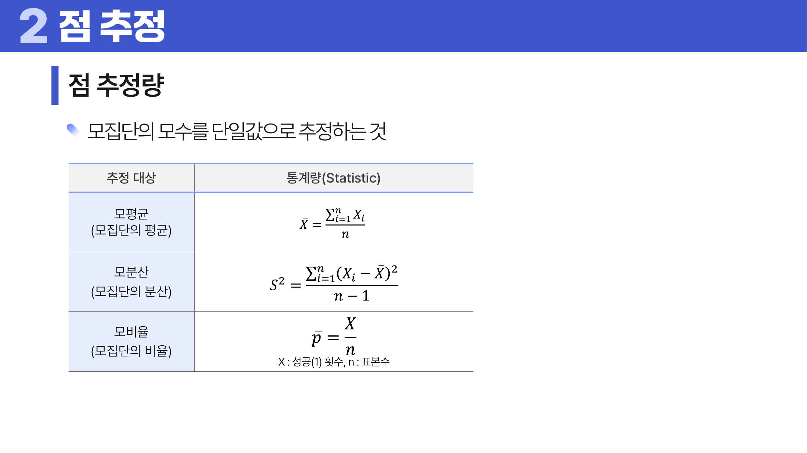
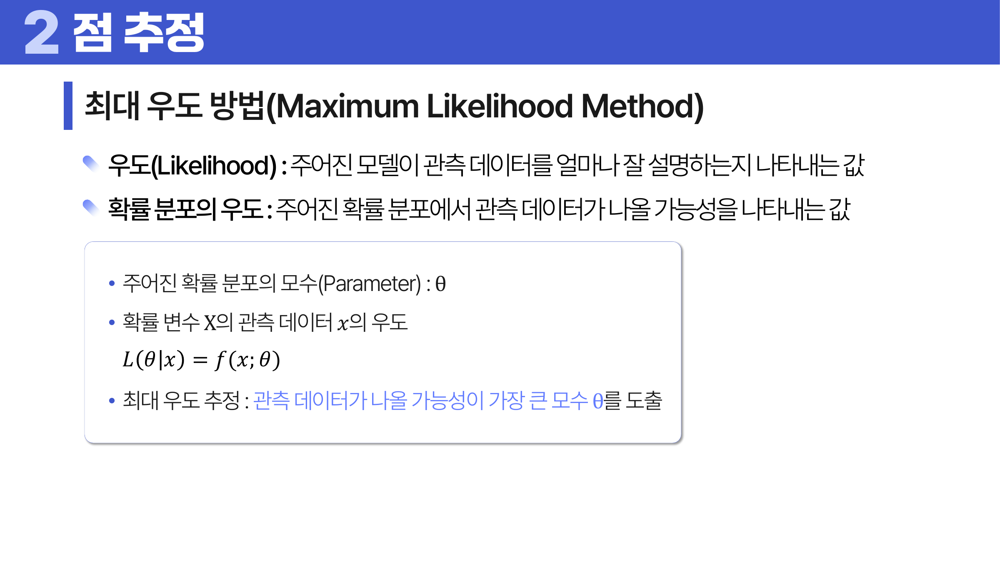
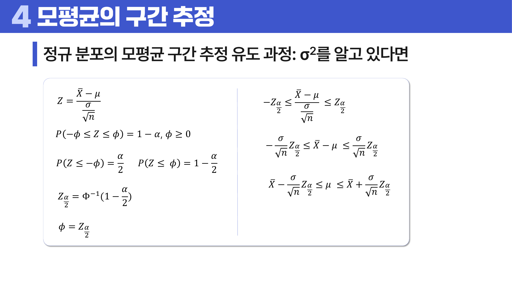

# 07. 점 추정과 구간 추정

## 학습 목표

이 차시를 마치면 다음을 쉬운 말로 설명할 수 있으면 충분하다.

- 점 추정과 구간 추정의 차이를 설명한다.
- 좋은 추정량의 기준인 불편성, 효율성, 일관성을 이해한다.
- 신뢰구간은 모수가 들어갈 절차의 신뢰도이지 특정 구간의 확률이 아님을 이해한다.

## 오늘의 한 줄

추정은 표본으로 모집단의 모수를 맞히되, 맞히는 방식의 불확실성을 함께 말하는 일이다.

## 오늘 반드시 이해할 3가지

1. 점 추정과 구간 추정의 차이를 설명한다.
2. 좋은 추정량의 기준인 불편성, 효율성, 일관성을 이해한다.
3. 신뢰구간은 모수가 들어갈 절차의 신뢰도이지 특정 구간의 확률이 아님을 이해한다.

## 처음 보는 단어

| 용어 | 먼저 이렇게 이해하기 |
|---|---|
| 추정 | 표본을 이용해 모집단의 모수를 어림하는 일 |
| 점 추정 | 모수를 하나의 숫자로 추정하는 방식 |
| 구간 추정 | 모수가 있을 만한 범위를 제시하는 방식 |
| 추정량 | 표본으로 추정값을 만드는 계산 규칙 |
| 불편성 | 반복해서 평균내면 참값에 맞는 성질 |
| 효율성 | 비슷하게 맞는 추정량 중 흔들림이 더 작은 성질 |
| 최대우도 | 관측 데이터가 가장 그럴듯해지는 모수를 찾는 방법 |
| 신뢰수준 | 같은 절차를 반복했을 때 참 모수를 포함할 장기 비율 |

## 용어 이름 먼저 풀기

| 용어 | 이름의 뉘앙스 |
|---|---|
| Estimator | estimate는 어림한다는 뜻이고 estimator는 어림값을 만드는 규칙이다. |
| Unbiased | bias가 없다는 뜻이다. 반복 평균이 실제 모수에 맞는 성질이다. |
| Likelihood | 관측된 데이터가 그 모수 아래에서 그럴듯한 정도다. |
| Confidence Interval | confidence는 절차에 대한 신뢰다. 특정 구간이 움직이지 않는 모수를 확률적으로 담는다는 말과 다르다. |
| Method of Moments | 분포의 적률과 표본의 적률을 맞춰 모수를 찾는 방법이다. |

## 개념 지도

```text
점 추정과 구간 추정
├── 점 추정과 구간 추정
├── 좋은 추정량의 기준
├── 적률법과 최대우도법
├── 대표 신뢰구간
└── 확인 문제와 해설
```

## 이 차시에서 꼭 붙잡을 설명 방식

신뢰구간 95%는 “이번에 계산한 구간 안에 모수가 95% 확률로 있다”는 뜻이 아니다. 모수는 고정되어 있고 구간이 표본마다 달라진다. 같은 방법으로 구간을 아주 많이 만들면 그중 약 95%가 참 모수를 포함한다는 절차의 성질이다.

## 핵심 이론

### 먼저 잡는 직관

- **점 추정과 구간 추정**: 점 추정은 하나의 숫자로 말하고, 구간 추정은 표본이 흔들린다는 사실까지 함께 말한다.
- **좋은 추정량의 기준**: 좋은 추정량은 평균적으로 빗나가지 않고, 덜 흔들리며, 표본이 많아질수록 참값에 가까워진다.
- **적률법과 최대우도법**: 적률법은 평균 같은 요약값을 맞추고, 최대우도법은 지금 데이터가 가장 그럴듯해지는 모수를 고른다.
- **대표 신뢰구간**: 분산을 아는지 모르는지, 평균인지 비율인지에 따라 쓰는 분포와 구간 공식이 달라진다.

### 1. 점 추정과 구간 추정

점 추정은 하나의 숫자로 모수를 추정한다. 구간 추정은 불확실성을 인정하고 가능한 범위를 함께 제시한다.

### 2. 좋은 추정량의 기준

불편성은 반복 평균이 참값에 맞는 성질이고, 효율성은 분산이 작은 성질이다. 일관성은 표본 수가 커질수록 참값에 가까워지는 성질이다.



### 3. 적률법과 최대우도법

적률법은 표본 평균 같은 요약량을 이론값과 맞춘다. 최대우도법은 관측된 데이터가 가장 그럴듯해지는 모수를 찾는다.



### 4. 대표 신뢰구간

모분산을 알면 정규분포를 쓰고, 모분산을 모르면 t분포를 쓴다. 비율은 표본 수가 충분할 때 정규근사를 사용하고, 분산은 카이제곱분포와 연결된다.



## 판단 기준

1. 숫자 하나가 필요한 문제인지, 불확실한 범위까지 필요한 문제인지 구분한다.
2. 추정량이 반복 평균에서 참값에 맞는지, 흔들림은 작은지 함께 본다.
3. 모분산을 아는지 모르는지에 따라 z분포와 t분포를 구분한다.
4. 신뢰수준은 “이번 구간의 확률”이 아니라 반복 절차의 장기 포함률로 해석한다.
5. 표본 수가 작거나 분포가 심하게 치우친 경우 구간 해석을 조심한다.

## 오해와 반례

### 오해 1. 신뢰구간 95%는 이번 구간에 모수가 있을 확률 95%다.

모수는 고정되어 있고 구간이 표본마다 달라진다. 95%는 같은 절차를 반복했을 때의 장기 포함률이다.

### 오해 2. 점 추정값 하나면 충분하다.

표본은 흔들리므로 하나의 숫자만 말하면 불확실성이 사라져 보인다. 구간을 함께 봐야 한다.

### 오해 3. 불편 추정량이면 항상 가장 좋다.

불편성이 좋아도 분산이 크면 실제 추정은 많이 흔들릴 수 있다. 효율성도 함께 봐야 한다.

## 예시 풀이

### 예시 1. 평균 키를 하나의 숫자로 말할 때

표본 평균 170cm는 점 추정이다. 하지만 표본을 다시 뽑으면 169cm나 171cm가 나올 수 있으므로, 168~172cm처럼 구간을 함께 제시하면 불확실성을 더 정직하게 표현한다.

### 예시 2. 모분산을 모를 때 t분포를 쓰는 이유

모분산을 모르기 때문에 표본표준편차로 대신한다. 이 추가 불확실성 때문에 표준정규분포보다 꼬리가 두꺼운 t분포를 사용한다.

## 오늘의 요약 5줄

1. 추정은 표본으로 모집단 모수를 어림하되 그 불확실성까지 표현하는 일이다.
2. 점 추정은 숫자 하나, 구간 추정은 모수가 있을 만한 범위를 제시한다.
3. 불편성, 효율성, 일관성은 추정량을 고를 때 보는 대표 기준이다.
4. 최대우도법은 관측 데이터가 가장 그럴듯해지는 모수를 찾는다.
5. 신뢰구간은 특정 구간의 확률이 아니라 같은 절차를 반복했을 때의 포함률이다.

## 확인 문제

1. 점 추정과 구간 추정의 차이를 설명하라.
2. 불편성이 좋은 성질인 이유를 설명하라.
3. 효율성이 의미하는 바를 설명하라.
4. 최대우도법의 직관을 설명하라.
5. 95% 신뢰구간의 올바른 해석을 설명하라.
6. 모분산을 모를 때 t분포를 쓰는 이유를 설명하라.
