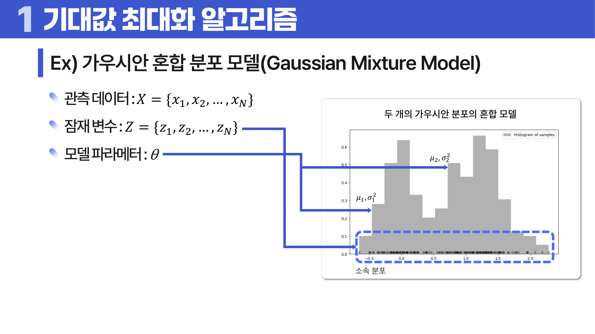
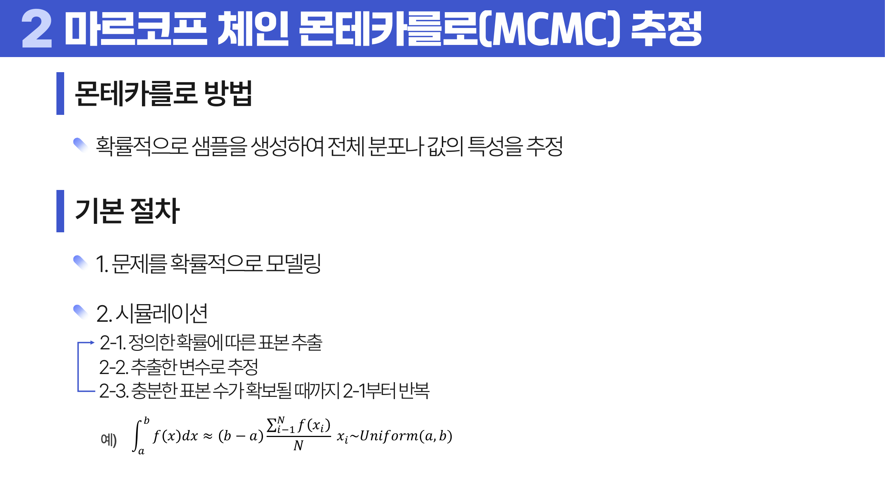
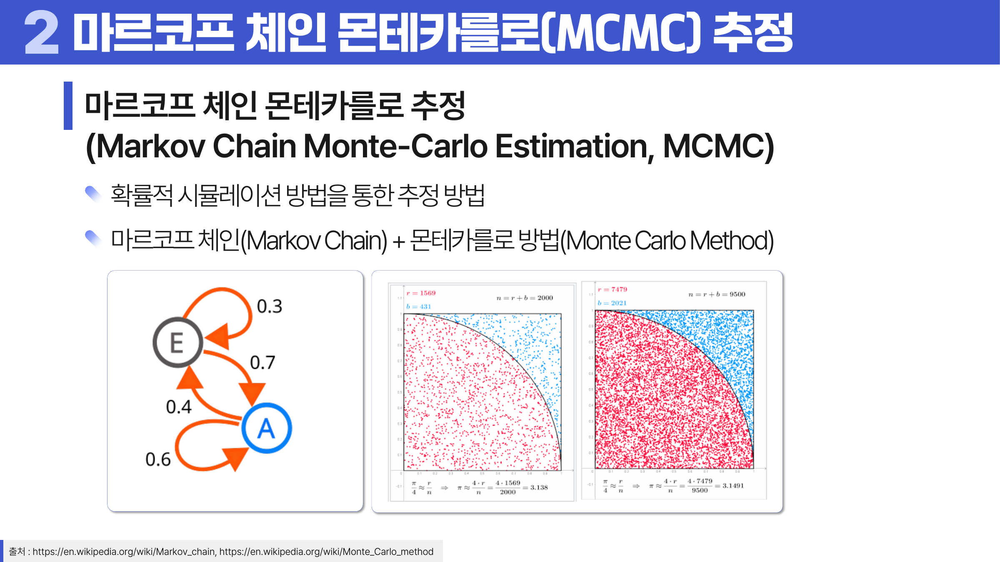
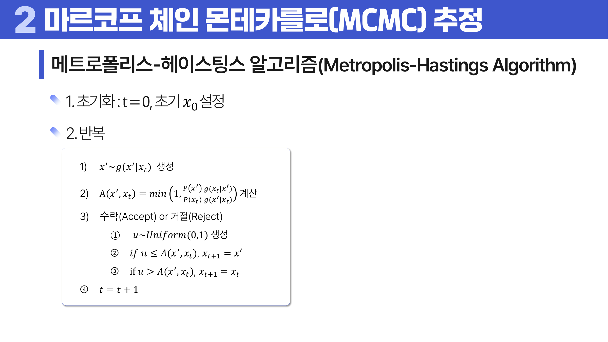
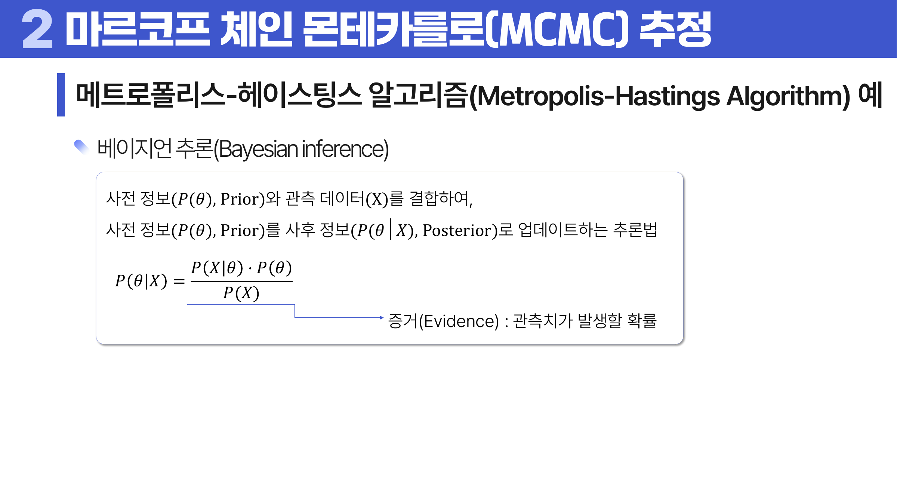

# 08. 고급 추정법

## 학습 목표

이 차시를 마치면 다음을 쉬운 말로 설명할 수 있으면 충분하다.

- EM은 숨은 소속을 추정하고 모수를 갱신하는 반복 알고리즘임을 이해한다.
- 몬테카를로는 무작위 샘플을 많이 뽑아 어려운 값을 추정하는 방법임을 이해한다.
- MCMC와 Metropolis-Hastings는 원하는 분포에서 표본을 얻기 위한 절차임을 이해한다.

## 오늘의 한 줄

고급 추정법은 보이지 않는 값이나 복잡한 분포를 직접 풀기 어려울 때 반복과 샘플링으로 추정한다.

## 오늘 반드시 이해할 3가지

1. EM은 숨은 소속을 추정하고 모수를 갱신하는 반복 알고리즘임을 이해한다.
2. 몬테카를로는 무작위 샘플을 많이 뽑아 어려운 값을 추정하는 방법임을 이해한다.
3. MCMC와 Metropolis-Hastings는 원하는 분포에서 표본을 얻기 위한 절차임을 이해한다.

## 이 차시 전에 알면 좋은 것

- **추정**: 보이지 않는 모수나 <a id="ref-08-잠재변수"></a>[잠재변수](#note-08-잠재변수)를 찾는 일
- **<a id="ref-08-분포"></a>[분포](#note-08-분포)**: 사후분포와 <a id="ref-08-표본"></a>[표본](#note-08-표본) 추출의 대상
- **반복 알고리즘**: 한 번에 못 푸는 문제를 단계적으로 푸는 감각

## 개념 지도

```text
고급 추정법
├── EM 알고리즘
├── 몬테카를로 방법
├── 마르코프 체인과 MCMC
├── Metropolis-Hastings
└── 확인 문제와 해설
```

## 학습 우선순위

- **필수**: <a id="ref-08-em"></a>[EM](#note-08-em)이 숨은 소속과 모수를 번갈아 추정한다는 점, <a id="ref-08-몬테카를로"></a>[몬테카를로](#note-08-몬테카를로)가 무작위 표본 <a id="ref-08-평균"></a>[평균](#note-08-평균)으로 근사한다는 점, <a id="ref-08-mcmc"></a>[MCMC](#note-08-mcmc)가 원하는 분포를 따라 움직이게 한다는 점
- **심화**: <a id="ref-08-metropolis-hastings"></a>[Metropolis-Hastings](#note-08-metropolis-hastings)의 수락 확률
- **나중**: 수렴 진단과 <a id="ref-08-자기상관"></a>[자기상관](#note-08-자기상관)의 수량화

## 이 차시에서 꼭 붙잡을 설명 방식

EM은 “정답을 모르는 군집 소속”과 “군집의 평균/분산”을 동시에 모르기 때문에 한 번에 풀기 어렵다. 그래서 현재 모수로 각 점이 어느 군집일지 확률적으로 추정하고, 그 추정된 소속으로 모수를 다시 계산한다. 서로를 조금씩 고쳐 가는 방식이다.

## 핵심 이론

### 먼저 잡는 직관

- **<a id="ref-08-em-알고리즘"></a>[EM 알고리즘](#note-08-em-알고리즘)**: 숨은 소속을 바로 알 수 없을 때, 일단 소속 가능성을 추정하고 그에 맞춰 모수를 다시 고친다.
- **몬테카를로 방법**: 직접 계산하기 어려운 평균이나 확률을 많은 무작위 표본의 평균으로 대신 구한다.
- **<a id="ref-08-마르코프-체인"></a>[마르코프 체인](#note-08-마르코프-체인)과 MCMC**: 다음 상태가 현재 상태에만 의존하도록 움직이게 해서 원하는 분포의 표본을 천천히 얻는다.
- **Metropolis-Hastings**: 새 후보를 제안한 뒤 목표분포에 맞는 방향이면 받아들이고, 불리한 방향도 일정 확률로 받아들인다.

### 1. EM 알고리즘

E step은 숨은 소속의 기대값을 계산하고 M step은 그 소속을 바탕으로 모수를 갱신한다. 초기값에 따라 다른 해로 갈 수 있어 전역 최적을 보장하지 않는다.

여기서 숨은 소속처럼 직접 보이지 않는 값을 **잠재변수**라고 부른다. 가우시안 혼합 모델에서는 데이터가 여러 정규분포 중 어느 분포에서 왔는지가 잠재변수다. EM은 “소속을 알면 평균과 분산을 계산하기 쉽고, 평균과 분산을 알면 소속 가능성을 계산하기 쉽다”는 관계를 번갈아 이용한다.



> **그림 읽기**: 숨은 군집 소속과 분포의 모수를 번갈아 추정하는 흐름을 본다. 알 수 없는 둘을 동시에 풀기 어렵기 때문에 반복한다.

### 2. 몬테카를로 방법

복잡한 적분이나 기대값을 직접 계산하기 어렵다면 무작위 표본을 많이 만들어 평균으로 추정할 수 있다.



> **그림 읽기**: 복잡한 계산을 무작위 표본의 평균으로 근사하는 절차를 본다. 표본 수가 많아질수록 추정이 안정된다.

### 3. 마르코프 체인과 MCMC

마르코프 체인은 현재 상태에서 다음 상태로 이동한다. MCMC는 이 이동 규칙을 설계해 원하는 분포에서 나온 것 같은 표본을 얻는다.

오래 움직인 뒤 상태가 머무는 비율이 안정되면 그 분포를 **<a id="ref-08-정상분포"></a>[정상분포](#note-08-정상분포)**라고 부른다. MCMC의 목표는 체인의 정상분포가 우리가 알고 싶은 분포, 예를 들어 베이즈 추론의 사후분포가 되도록 이동 규칙을 만드는 것이다.



> **그림 읽기**: 마르코프 체인과 몬테카를로가 결합되는 구조를 본다. 원하는 분포를 직접 뽑기 어려울 때 이동 규칙을 설계한다.

### 4. Metropolis-Hastings

새 후보를 제안하고, 목표분포에서 더 그럴듯하면 잘 받아들이고 덜 그럴듯해도 일정 확률로 받아들인다. 이렇게 해야 한곳에 갇히지 않고 분포 전체를 탐색한다.



> **그림 읽기**: 후보를 제안하고 받아들일지 결정하는 반복 절차를 본다. 덜 그럴듯한 후보도 가끔 받아들여야 분포 전체를 탐색한다.



> **그림 읽기**: 사전분포가 데이터 관측 후 사후분포로 업데이트되는 흐름을 본다. 믿음이 데이터로 어떻게 바뀌는지 확인한다.

## 판단 기준

1. 숨은 <a id="ref-08-변수"></a>[변수](#note-08-변수) 때문에 직접 추정이 어려운 문제인지 먼저 확인한다.
2. 반복 알고리즘이 초기값에 민감할 수 있음을 염두에 둔다.
3. 몬테카를로 표본 수가 충분한지, 난수 변동이 결과를 바꾸지 않는지 본다.
4. MCMC에서는 <a id="ref-08-burn-in"></a>[burn-in](#note-08-burn-in), 자기상관, 수렴 진단을 확인한다. burn-in은 초반 표본을 버리는 일이고, 자기상관은 연속 표본이 서로 얼마나 닮았는지를 뜻한다.
5. 반복 결과를 하나의 정답처럼 보지 말고 불확실성과 함께 해석한다.

## 오해와 반례

### 오해 1. EM은 항상 전역 최적해를 찾는다.

EM은 초기값에 따라 지역 최적에 머물 수 있다. 여러 초기값을 시도하는 이유가 여기에 있다.

### 오해 2. 몬테카를로는 대충 찍는 방법이다.

무작위 샘플을 쓰지만 반복 수가 커질수록 평균이 안정되는 확률 원리를 이용한다.

### 오해 3. MCMC 샘플은 바로 독립 표본이다.

연속된 샘플은 상관될 수 있다. burn-in은 초반 표본을 버리는 일이다. 핵심은 시작점의 영향이 줄었는지, 표본 사이의 자기상관이 지나치게 크지 않은지, 체인이 안정적으로 수렴했는지를 점검하는 것이다.

## 예시 풀이

### 예시 1. 두 개의 정규분포가 섞인 키 데이터

성별 라벨이 없지만 키 분포가 두 봉우리라면 GMM을 생각할 수 있다. EM은 각 사람이 어느 분포에 속할 가능성이 큰지 추정하고 평균과 분산을 다시 계산한다.

### 예시 2. 복잡한 사후분포 평균 구하기

베이즈 추론에서는 데이터를 보기 전의 믿음을 사전분포, 데이터를 본 뒤 갱신된 믿음을 사후분포라고 부른다. 수식으로 사후분포의 적분을 계산하기 어렵다면 MCMC로 사후분포를 따라 샘플을 만들고, 그 샘플 평균으로 기대값을 추정한다.

## 오늘의 요약 5줄

1. 고급 추정법은 숨은 값이나 복잡한 분포를 반복과 샘플링으로 다룬다.
2. EM은 E-step에서 숨은 소속을 추정하고 M-step에서 모수를 갱신한다.
3. 몬테카를로 방법은 어려운 계산을 무작위 표본의 평균으로 근사한다.
4. MCMC는 목표분포를 직접 뽑기 어려울 때 그 분포를 따르는 체인을 만든다.
5. 반복 알고리즘은 수렴과 초기값 민감성을 반드시 확인해야 한다.

## 확인 문제

1. EM의 E step과 M step을 설명하라.
2. EM이 초기값에 민감할 수 있는 이유를 설명하라.
3. 몬테카를로 방법이 필요한 상황을 설명하라.
4. 마르코프 체인의 기본 아이디어를 설명하라.
5. MCMC에서 burn-in을 버리는 이유를 설명하라.
6. Metropolis-Hastings가 나쁜 후보도 가끔 받아들이는 이유를 설명하라.
7. 왜 EM은 E step과 M step을 번갈아 반복하는가?
8. 왜 MCMC 표본은 바로 독립 표본처럼 쓰면 안 되는가?

## 개념 주석

본문에서 연결된 개념을 잠깐 확인하는 공간이다. 용어를 누르면 본문에서 처음 표시된 위치로 돌아간다.

- <a id="note-08-잠재변수"></a>[잠재변수](#ref-08-잠재변수): 직접 관측되지 않지만 모델 안에 숨어 있는 변수.
- <a id="note-08-분포"></a>[분포](#ref-08-분포): 값들이 어떤 모양으로 흩어져 있는지 나타내는 구조. ([처음 설명된 차시](../05-probability-distributions/README.md#1-확률변수와-분포))
- <a id="note-08-표본"></a>[표본](#ref-08-표본): 전체 대신 관찰한 일부 대상. ([처음 설명된 차시](../04-statistics-probability/README.md#2-모집단과-표본))
- <a id="note-08-em"></a>[EM](#ref-08-em): 숨은 값을 추정하고 모수를 갱신하는 반복 알고리즘.
- <a id="note-08-몬테카를로"></a>[몬테카를로](#ref-08-몬테카를로): 무작위 샘플을 많이 뽑아 값을 추정하는 방법.
- <a id="note-08-평균"></a>[평균](#ref-08-평균): 모든 값을 더해 개수로 나눈 대표값. ([처음 설명된 차시](../04-statistics-probability/README.md#4-중심-경향))
- <a id="note-08-mcmc"></a>[MCMC](#ref-08-mcmc): 마르코프 체인으로 원하는 분포의 샘플을 얻는 방법.
- <a id="note-08-metropolis-hastings"></a>[Metropolis-Hastings](#ref-08-metropolis-hastings): 후보를 제안하고 확률적으로 수락하며 원하는 분포를 탐색하는 MCMC 방법. 이름: 제안한 이동을 받아들일지 확률적으로 결정해 목표 분포를 따라가게 하는 알고리즘이다.
- <a id="note-08-자기상관"></a>[자기상관](#ref-08-자기상관): 연속된 샘플끼리 서로 닮아 독립적이지 않은 정도.
- <a id="note-08-em-알고리즘"></a>[EM 알고리즘](#ref-08-em-알고리즘): 숨은 값 추정과 모수 갱신을 번갈아 반복하는 알고리즘.
- <a id="note-08-마르코프-체인"></a>[마르코프 체인](#ref-08-마르코프-체인): 현재 상태만 다음 상태에 영향을 주는 확률 과정.
- <a id="note-08-정상분포"></a>[정상분포](#ref-08-정상분포): 충분히 이동한 뒤 상태 확률이 안정된 분포.
- <a id="note-08-변수"></a>[변수](#ref-08-변수): 관측 대상의 특징을 적어 둔 열. ([처음 설명된 차시](../01-data-understanding/README.md#4-단위-변수-관측치))
- <a id="note-08-burn-in"></a>[burn-in](#ref-08-burn-in): 시작점 영향이 큰 초반 샘플을 버리는 구간.
