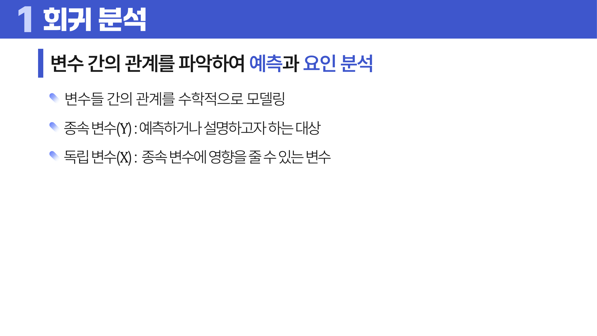
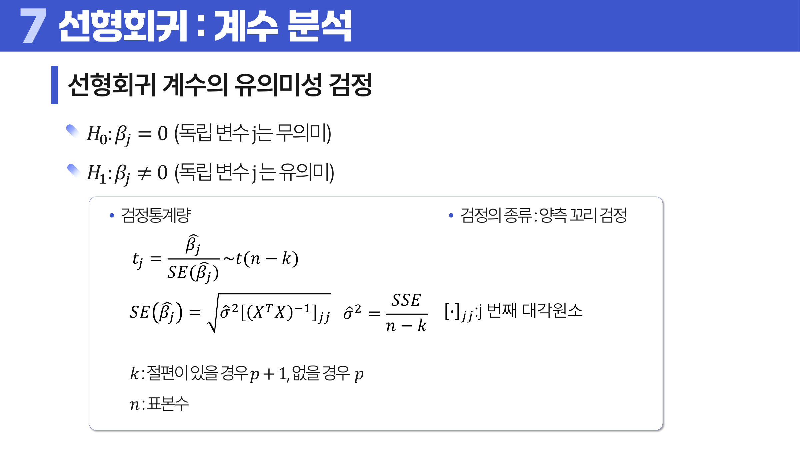
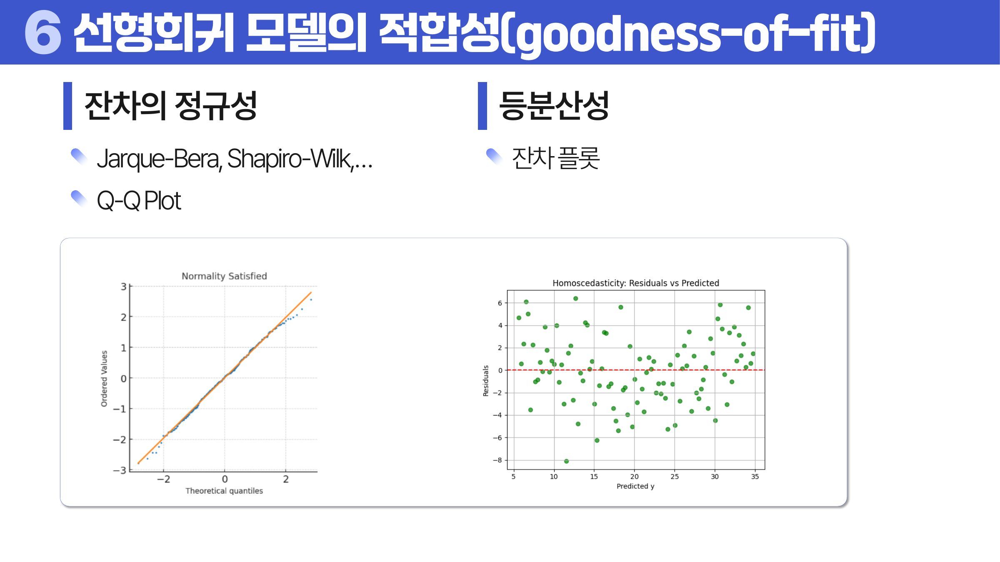

# 09. 선형회귀 분석

## 학습 목표

이 차시를 마치면 다음을 쉬운 말로 설명할 수 있으면 충분하다.

- 종속변수와 독립변수의 관계를 직선으로 표현한다는 뜻을 이해한다.
- 최소제곱법이 왜 잔차 제곱합을 줄이는지 설명한다.
- 잔차 진단, 다중공선성, 영향점을 통해 회귀 모델을 점검한다.

## 오늘의 한 줄

선형회귀는 변수 사이의 관계를 직선으로 단순화해 예측과 설명을 함께 시도하는 모델이다.

## 오늘 반드시 이해할 3가지

1. 종속변수와 독립변수의 관계를 직선으로 표현한다는 뜻을 이해한다.
2. 최소제곱법이 왜 잔차 제곱합을 줄이는지 설명한다.
3. 잔차 진단, 다중공선성, 영향점을 통해 회귀 모델을 점검한다.

## 이 차시 전에 알면 좋은 것

- **평균**: 회귀가 조건부 평균을 설명한다는 감각 ([처음 설명된 차시](../04-statistics-probability/README.md#4-중심-경향))
- **분산**: 잔차의 퍼짐을 평가하는 기준
- **가설 검정**: 계수가 0인지 검정하는 언어

## 개념 지도

```text
선형회귀 분석
├── 단순회귀와 다중회귀
├── 주요 가정
├── 모델 평가
├── 유의성 검정과 로지스틱 회귀
├── 진단과 대응
└── 확인 문제와 해설
```

## 학습 우선순위

- **필수**: 회귀식의 입력/출력 관계, 잔차와 회귀 가정, R2와 오차 지표의 차이
- **심화**: AIC/BIC와 다중공선성
- **확장**: 규제 회귀와 차원축소로의 확장

## 이 차시에서 꼭 붙잡을 설명 방식

<a id="ref-09-잔차"></a>[잔차](#note-09-잔차)를 그냥 더하면 양수와 음수가 서로 상쇄된다. 그래서 오차를 제곱해 모두 양수로 만들고, 큰 오차를 더 크게 벌한다. 최소제곱법은 이 잔차 제곱합이 가장 작아지는 직선을 찾는 방법이다.

## 핵심 이론

### 먼저 잡는 직관

- **단순 선형회귀와 다중 선형회귀**: 회귀는 입력 변수가 변할 때 평균적인 결과가 얼마나 움직이는지 직선식으로 표현한다.
- **주요 가정**: 잔차가 어떤 패턴 없이 흩어져야 직선식의 해석과 검정이 믿을 만해진다.
- **모델 평가**: R2, RMSE, MAE는 각각 설명력과 예측 오차를 다른 관점에서 보여 준다.
- **진단과 대응**: 잔차 그림에서 곡선, 부채꼴, 극단값이 보이면 변수 변환이나 모델 수정이 필요할 수 있다.

### 1. 단순 선형회귀와 다중 선형회귀

단순 선형회귀는 <a id="ref-09-독립변수"></a>[독립변수](#note-09-독립변수) 하나로 <a id="ref-09-종속변수"></a>[종속변수](#note-09-종속변수)를 설명하고, 다중 선형회귀는 여러 독립변수를 함께 사용한다.

단순 선형회귀는 `Y = beta0 + beta1 X + error`처럼 쓴다. 다중 선형회귀는 `Y = beta0 + beta1 X1 + ... + betap Xp + error`처럼 여러 독립변수를 함께 넣는다. 행렬로 쓰면 `y = X beta + error`이고, 절편을 포함하기 위해 X 행렬에 모든 값이 1인 열을 추가한다.



> **그림 읽기**: 점들의 관계를 하나의 직선으로 요약하는 장면을 본다. 직선은 개별 점이 아니라 평균적 경향을 설명한다.

### 2. 주요 가정

선형성, 등분산성, 정규성, 독립성을 점검한다. 다중회귀에서는 독립변수끼리 너무 강하게 관련되는 <a id="ref-09-다중공선성"></a>[다중공선성](#note-09-다중공선성)도 본다.

단순회귀와 다중회귀 모두 잔차가 다음 성질을 대체로 만족해야 계수 검정과 구간 해석이 믿을 만해진다.

| 가정 | 의미 |
|---|---|
| 선형성 | 독립변수와 종속변수의 평균 관계를 선형식으로 표현할 수 있다. |
| 등분산성 | 독립변수 수준이 달라져도 오차의 분산이 일정하다. |
| 정규성 | 오차항이 `epsilon ~ N(0, sigma^2)`를 따른다고 본다. |
| 독립성 | 관측치와 오차가 서로 독립이다. |
| 다중공선성 없음 | 다중회귀에서 독립변수끼리 지나치게 강하게 겹치지 않는다. |

### 3. 모델 평가

결정계수 R2는 종속변수 변동 중 모델이 설명한 비율이다. 조정 R2는 <a id="ref-09-변수"></a>[변수](#note-09-변수)가 늘어날 때의 과대평가를 줄이고, <a id="ref-09-aicbic"></a>[AIC/BIC](#note-09-aicbic)는 적합도와 복잡도를 함께 본다.

최소제곱법은 `SSE = sum(yi - yhat_i)^2`를 최소화하는 계수를 찾는다. 단순회귀에서는 정규방정식을 풀면 기울기와 절편을 다음처럼 얻는다.

```text
yi = beta0 + beta1 xi + epsilon_i
yhat_i = beta0_hat + beta1_hat xi
SSE = sum(yi - yhat_i)^2
L(beta0_hat, beta1_hat) = sum(yi - beta0_hat - beta1_hat xi)^2

dL / d beta0_hat = 0
dL / d beta1_hat = 0

beta1_hat = sum((xi - xbar)(yi - ybar)) / sum((xi - xbar)^2)
beta0_hat = ybar - beta1_hat * xbar
```

다중회귀에서는 같은 원리가 행렬식으로 정리된다.

```text
y = X beta + epsilon
yhat = X beta_hat
L = SSE = (y - X beta_hat)^T(y - X beta_hat)
gradient_beta_hat L = -2X^T(y - X beta_hat)

beta_hat = (X^T X)^(-1) X^T y
```



> **그림 읽기**: 각 계수가 0과 구분될 만큼 충분한 증거가 있는지 본다. 계수의 크기뿐 아니라 표준오차와 검정통계량을 함께 읽는다.

### 4. 진단과 대응

잔차 플롯, Q-Q plot, VIF, <a id="ref-09-영향점"></a>[영향점](#note-09-영향점) 지표로 문제를 찾는다. 필요하면 변수 제거, 변환, 규제, 차원축소를 고려한다.



> **그림 읽기**: 잔차가 무작위로 흩어지는지, 특정 패턴을 보이는지 본다. 패턴이 남아 있으면 직선 모델의 가정이 약할 수 있다.

### 5. 제곱합, 정보 기준, 영향점

선형회귀는 `SST = SSR + SSE`로 설명한다. 전체 변동 `SST` 중 모델이 설명한 변동이 `SSR`, 남은 오차가 `SSE`다. 결정계수는 전체 변동 중 모델이 설명한 비율로 읽을 수 있지만, 변수를 많이 넣으면 올라가기 쉬우므로 수정 결정계수나 검증 성능도 함께 본다.

```text
SST = sum(yi - ybar)^2
SSR = sum(yhat_i - ybar)^2
SSE = sum(yi - yhat_i)^2
SST = SSR + SSE

R^2 = 1 - SSE / SST
Adjusted R^2 = 1 - (SSE / (n - k)) / (SST / (n - 1))
```

여기서 `n`은 표본 수다. `k`는 절편을 포함하면 `p + 1`, 절편을 포함하지 않으면 `p`로 둔다. 절편이 있는 최소제곱 회귀에서는 잔차합이 0이 되고 잔차가 적합값과 직교하므로 `SST = SSR + SSE` 분해가 성립한다.

AIC와 BIC는 적합도와 복잡도 사이의 균형을 보는 기준이다. 둘 다 값이 작을수록 선호하지만, BIC는 표본 수가 커질수록 복잡한 모델에 더 강한 벌점을 주는 경향이 있다. 따라서 단순히 훈련 오차가 작은 모델이 아니라 불필요하게 복잡하지 않은 모델을 고르는 데 쓴다.

```text
AIC = 2k - 2log(L)
BIC = k log(n) - 2log(L)
```

`L = L(theta | X)`는 표본 `X`에 대한 최대우도다. 정규오차 선형회귀에서는 상수항을 제외하면 `SSE / n`이 작을수록 우도가 커진다. 따라서 AIC와 BIC는 오차를 줄이는 효과와 모수 수 `k`에 대한 벌점을 같이 반영한다.

회귀모델 전체가 의미 있는지는 F검정으로 본다. 귀무가설은 `beta1 = beta2 = ... = betap = 0`, 즉 모든 독립변수가 의미 없다는 주장이다. 검정통계량은 `F = MSR / MSE = (SSR / (k - 1)) / (SSE / (n - k))`이고 우측꼬리검정을 한다.

각 회귀계수가 의미 있는지는 t검정으로 본다. 귀무가설은 `beta_j = 0`이고, 검정통계량은 `t_j = beta_j_hat / SE(beta_j_hat)`이다. 계수 p-value가 작으면 해당 변수가 종속변수와 관련 있다는 증거가 된다. 단, 다중공선성이 크면 계수와 p-value가 불안정할 수 있다.

```text
H0: beta_j = 0
H1: beta_j != 0

t_j = beta_j_hat / SE(beta_j_hat) ~ t(n - k)
SE(beta_j_hat) = sqrt(sigma_hat^2 * [(X^T X)^(-1)]_jj)
sigma_hat^2 = SSE / (n - k)
```

`[(X^T X)^(-1)]_jj`는 행렬 `(X^T X)^(-1)`의 `j`번째 대각원소다. 계수 검정은 양측꼬리검정으로 해석한다.

잔차 진단에서는 정규성, 등분산성, 독립성, 선형성을 확인한다. 정규성은 Q-Q plot, Jarque-Bera, Shapiro-Wilk 등으로 보고, 등분산성은 잔차 플롯에서 부채꼴 패턴이 있는지 본다. 이상점은 y값이 특이한 관측치이고, 영향점은 모델 계수를 크게 흔드는 관측치다. leverage, studentized residual, DFFITS, DFBETAS 같은 지표는 한 점이 회귀선에 얼마나 큰 영향을 주는지 보는 도구다.

영향점 지표는 한 관측치를 제외했을 때 모델이 얼마나 달라지는지 본다. `x_i`는 절편까지 포함한 `i`번째 관측치의 설명변수 벡터다.

```text
leverage: h_ii = x_i^T (X^T X)^(-1) x_i

MSE(-i) = SSE(-i) / (n - k - 1)
studentized residual: t_i = e_i / sqrt(MSE(-i)(1 - h_ii))

DFFITS_i = (yhat_i - yhat_i(-i)) / sqrt(MSE(-i)h_ii)
DFBETAS_ij = (beta_j_hat - beta_j_hat(-i))
             / sqrt(MSE(-i)[(X^T X)^(-1)]_jj)
```

leverage는 x공간에서 멀리 떨어진 정도, studentized residual은 y방향 잔차가 큰 정도, DFFITS와 DFBETAS는 예측값과 계수가 얼마나 흔들리는지를 본다.

로지스틱 회귀에서 계수는 확률 자체의 변화가 아니라 log-odds의 변화로 해석한다. 다중 클래스에서는 OVR처럼 클래스를 하나씩 나누거나, softmax처럼 여러 클래스 확률을 한 번에 정규화하는 방식을 쓴다.

표준화 회귀계수는 변수들의 단위를 맞춘 뒤 계수를 비교하려는 방법이다. 원 단위 계수는 현실 해석에 좋고, 표준화 회귀계수는 서로 다른 단위의 변수가 상대적으로 얼마나 크게 움직이는지 비교할 때 도움이 된다.

다중공선성은 상관계수 행렬과 VIF로 진단한다. 상관계수 `r > 0.8`이면 의심하고, VIF가 5~10이면 다중공선성을 의심하며, 10 이상이면 심각하다고 본다. 대응 방법은 표준화가 아니라 변수 제거, 변수 결합, PCA/PLS 같은 차원축소, Ridge/Lasso 같은 규제다.

로지스틱 회귀는 종속변수가 0/1일 때 `P(Y = 1)`을 추정한다. 로짓은 확률을 실수 전체로 바꾸고, 로지스틱 함수는 로짓을 다시 확률로 바꾼다.

```text
logit(p) = log(p / (1 - p)) = beta0 + beta1 X1 + ... + betap Xp
p = 1 / (1 + exp(-z))
```

계수 `beta_j`는 독립변수 `X_j`가 1 증가할 때 승산이 `exp(beta_j)`배가 된다는 뜻이다. 로지스틱 회귀의 계수는 닫힌형 해석식으로 바로 풀기 어려워 최대우도추정으로 구한다.

```text
P(Y = 1 | X = x_i) = sigma(z_i) = 1 / (1 + exp(-z_i))
z_i = beta^T x_i

P(Y = y_i | X = x_i)
= sigma(z_i)^y_i * (1 - sigma(z_i))^(1 - y_i)

L(beta) = product_i sigma(z_i)^y_i * (1 - sigma(z_i))^(1 - y_i)
log L(beta) = sum_i [y_i log sigma(z_i)
              + (1 - y_i)log(1 - sigma(z_i))]
beta_hat = argmax L(beta)
```

다중 클래스에서는 Softmax 회귀가 여러 클래스 확률을 함께 정규화하고, One-vs-Rest는 각 클래스를 나머지와 분리해 이진 문제 여러 개로 푼다. One-vs-One은 클래스 쌍마다 분류기를 만들어 비교한다.

## 판단 기준

1. 예측이 목표인지, 변수 효과의 설명이 목표인지 먼저 정한다.
2. 잔차 플롯으로 선형성, 등분산성, <a id="ref-09-이상치"></a>[이상치](#note-09-이상치) 패턴을 확인한다.
3. 계수의 부호와 크기를 현실 단위로 해석할 수 있는지 본다.
4. R2만 보지 말고 오차 지표와 검증 데이터 성능을 함께 본다.
5. 다중공선성이 큰 변수는 계수 해석을 불안정하게 만들 수 있다.

## 오해와 반례

### 오해 1. R2가 높으면 항상 좋은 회귀 모델이다.

변수를 많이 넣거나 데이터 누수가 있으면 R2가 높아질 수 있다. 잔차 진단과 검증 성능을 함께 봐야 한다.

### 오해 2. 잔차 평균이 0이면 가정이 모두 맞다.

잔차의 패턴, 분산, 정규성, 독립성을 따로 확인해야 한다.

### 오해 3. 상관이 높은 변수는 모두 넣으면 좋다.

독립변수끼리 강하게 관련되면 계수 해석이 불안정해질 수 있다.

## 예시 풀이

### 예시 1. 광고비와 매출의 관계

광고비가 늘수록 매출이 증가하는지 직선으로 설명할 수 있다. 기울기는 광고비가 한 단위 늘 때 매출이 얼마나 변하는지 뜻한다.

### 예시 2. 잔차 플롯에서 부채꼴 모양이 보일 때

예측값이 커질수록 잔차의 퍼짐이 커지면 등분산성 가정이 흔들린다. 변환이나 다른 모델을 고려해야 한다.

## 오늘의 요약 5줄

1. 선형회귀는 변수 사이의 평균적 관계를 직선으로 단순화해 설명과 예측을 한다.
2. 잔차는 모델이 설명하지 못한 부분이며 가정 점검의 핵심 단서다.
3. 계수는 다른 조건이 같을 때 입력이 한 단위 변하면 결과가 얼마나 바뀌는지 말한다.
4. R2가 높아도 잔차 패턴이나 과적합이 있으면 좋은 모델이라고 보기 어렵다.
5. 회귀 결과는 수치 지표와 진단 그림을 함께 읽어야 한다.

## 확인 문제

1. 잔차가 중요한 이유를 설명하라.
2. 선형회귀의 주요 가정 중 두 가지를 설명하라.
3. R2가 높아도 모델이 좋지 않을 수 있는 이유를 설명하라.
4. 다중공선성이 계수 해석을 어렵게 하는 이유를 설명하라.
5. 잔차 플롯에서 부채꼴 모양이 보이면 무엇을 의심해야 하는가?
6. 회귀계수를 현실 단위로 해석하는 예를 들어라.
7. 왜 잔차 플롯을 봐야 회귀 모델을 믿을 수 있는가?
8. 왜 독립변수끼리 너무 비슷하면 계수 해석이 불안정해지는가?
9. `SST = SSR + SSE`가 회귀모델 해석에서 뜻하는 바를 설명하라.
10. AIC와 BIC가 훈련 오차만 보는 기준과 다른 점을 설명하라.
11. 이상점과 영향점의 차이를 설명하라.
12. 단순회귀와 다중회귀에서 최소제곱 추정식이 어떻게 달라지는지 설명하라.
13. 회귀모델 전체 유의성 F검정과 회귀계수 t검정의 차이를 설명하라.
14. VIF 기준과 다중공선성 대응 방법을 설명하라.
15. 로지스틱 회귀에서 `exp(beta)`를 어떻게 해석하는지 설명하라.
16. Softmax 방식과 One-vs-Rest 방식의 차이를 설명하라.
17. 단순 선형회귀의 최소제곱 목적함수와 `beta0_hat`, `beta1_hat` 식을 쓰라.
18. 다중회귀의 행렬식 `beta_hat = (X^T X)^(-1)X^T y`가 어떤 조건에서 나오는지 설명하라.
19. `R^2`, 조정 `R^2`, AIC, BIC가 각각 모델을 어떤 관점에서 평가하는지 설명하라.
20. 회귀계수 t검정에서 `SE(beta_j_hat)`와 `sigma_hat^2`가 어떻게 계산되는지 쓰라.
21. leverage, studentized residual, DFFITS, DFBETAS가 각각 무엇을 진단하는지 설명하라.
22. 로지스틱 회귀의 likelihood와 log-likelihood 식을 쓰고, 해석적 해가 어려운 이유를 설명하라.

## 개념 주석

본문에서 연결된 개념을 잠깐 확인하는 공간이다. 용어를 누르면 본문에서 처음 표시된 위치로 돌아간다.

- <a id="note-09-잔차"></a>[잔차](#ref-09-잔차): 실제값과 예측값의 차이.
- <a id="note-09-독립변수"></a>[독립변수](#ref-09-독립변수): 종속변수를 설명하는 입력 변수.
- <a id="note-09-종속변수"></a>[종속변수](#ref-09-종속변수): 예측하거나 설명하려는 대상.
- <a id="note-09-다중공선성"></a>[다중공선성](#ref-09-다중공선성): 독립변수끼리 너무 강하게 관련된 상태.
- <a id="note-09-변수"></a>[변수](#ref-09-변수): 관측 대상의 특징을 적어 둔 열. ([처음 설명된 차시](../01-data-understanding/README.md#4-단위-변수-관측치))
- <a id="note-09-aicbic"></a>[AIC/BIC](#ref-09-aicbic): 모델 적합도와 복잡도를 함께 보는 기준.
- <a id="note-09-영향점"></a>[영향점](#ref-09-영향점): 회귀선 위치를 크게 흔드는 관측치.
- <a id="note-09-이상치"></a>[이상치](#ref-09-이상치): 전체 흐름에서 유난히 튀는 값. ([처음 설명된 차시](../02-data-cleaning/README.md#4-이상치의-의미))
