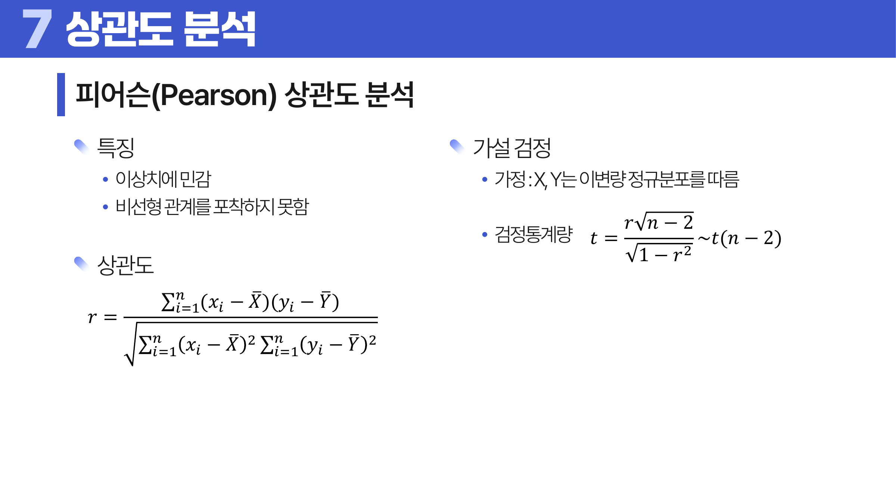
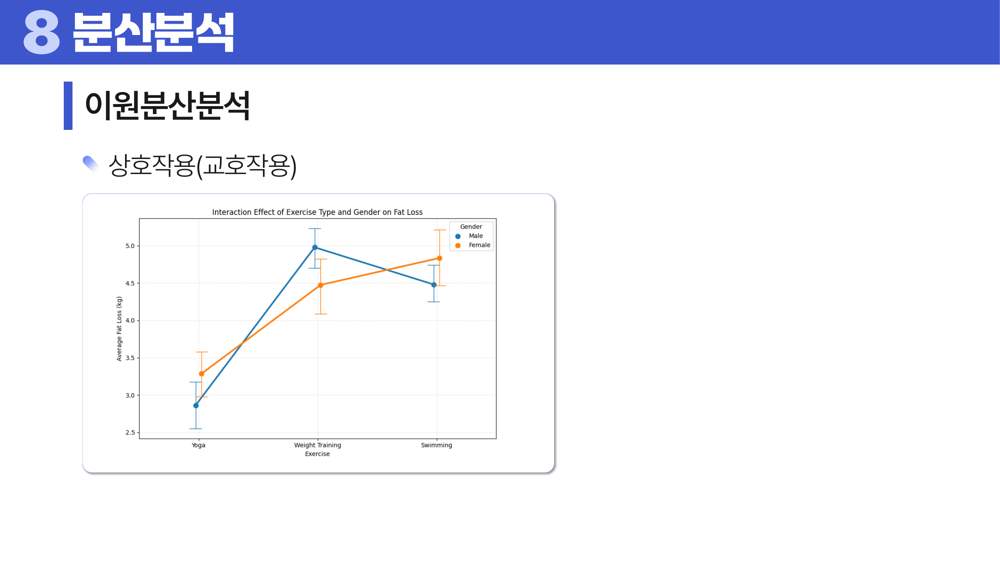
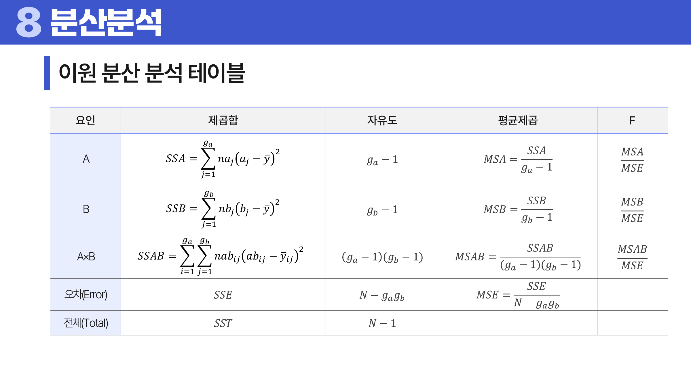
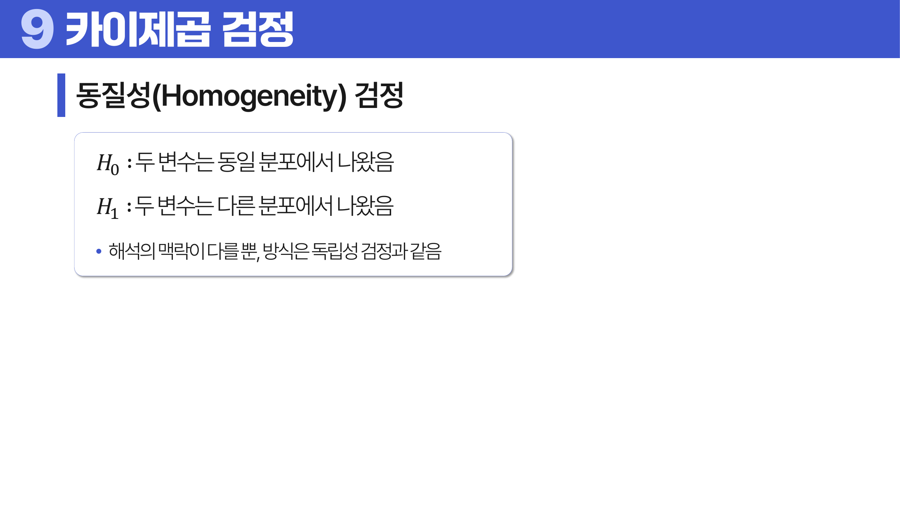

# 10. 연관성 분석

## 학습 목표

이 차시를 마치면 다음을 쉬운 말로 설명할 수 있으면 충분하다.

- 모수적 검정과 비모수적 검정을 가정의 차이로 구분한다.
- 피어슨, 스피어만, 켄달 상관의 차이를 설명한다.
- ANOVA와 카이제곱 검정이 각각 어떤 질문에 답하는지 이해한다.

## 오늘의 한 줄

연관성 분석은 변수들이 함께 움직이는지, 집단 간 차이가 있는지, 범주 빈도가 기대와 다른지 판단한다.

## 오늘 반드시 이해할 3가지

1. 모수적 검정과 비모수적 검정을 가정의 차이로 구분한다.
2. 피어슨, 스피어만, 켄달 상관의 차이를 설명한다.
3. ANOVA와 카이제곱 검정이 각각 어떤 질문에 답하는지 이해한다.

## 이 차시 전에 알면 좋은 것

- **<a id="ref-10-변수"></a>[변수](#note-10-변수) 타입**: 상관/<a id="ref-10-anova"></a>[ANOVA](#note-10-anova)/카이제곱 선택 기준
- **가설 검정**: <a id="ref-10-p-value"></a>[p-value](#note-10-p-value)와 <a id="ref-10-유의수준"></a>[유의수준](#note-10-유의수준) 해석
- **분산**: 집단 간 차이와 집단 내 흔들림 비교

## 개념 지도

```text
연관성 분석
├── 검정 전 가정 점검
├── 상관 분석
├── 분산분석
├── 카이제곱 검정
└── 확인 문제와 해설
```

## 학습 우선순위

- **필수**: 상관이 인과가 아님을 이해, ANOVA가 전체 <a id="ref-10-평균"></a>[평균](#note-10-평균) 차이를 먼저 묻는다는 점, 카이제곱이 빈도 차이를 본다는 점
- **심화**: 이원분산분석의 <a id="ref-10-교호작용"></a>[교호작용](#note-10-교호작용)
- **나중**: 비모수 검정으로의 확장

## 이 차시에서 꼭 붙잡을 설명 방식

<a id="ref-10-상관계수"></a>[상관계수](#note-10-상관계수)가 높아도 한 변수가 다른 변수를 원인으로 만든다는 뜻은 아니다. 두 변수가 함께 움직인다는 숫자일 뿐이다. 숨은 제3변수, 시간 흐름, 집단 구조가 같은 패턴을 만들 수 있으므로 상관과 인과를 분리해야 한다.

## 핵심 이론

### 먼저 잡는 직관

- **검정 전 가정 점검**: <a id="ref-10-연관성"></a>[연관성](#note-10-연관성) 분석은 변수 형태와 <a id="ref-10-분포"></a>[분포](#note-10-분포) 가정에 따라 쓸 수 있는 검정이 달라진다.
- **<a id="ref-10-상관-분석"></a>[상관 분석](#note-10-상관-분석)**: 상관계수는 두 변수가 함께 움직이는 방향과 강도를 요약하지만 원인을 증명하지는 않는다.
- **<a id="ref-10-분산분석"></a>[분산분석](#note-10-분산분석)**: 세 집단 이상 평균 차이를 한 번에 비교해 전체적으로 차이가 있는지 먼저 본다.
- **<a id="ref-10-카이제곱-검정"></a>[카이제곱 검정](#note-10-카이제곱-검정)**: 범주형 변수의 관측 빈도가 독립이라고 기대한 빈도와 얼마나 다른지 비교한다.

### 1. 검정 전 가정 점검

정규성 검정과 등분산성 검정은 어떤 검정을 쓸지 정하기 위한 점검이다. 가정이 맞지 않으면 비모수적 방법을 고려한다.

### 2. 상관 분석

피어슨은 선형 관계와 수치값, 스피어만은 순위의 단조 관계, 켄달은 순위쌍의 일치 정도를 본다.



> **그림 읽기**: 두 변수가 함께 움직이는 방향과 강도를 본다. 점들이 직선에 가까워도 그것만으로 원인이라고 말할 수는 없다.

### 3. 분산분석

셋 이상 집단의 평균 차이를 검정한다. 이원분산분석은 두 범주형 요인과 그 교호작용까지 본다.



> **그림 읽기**: 두 요인이 따로 작용할 때와 함께 작용할 때 결과가 달라지는지 본다. 선이 평행하지 않으면 상호작용을 의심한다.



> **그림 읽기**: 제곱합, 자유도, 평균제곱, F값이 어떤 행에 배치되는지 본다. 집단 차이를 변동의 분해로 읽는 표다.

### 4. 카이제곱 검정

적합도 검정은 한 범주의 분포가 기대와 맞는지 보고, 독립성 검정은 두 범주형 변수가 관련 있는지 본다. 동질성 검정은 여러 집단의 범주 분포가 같은지 본다.



> **그림 읽기**: 관측 빈도와 기대 빈도가 얼마나 다른지 본다. 범주형 변수의 관계는 평균이 아니라 빈도 차이로 판단한다.

## 판단 기준

1. 변수가 연속형인지 범주형인지 먼저 구분한다.
2. 정규성, 등분산성, <a id="ref-10-표본"></a>[표본](#note-10-표본) 독립성 같은 가정을 확인한다.
3. 상관계수는 산점도와 함께 보고 비선형 관계를 놓치지 않는다.
4. ANOVA가 유의하면 사후검정으로 어느 집단 차이인지 확인한다.
5. 카이제곱 검정에서는 <a id="ref-10-기대빈도"></a>[기대빈도](#note-10-기대빈도)가 너무 작은 셀이 없는지 본다.

## 오해와 반례

### 오해 1. 상관관계는 인과관계다.

상관은 함께 움직인다는 뜻이다. 원인이라고 말하려면 설계, 시간 순서, 교란 요인 통제가 필요하다.

### 오해 2. 정규성 검정 p-value만 보면 된다.

표본 수에 따라 민감도가 달라진다. 그래프와 도메인 지식도 함께 봐야 한다.

### 오해 3. ANOVA는 어느 집단끼리 다른지 바로 알려 준다.

ANOVA는 전체 평균 차이가 있는지 먼저 본다. 구체적 쌍 차이는 사후검정이 필요하다.

## 예시 풀이

### 예시 1. 공부 시간과 시험 점수

둘 다 수치형이고 선형 관계를 보고 싶다면 피어슨 상관을 생각한다. 순위 관계만 안정적이면 스피어만을 고려한다.

### 예시 2. 지역과 구매 여부의 관계

두 변수가 범주형이면 교차표를 만들고 카이제곱 독립성 검정으로 기대빈도와 관측빈도의 차이를 본다.

## 오늘의 요약 5줄

1. 연관성 분석은 변수들이 함께 움직이는지, 집단 차이가 있는지, 빈도가 기대와 다른지 본다.
2. 상관관계는 함께 움직임을 말할 뿐 인과관계를 증명하지 않는다.
3. <a id="ref-10-모수적-검정"></a>[모수적 검정](#note-10-모수적-검정)은 분포 가정을 더 강하게 쓰고, <a id="ref-10-비모수적-검정"></a>[비모수적 검정](#note-10-비모수적-검정)은 순위나 빈도 정보를 더 활용한다.
4. ANOVA는 여러 평균이 모두 같다는 귀무가설을 한 번에 검정한다.
5. 카이제곱 검정은 범주형 변수의 독립성이나 적합도를 판단할 때 쓴다.

## 확인 문제

1. 모수적 검정과 비모수적 검정의 차이를 설명하라.
2. 피어슨 상관계수와 스피어만 상관계수의 차이를 설명하라.
3. 상관관계를 인과관계로 해석하면 안 되는 이유를 설명하라.
4. ANOVA가 유의할 때 사후검정이 필요한 이유를 설명하라.
5. 카이제곱 독립성 검정의 직관을 설명하라.
6. 기대빈도가 너무 작을 때 생기는 문제를 설명하라.
7. 왜 상관관계만으로 인과관계를 말할 수 없는가?
8. 왜 ANOVA가 유의해도 바로 어느 두 집단이 다른지는 알 수 없는가?

## 개념 주석

본문에서 연결된 개념을 잠깐 확인하는 공간이다. 용어를 누르면 본문에서 처음 표시된 위치로 돌아간다.

- <a id="note-10-변수"></a>[변수](#ref-10-변수): 관측 대상의 특징을 적어 둔 열. ([처음 설명된 차시](../01-data-understanding/README.md#4-단위-변수-관측치))
- <a id="note-10-anova"></a>[ANOVA](#ref-10-anova): 셋 이상 집단 평균 차이를 분산으로 검정하는 방법. 이름: Analysis of Variance다. 평균 차이를 분산의 분해로 검정한다.
- <a id="note-10-p-value"></a>[p-value](#ref-10-p-value): 귀무가설 아래에서 지금 결과가 얼마나 드문지. ([처음 설명된 차시](../06-hypothesis-testing/README.md#2-p-value와-유의수준))
- <a id="note-10-유의수준"></a>[유의수준](#ref-10-유의수준): 얼마나 드문 결과부터 귀무가설을 버릴지 정한 기준. ([처음 설명된 차시](../06-hypothesis-testing/README.md#2-p-value와-유의수준))
- <a id="note-10-평균"></a>[평균](#ref-10-평균): 모든 값을 더해 개수로 나눈 대표값. ([처음 설명된 차시](../04-statistics-probability/README.md#4-중심-경향))
- <a id="note-10-교호작용"></a>[교호작용](#ref-10-교호작용): 한 요인의 효과가 다른 요인의 수준에 따라 달라지는 현상.
- <a id="note-10-상관계수"></a>[상관계수](#ref-10-상관계수): 두 변수가 함께 움직이는 방향과 강도.
- <a id="note-10-연관성"></a>[연관성](#ref-10-연관성): 두 변수나 집단 사이에 관계가 있는 정도.
- <a id="note-10-분포"></a>[분포](#ref-10-분포): 값들이 어떤 모양으로 흩어져 있는지 나타내는 구조. ([처음 설명된 차시](../05-probability-distributions/README.md#1-확률변수와-분포))
- <a id="note-10-상관-분석"></a>[상관 분석](#ref-10-상관-분석): 두 변수가 함께 움직이는 방향과 강도를 재는 분석.
- <a id="note-10-분산분석"></a>[분산분석](#ref-10-분산분석): 여러 집단 평균 차이를 변동 분해로 검정하는 방법.
- <a id="note-10-카이제곱-검정"></a>[카이제곱 검정](#ref-10-카이제곱-검정): 관측빈도와 기대빈도의 차이를 보는 검정.
- <a id="note-10-표본"></a>[표본](#ref-10-표본): 전체 대신 관찰한 일부 대상. ([처음 설명된 차시](../04-statistics-probability/README.md#2-모집단과-표본))
- <a id="note-10-기대빈도"></a>[기대빈도](#ref-10-기대빈도): 독립이나 가정이 맞다면 기대되는 빈도.
- <a id="note-10-모수적-검정"></a>[모수적 검정](#ref-10-모수적-검정): 평균, 분산, 정규성 같은 가정을 사용하는 검정.
- <a id="note-10-비모수적-검정"></a>[비모수적 검정](#ref-10-비모수적-검정): 강한 분포 가정보다 순위나 빈도를 활용하는 검정.
