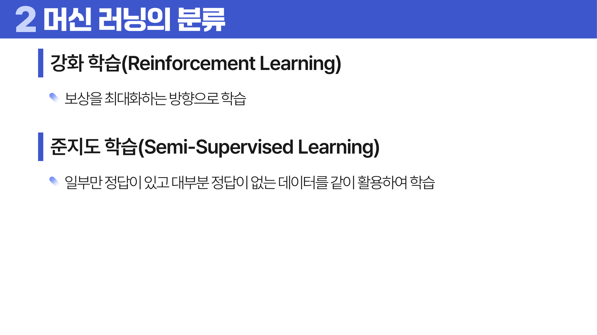

# 11. 머신 러닝

## 학습 목표

이 차시를 마치면 다음을 쉬운 말로 설명할 수 있으면 충분하다.

- 지도/비지도/강화/준지도 학습을 문제 형태로 구분한다.
- 성능 지표는 문제 유형과 비용에 따라 골라야 함을 이해한다.
- 과소적합, 과대적합, 편향-분산 관계를 설명한다.

## 오늘의 한 줄

머신러닝은 훈련 데이터의 패턴을 배워 아직 보지 못한 데이터에서 잘 맞히는 것을 목표로 한다.

## 오늘 반드시 이해할 3가지

1. 지도/비지도/강화/준지도 학습을 문제 형태로 구분한다.
2. 성능 지표는 문제 유형과 비용에 따라 골라야 함을 이해한다.
3. 과소적합, 과대적합, 편향-분산 관계를 설명한다.

## 처음 보는 단어

| 용어 | 먼저 이렇게 이해하기 |
|---|---|
| 머신러닝 | 데이터에서 패턴을 학습해 예측이나 판단을 하는 방법 |
| 지도학습 | 정답 라벨이 있는 데이터로 예측 규칙을 배우는 학습 |
| 비지도학습 | 정답 없이 데이터 구조를 찾는 학습 |
| 강화학습 | 행동과 보상으로 좋은 전략을 배우는 학습 |
| 일반화 | 새 데이터에서도 잘 맞는 성질 |
| 성능 지표 | 모델 결과를 평가하는 숫자 |
| 교차검증 | 데이터를 여러 번 나누어 검증하는 방식 |
| 과대적합 | 훈련 데이터에 너무 맞아 새 데이터에서 약해지는 상태 |

## 용어 이름 먼저 풀기

| 용어 | 이름의 뉘앙스 |
|---|---|
| Machine Learning | 기계가 규칙을 직접 입력받는 대신 데이터에서 패턴을 배운다는 뜻이다. |
| Fit | 모델을 데이터에 맞춘다는 뜻이다. |
| Generalization | 새 데이터에도 통하는 성능이다. |
| Metric | 성능을 재는 자다. 문제에 따라 자가 달라진다. |
| Overfitting | 훈련 데이터에 과하게 맞아 새 데이터에서 약해지는 상태다. |

## 개념 지도

```text
머신 러닝
├── 학습 유형
├── 성능 지표
├── 검증 방식
├── 편향-분산
└── 확인 문제와 해설
```

## 이 차시에서 꼭 붙잡을 설명 방식

모델의 목표는 훈련 데이터를 외우는 것이 아니다. 훈련 점수만 높고 새 데이터 점수가 낮으면 패턴을 배운 것이 아니라 특이한 노이즈까지 외운 것이다. 그래서 검증 데이터와 교차검증이 필요하다.

## 핵심 이론

### 먼저 잡는 직관

- **학습 유형**: 정답 라벨이 있으면 지도학습, 없으면 비지도학습처럼 문제의 형태가 학습 방식을 결정한다.
- **성능 지표**: 정확도, 정밀도, 재현율, F1은 틀리는 방식의 비용이 다를 때 서로 다른 판단을 준다.
- **검증 방식**: 훈련 데이터 성능만 보면 외운 모델을 좋은 모델로 착각할 수 있어 검증 절차가 필요하다.
- **편향-분산**: 너무 단순하면 패턴을 못 잡고, 너무 복잡하면 훈련 데이터의 우연한 흔들림까지 외운다.

### 1. 학습 유형

지도학습은 정답 라벨이 있고, 비지도학습은 구조를 찾는다. 강화학습은 행동과 보상으로 배우고, 준지도학습은 일부 라벨과 많은 무라벨 데이터를 함께 쓴다.

### 2. 성능 지표

분류는 정확도, 정밀도, 재현율, F1, ROC-AUC를 쓴다. 회귀는 MAE, MSE/RMSE, R2, MAPE를 쓴다. 군집화는 실루엣 같은 구조 지표를 본다.

처음에는 지표 이름을 모두 외우기보다 무엇을 벌하는지로 읽는다. MAE는 오차의 절댓값 평균이라 실제 단위로 이해하기 쉽고, RMSE는 큰 오차를 더 강하게 벌한다. ROC-AUC와 PR-AUC는 임계값을 바꿔 가며 분류 성능을 보는 지표인데, 불균형 데이터에서는 PR-AUC가 소수 클래스 성능을 더 직접적으로 보여 줄 때가 많다.



### 3. 검증 방식

훈련/검증/테스트 분리와 교차검증은 새 데이터 성능을 추정하기 위한 장치다. 클래스 불균형이 있으면 층화 분리를 고려한다.

### 4. 편향-분산

단순한 모델은 편향이 크고 복잡한 모델은 분산이 커질 수 있다. 좋은 모델은 둘의 균형을 찾는다.


## 판단 기준

1. 문제가 분류, 회귀, 군집, 추천 중 어디에 가까운지 정한다.
2. 틀렸을 때 비용이 큰 쪽을 기준으로 성능 지표를 고른다.
3. 훈련, 검증, 테스트 데이터의 역할을 섞지 않는다.
4. 과소적합과 과대적합은 훈련 성능과 검증 성능의 차이로 판단한다.
5. 모델 성능 숫자는 데이터 누수 여부를 확인한 뒤 해석한다.

## 오해와 반례

### 오해 1. 훈련 정확도가 높으면 좋은 모델이다.

새 데이터 성능이 중요하다. 훈련 정확도만 높으면 과대적합일 수 있다.

### 오해 2. 정확도 하나면 분류 성능을 평가할 수 있다.

클래스 불균형이나 오류 비용에 따라 정밀도, 재현율, F1, AUC가 더 중요할 수 있다.

### 오해 3. 교차검증은 성능을 올리는 방법이다.

교차검증은 성능을 더 믿을 수 있게 추정하는 방법이다.

## 예시 풀이

### 예시 1. 암 진단 모델

암 환자를 놓치는 비용이 크면 정확도보다 재현율을 중요하게 볼 수 있다.

### 예시 2. 집값 예측 모델

연속값을 예측하므로 회귀 문제다. MAE나 RMSE로 예측 오차 크기를 본다.

## 오늘의 요약 5줄

1. 머신러닝은 데이터의 패턴을 배워 보지 못한 데이터에서 잘 맞히는 것을 목표로 한다.
2. 학습 유형은 정답 라벨의 유무와 문제 목표에 따라 나뉜다.
3. 정확도 하나만 보면 불균형 데이터에서 성능을 크게 오해할 수 있다.
4. 검증은 모델이 외웠는지 일반화했는지 확인하는 절차다.
5. 편향과 분산의 균형이 모델 복잡도를 고르는 핵심 기준이다.

## 확인 문제

1. 지도학습과 비지도학습의 차이를 설명하라.
2. 분류 문제에서 정확도만 보면 위험한 상황을 설명하라.
3. 정밀도와 재현율의 차이를 예로 설명하라.
4. 훈련, 검증, 테스트 데이터의 역할을 설명하라.
5. 과소적합과 과대적합을 구분하는 방법을 설명하라.
6. 교차검증이 필요한 이유를 설명하라.
