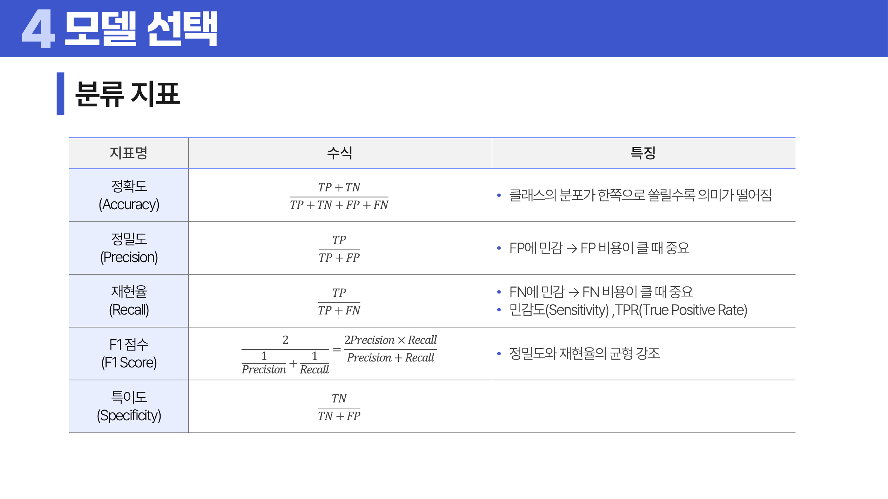
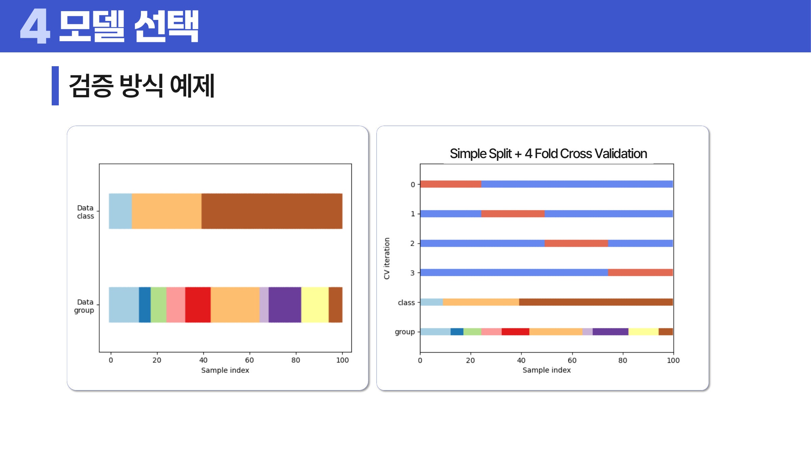
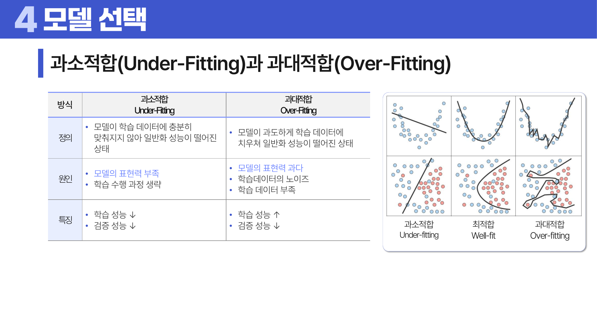
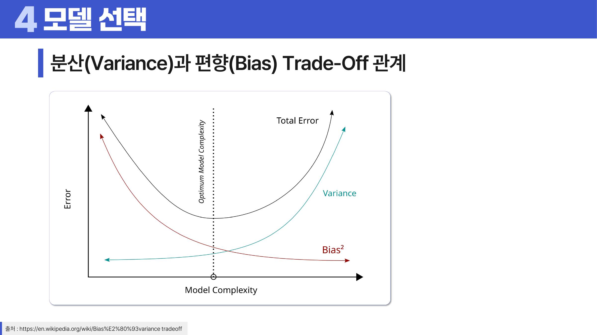

# 11. 머신 러닝

## 학습 목표

이 차시를 마치면 다음을 쉬운 말로 설명할 수 있으면 충분하다.

- 지도/비지도/강화/준지도 학습을 문제 형태로 구분한다.
- 성능 지표는 문제 유형과 비용에 따라 골라야 함을 이해한다.
- 과소적합, 과대적합, 편향-분산 관계를 설명한다.

## 오늘의 한 줄

머신러닝은 훈련 데이터의 패턴을 배워 아직 보지 못한 데이터에서 잘 맞히는 것을 목표로 한다.

## 오늘 반드시 이해할 3가지

1. 지도/비지도/강화/준지도 학습을 문제 형태로 구분한다.
2. 성능 지표는 문제 유형과 비용에 따라 골라야 함을 이해한다.
3. 과소적합, 과대적합, 편향-분산 관계를 설명한다.

## 이 차시 전에 알면 좋은 것

- **회귀**: 모델이 데이터를 보고 규칙을 맞춘다는 예
- **검증**: 새 데이터 성능을 분리해 보는 이유
- **오차**: 모델 성능을 숫자로 비교하는 기준

## 개념 지도

```text
머신 러닝
├── 학습 유형
├── 성능 지표
├── 검증 방식
├── 편향-분산
└── 확인 문제와 해설
```

## 학습 우선순위

- **필수**: 지도/비지도/강화/준지도 구분, 지표를 문제 비용에 맞게 선택, 과소적합과 과대적합 판단
- **심화**: 편향-분산 트레이드오프
- **확장**: 모델 선택과 튜닝 절차 자동화

## 이 차시에서 꼭 붙잡을 설명 방식

모델의 목표는 훈련 데이터를 외우는 것이 아니다. 훈련 점수만 높고 새 데이터 점수가 낮으면 패턴을 배운 것이 아니라 특이한 노이즈까지 외운 것이다. 그래서 검증 데이터와 <a id="ref-11-교차검증"></a>[교차검증](#note-11-교차검증)이 필요하다.

## 핵심 이론

### 먼저 잡는 직관

- **학습 유형**: 정답 라벨이 있으면 지도학습, 없으면 비지도학습처럼 문제의 형태가 학습 방식을 결정한다.
- **성능 지표**: 정확도, 정밀도, 재현율, F1은 틀리는 방식의 비용이 다를 때 서로 다른 판단을 준다.
- **검증 방식**: 훈련 데이터 성능만 보면 외운 모델을 좋은 모델로 착각할 수 있어 검증 절차가 필요하다.
- **편향-분산**: 너무 단순하면 패턴을 못 잡고, 너무 복잡하면 훈련 데이터의 우연한 흔들림까지 외운다.

### 1. 학습 유형

지도학습은 정답 라벨이 있고, 비지도학습은 구조를 찾는다. 강화학습은 행동과 보상으로 배우고, 준지도학습은 일부 라벨과 많은 무라벨 데이터를 함께 쓴다.


> **그림 읽기**: 라벨이 있는 학습, 없는 학습, 보상으로 배우는 학습을 문제 형태로 구분한다. 학습 유형은 데이터가 어떻게 주어지는지가 정한다.

### 2. 성능 지표

분류는 정확도, 정밀도, 재현율, F1, 특이도, AUC를 쓴다. 회귀는 MAE, MSE/RMSE, <a id="ref-11-r2"></a>[R2](#note-11-r2), MAPE를 쓴다. 군집화는 실루엣 같은 구조 지표를 본다.

처음에는 지표 이름을 모두 외우기보다 무엇을 벌하는지로 읽는다. 정확도는 전체 중 맞힌 비율, 정밀도는 양성이라고 예측한 것 중 진짜 양성 비율, 재현율은 실제 양성 중 찾아낸 비율, 특이도는 실제 음성 중 음성으로 맞힌 비율이다. F1은 정밀도와 재현율의 조화평균이다. MAE는 오차의 절댓값 평균이라 실제 단위로 이해하기 쉽고, RMSE는 큰 오차를 더 강하게 벌한다. AUC는 ROC curve 아래 면적으로, 임계값을 바꿔 가며 분류 모델이 양성과 음성을 얼마나 잘 구분하는지 본다.

ROC curve의 x축은 False Positive Rate, y축은 True Positive Rate다. 낮은 FPR에서 높은 TPR을 유지할수록 양성과 음성을 더 잘 구분하는 모델이다.



> **그림 읽기**: 정확도, 정밀도, 재현율, F1이 서로 다른 오류를 본다는 점을 확인한다. 어떤 오류가 비싼지가 지표 선택의 기준이다.

### 3. 검증 방식

훈련/검증/테스트 분리와 교차검증은 새 데이터 성능을 추정하기 위한 장치다. 홀드아웃 검증은 한 번 나누어 평가하고, 교차검증은 여러 fold를 번갈아 평가하며, 반복 검증은 분할을 여러 번 반복해 성능의 흔들림을 본다. 클래스 불균형이 있으면 층화 분리를 고려한다.

분리 방식도 데이터 구조에 맞춰 고른다. Simple Split은 순서대로 단순히 나누고, Shuffle Split은 무작위로 섞어 나눈다. Stratified Split은 타깃 비율을 유지하고, Grouped Split은 같은 그룹의 데이터가 훈련/검증에 동시에 섞이지 않게 한다. Time Series Split은 시간 순서를 깨지 않고 과거로 학습해 미래를 검증한다.



> **그림 읽기**: 데이터를 여러 번 나누어 평가하는 흐름을 본다. 한 번의 분할에 따른 우연한 성능 흔들림을 줄인다.

### 4. 편향-분산

단순한 모델은 편향이 크고 복잡한 모델은 분산이 커질 수 있다. 좋은 모델은 둘의 균형을 찾는다.



> **그림 읽기**: 모델 복잡도에 따라 훈련/검증 성능이 어떻게 달라지는지 본다. 너무 단순하면 못 배우고 너무 복잡하면 외운다.



> **그림 읽기**: 편향과 분산이 서로 밀고 당기는 관계를 본다. 좋은 모델은 단순함과 유연함 사이의 균형을 찾는다.

### 5. 모델 선택과 일반화 오차

머신러닝 모델은 모수적 모델과 비모수적 모델로 나눈다. 모수적 모델은 정해진 형태와 제한된 파라미터 안에서 학습하고, 비모수적 모델은 데이터가 많아질수록 더 유연한 구조를 만들 수 있다. 모수적 모델은 빠르고 해석이 쉬운 경우가 많지만 형태 가정이 틀리면 과소적합될 수 있고, 비모수적 모델은 유연하지만 데이터와 계산 비용이 더 필요하다.

분류 지표는 혼동행렬에서 출발한다. 정확도는 전체 중 맞힌 비율, 정밀도는 양성이라고 예측한 것 중 진짜 양성의 비율, 재현율은 실제 양성 중 찾아낸 비율이다. ROC-AUC는 임계값을 바꿀 때 TPR과 FPR의 균형을 본다. 클래스 불균형이 심하면 PR-AUC나 F1이 더 직접적인 판단 기준이 될 수 있다.

군집화의 실루엣 계수는 자기 군집 응집도와 다른 군집과의 분리도를 함께 본다. 같은 군집 안에서는 가까울수록 좋고, 다른 군집과는 멀수록 좋다.

편향-분산 분해는 일반화 오차를 세 부분으로 읽게 한다. 모델이 너무 단순해서 생기는 편향, 훈련 데이터가 바뀔 때 예측이 흔들리는 분산, 데이터 자체의 노이즈다. 모델 선택은 이 세 요소 중 줄일 수 있는 부분을 줄이는 과정이다.

## 판단 기준

1. 문제가 분류, 회귀, 군집, 추천 중 어디에 가까운지 정한다.
2. 틀렸을 때 비용이 큰 쪽을 기준으로 <a id="ref-11-성능-지표"></a>[성능 지표](#note-11-성능-지표)를 고른다.
3. 훈련, 검증, 테스트 데이터의 역할을 섞지 않는다.
4. 과소적합과 <a id="ref-11-과대적합"></a>[과대적합](#note-11-과대적합)은 훈련 성능과 검증 성능의 차이로 판단한다.
5. 모델 성능 숫자는 데이터 누수 여부를 확인한 뒤 해석한다.

## 오해와 반례

### 오해 1. 훈련 정확도가 높으면 좋은 모델이다.

새 데이터 성능이 중요하다. 훈련 정확도만 높으면 과대적합일 수 있다.

### 오해 2. 정확도 하나면 분류 성능을 평가할 수 있다.

클래스 불균형이나 오류 비용에 따라 정밀도, 재현율, F1, AUC가 더 중요할 수 있다.

### 오해 3. 교차검증은 성능을 올리는 방법이다.

교차검증은 성능을 더 믿을 수 있게 추정하는 방법이다.

## 예시 풀이

### 예시 1. 암 진단 모델

암 환자를 놓치는 비용이 크면 정확도보다 재현율을 중요하게 볼 수 있다.

### 예시 2. 집값 예측 모델

연속값을 예측하므로 회귀 문제다. MAE나 RMSE로 예측 오차 크기를 본다.

## 오늘의 요약 5줄

1. 머신러닝은 데이터의 패턴을 배워 보지 못한 데이터에서 잘 맞히는 것을 목표로 한다.
2. 학습 유형은 정답 라벨의 유무와 문제 목표에 따라 나뉜다.
3. 정확도 하나만 보면 불균형 데이터에서 성능을 크게 오해할 수 있다.
4. 검증은 모델이 외웠는지 일반화했는지 확인하는 절차다.
5. 편향과 분산의 균형이 모델 복잡도를 고르는 핵심 기준이다.

## 확인 문제

1. 지도학습과 비지도학습의 차이를 설명하라.
2. 분류 문제에서 정확도만 보면 위험한 상황을 설명하라.
3. 정밀도와 재현율의 차이를 예로 설명하라.
4. 훈련, 검증, 테스트 데이터의 역할을 설명하라.
5. 과소적합과 과대적합을 구분하는 방법을 설명하라.
6. 교차검증이 필요한 이유를 설명하라.
7. 왜 훈련 성능만 높으면 좋은 모델이라고 말할 수 없는가?
8. 왜 정확도 대신 재현율이나 정밀도를 봐야 하는 문제가 있는가?
9. 모수적 모델과 비모수적 모델의 차이를 설명하라.
10. ROC-AUC와 PR-AUC가 각각 어떤 상황에서 유용한지 설명하라.
11. 편향-분산 관점에서 과소적합과 과대적합을 설명하라.
12. ROC curve의 x축과 y축이 각각 무엇인지 설명하라.
13. hold-out, cross validation, repeated validation의 차이를 설명하라.
14. Stratified Split, Grouped Split, Time Series Split을 언제 쓰는지 설명하라.
15. 실루엣 점수가 군집화에서 무엇을 보는지 설명하라.

## 개념 주석

본문에서 연결된 개념을 잠깐 확인하는 공간이다. 용어를 누르면 본문에서 처음 표시된 위치로 돌아간다.

- <a id="note-11-교차검증"></a>[교차검증](#ref-11-교차검증): 데이터를 여러 번 나누어 검증하는 방식.
- <a id="note-11-r2"></a>[R2](#ref-11-r2): 종속변수 변동 중 모델이 설명한 비율. ([처음 설명된 차시](../09-linear-regression/README.md#3-모델-평가))
- <a id="note-11-성능-지표"></a>[성능 지표](#ref-11-성능-지표): 모델 결과를 평가하는 숫자.
- <a id="note-11-과대적합"></a>[과대적합](#ref-11-과대적합): 훈련 데이터에 너무 맞아 새 데이터에서 약해지는 상태.
