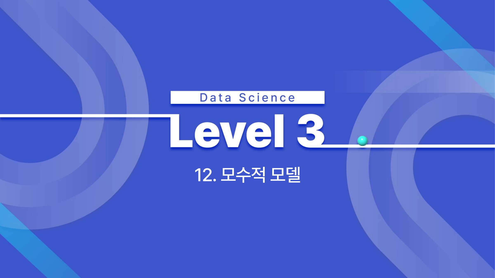
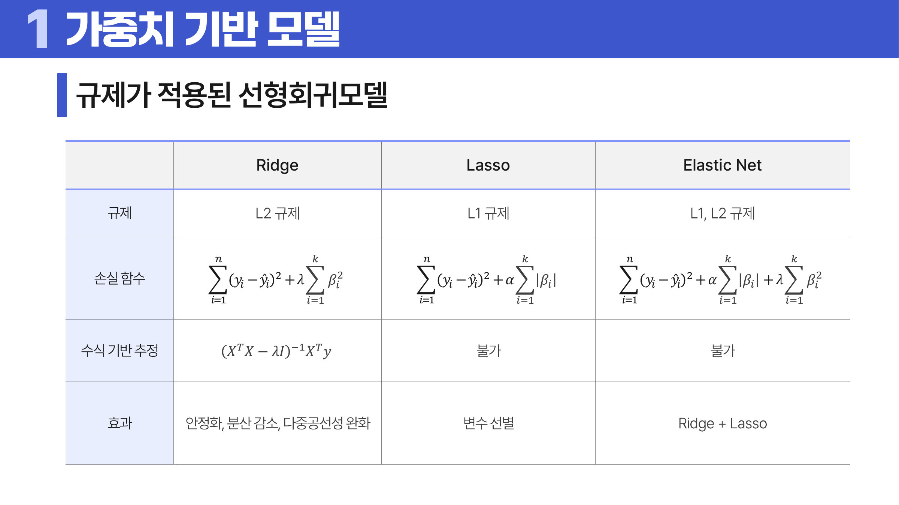

# 12. 모수적 모델

## 학습 목표

이 차시를 마치면 다음을 쉬운 말로 설명할 수 있으면 충분하다.

- 가중치 기반 모델이 입력에 가중치를 곱해 출력을 만든다는 흐름을 이해한다.
- 경사하강법, 학습률, 규제가 왜 필요한지 설명한다.
- 나이브 베이즈의 독립 가정과 평활화의 의미를 이해한다.

## 오늘의 한 줄

모수적 모델은 정해진 형태의 식과 가중치를 학습해 예측 규칙을 만든다.

## 오늘 반드시 이해할 3가지

1. 가중치 기반 모델이 입력에 가중치를 곱해 출력을 만든다는 흐름을 이해한다.
2. 경사하강법, 학습률, 규제가 왜 필요한지 설명한다.
3. 나이브 베이즈의 독립 가정과 평활화의 의미를 이해한다.

## 처음 보는 단어

| 용어 | 먼저 이렇게 이해하기 |
|---|---|
| 가중치 | 입력 변수의 영향력을 나타내는 숫자 |
| 경사하강법 | 손실이 줄어드는 방향으로 가중치를 조금씩 바꾸는 방법 |
| 학습률 | 한 번에 움직이는 보폭 |
| 규제 | 모델이 너무 복잡해지지 않게 벌점을 주는 방법 |
| L1 규제 | 가중치 절댓값 합에 벌점을 주는 규제 |
| L2 규제 | 가중치 제곱합에 벌점을 주는 규제 |
| 나이브 베이즈 | 입력 변수 독립을 가정해 베이즈 정리로 분류하는 모델 |
| 평활화 | 확률이 0이 되거나 작은 표본이 과하게 흔들리는 문제를 줄이는 보정 |

## 용어 이름 먼저 풀기

| 용어 | 이름의 뉘앙스 |
|---|---|
| Weight-Based Model | 입력마다 weight, 즉 중요도를 곱해 판단하는 모델이다. |
| Gradient Descent | 손실이 내려가는 방향으로 조금씩 이동한다는 이름이다. |
| Learning Rate | 한 번에 얼마나 크게 움직일지 정하는 보폭이다. |
| Regularization | 모델이 너무 복잡해지지 않도록 규칙을 붙인다는 뜻이다. |
| Naive Bayes | naive는 순진하다는 뜻이다. 변수들이 서로 독립이라고 단순하게 가정한다. |

## 개념 지도

```text
모수적 모델
├── 가중치 기반 모델
├── 경사하강법과 학습률
├── L1과 L2 규제
├── 나이브 베이즈
└── 확인 문제와 해설
```

## 이 차시에서 꼭 붙잡을 설명 방식

규제는 성능을 일부러 방해하는 것처럼 보이지만, 실제 목적은 훈련 데이터에 너무 딱 맞는 복잡한 가중치를 막는 것이다. 작은 손실만 쫓으면 새 데이터에서 흔들릴 수 있으므로, 가중치 크기에도 비용을 붙여 더 단순한 규칙을 선호하게 만든다.

## 핵심 이론

### 먼저 잡는 직관

- **가중치 기반 모델**: 입력값마다 중요도를 나타내는 가중치를 곱해 더하면 모델의 예측값이 만들어진다.
- **경사하강법과 학습률**: 손실이 줄어드는 방향으로 가중치를 조금씩 움직이되, 보폭이 너무 크거나 작으면 문제가 생긴다.
- **L1과 L2 규제**: 규제는 가중치가 필요 이상으로 커지는 것을 막아 모델이 훈련 데이터에 과하게 맞는 일을 줄인다.
- **나이브 베이즈**: 특징들이 조건부로 독립이라고 단순화해 각 클래스가 얼마나 그럴듯한지 계산한다.

### 1. 가중치 기반 모델

선형회귀, 로지스틱 회귀, 신경망은 입력과 가중치의 조합으로 출력을 만든다. 학습은 손실을 줄이는 가중치를 찾는 과정이다.



### 2. 경사하강법과 학습률

기울기는 손실이 커지는 방향을 알려 준다. 반대 방향으로 움직이면 손실을 줄일 수 있다. 학습률이 너무 크면 튀고 너무 작으면 느리다.

### 3. L1과 L2 규제

L1은 일부 가중치를 0으로 만들어 변수 선택 효과가 있고, L2는 가중치를 전반적으로 작게 만들어 안정화한다. 둘을 함께 쓰면 Elastic Net이다.



### 4. 나이브 베이즈

각 입력 변수가 클래스 안에서 독립이라고 가정해 사후확률을 계산한다. 확률이 0이 되는 문제를 막기 위해 평활화를 사용한다.

## 판단 기준

1. 모델이 어떤 가중치와 파라미터를 학습하는지 식으로 추적한다.
2. 손실 함수가 줄어드는 방향과 학습률의 크기를 함께 본다.
3. L1은 변수 선택 효과, L2는 가중치 축소 효과가 크다는 차이를 확인한다.
4. 규제 강도가 너무 크면 필요한 신호까지 약해질 수 있음을 본다.
5. 나이브 베이즈의 독립 가정이 현실에서 얼마나 거친 단순화인지 설명한다.

## 오해와 반례

### 오해 1. 규제는 무조건 성능을 낮춘다.

훈련 성능은 낮출 수 있지만 새 데이터 성능을 높일 수 있다.

### 오해 2. 학습률은 클수록 빠르고 좋다.

너무 크면 최적점을 지나치며 발산하거나 흔들릴 수 있다.

### 오해 3. 나이브 베이즈는 독립 가정이 완벽해야만 쓸 수 있다.

가정은 단순하지만 실제로는 기준선 모델로 유용한 경우가 많다. 다만 상관이 강하면 성능이 흔들릴 수 있다.

## 예시 풀이

### 예시 1. Lasso가 변수를 줄이는 이유

L1 벌점은 일부 가중치를 정확히 0으로 만들 수 있다. 그래서 변수 선택 효과가 생긴다.

### 예시 2. 스팸 메일 분류

단어들이 독립이라고 단순화하고, 각 클래스에서 단어가 나올 확률을 곱해 스팸 가능성을 계산할 수 있다.

## 오늘의 요약 5줄

1. 모수적 모델은 정해진 형태의 식 안에서 파라미터를 학습해 예측 규칙을 만든다.
2. 가중치는 입력 특징이 출력에 미치는 영향의 크기와 방향을 담는다.
3. 경사하강법은 손실을 줄이는 방향으로 가중치를 반복 수정한다.
4. 규제는 모델이 훈련 데이터에 지나치게 맞는 것을 막기 위한 제약이다.
5. 나이브 베이즈는 단순한 가정 덕분에 빠르고 해석하기 쉬운 확률 모델이다.

## 확인 문제

1. 가중치 기반 모델의 학습을 설명하라.
2. 학습률이 너무 크거나 작을 때 생기는 문제를 설명하라.
3. L1 규제와 L2 규제의 차이를 설명하라.
4. 규제가 과대적합을 줄일 수 있는 이유를 설명하라.
5. 나이브 베이즈의 “나이브”가 뜻하는 바를 설명하라.
6. 독립 가정이 완벽하지 않아도 나이브 베이즈가 쓰일 수 있는 이유를 설명하라.
