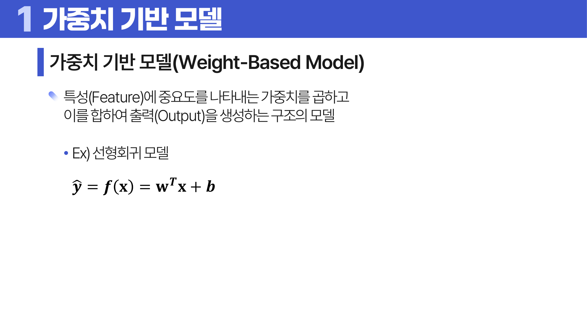
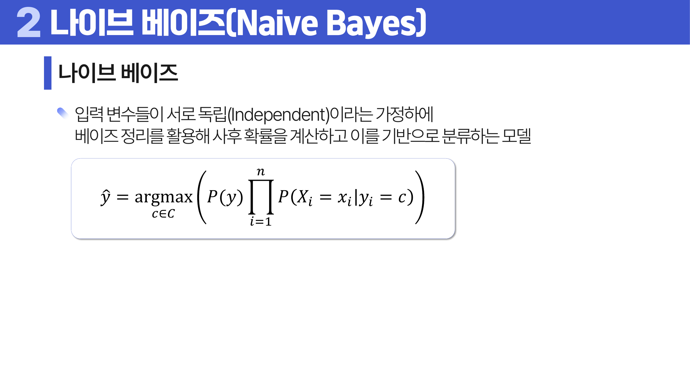

# 12. 모수적 모델

## 학습 목표

이 차시를 마치면 다음을 쉬운 말로 설명할 수 있으면 충분하다.

- 가중치 기반 모델이 입력에 가중치를 곱해 출력을 만든다는 흐름을 이해한다.
- 손실 함수가 모델이 줄이려는 “틀림의 기준”임을 이해한다.
- 경사하강법, 학습률, 규제가 왜 필요한지 설명한다.
- 나이브 베이즈의 독립 가정과 평활화의 의미를 이해한다.

## 오늘의 한 줄

모수적 모델은 정해진 형태의 식과 가중치를 학습해 예측 규칙을 만든다.

## 오늘 반드시 이해할 3가지

1. 가중치 기반 모델이 입력에 가중치를 곱해 출력을 만든다는 흐름을 이해한다.
2. 경사하강법, 학습률, 규제가 왜 필요한지 설명한다.
3. 나이브 베이즈의 독립 가정과 평활화의 의미를 이해한다.

## 이 차시 전에 알면 좋은 것

- **머신러닝**: 모델이 데이터를 보고 파라미터를 배운다는 관점
- **경사하강법**: 손실을 줄이는 방향으로 움직이는 감각
- **확률**: 나이브 베이즈의 사후확률 계산 언어

## 개념 지도

```text
모수적 모델
├── 가중치 기반 모델
├── 경사하강법과 학습률
├── L1과 L2 규제
├── 나이브 베이즈
└── 확인 문제와 해설
```

## 학습 우선순위

- **필수**: 가중치 기반 모델의 입력-가중치-출력 흐름, 학습률이 너무 크거나 작을 때 문제, L1/L2 규제 차이
- **심화**: 나이브 베이즈의 조건부 독립 가정
- **확장**: Elastic Net과 확률 모델 비교

## 이 차시에서 꼭 붙잡을 설명 방식

규제는 성능을 일부러 방해하는 것처럼 보이지만, 실제 목적은 훈련 데이터에 너무 딱 맞는 복잡한 <a id="ref-12-가중치"></a>[가중치](#note-12-가중치)를 막는 것이다. 작은 손실만 쫓으면 새 데이터에서 흔들릴 수 있으므로, 가중치 크기에도 비용을 붙여 더 단순한 규칙을 선호하게 만든다.

손실 함수는 모델이 무엇을 틀렸다고 볼지 정하는 기준이다. 선형회귀의 MSE는 큰 오차를 제곱으로 강하게 벌하고, 분류의 로그손실은 정답 클래스에 낮은 확률을 주면 크게 벌한다. 모델은 “진짜 의미”를 직접 아는 것이 아니라, 우리가 정한 손실을 줄이는 방향으로 학습한다.

## 핵심 이론

### 먼저 잡는 직관

- **가중치 기반 모델**: 입력값마다 중요도를 나타내는 가중치를 곱해 더하면 모델의 예측값이 만들어진다.
- **경사하강법과 학습률**: 손실이 줄어드는 방향으로 가중치를 조금씩 움직이되, 보폭이 너무 크거나 작으면 문제가 생긴다.
- **L1과 L2 규제**: 규제는 가중치가 필요 이상으로 커지는 것을 막아 모델이 훈련 데이터에 과하게 맞는 일을 줄인다.
- **나이브 베이즈**: 특징들이 조건부로 독립이라고 단순화해 각 클래스가 얼마나 그럴듯한지 계산한다.

### 1. 가중치 기반 모델

<a id="ref-12-선형회귀"></a>[선형회귀](#note-12-선형회귀), 로지스틱 회귀, 인공신경망은 입력과 가중치의 조합으로 출력을 만든다. 학습은 손실을 줄이는 가중치를 찾는 과정이다.

가중치 기반 모델은 보통 `yhat = w^T x + b`처럼 입력 특성에 가중치를 곱해 더하고, 편향 `b`를 더해 출력을 만든다. 인공신경망도 여러 층에서 이 계산을 반복하고 비선형 변환을 끼워 넣은 모델로 볼 수 있다.

입력 스케일이 크게 다르면 가중치 해석과 최적화가 어려워질 수 있다. 같은 1만큼의 변화라도 나이는 1년, 소득은 1원일 수 있다. 그래서 경사하강법 기반 모델에서는 표준화나 정규화가 학습 안정성에 도움이 되는 경우가 많다.

가중치를 구하는 방식은 크게 둘로 나뉜다. 수식 기반 추정은 정규방정식처럼 닫힌 해가 있어 같은 데이터에서는 같은 결과를 바로 계산한다. 최적화 알고리즘 기반 추정은 손실을 줄이는 방향으로 반복해서 모수를 바꾼다. 데이터가 크거나 모델이 복잡하면 경사하강법처럼 반복 최적화가 더 현실적이다.



> **그림 읽기**: 입력에 가중치를 곱하고 더해 출력을 만드는 구조를 본다. 학습은 이 가중치를 조정하는 과정이다.

### 2. 경사하강법과 학습률

기울기는 손실이 커지는 방향을 알려 준다. 반대 방향으로 움직이면 손실을 줄일 수 있다. <a id="ref-12-학습률"></a>[학습률](#note-12-학습률)이 너무 크면 튀고 너무 작으면 느리다.

경사하강법의 기본 업데이트는 다음처럼 쓴다.

```text
theta = theta - eta * gradient(J(theta))
```

여기서 `J(theta)`는 목적함수이고, `eta`는 학습률이다. 선형회귀에 적용하면 MSE를 목적함수로 두고, 예측값 `yhat_i = w^T x_i + b`와 실제값의 차이를 이용해 `w`와 `b`의 기울기를 계산한다.

```text
yhat_i = w^T x_i + b
J = (1 / N) * sum_i (y_i - yhat_i)^2

gradient_w J = (-2 / N) * sum_i x_i(y_i - yhat_i)
             = (-2 / N) * X^T(y - yhat)

dJ / db = (-2 / N) * sum_i (y_i - yhat_i)

w = w - eta * gradient_w J
b = b - eta * dJ/db
```

과정은 `모수 초기화 -> 손실과 기울기 계산 -> 모수 업데이트 -> 종료조건 확인`을 반복한다. 에폭(epoch)은 학습 데이터를 모두 사용해 한 번 학습을 완료한 단위다. 큰 데이터에서는 전체 데이터를 한 번에 메모리에 올리지 않고 배치(batch)로 나누어 학습할 수 있다.

### 3. L1과 L2 규제

L1은 일부 가중치를 0으로 만들어 <a id="ref-12-변수"></a>[변수](#note-12-변수) 선택 효과가 있고, L2는 가중치를 전반적으로 작게 만들어 안정화한다. 둘을 함께 쓰면 Elastic Net이다.

규제는 기존 손실 함수에 가중치 크기에 대한 벌점을 더한다.

```text
기본 손실 = sum_i (y_i - yhat_i)^2

L1 penalty = sum_j |beta_j|
L2 penalty = sum_j beta_j^2

Lasso loss = sum_i (y_i - yhat_i)^2 + alpha * sum_j |beta_j|
Ridge loss = sum_i (y_i - yhat_i)^2 + lambda * sum_j beta_j^2
Elastic Net loss = sum_i (y_i - yhat_i)^2
                   + alpha * sum_j |beta_j|
                   + lambda * sum_j beta_j^2
```

L1은 `beta_j = 0`에서 미분 불가능하고, 0 양쪽에서 기울기가 일정하게 작용한다. 이 성질 때문에 일부 계수가 정확히 0이 되기 쉽다. L2의 도함수는 `2beta_j`라서 큰 계수일수록 더 강하게 줄이지만, 보통 정확히 0으로 만들지는 않는다.


> **그림 읽기**: 가중치가 과하게 커지는 것을 벌점으로 막는 구조를 본다. L1과 L2가 가중치를 줄이는 방식이 다르다.

### 4. 나이브 베이즈

각 입력 변수가 클래스 안에서 독립이라고 가정해 사후확률을 계산한다. 확률이 0이 되는 문제를 막기 위해 <a id="ref-12-평활화"></a>[평활화](#note-12-평활화)를 사용한다.

나이브 베이즈는 베이즈 정리에서 시작한다. 모든 클래스 `c`에 대해 `P(y=c) * product(P(X_i=x_i | y=c))`를 비교하고 가장 큰 클래스를 고른다. 곱셈이 길어지면 값이 너무 작아지는 underflow가 생길 수 있으므로 실제 계산에서는 로그를 취해 더한다.

```text
P(y = c | X1 = x1, ..., Xk = xk)
= P(X1 = x1, ..., Xk = xk | y = c)P(y = c)
  / P(X1 = x1, ..., Xk = xk)

조건부 독립 가정:
P(X1 = x1, ..., Xk = xk | y = c)
= product_i P(X_i = x_i | y = c)

yhat = argmax_c P(y = c) * product_i P(X_i = x_i | y = c)
yhat = argmax_c [log P(y=c) + sum_i log P(X_i=x_i | y=c)]
```



> **그림 읽기**: 사전 정보와 관측 정보를 결합해 조건을 뒤집는 흐름을 본다. 검사 양성일 확률과 실제 질병일 확률은 서로 다른 질문이다.

### 5. 규제와 나이브 베이즈 종류

규제가 적용된 선형회귀는 Ridge와 Lasso 관점으로 다룬다. Ridge는 L2 벌점으로 계수를 전반적으로 줄여 다중공선성이 있는 상황에서도 안정적인 해를 만들기 쉽다. Lasso는 L1 벌점으로 일부 계수를 0으로 만들어 변수 선택 효과를 준다. Elastic Net은 두 벌점을 섞어, 강하게 관련된 변수들이 많은 상황에서 한쪽 성질만 쓰는 약점을 줄인다.

나이브 베이즈는 입력 변수의 분포 가정에 따라 종류가 나뉜다. Gaussian Naive Bayes는 연속형 변수가 클래스별 정규분포를 따른다고 보고, Multinomial Naive Bayes는 단어 빈도처럼 카운트 데이터를 다룰 때 자주 쓰며, Bernoulli Naive Bayes는 단어가 등장했는지처럼 0/1 특징에 어울린다.

평활화는 관측되지 않은 조합의 확률이 0이 되는 문제를 막는다. 단어 분류에서 어떤 클래스에 특정 단어가 한 번도 나오지 않았다는 이유만으로 전체 사후확률이 0이 되면 지나치게 단정적이므로, 작은 가짜 카운트를 더해 확률을 안정화한다.

나이브 베이즈의 독립 가정은 현실을 단순화한 것이다. 스팸 메일에서 `무료`와 `쿠폰`이라는 단어는 서로 관련 있을 수 있지만, 모델은 클래스가 주어지면 단어들이 독립이라고 가정해 계산을 단순하게 만든다. 이 가정이 완벽하지 않아도 빠른 기준선 모델로 쓸 수 있지만, 강하게 관련된 특징이 많으면 확률값을 과신할 수 있다.

Bernoulli NB에서는 0/1 특징의 등장 확률을, Multinomial NB에서는 여러 사건의 발생 빈도 확률을 평활화한다. `alpha = 1`이면 Laplace Smoothing, `alpha > 0`이면 Lidstone Smoothing이라고 부른다. alpha가 작아질수록 관측 데이터에 더 민감해져 분산이 커질 수 있고, alpha가 커질수록 확률을 더 평평하게 만들어 편향이 커질 수 있다.

사전확률은 클래스별 관측 비율로 추정한다.

```text
P(y = c) = sum_i 1(y_i = c) / n
```

Bernoulli NB는 0/1 특징의 조건부 확률을 추정한다.

```text
P(X_i = x_i | y = c) = p^x_i(1 - p)^(1 - x_i)
p = (sum_i x_i + alpha) / (n + 2alpha)
```

Multinomial NB는 카운트 벡터의 다항분포를 쓴다.

```text
P(X1 = x1, ..., Xk = xk)
= n! / (x1! ... xk!) * p1^x1 ... pk^xk

p_j = (sum_i x_ij + alpha) / (sum_i sum_l x_il + k alpha)
```

Gaussian NB는 연속형 특징을 클래스별 정규분포로 보고, 각 클래스 안에서 평균과 분산을 추정해 조건부 밀도를 계산한다.

## 판단 기준

1. 모델이 어떤 가중치와 파라미터를 학습하는지 식으로 추적한다.
2. 손실 함수가 줄어드는 방향과 학습률의 크기를 함께 본다.
3. L1은 변수 선택 효과, L2는 가중치 축소 효과가 크다는 차이를 확인한다.
4. 규제 강도가 너무 크면 필요한 신호까지 약해질 수 있음을 본다.
5. <a id="ref-12-나이브-베이즈"></a>[나이브 베이즈](#note-12-나이브-베이즈)의 독립 가정이 현실에서 얼마나 거친 단순화인지 설명한다.

## 오해와 반례

### 오해 1. 규제는 무조건 성능을 낮춘다.

훈련 성능은 낮출 수 있지만 새 데이터 성능을 높일 수 있다.

### 오해 2. 학습률은 클수록 빠르고 좋다.

너무 크면 최적점을 지나치며 발산하거나 흔들릴 수 있다.

### 오해 3. 나이브 베이즈는 독립 가정이 완벽해야만 쓸 수 있다.

가정은 단순하지만 실제로는 기준선 모델로 유용한 경우가 많다. 다만 상관이 강하면 성능이 흔들릴 수 있다.

## 예시 풀이

### 예시 1. Lasso가 변수를 줄이는 이유

L1 벌점은 일부 가중치를 정확히 0으로 만들 수 있다. 그래서 변수 선택 효과가 생긴다.

### 예시 2. 스팸 메일 분류

단어들이 독립이라고 단순화하고, 각 클래스에서 단어가 나올 확률을 곱해 스팸 가능성을 계산할 수 있다.

## 오늘의 요약 5줄

1. 모수적 모델은 정해진 형태의 식 안에서 파라미터를 학습해 예측 규칙을 만든다.
2. 가중치는 입력 특징이 출력에 미치는 영향의 크기와 방향을 담는다.
3. 경사하강법은 손실을 줄이는 방향으로 가중치를 반복 수정한다.
4. 규제는 모델이 훈련 데이터에 지나치게 맞는 것을 막기 위한 제약이다.
5. 나이브 베이즈는 단순한 가정 덕분에 빠르고 해석하기 쉬운 확률 모델이다.

## 확인 문제

1. 가중치 기반 모델의 학습을 설명하라.
2. 학습률이 너무 크거나 작을 때 생기는 문제를 설명하라.
3. L1 규제와 L2 규제의 차이를 설명하라.
4. 규제가 과대적합을 줄일 수 있는 이유를 설명하라.
5. 나이브 베이즈의 “나이브”가 뜻하는 바를 설명하라.
6. 독립 가정이 완벽하지 않아도 나이브 베이즈가 쓰일 수 있는 이유를 설명하라.
7. 왜 학습률이 너무 크면 손실이 줄지 않을 수 있는가?
8. 왜 L1 규제는 변수 선택 효과가 생길 수 있는가?
9. Ridge, Lasso, Elastic Net의 차이를 설명하라.
10. Gaussian, Multinomial, Bernoulli Naive Bayes가 어울리는 데이터 차이를 설명하라.
11. 나이브 베이즈에서 평활화가 필요한 이유를 설명하라.
12. 수식 기반 추정과 최적화 알고리즘 기반 추정의 차이를 설명하라.
13. 경사하강법의 업데이트식과 에폭, 배치의 의미를 설명하라.
14. 나이브 베이즈에서 로그를 취해 계산하는 이유를 설명하라.
15. Laplace Smoothing과 Lidstone Smoothing, alpha의 편향-분산 효과를 설명하라.
16. 선형회귀 MSE 목적함수에서 `w`와 `b`의 경사하강법 기울기 식을 쓰라.
17. Ridge, Lasso, Elastic Net의 손실 함수와 규제항을 각각 쓰라.
18. 나이브 베이즈의 베이즈 정리 유도, 조건부 독립 가정, 로그 점수 식을 순서대로 설명하라.
19. Bernoulli NB와 Multinomial NB의 평활화 공식을 쓰고 `alpha`가 하는 일을 설명하라.
20. 손실 함수가 모델 학습에서 어떤 역할을 하는지 설명하라.
21. 입력 변수 스케일 차이가 경사하강법 기반 모델에 문제를 만들 수 있는 이유를 설명하라.
22. 나이브 베이즈의 조건부 독립 가정이 완벽하지 않아도 기준선 모델로 쓰일 수 있는 이유를 설명하라.

## 개념 주석

본문에서 연결된 개념을 잠깐 확인하는 공간이다. 용어를 누르면 본문에서 처음 표시된 위치로 돌아간다.

- <a id="note-12-가중치"></a>[가중치](#ref-12-가중치): 입력 변수의 영향력을 나타내는 숫자.
- <a id="note-12-선형회귀"></a>[선형회귀](#ref-12-선형회귀): 입력과 출력의 평균적 관계를 직선식으로 설명하는 모델. ([처음 설명된 차시](../09-linear-regression/README.md#1-단순-선형회귀와-다중-선형회귀))
- <a id="note-12-학습률"></a>[학습률](#ref-12-학습률): 한 번에 움직이는 보폭.
- <a id="note-12-변수"></a>[변수](#ref-12-변수): 관측 대상의 특징을 적어 둔 열. ([처음 설명된 차시](../01-data-understanding/README.md#4-단위-변수-관측치))
- <a id="note-12-평활화"></a>[평활화](#ref-12-평활화): 확률이 0이 되거나 작은 표본이 과하게 흔들리는 문제를 줄이는 보정.
- <a id="note-12-나이브-베이즈"></a>[나이브 베이즈](#ref-12-나이브-베이즈): 입력 변수 독립을 가정해 베이즈 정리로 분류하는 모델.
