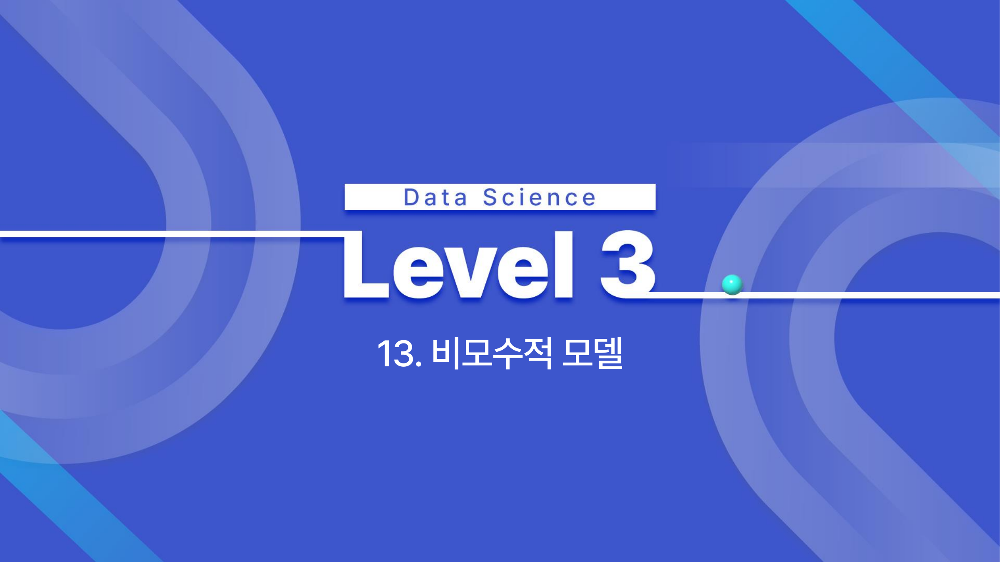

# 13. 비모수적 모델

## 학습 목표

이 차시를 마치면 다음을 쉬운 말로 설명할 수 있으면 충분하다.

- 의사결정나무가 분기를 반복해 예측한다는 구조를 이해한다.
- 불순도와 가지치기가 왜 필요한지 설명한다.
- KNN은 가까운 이웃의 라벨을 이용하며 차원의 저주에 약함을 이해한다.

## 오늘의 한 줄

비모수적 모델은 고정된 공식 모양보다 데이터의 구조를 더 직접적으로 사용해 예측한다.

## 오늘 반드시 이해할 3가지

1. 의사결정나무가 분기를 반복해 예측한다는 구조를 이해한다.
2. 불순도와 가지치기가 왜 필요한지 설명한다.
3. KNN은 가까운 이웃의 라벨을 이용하며 차원의 저주에 약함을 이해한다.

## 처음 보는 단어

| 용어 | 먼저 이렇게 이해하기 |
|---|---|
| 의사결정나무 | 질문을 따라 가지를 내려가며 예측하는 트리 모델 |
| 노드 | 분기 조건이나 결과가 놓이는 지점 |
| 가지 | 조건에 따라 다음 노드로 이어지는 연결 |
| 리프 | 최종 예측이 놓이는 마지막 노드 |
| 불순도 | 한 노드 안에 클래스가 얼마나 섞여 있는지 |
| 가지치기 | 너무 복잡한 트리를 줄이는 과정 |
| KNN | 가까운 k개 이웃의 정보를 이용하는 모델 |
| 차원의 저주 | 차원이 늘수록 거리의 구분력이 약해지는 현상 |

## 용어 이름 먼저 풀기

| 용어 | 이름의 뉘앙스 |
|---|---|
| Decision Tree | 결정을 나무처럼 가지치며 내려간다는 이름이다. |
| Node | 분기나 결과가 놓이는 점이다. |
| Pruning | 나무의 가지를 자르듯 너무 복잡한 분기를 줄인다. |
| K-Nearest Neighbors | 가장 가까운 k개의 이웃을 본다는 뜻이다. |
| Curse of Dimensionality | 차원이 늘수록 거리의 의미가 흐려지는 문제다. |

## 개념 지도

```text
비모수적 모델
├── 의사결정나무 구조
├── 분기 기준
├── 가지치기와 과적합
├── KNN
└── 확인 문제와 해설
```

## 이 차시에서 꼭 붙잡을 설명 방식

의사결정나무는 질문을 많이 만들수록 훈련 데이터를 잘 나눌 수 있다. 하지만 너무 깊게 자라면 우연한 예외까지 규칙으로 만든다. 가지치기는 설명력을 조금 포기하더라도 새 데이터에서 덜 흔들리는 나무를 만들기 위한 장치다.

## 핵심 이론

### 먼저 잡는 직관

- **의사결정나무 구조**: 질문을 하나씩 던져 데이터를 나누고 마지막 잎에서 예측값이나 클래스를 정한다.
- **분기 기준**: 좋은 분기는 섞여 있던 데이터를 더 순수한 집단으로 나누는 질문이다.
- **가지치기와 과적합**: 나무가 너무 깊으면 훈련 데이터의 예외까지 외우므로 가지치기로 복잡도를 제한한다.
- **KNN**: 새 데이터 주변의 가까운 이웃들이 어떤 라벨을 가졌는지 보고 예측한다.

### 1. 의사결정나무 구조

루트 노드에서 시작해 내부 노드의 조건을 따라 내려가고, 리프 노드에서 최종 예측을 낸다.



### 2. 분기 기준

분류는 지니 불순도나 엔트로피처럼 섞임 정도를 줄이는 분기를 찾는다. 회귀는 MSE처럼 예측 오차를 줄이는 분기를 찾는다.

### 3. 가지치기와 과적합

사전 가지치기는 깊이와 최소 표본 수를 제한하고, 사후 가지치기는 만든 뒤 불필요한 가지를 줄인다.

### 4. KNN

훈련 과정은 거의 없고 예측 시점에 가까운 이웃을 찾는다. k가 작으면 분산이 크고, k가 크면 편향이 커질 수 있다.


## 판단 기준

1. 트리의 각 분기가 어떤 질문으로 데이터를 나누는지 말로 읽는다.
2. 깊이, 최소 샘플 수, 가지치기 기준이 과적합에 미치는 영향을 본다.
3. 불순도 감소가 실제로 의미 있는 분리인지 확인한다.
4. KNN에서는 거리 척도와 스케일링이 결과를 바꿀 수 있음을 확인한다.
5. 고차원 데이터에서 거리 기반 판단이 약해질 수 있음을 고려한다.

## 오해와 반례

### 오해 1. 트리는 깊을수록 좋다.

깊은 트리는 훈련 데이터를 외우기 쉬워 과대적합될 수 있다.

### 오해 2. KNN은 학습이 없으니 계산이 항상 빠르다.

훈련은 빠르지만 예측 때 모든 훈련 데이터와 거리를 계산해야 해 느릴 수 있다.

### 오해 3. 고차원에서도 거리 기반 방법은 안정적이다.

차원이 늘면 점들 사이 거리가 비슷해져 가까움의 의미가 약해질 수 있다.

## 예시 풀이

### 예시 1. 대출 승인 트리

소득, 연체 이력, 부채 비율 같은 질문을 순서대로 따라가며 승인 여부를 예측할 수 있다.

### 예시 2. KNN으로 붓꽃 분류

새 꽃의 꽃잎 길이와 너비가 기존 어떤 꽃들과 가까운지 보고, 가까운 k개 이웃의 다수 클래스를 예측한다.

## 오늘의 요약 5줄

1. 비모수적 모델은 고정된 식보다 데이터 구조를 직접 활용해 예측한다.
2. 의사결정나무는 질문과 분기를 반복해 사람이 읽기 쉬운 규칙을 만든다.
3. 불순도는 한 노드 안에 여러 클래스가 얼마나 섞였는지를 나타낸다.
4. 가지치기는 깊은 나무가 훈련 데이터를 외우는 일을 줄인다.
5. KNN은 가까운 이웃을 기준으로 판단하므로 거리와 스케일에 민감하다.

## 확인 문제

1. 의사결정나무의 루트, 내부노드, 리프를 설명하라.
2. 불순도가 낮아진다는 뜻을 설명하라.
3. 나무가 깊어질수록 과대적합 위험이 커지는 이유를 설명하라.
4. 가지치기가 필요한 이유를 설명하라.
5. KNN에서 k가 너무 작거나 클 때 생기는 문제를 설명하라.
6. 거리 기반 방법에서 스케일링이 중요한 이유를 설명하라.
