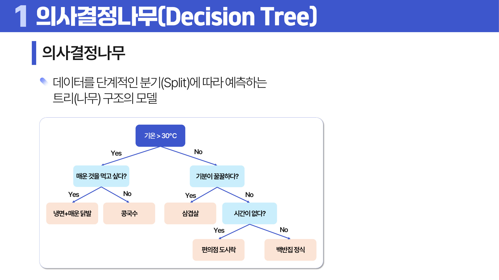
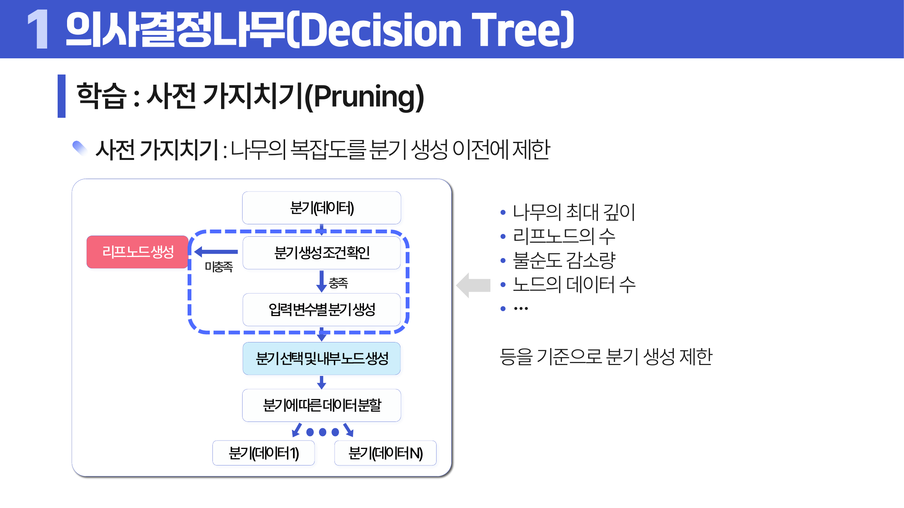
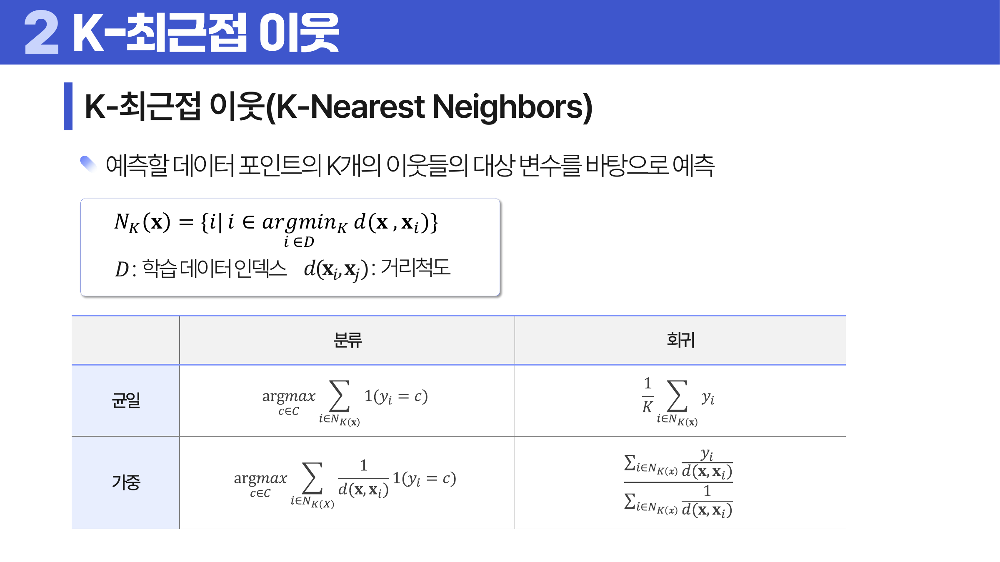
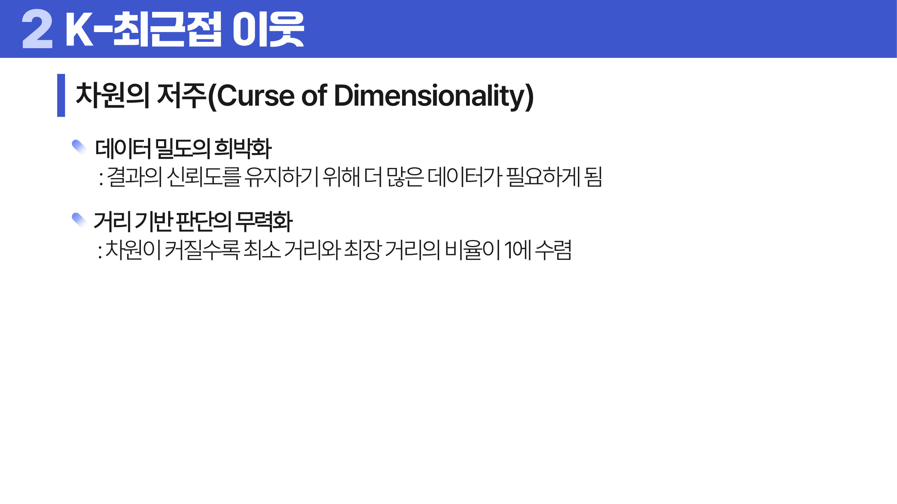

# 13. 비모수적 모델

## 학습 목표

이 차시를 마치면 다음을 쉬운 말로 설명할 수 있으면 충분하다.

- 의사결정나무가 분기를 반복해 예측한다는 구조를 이해한다.
- 불순도와 가지치기가 왜 필요한지 설명한다.
- KNN은 가까운 이웃의 라벨을 이용하며 차원의 저주에 약함을 이해한다.

## 오늘의 한 줄

비모수적 모델은 고정된 공식 모양보다 데이터의 구조를 더 직접적으로 사용해 예측한다.

## 오늘 반드시 이해할 3가지

1. 의사결정나무가 분기를 반복해 예측한다는 구조를 이해한다.
2. 불순도와 가지치기가 왜 필요한지 설명한다.
3. KNN은 가까운 이웃의 라벨을 이용하며 차원의 저주에 약함을 이해한다.

## 이 차시 전에 알면 좋은 것

- **모수적 모델**: 정해진 식을 가정하는 방식과 비교
- **거리**: KNN에서 가까움을 재는 기준
- **과대적합**: 트리 깊이와 KNN의 k가 만드는 위험

## 개념 지도

```text
비모수적 모델
├── 의사결정나무 구조
├── 분기 기준
├── 가지치기와 과적합
├── KNN
└── 확인 문제와 해설
```

## 학습 우선순위

- **필수**: 의사결정나무가 질문으로 데이터를 나눈다는 점, 가지치기가 과적합을 줄이는 이유, KNN이 거리와 k에 민감하다는 점
- **심화**: 지니 불순도와 엔트로피
- **확장**: 고차원에서 거리 기반 모델의 한계

## 이 차시에서 꼭 붙잡을 설명 방식

<a id="ref-13-의사결정나무"></a>[의사결정나무](#note-13-의사결정나무)는 질문을 많이 만들수록 훈련 데이터를 잘 나눌 수 있다. 하지만 너무 깊게 자라면 우연한 예외까지 규칙으로 만든다. 가지치기는 설명력을 조금 포기하더라도 새 데이터에서 덜 흔들리는 나무를 만들기 위한 장치다.

## 핵심 이론

### 먼저 잡는 직관

- **의사결정나무 구조**: 질문을 하나씩 던져 데이터를 나누고 마지막 잎에서 예측값이나 클래스를 정한다.
- **분기 기준**: 좋은 분기는 섞여 있던 데이터를 더 순수한 집단으로 나누는 질문이다.
- **가지치기와 과적합**: 나무가 너무 깊으면 훈련 데이터의 예외까지 외우므로 가지치기로 복잡도를 제한한다.
- **KNN**: 새 데이터 주변의 가까운 이웃들이 어떤 라벨을 가졌는지 보고 예측한다.

### 1. 의사결정나무 구조

루트 <a id="ref-13-노드"></a>[노드](#note-13-노드)에서 시작해 내부 노드의 조건을 따라 내려가고, <a id="ref-13-리프"></a>[리프](#note-13-리프) 노드에서 최종 예측을 낸다.



> **그림 읽기**: 질문을 따라 데이터를 나누고 리프에서 예측하는 흐름을 본다. 좋은 질문은 섞여 있던 데이터를 더 순수하게 나눈다.

### 2. 분기 기준

분류는 지니 불순도(Gini impurity)나 엔트로피(entropy)처럼 섞임 정도를 줄이는 분기를 찾는다. 회귀는 MSE처럼 예측 오차를 줄이는 분기를 찾는다.

분기 선택은 불순도 감소량으로 볼 수 있다. 부모 노드의 불순도에서 자식 노드들의 가중평균 불순도를 뺀 값이 크면 좋은 분기다.

```text
impurity reduction = I - sum_k (N_k / N) I_k
```

분류에서 지니 불순도는 `1 - sum(p_i^2)`로 계산한다. 한 노드의 클래스 비율이 0.4, 0.3, 0.3이면 `1 - (0.4^2 + 0.3^2 + 0.3^2) = 0.66`이다. 엔트로피는 확률의 로그를 이용해 섞임의 정보량을 재며, 지니보다 민감해 과적합 위험이 더 커질 수 있다.

```text
Gini = sum_i p_i(1 - p_i) = 1 - sum_i p_i^2
Entropy = -sum_i p_i log2(p_i)
```

회귀 트리에서는 클래스 비율 대신 노드 안 목표값의 흩어짐을 줄인다.

```text
MSE impurity = (1 / n) * sum_i (y_i - ybar)^2
MAE impurity = (1 / n) * sum_i |y_i - median(y)|
```

MSE는 큰 오차에 더 민감하고, MAE는 이상치에 상대적으로 강건하다.

### 3. 가지치기와 과적합

사전 가지치기는 깊이와 최소 <a id="ref-13-표본"></a>[표본](#note-13-표본) 수를 제한하고, 사후 가지치기는 만든 뒤 불필요한 <a id="ref-13-가지"></a>[가지](#note-13-가지)를 줄인다.

사전 가지치기는 최대 깊이, 리프 노드 수, 최소 데이터 수, 최소 불순도 감소량 같은 조건으로 분기 생성을 미리 막는다. 사후 가지치기는 먼저 나무를 만든 뒤 리프 노드를 분기 이전으로 되돌렸을 때 손실과 복잡도의 균형이 좋아지는지 비교한다. 비용 복잡도 가지치기는 `R_alpha(T) = R(T) + alpha|T|`처럼 손실과 리프 수에 대한 벌점을 함께 본다.



> **그림 읽기**: 분기를 만들기 전에 깊이와 표본 수 같은 조건으로 복잡도를 제한한다. 너무 세밀한 예외 분기를 막는 장치다.

### 4. KNN

훈련 과정은 거의 없고 예측 시점에 가까운 이웃을 찾는다. k가 작으면 분산이 크고, k가 크면 편향이 커질 수 있다.

KNN은 인스턴스 기반(Instance-Based) 모델이다. 훈련 데이터 자체를 예측 때 활용하고, 별도의 긴 학습 과정 없이 예측 시점에 거리를 계산하므로 Lazy Learning이라고 부른다. 가까운 주변의 정보로 판단하므로 Local Generalization 성격이 강하다. 분류에서는 가까운 이웃의 다수결을 쓰고, 회귀에서는 가까운 이웃의 평균이나 거리 가중평균을 쓴다.

```text
N_K(x) = {i | i is one of the K nearest points to x}
```

분류에서 균일 투표는 이웃들이 같은 한 표를 갖는다. 거리 가중 투표는 가까운 이웃에 더 큰 가중치를 준다. 회귀에서도 균일 방식은 이웃 y값의 단순 평균을 쓰고, 가중 방식은 가까운 이웃의 y값을 더 크게 반영한다.

```text
classification uniform: yhat = majority_vote(y_i for i in N_K(x))
regression uniform: yhat = (1 / K) * sum_{i in N_K(x)} y_i
weighted regression: yhat = sum_i w_i y_i / sum_i w_i
```

k가 작을수록 가까운 몇 점에 크게 반응해 분산이 커지고 편향은 작아진다. k가 클수록 많은 이웃을 평균 내므로 분산은 줄지만 지역 패턴을 놓쳐 편향이 커진다.

차원의 저주는 <a id="ref-13-변수"></a>[변수](#note-13-변수)가 많아질수록 거리의 의미가 흐려지는 현상이다. 차원이 높으면 대부분의 점이 서로 멀게 느껴져 “가까운 이웃”을 고르는 기준이 약해질 수 있다. 그래서 <a id="ref-13-knn"></a>[KNN](#note-13-knn)은 스케일링과 차원 선택이 특히 중요하다.

차원이 커질수록 데이터 밀도가 희박해져 같은 신뢰도로 지역 정보를 얻으려면 훨씬 더 많은 데이터가 필요하다. 또한 최소거리와 최대거리의 비율이 1에 가까워져, 가장 가까운 점과 먼 점의 차이가 작아진다. 이때 거리 기반 판단은 구분력을 잃는다.



> **그림 읽기**: 새 점 주변의 가까운 이웃들이 어떤 라벨을 갖는지 본다. 거리와 k가 예측을 직접 바꾼다.



> **그림 읽기**: 차원이 늘수록 점들이 모두 멀어지고 가까움의 의미가 약해지는 이유를 본다. 거리 기반 방법이 특히 영향을 받는다.

### 5. 트리 성장 방식과 Tie Breaking

의사결정나무 학습은 재귀적 분할로 설명한다. 한 번에 전체 규칙을 찾는 것이 아니라, 현재 노드에서 가장 잘 나누는 질문을 고르고, 나뉜 각 노드에서 같은 과정을 반복한다. 깊이 우선으로 자랄 수도 있고, 수준별로 확장할 수도 있지만 핵심은 매 단계의 분기가 전체 나무의 해석을 만든다는 점이다.

분기는 이지분리(Binary Split)처럼 두 갈래로 나눌 수도 있고, 다지분리(Multi-Way Split)처럼 여러 갈래로 나눌 수도 있다. 성장 방식은 level-wise 또는 breadth-first처럼 같은 깊이를 넓게 확장하는 방식과, leaf-wise 또는 best-first처럼 성능 개선이 큰 리프를 우선 확장하는 방식이 있다. leaf-wise는 더 유연하지만 과적합 위험도 커질 수 있다.

대표적인 의사결정나무 계열에는 ID3, C4.5, CHAID, CART가 있다. CART는 Classification and Regression Tree로 분류와 회귀 모두에 쓰이고, CHAID는 Chi-squared Automatic Interaction Detection의 약자로 카이제곱 기반 분기를 떠올리면 된다. 트리는 특성 선택이 모델 안에 들어 있고 해석이 쉬운 장점이 있지만, 깊어지면 과적합되기 쉽고 작은 데이터 변화에도 구조가 흔들릴 수 있다.

분류 트리의 불순도는 클래스가 얼마나 섞여 있는지 나타낸다. 지니 불순도는 무작위로 뽑은 샘플을 잘못 분류할 가능성에 가깝고, 엔트로피는 섞임의 정보량을 본다. 회귀 트리는 클래스 섞임 대신 노드 안의 y값이 얼마나 흩어져 있는지를 MSE 같은 기준으로 본다.

KNN에서 tie breaking은 가까운 이웃들의 투표가 동률일 때의 처리다. k값을 홀수로 고르거나, 더 가까운 이웃에 더 큰 가중치를 주거나, 사전에 정한 우선순위를 쓰는 방식이 있다. 동률 처리는 작아 보이지만 경계 근처 예측을 바꿀 수 있다.

## 판단 기준

1. 트리의 각 분기가 어떤 질문으로 데이터를 나누는지 말로 읽는다.
2. 깊이, 최소 샘플 수, 가지치기 기준이 과적합에 미치는 영향을 본다.
3. <a id="ref-13-불순도"></a>[불순도](#note-13-불순도) 감소가 실제로 의미 있는 분리인지 확인한다.
4. KNN에서는 거리 <a id="ref-13-척도"></a>[척도](#note-13-척도)와 스케일링이 결과를 바꿀 수 있음을 확인한다.
5. 고차원 데이터에서 거리 기반 판단이 약해질 수 있음을 고려한다.

## 오해와 반례

### 오해 1. 트리는 깊을수록 좋다.

깊은 트리는 훈련 데이터를 외우기 쉬워 과대적합될 수 있다.

### 오해 2. KNN은 학습이 없으니 계산이 항상 빠르다.

훈련은 빠르지만 예측 때 모든 훈련 데이터와 거리를 계산해야 해 느릴 수 있다.

### 오해 3. 고차원에서도 거리 기반 방법은 안정적이다.

차원이 늘면 점들 사이 거리가 비슷해져 가까움의 의미가 약해질 수 있다.

## 예시 풀이

### 예시 1. 대출 승인 트리

소득, 연체 이력, 부채 비율 같은 질문을 순서대로 따라가며 승인 여부를 예측할 수 있다.

### 예시 2. KNN으로 붓꽃 분류

새 꽃의 꽃잎 길이와 너비가 기존 어떤 꽃들과 가까운지 보고, 가까운 k개 이웃의 다수 클래스를 예측한다.

## 오늘의 요약 5줄

1. 비모수적 모델은 고정된 식보다 데이터 구조를 직접 활용해 예측한다.
2. 의사결정나무는 질문과 분기를 반복해 사람이 읽기 쉬운 규칙을 만든다.
3. 불순도는 한 노드 안에 여러 클래스가 얼마나 섞였는지를 나타낸다.
4. 가지치기는 깊은 나무가 훈련 데이터를 외우는 일을 줄인다.
5. KNN은 가까운 이웃을 기준으로 판단하므로 거리와 스케일에 민감하다.

## 확인 문제

1. 의사결정나무의 루트, 내부노드, 리프를 설명하라.
2. 불순도가 낮아진다는 뜻을 설명하라.
3. 나무가 깊어질수록 과대적합 위험이 커지는 이유를 설명하라.
4. 가지치기가 필요한 이유를 설명하라.
5. KNN에서 k가 너무 작거나 클 때 생기는 문제를 설명하라.
6. 거리 기반 방법에서 스케일링이 중요한 이유를 설명하라.
7. 왜 깊은 의사결정나무는 과대적합되기 쉬운가?
8. 왜 KNN은 스케일링에 민감한가?
9. 분류 트리와 회귀 트리의 분기 기준이 어떻게 다른지 설명하라.
10. KNN에서 tie breaking이 필요한 상황과 대응 방법을 설명하라.
11. 불순도 감소량과 지니 불순도를 계산하는 방식을 설명하라.
12. 이지분리와 다지분리, level-wise와 leaf-wise 성장을 비교하라.
13. 비용 복잡도 사후 가지치기의 직관을 설명하라.
14. ID3, C4.5, CHAID, CART가 의사결정나무 계열이라는 점과 CART의 의미를 설명하라.
15. KNN의 Instance-Based, Lazy Learning, Local Generalization 특징을 설명하라.
16. Gini, Entropy, 회귀 트리의 MSE/MAE 불순도 공식을 쓰고 차이를 설명하라.
17. KNN의 이웃 집합 `N_K(x)`와 분류/회귀 예측식을 쓰라.
18. k값이 작거나 클 때 편향과 분산이 어떻게 달라지는지 설명하라.
19. 차원의 저주가 KNN의 거리 판단을 약하게 만드는 이유를 설명하라.

## 개념 주석

본문에서 연결된 개념을 잠깐 확인하는 공간이다. 용어를 누르면 본문에서 처음 표시된 위치로 돌아간다.

- <a id="note-13-의사결정나무"></a>[의사결정나무](#ref-13-의사결정나무): 질문을 따라 가지를 내려가며 예측하는 트리 모델.
- <a id="note-13-노드"></a>[노드](#ref-13-노드): 분기 조건이나 결과가 놓이는 지점.
- <a id="note-13-리프"></a>[리프](#ref-13-리프): 최종 예측이 놓이는 마지막 노드.
- <a id="note-13-표본"></a>[표본](#ref-13-표본): 전체 대신 관찰한 일부 대상. ([처음 설명된 차시](../04-statistics-probability/README.md#2-모집단과-표본))
- <a id="note-13-가지"></a>[가지](#ref-13-가지): 조건에 따라 다음 노드로 이어지는 연결.
- <a id="note-13-변수"></a>[변수](#ref-13-변수): 관측 대상의 특징을 적어 둔 열. ([처음 설명된 차시](../01-data-understanding/README.md#4-단위-변수-관측치))
- <a id="note-13-knn"></a>[KNN](#ref-13-knn): 가까운 k개 이웃의 정보를 이용하는 모델.
- <a id="note-13-불순도"></a>[불순도](#ref-13-불순도): 한 노드 안에 클래스가 얼마나 섞여 있는지.
- <a id="note-13-척도"></a>[척도](#ref-13-척도): 값을 어떤 규칙과 수준으로 측정했는지 나타내는 기준. ([처음 설명된 차시](../01-data-understanding/README.md#5-변수의-역할과-척도))
