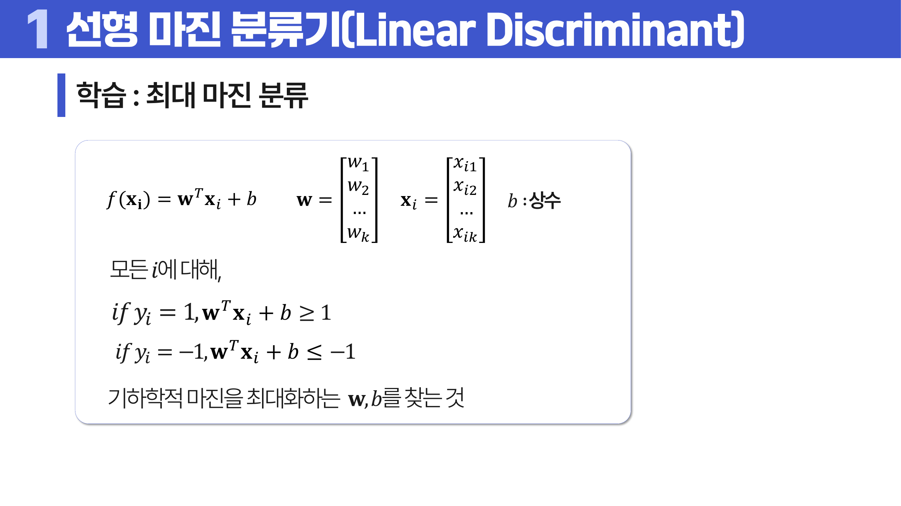
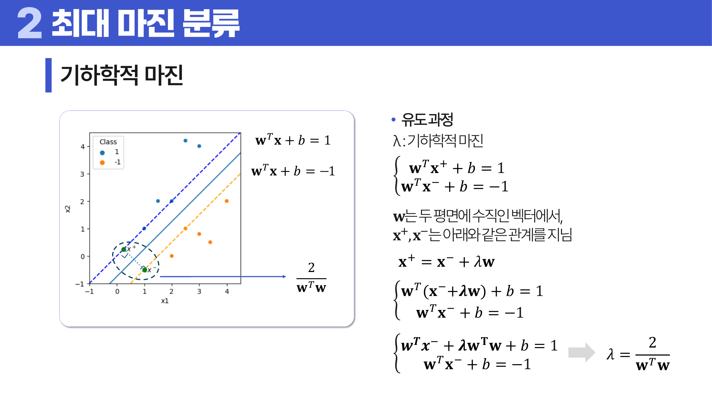
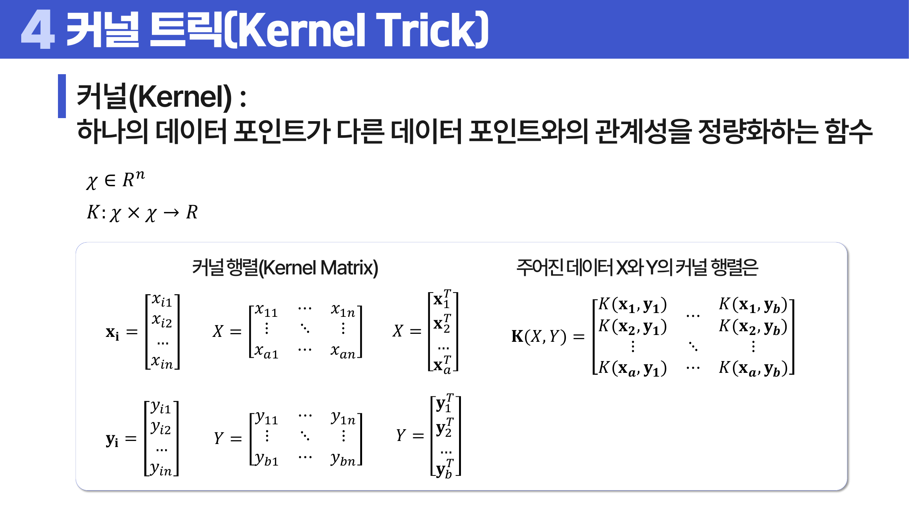
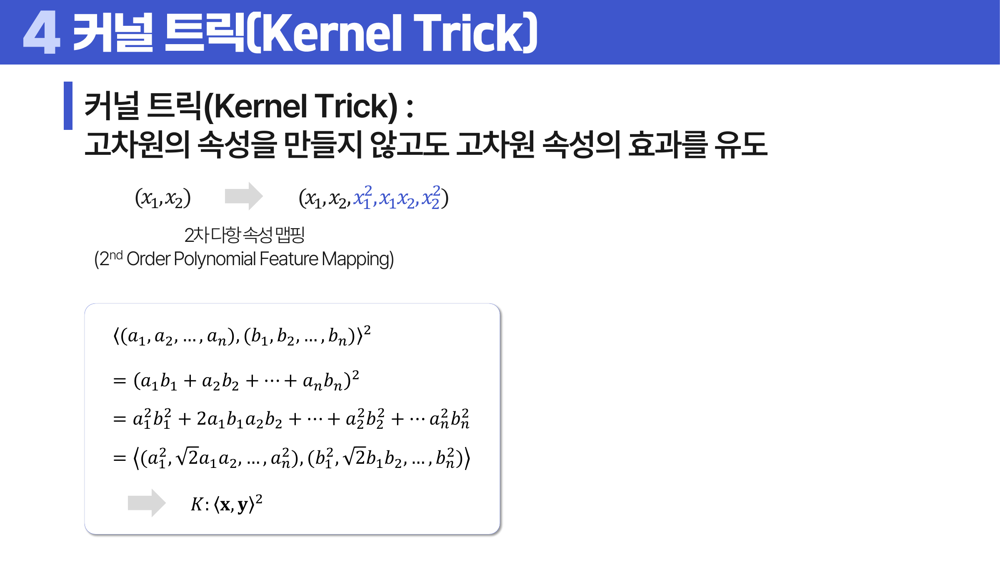

# 14. SVM

## 학습 목표

이 차시를 마치면 다음을 쉬운 말로 설명할 수 있으면 충분하다.

- 마진과 서포트 벡터의 의미를 이해한다.
- C와 슬랙 변수가 선형 분리가 안 되는 상황을 어떻게 다루는지 설명한다.
- 커널 트릭이 고차원 효과를 직접 좌표로 만들지 않고 쓰는 방법임을 이해한다.

## 오늘의 한 줄

SVM은 두 집단 사이에 가능한 한 넓은 여백을 남기는 경계선을 찾는 분류 모델이다.

## 오늘 반드시 이해할 3가지

1. 마진과 서포트 벡터의 의미를 이해한다.
2. C와 슬랙 변수가 선형 분리가 안 되는 상황을 어떻게 다루는지 설명한다.
3. 커널 트릭이 고차원 효과를 직접 좌표로 만들지 않고 쓰는 방법임을 이해한다.

## 이 차시 전에 알면 좋은 것

- **분류**: 두 집단을 나누는 문제
- **거리**: 마진을 경계와 점 사이 거리로 읽기
- **과대적합**: C와 커널이 경계 복잡도를 바꾼다는 감각

## 개념 지도

```text
SVM
├── 선형 분류 함수
├── 최대 마진
├── 서포트 벡터
├── 슬랙과 C
├── 라그랑지안과 쌍대 문제
├── 커널과 커널 트릭
├── 다중 클래스 분류
└── 확인 문제와 해설
```

## 학습 우선순위

- **필수**: 최대 마진의 의미, 서포트 벡터가 경계를 결정한다는 점, C와 커널이 복잡도를 조절한다는 점
- **심화**: 라그랑지안과 쌍대 문제
- **확장**: 커널 행렬과 고차원 내적의 수식 유도

## 이 차시에서 꼭 붙잡을 설명 방식

SVM이 단순히 경계선을 아무렇게나 긋지 않는 이유는 새 데이터 때문이다. 두 집단을 겨우 나누는 선은 작은 흔들림에도 틀릴 수 있다. 가장 가까운 점들과의 여백을 최대화하면 경계가 덜 민감해져 일반화에 도움이 된다.

## 핵심 이론

### 먼저 잡는 직관

- **최대 마진**: SVM은 두 집단을 겨우 나누는 선보다 가장 가까운 점들과의 여백이 넓은 선을 고른다.
- **서포트 벡터**: 경계에서 가장 가까운 점들이 마진을 지탱하므로 멀리 있는 점보다 경계에 더 큰 영향을 준다.
- **슬랙과 C**: 현실 데이터는 완벽히 나뉘지 않으므로 일부 위반을 허용하고 그 위반을 얼마나 벌할지 정한다.
- **커널**: 선형 경계가 부족할 때 고차원에서의 유사도 계산 효과로 더 복잡한 경계를 만든다.

### 1. 선형 분류 함수

SVM의 기본 형태는 선형 함수 `f(x_i) = w^T x_i + b`다. 여기서 `w`는 각 변수에 곱해지는 가중치 벡터, `x_i`는 i번째 데이터의 변수 벡터, `b`는 상수항이다. 예측은 `f(x_i)`의 부호로 정한다. `f(x_i) >= 0`이면 `+1`, `f(x_i) < 0`이면 `-1` 클래스로 본다.

결정경계는 `w^T x + b = 0`이고, 양쪽 마진 경계는 보통 `w^T x + b = 1`, `w^T x + b = -1`로 둔다. 이 표기는 뒤에서 나오는 마진과 최적화식을 한꺼번에 이해하게 해 준다.

### 2. 최대 마진

마진은 결정경계와 가장 가까운 점 사이의 거리다. SVM은 이 마진을 최대화하는 경계를 찾는다.

두 클래스 라벨을 `y_i in {-1, 1}`로 두면 모든 훈련 데이터가 마진 바깥에 있어야 한다는 조건은 `y_i(w^T x_i + b) >= 1`로 쓸 수 있다. 이 조건을 만족할 때 두 마진 경계 사이의 폭은 `2 / ||w||`가 된다. 따라서 마진을 넓힌다는 말은 `||w||`를 작게 만든다는 말과 같고, 계산에서는 `1/2 w^T w`를 최소화하는 문제로 바뀐다.

정리하면 선형 분리가 되는 경우의 hard-margin SVM은 다음 문제다.

```text
minimize    1/2 w^T w
subject to  y_i(w^T x_i + b) >= 1  for every i
```



> **그림 읽기**: 두 집단 사이 여백이 가장 넓은 경계를 고르는 모습을 본다. 경계에 가까운 점들이 결정적으로 중요하다.



> **그림 읽기**: 결정경계와 가장 가까운 점 사이의 실제 거리를 본다. SVM의 목표는 이 거리를 크게 만드는 것이다.

기하학적 마진은 점이 결정경계에서 실제로 얼마나 떨어져 있는지를 보는 값이다. 한 데이터의 부호까지 고려한 거리는 `y_i(w^T x_i + b) / ||w||`로 읽을 수 있다. 마진 경계 `w^T x + b = 1`과 `w^T x + b = -1` 사이의 거리가 `2 / ||w||`이므로, `1/2 w^T w`를 줄이는 최적화식이 나온다.

### 3. 서포트 벡터

경계에 가장 가까워 마진을 결정하는 데이터들이다. 멀리 떨어진 점보다 이 점들이 경계 위치에 더 큰 영향을 준다.

쌍대 문제에서 각 데이터에는 라그랑지안 승수 `alpha_i`가 붙는다. `alpha_i > 0`인 데이터가 서포트 벡터다. soft-margin에서는 `0 < alpha_i < C`인 점은 마진 경계 위의 서포트 벡터, `alpha_i = C`인 점은 마진 안쪽에 들어오거나 오분류된 점으로 해석할 수 있다.

### 4. 슬랙과 C

완벽히 분리되지 않는 데이터에서는 일부 위반을 허용한다. C가 크면 위반을 강하게 벌하고, C가 작으면 더 넓은 마진을 허용한다.

선형 분리가 되지 않을 때는 슬랙 변수 `xi_i`를 둔다. `xi_i`는 각 데이터가 마진 조건을 얼마나 위반했는지 나타내며 항상 `xi_i >= 0`이어야 한다.

```text
y_i(w^T x_i + b) >= 1 - xi_i
xi_i >= 0
minimize 1/2 w^T w + C sum_i xi_i
```

`C`가 클수록 위반을 강하게 벌하므로 학습 데이터를 더 엄격하게 맞추고, 그 대신 기하학적 마진은 좁아질 수 있다. `C`가 작을수록 위반을 더 허용하므로 마진은 넓어질 수 있지만 훈련 데이터 반영 정도는 낮아진다.

### 5. 커널

선형 경계로 나누기 어려운 데이터도 <a id="ref-14-커널"></a>[커널](#note-14-커널)을 쓰면 더 복잡한 경계를 만들 수 있다. Feature mapping은 데이터를 더 높은 차원 특징 공간으로 보낸다고 생각하는 관점이고, 커널 트릭은 그 좌표를 직접 만들지 않고 내적 결과만 계산하는 방법이다. <a id="ref-14-rbf-커널"></a>[RBF 커널](#note-14-rbf-커널)의 <a id="ref-14-gamma"></a>[gamma](#note-14-gamma)가 크면 개별 점의 영향이 좁아져 결정면이 복잡해질 수 있다.

커널은 한 데이터 포인트와 다른 데이터 포인트의 관계성을 정량화하는 함수다. `K(x, y)`는 두 벡터의 유사도를 반환하고, 여러 데이터 쌍의 커널값을 모으면 커널 행렬 `K(X, Y)`가 된다. 선형 커널은 단순 내적 `x^T y`와 같고, 다항 커널은 `(gamma x^T y + b)^d`, RBF 커널은 거리가 가까운 점일수록 큰 값을 주는 방식으로 이해하면 된다. 시그모이드 커널도 SVM에서 사용될 수 있는 커널 중 하나다.

```text
K(X, Y) =
[[K(x1, y1), ..., K(x1, yb)],
 [K(x2, y1), ..., K(x2, yb)],
 ...
 [K(xa, y1), ..., K(xa, yb)]]

Linear: K(x, y) = x^T y
Polynomial: K(x, y) = (gamma x^T y + b)^d
RBF: K(x, y) = exp(-gamma ||x - y||^2)
Sigmoid: K(x, y) = tanh(gamma x^T y + b)
```

RBF의 `gamma`가 클수록 가까운 점만 강하게 영향을 주므로 결정면이 복잡해지기 쉽다. `gamma`가 작으면 한 점의 영향 범위가 넓어져 더 부드러운 경계를 만든다.

직접 2차 다항 feature mapping을 하면 `(x1, x2)`가 `(x1, x2, x1^2, x1 x2, x2^2)`처럼 늘어난다. 변수 수와 차수가 커질수록 차원이 급격히 커지므로, 커널 트릭은 이 고차원 좌표를 실제로 만들지 않고도 내적 효과만 계산한다.



> **그림 읽기**: 데이터 쌍 사이의 유사도를 행렬로 모은 구조를 본다. 좌표를 직접 늘리지 않고 관계를 계산한다.



> **그림 읽기**: 고차원 특징을 실제로 만들지 않고도 그 효과를 계산하는 생각을 본다. 복잡한 경계를 유사도 함수로 만든다.

### 심화. 쌍대 문제는 왜 나오나

라그랑지안 승수와 쌍대 문제는 SVM을 최적화 문제로 이해할 때 등장한다. 처음 학습에서는 수식을 완전히 유도하기보다 “경계를 직접 찾는 문제를 서포트 벡터와 데이터 간 유사도 중심의 문제로 바꾼다” 정도로 잡으면 된다. 이 변환 덕분에 커널을 넣어도 고차원 좌표를 직접 만들지 않고 유사도 계산만으로 학습할 수 있다.

### 라그랑지안, KKT, 커널 요건

SVM은 최대 마진을 직관으로만 설명하지 않고, 제약이 있는 최적화 문제로 정리한다. 핵심은 “모든 훈련 데이터가 마진 조건을 만족해야 한다”는 제약을 두고, 그 제약 아래에서 `||w||`를 작게 만들어 마진을 넓히는 것이다.

라그랑지안 승수법은 제약 조건을 목적함수 안으로 가져오는 방법이다. 각 데이터의 제약에는 `alpha`라는 승수가 붙는다. KKT 조건은 최적해에서 목적함수, 제약, 승수 사이에 어떤 관계가 성립해야 하는지 정리한다. 이 조건 때문에 마진에서 멀리 떨어진 점들은 `alpha = 0`이 되고, 경계에 영향을 주는 점들만 서포트 벡터로 남는다.

hard-margin의 라그랑지안은 `L(w, b, alpha) = 1/2 w^T w + sum_i alpha_i[-y_i(w^T x_i + b) + 1]`로 쓸 수 있다. KKT 조건을 적용하면 정상 조건에서 `w = X^T(alpha o y)`와 `sum_i alpha_i y_i = 0`이 나온다. 여기에 원조건, 쌍대 조건 `alpha_i >= 0`, 여부등 조건 `alpha_i[-y_i(w^T x_i + b) + 1] = 0`을 함께 만족해야 한다.

이 조건을 이용하면 원문제는 `alpha`를 찾는 쌍대 문제로 바뀐다.

```text
maximize    sum_i alpha_i - 1/2 (alpha o y)^T X X^T (alpha o y)
subject to  sum_i alpha_i y_i = 0
            alpha_i >= 0
```

soft-margin에서는 슬랙 변수 때문에 `0 <= alpha_i <= C`가 추가된다. 마진 경계 위의 서포트 벡터를 이용하면 `b`도 구할 수 있고, 커널을 쓰는 경우에는 `X X^T` 자리에 커널 행렬 `K(X, X)`를 넣는다. 예측식도 `f(x) = (alpha o y)^T K(X, x) + b`로 읽으면 된다. 선형 커널이면 다시 `f(x) = w^T x + b`가 된다.

```text
Support Vectors = {x_i | alpha_i > 0}
Support Vectors on Margin Plane = {x_i | 0 < alpha_i < C}

b* = (1 / N_svmp) * sum_{i in SVMP}
     [y_i - (alpha o y)^T K(X, x_i)]

f(x) = (alpha o y)^T K(X, x) + b*
```

선형 분리가 되지 않는 현실 데이터에서는 슬랙 변수 `xi`가 들어간다. `xi`는 마진을 얼마나 위반했는지 나타내고, `C`는 그 위반을 얼마나 강하게 벌할지 정한다. 따라서 `C`는 단순 성능 버튼이 아니라 `마진을 넓게 둘 것인가`, `훈련 오류를 더 줄일 것인가` 사이의 균형이다.

커널은 아무 유사도 함수나 쓰는 것이 아니다. 수학적으로 필요한 요건은 대칭성과 양의 준정성이다. 대칭성은 `K(x, y)`와 `K(y, x)`가 같아야 한다는 뜻이고, 양의 준정성은 커널 행렬이 어떤 벡터와 곱해져도 음의 제곱거리처럼 행동하지 않아야 한다는 조건이다. 이 조건이 있어야 커널이 어떤 고차원 공간의 내적처럼 해석될 수 있다.

```text
symmetry: K(x, y) = K(y, x)
positive semi-definite: for every c in R^n, c^T K c >= 0
```

예를 들어 RBF 커널의 `gamma`를 잘못 잡아 커널 요건을 깨뜨리면 SVM의 쌍대 최적화가 정상적인 내적 공간 문제로 해석되지 않는다. 그래서 커널 공식과 하이퍼파라미터 범위를 함께 확인해야 한다.

다중 클래스 문제에서는 단일 SVM이 기본적으로 이진 분류기라는 점을 기억해야 한다. 여러 개의 SVM을 조합해 한 클래스와 나머지를 비교하는 One-vs-Rest(OVR), 두 클래스씩 비교하는 One-vs-One(OVO) 방식으로 확장한다.

SVM의 장점은 고차원 데이터와 중소 규모 데이터에서 강한 분류 성능을 낼 수 있고, 커널을 통해 비선형 경계까지 다룰 수 있다는 점이다. 단점은 스케일과 커널, `C`, `gamma` 선택에 민감하고, 데이터가 매우 커지면 학습이 느려질 수 있으며, 결정경계의 해석이 선형 회귀만큼 직관적이지 않을 수 있다는 점이다.

## 판단 기준

1. 데이터를 선형 경계로 충분히 나눌 수 있는지 먼저 본다.
2. 마진을 결정하는 <a id="ref-14-서포트-벡터"></a>[서포트 벡터](#note-14-서포트-벡터)가 어떤 점들인지 확인한다.
3. C가 커질수록 위반을 덜 허용하고 과대적합 위험이 커질 수 있음을 본다.
4. 커널과 gamma가 결정경계 복잡도에 미치는 영향을 그림으로 확인한다.
5. 특징 스케일이 SVM 거리 계산에 영향을 주므로 <a id="ref-14-표준화"></a>[표준화](#note-14-표준화)를 고려한다.
6. 다중 클래스라면 OVR 또는 OVO처럼 여러 이진 SVM을 조합하는 구조인지 확인한다.

## 오해와 반례

### 오해 1. SVM은 모든 데이터를 똑같이 중요하게 본다.

결정경계는 주로 서포트 벡터에 의해 정해진다. 멀리 떨어진 점은 영향이 작다.

### 오해 2. C가 클수록 항상 좋다.

C가 크면 훈련 데이터 위반을 강하게 벌해 과대적합 위험이 커질 수 있다.

### 오해 3. 커널은 데이터를 실제로 고차원에 전부 만든다.

커널 트릭은 고차원 내적 효과를 함수 계산으로 대신한다.

## 예시 풀이

### 예시 1. 두 클래스 사이 여백 고르기

여러 직선이 두 클래스를 나눌 수 있어도 가장 가까운 점들과의 거리가 큰 직선이 작은 흔들림에 더 강하다.

### 예시 2. RBF gamma가 큰 경우

각 점의 영향 범위가 좁아져 결정경계가 복잡해질 수 있다. 훈련 데이터에는 잘 맞지만 새 데이터에는 약할 수 있다.

## 오늘의 요약 5줄

1. SVM은 두 집단 사이에 가능한 한 넓은 여백을 남기는 결정경계를 찾는다.
2. 서포트 벡터는 경계를 지탱하는 가까운 데이터라서 모델 이름의 핵심이다.
3. 슬랙 변수는 완벽히 분리되지 않는 데이터에서 마진 위반을 수치로 표현한다.
4. C는 마진 위반을 얼마나 강하게 벌할지 조절한다.
5. 커널 트릭은 고차원 특징을 직접 만들지 않고도 복잡한 경계를 쓰게 해 준다.

## 확인 문제

1. 마진을 최대화하는 이유를 설명하라.
2. 서포트 벡터가 중요한 이유를 설명하라.
3. 슬랙 변수의 역할을 설명하라.
4. C가 커질 때와 작아질 때의 차이를 설명하라.
5. 커널 트릭의 직관을 설명하라.
6. RBF 커널의 gamma가 너무 크면 어떤 문제가 생길 수 있는가?
7. 왜 SVM은 가장 가까운 점들에 특히 민감한가?
8. 왜 C가 크다고 항상 좋은 것은 아닌가?
9. 라그랑지안 승수와 KKT 조건이 SVM에서 하는 역할을 설명하라.
10. 커널 함수가 대칭성과 양의 준정성을 만족해야 하는 이유를 설명하라.
11. SVM의 선형 분류 함수 `f(x) = w^T x + b`에서 예측 클래스는 어떻게 정해지는가?
12. hard-margin SVM에서 `1/2 w^T w`를 최소화하는 이유를 설명하라.
13. soft-margin SVM에서 `0 <= alpha_i <= C`가 의미하는 바를 설명하라.
14. 커널을 쓰는 쌍대 문제에서 `X X^T`가 무엇으로 바뀌는가?
15. 다중 클래스 분류에서 OVR과 OVO의 차이를 설명하라.
16. Linear, Polynomial, RBF, Sigmoid 커널 공식을 쓰고 `gamma`가 결정경계에 미치는 영향을 설명하라.
17. 마진 경계 위 서포트 벡터로 `b*`와 커널 예측식 `f(x)`를 계산하는 구조를 설명하라.

## 개념 주석

본문에서 연결된 개념을 잠깐 확인하는 공간이다. 용어를 누르면 본문에서 처음 표시된 위치로 돌아간다.

- <a id="note-14-커널"></a>[커널](#ref-14-커널): 두 데이터의 유사도를 계산하는 함수.
- <a id="note-14-rbf-커널"></a>[RBF 커널](#ref-14-rbf-커널): 가까운 점의 영향은 크게, 먼 점의 영향은 작게 보는 커널.
- <a id="note-14-gamma"></a>[gamma](#ref-14-gamma): RBF 커널에서 한 점의 영향 범위를 조절하는 값.
- <a id="note-14-서포트-벡터"></a>[서포트 벡터](#ref-14-서포트-벡터): 마진을 결정하는 경계 가까운 데이터.
- <a id="note-14-표준화"></a>[표준화](#ref-14-표준화): 평균을 0, 표준편차를 1 기준으로 맞추는 변환. ([처음 설명된 차시](../03-data-transformation/README.md#2-정규화와-표준화))
