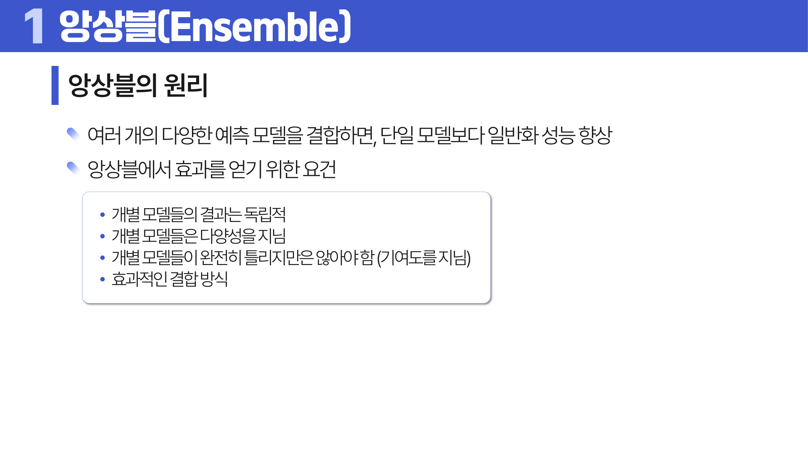
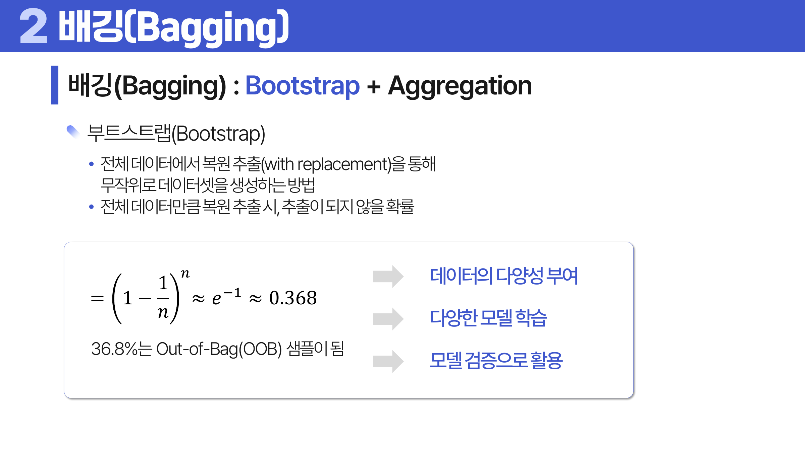
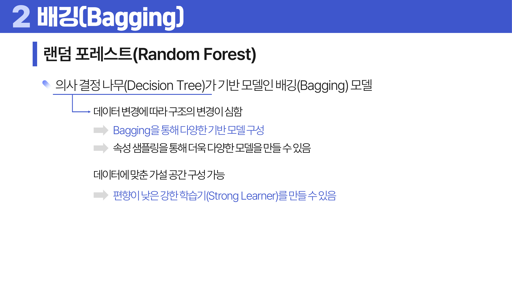
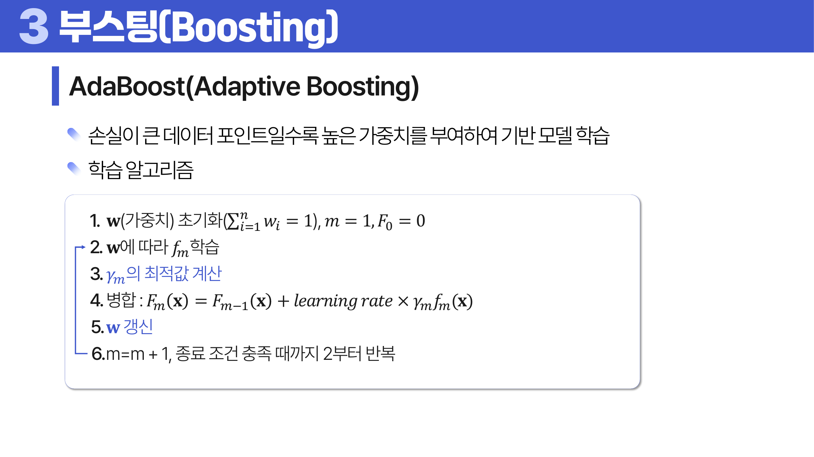
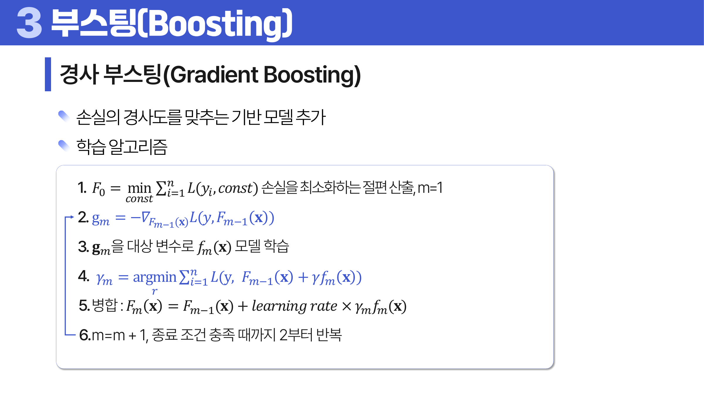

# 15. 앙상블 모델

## 학습 목표

이 차시를 마치면 다음을 쉬운 말로 설명할 수 있으면 충분하다.

- 배깅과 부스팅의 차이를 설명한다.
- 랜덤 포레스트가 의사결정나무와 배깅을 결합한 모델임을 이해한다.
- 보팅과 스태킹처럼 서로 다른 모델을 결합하는 방법을 구분한다.

## 오늘의 한 줄

앙상블은 여러 약한 모델의 판단을 결합해 하나의 모델보다 안정적인 예측을 얻는 방법이다.

## 오늘 반드시 이해할 3가지

1. 배깅과 부스팅의 차이를 설명한다.
2. 랜덤 포레스트가 의사결정나무와 배깅을 결합한 모델임을 이해한다.
3. 보팅과 스태킹처럼 서로 다른 모델을 결합하는 방법을 구분한다.

## 이 차시 전에 알면 좋은 것

- **의사결정나무**: 랜덤 포레스트와 부스팅의 기본 학습기
- **과대적합**: 여러 모델을 합쳐 흔들림을 줄이는 이유
- **검증**: 앙상블도 새 데이터 성능으로 평가해야 한다

## 개념 지도

```text
앙상블 모델
├── 배깅
├── 랜덤 포레스트
├── 부스팅
├── 보팅과 스태킹
└── 확인 문제와 해설
```

## 학습 우선순위

- **필수**: 배깅은 분산 감소에 강함, 부스팅은 순차적 오류 보완, 랜덤 포레스트는 데이터와 변수 무작위성을 함께 사용
- **심화**: AdaBoost와 Gradient Boosting의 보완 신호 차이
- **확장**: 스태킹의 out-of-fold 예측 설계

## 이 차시에서 꼭 붙잡을 설명 방식

<a id="ref-15-앙상블"></a>[앙상블](#note-15-앙상블)이 항상 좋아지는 것은 아니다. 서로 똑같이 틀리는 모델을 많이 모아도 오류가 줄지 않는다. 효과를 얻으려면 모델들이 어느 정도 잘 맞히면서도 서로 다른 방식으로 틀려야 한다. 다양성이 핵심이다.

## 핵심 이론

### 먼저 잡는 직관

- **배깅**: 여러 데이터 샘플로 비슷한 모델을 따로 학습시켜 평균이나 투표로 흔들림을 줄인다.
- **랜덤 포레스트**: 나무마다 데이터와 변수 선택을 다르게 해 서로 다른 판단을 만든 뒤 투표한다.
- **부스팅**: 앞 모델이 틀린 부분에 다음 모델이 더 집중하면서 순서대로 약점을 보완한다.
- **보팅과 스태킹**: 보팅은 모델들의 표를 단순 결합하고, 스태킹은 다른 모델의 예측을 새 입력으로 다시 학습한다.

### 1. 배깅

<a id="ref-15-부트스트랩"></a>[부트스트랩](#note-15-부트스트랩) <a id="ref-15-표본"></a>[표본](#note-15-표본)을 여러 개 만들고 각 표본으로 모델을 학습한 뒤 평균이나 투표로 합친다. 분산을 줄이는 데 강하다.



> **그림 읽기**: 여러 모델이 서로 다른 실수를 할 때 결합 효과가 커지는 이유를 본다. 다양성과 기본 성능이 모두 필요하다.



> **그림 읽기**: 복원추출로 만든 여러 데이터셋과 모델을 합치는 흐름을 본다. 평균과 투표가 흔들림을 줄인다.

### 2. 랜덤 포레스트

<a id="ref-15-의사결정나무"></a>[의사결정나무](#note-15-의사결정나무)를 많이 만들되 표본과 <a id="ref-15-변수"></a>[변수](#note-15-변수) 선택에 무작위성을 넣는다. 나무들이 서로 달라져 앙상블 효과가 커진다.



> **그림 읽기**: 여러 트리에 데이터와 변수 무작위성을 넣는 구조를 본다. 서로 다른 트리를 만들어 앙상블 효과를 높인다.

### 3. 부스팅

앞 모델이 틀린 부분을 다음 모델이 더 신경 쓰게 만들어 순차적으로 오류를 줄인다. 성능은 강하지만 과적합 관리가 중요하다.

AdaBoost는 틀린 데이터의 가중치를 키워 다음 모델이 그 데이터를 더 신경 쓰게 만든다. 경사 부스팅은 현재 모델이 남긴 잔차나 손실이 줄어드는 방향을 다음 모델이 맞추는 방식이다. 둘 다 “약한 모델을 순서대로 보완한다”는 큰 틀은 같지만, 무엇을 보완 신호로 삼는지가 다르다.



> **그림 읽기**: 틀린 데이터의 가중치를 키워 다음 모델이 더 신경 쓰게 하는 흐름을 본다. 순차적 보완이 boost의 핵심이다.



> **그림 읽기**: 이전 모델이 남긴 오차를 다음 모델이 맞추는 흐름을 본다. 경사 부스팅은 약한 모델을 더해 손실이 줄어드는 방향으로 보완한다.

### 4. 보팅과 스태킹

보팅은 모델들의 예측을 직접 투표하거나 평균한다. 스태킹은 여러 모델의 예측을 다시 입력으로 사용해 최종 모델을 학습한다.

### 5. Hard/Soft Voting과 Gradient Boosting

보팅은 hard voting과 soft voting으로 나눈다. Hard voting은 각 모델이 고른 클래스에 투표해 다수결로 정한다. Soft voting은 각 모델이 낸 클래스 확률을 평균한 뒤 가장 높은 확률의 클래스를 고른다. 확률이 잘 보정된 모델들이라면 soft voting이 더 많은 정보를 쓸 수 있다.

AdaBoost는 틀린 샘플의 가중치를 키우고, 다음 약한 학습기가 그 샘플을 더 신경 쓰도록 만든다. 최종 예측에서는 각 약한 학습기의 성능에 따라 투표 가중치도 달라진다. Gradient Boosting은 손실함수를 직접 보고, 현재 모델이 줄여야 할 방향을 다음 모델이 맞춘다. 회귀에서는 잔차를 맞추는 직관으로 이해할 수 있고, 일반 손실에서는 음의 기울기를 맞춘다고 보면 된다.

스태킹은 강력하지만 데이터 누수가 가장 흔한 실수다. 1단계 모델이 이미 학습에 사용한 행의 예측값으로 2단계 모델을 학습하면 실제보다 좋은 성능이 나온다. 그래서 out-of-fold 예측으로 2단계 학습 데이터를 만들어야 한다.

## 판단 기준

1. 여러 모델이 서로 충분히 다른 실수를 하는지 확인한다.
2. <a id="ref-15-배깅"></a>[배깅](#note-15-배깅)은 분산 감소, <a id="ref-15-부스팅"></a>[부스팅](#note-15-부스팅)은 편향 감소에 더 초점이 있음을 구분한다.
3. <a id="ref-15-랜덤-포레스트"></a>[랜덤 포레스트](#note-15-랜덤-포레스트)의 나무 수, 깊이, 변수 샘플링 설정을 확인한다.
4. 부스팅은 학습률과 반복 수가 과대적합에 미치는 영향을 본다.
5. 스태킹은 검증 데이터 누수가 생기지 않도록 out-of-fold 예측을 사용한다. out-of-fold는 해당 행을 학습에 쓰지 않은 fold의 모델로 만든 예측값이라는 뜻이다.

## 오해와 반례

### 오해 1. 모델을 많이 합치면 항상 좋아진다.

서로 비슷하게 틀리는 모델을 많이 모으면 효과가 작다. 다양성이 필요하다.

### 오해 2. 배깅과 부스팅은 같은 방식이다.

배깅은 병렬적으로 분산을 줄이고, 부스팅은 순차적으로 오류를 보완한다.

### 오해 3. 랜덤 포레스트는 해석이 항상 쉽다.

개별 트리보다 안정적이지만 많은 트리를 합치므로 전체 의사결정은 덜 직관적일 수 있다.

## 예시 풀이

### 예시 1. 랜덤 포레스트로 고객 이탈 예측

여러 나무가 서로 다른 표본과 변수 조합을 보고 예측한다. 최종 예측은 다수결이나 <a id="ref-15-평균"></a>[평균](#note-15-평균)으로 결정된다.

### 예시 2. 부스팅에서 어려운 데이터에 집중

앞 모델이 틀린 데이터에 다음 모델이 더 신경 쓰면 점차 약점을 보완할 수 있다.

## 오늘의 요약 5줄

1. 앙상블은 여러 모델의 판단을 결합해 더 안정적인 예측을 얻는 방법이다.
2. 배깅은 데이터를 다르게 뽑아 병렬 모델을 만들고 평균으로 흔들림을 줄인다.
3. 랜덤 포레스트는 배깅에 변수 무작위성을 더한 의사결정나무 앙상블이다.
4. 부스팅은 이전 모델의 오류를 다음 모델이 보완하도록 순차적으로 학습한다.
5. 앙상블도 다양성이 부족하거나 검증 설계가 잘못되면 성능이 좋아지지 않는다.

## 확인 문제

1. 앙상블이 성능을 높일 수 있는 이유를 설명하라.
2. 배깅과 부스팅의 차이를 설명하라.
3. 랜덤 포레스트에서 변수를 무작위로 고르는 이유를 설명하라.
4. 부스팅이 과대적합될 수 있는 이유를 설명하라.
5. 보팅과 스태킹의 차이를 설명하라.
6. 앙상블 모델의 해석이 어려워질 수 있는 이유를 설명하라.
7. 왜 배깅은 분산을 줄이는 데 도움이 되는가?
8. 왜 boosting은 “boost”라는 이름처럼 약한 모델을 강하게 만들 수 있는가?
9. Hard voting과 Soft voting의 차이를 설명하라.
10. Gradient Boosting이 잔차 또는 손실의 기울기를 학습한다는 뜻을 설명하라.

## 개념 주석

본문에서 연결된 개념을 잠깐 확인하는 공간이다. 용어를 누르면 본문에서 처음 표시된 위치로 돌아간다.

- <a id="note-15-앙상블"></a>[앙상블](#ref-15-앙상블): 여러 모델을 결합해 하나의 예측을 만드는 방법.
- <a id="note-15-부트스트랩"></a>[부트스트랩](#ref-15-부트스트랩): 원 데이터에서 복원추출로 만든 표본.
- <a id="note-15-표본"></a>[표본](#ref-15-표본): 전체 대신 관찰한 일부 대상. ([처음 설명된 차시](../04-statistics-probability/README.md#2-모집단과-표본))
- <a id="note-15-의사결정나무"></a>[의사결정나무](#ref-15-의사결정나무): 질문을 따라 가지를 내려가며 예측하는 트리 모델. ([처음 설명된 차시](../13-nonparametric-models/README.md#1-의사결정나무-구조))
- <a id="note-15-변수"></a>[변수](#ref-15-변수): 관측 대상의 특징을 적어 둔 열. ([처음 설명된 차시](../01-data-understanding/README.md#4-단위-변수-관측치))
- <a id="note-15-배깅"></a>[배깅](#ref-15-배깅): 부트스트랩 표본으로 여러 모델을 독립적으로 학습해 합치는 방식.
- <a id="note-15-부스팅"></a>[부스팅](#ref-15-부스팅): 이전 모델의 오류를 다음 모델이 보완하는 순차 앙상블.
- <a id="note-15-랜덤-포레스트"></a>[랜덤 포레스트](#ref-15-랜덤-포레스트): 무작위성을 넣은 의사결정나무 여러 개의 앙상블.
- <a id="note-15-평균"></a>[평균](#ref-15-평균): 모든 값을 더해 개수로 나눈 대표값. ([처음 설명된 차시](../04-statistics-probability/README.md#4-중심-경향))
