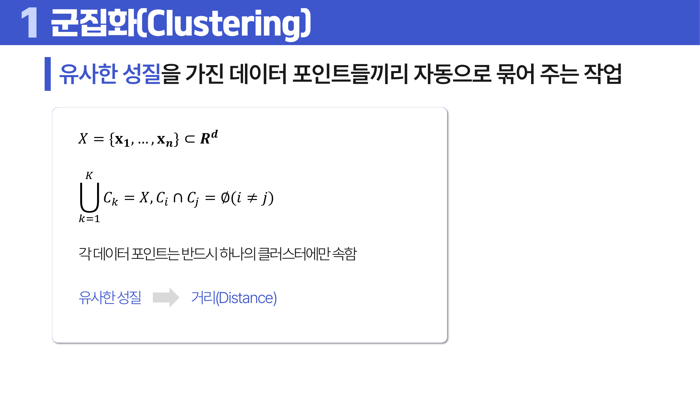
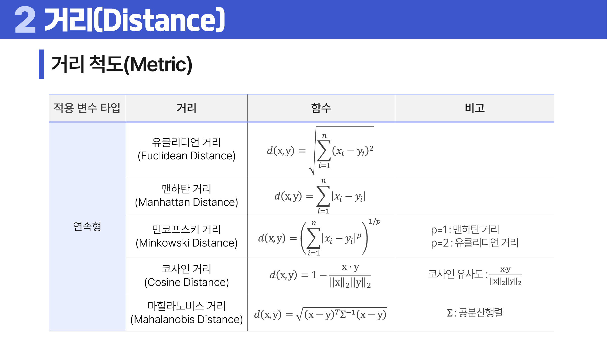
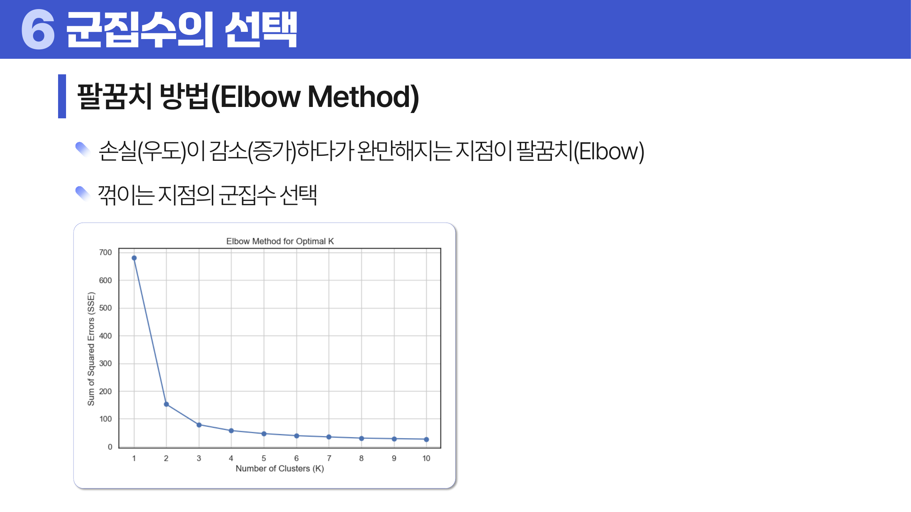
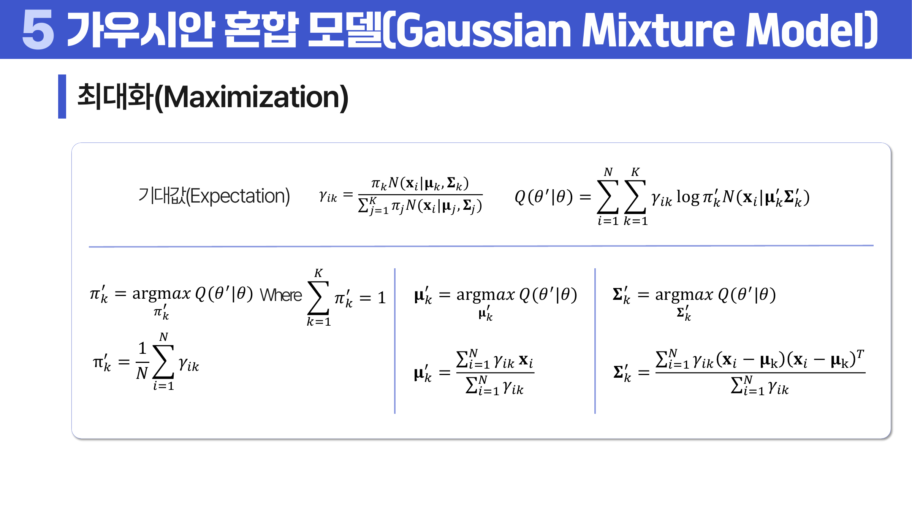
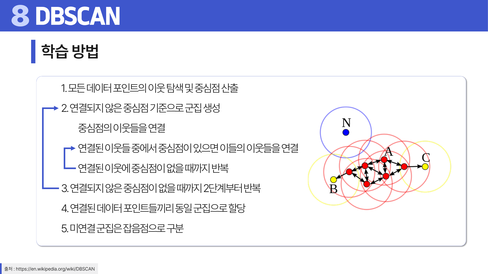

# 16. 군집화

## 학습 목표

이 차시를 마치면 다음을 쉬운 말로 설명할 수 있으면 충분하다.

- 거리 척도가 군집 결과를 바꾼다는 점을 이해한다.
- k-means, k-medoids, GMM의 차이를 설명한다.
- 계층적 군집화와 DBSCAN이 어떤 상황에 맞는지 구분한다.

## 오늘의 한 줄

군집화는 정답 라벨 없이 비슷한 데이터끼리 자동으로 묶어 구조를 찾는 방법이다.

## 오늘 반드시 이해할 3가지

1. 거리 척도가 군집 결과를 바꾼다는 점을 이해한다.
2. k-means, k-medoids, GMM의 차이를 설명한다.
3. 계층적 군집화와 DBSCAN이 어떤 상황에 맞는지 구분한다.

## 이 차시 전에 알면 좋은 것

- **비지도학습**: 정답 없이 구조를 찾는 관점 ([처음 설명된 차시](../11-machine-learning/README.md#1-학습-유형))
- **거리**: 비슷함을 숫자로 재는 기준
- **스케일링**: 거리 계산이 변수 단위에 영향을 받는 문제

## 개념 지도

```text
군집화
├── 군집화의 정의
├── 거리 척도
├── k-means와 k-medoids
├── GMM
├── 계층적 군집화와 DBSCAN
└── 확인 문제와 해설
```

## 학습 우선순위

- **필수**: 거리 척도가 군집 결과를 바꾼다는 점, k-means의 k 선택과 초기값 민감성, DBSCAN이 밀도와 잡음을 본다는 점
- **심화**: GMM의 부드러운 소속 확률
- **확장**: 계층적 군집화의 linkage 선택

## 이 차시에서 꼭 붙잡을 설명 방식

<a id="ref-16-군집화"></a>[군집화](#note-16-군집화)에서 “가깝다”는 말은 자연스럽지만 사실 정의가 필요하다. 키와 몸무게를 그대로 쓰면 몸무게 단위가 더 크게 작용할 수 있고, 텍스트 벡터에서는 방향이 더 중요할 수 있다. 그래서 <a id="ref-16-거리-척도"></a>[거리 척도](#note-16-거리-척도)와 스케일링이 군집 결과를 좌우한다.

## 핵심 이론

### 먼저 잡는 직관

- **거리 척도**: 군집화는 “가깝다”의 정의에 크게 의존하므로 거리 척도와 스케일링이 결과를 바꾼다.
- **k-means와 k-medoids**: k-means는 평균 중심을 움직이고, k-medoids는 실제 데이터 대표점을 중심으로 삼는다.
- **GMM**: 각 군집을 하나의 정규분포로 보고, 한 점이 여러 군집에 속할 확률을 함께 계산한다.
- **계층적 군집화와 DBSCAN**: 계층적 방법은 묶이는 순서를 보고, DBSCAN은 밀도가 높은 지역을 군집으로 본다.

### 1. 군집화의 정의와 거리 척도

군집화는 유사한 성질을 가진 데이터 포인트를 자동으로 묶는 작업이다. 데이터 집합을 `X = {x_1, ..., x_n}`이라고 하면, K개의 군집 `C_1, ..., C_K`는 전체 데이터를 빠짐없이 덮고 서로 겹치지 않아야 한다. 즉 각 데이터 포인트는 반드시 하나의 군집에 속한다.

두 데이터 포인트의 차이를 수치화한 값이 거리다. 거리가 작을수록 두 데이터는 유사하고, 거리가 클수록 차이가 크다고 본다. 거리로 쓰려면 보통 네 가지 성질을 확인한다. 거리는 음수가 아니어야 하고, 같은 점 사이 거리는 0이어야 하며, `d(x, y) = d(y, x)`인 대칭성을 가져야 하고, 한 점을 거쳐 가는 길이 직접 가는 길보다 짧아서는 안 된다는 삼각부등식을 만족해야 한다.

유클리디언, 맨해튼, 코사인, 마할라노비스 거리 등은 가까움을 다르게 정의한다. <a id="ref-16-변수"></a>[변수](#note-16-변수) 타입과 질문에 맞게 고른다. 범주형 변수에는 해밍 거리와 자카드 거리를 쓸 수 있고, 연속형 변수에는 유클리디언, 맨해튼, 민코프스키, 코사인, 마할라노비스 거리를 자주 비교한다.



> **그림 읽기**: 정답 없이 비슷한 점끼리 묶는 구조를 본다. 가까움의 정의가 군집 결과를 만든다.



> **그림 읽기**: 같은 데이터도 거리 정의에 따라 가깝고 멂이 달라진다. 변수 타입과 질문에 맞는 거리를 골라야 한다.

### 2. k-means와 k-medoids

k-means는 <a id="ref-16-평균"></a>[평균](#note-16-평균) 중심을 쓰고 유클리디언 거리에 적합하다. k-medoids는 실제 데이터 대표점을 쓰며 다양한 거리 <a id="ref-16-척도"></a>[척도](#note-16-척도)에 더 유연하다.

k-means는 K개의 중심점 `mu_1, ..., mu_K`를 기준으로 각 데이터 `x_i`를 가장 가까운 중심점의 군집에 할당한다. 학습은 중심점 초기화, 군집 할당, 중심점 갱신을 반복한다. 중심점 갱신은 해당 군집에 속한 점들의 평균 `mu_k = 1/|C_k| sum_{x_i in C_k} x_i`로 한다. 이 과정은 응집도 `Inertia = sum_k sum_{x_i in C_k} ||x_i - mu_k||^2`를 낮추는 방향이다.

k-means는 greedy하게 움직이므로 지역 최적점이 여러 개 존재하고, 초기 중심점에 따라 결과가 달라질 수 있다. 그래서 여러 번 실행한 뒤 가장 좋은 응집도 결과를 선택한다. 기본 k-means는 유클리디언 거리 기반이라 구형 군집에 잘 맞고, 데이터의 분산·밀도·구조에 민감하다.

k-medoids는 중심점 대신 실제 데이터 포인트 중 대표점 `m_k`를 고른다. 각 데이터는 `distance(x_i, m_k)`가 가장 작은 대표점의 군집에 할당되고, 목표는 `Total Cost = sum_k sum_{x_i in C_k} distance(x_i, m_k)`를 낮추는 것이다. 대표점 갱신에서는 군집 안의 다른 점들과의 총거리가 가장 작은 실제 데이터 포인트를 새 대표점으로 고른다. k-means가 유클리디언 거리에 고정되는 반면, k-medoids는 거리 척도를 선택할 수 있다.

k를 고를 때는 elbow 방법이나 <a id="ref-16-실루엣"></a>[실루엣](#note-16-실루엣) 점수를 참고한다. 실루엣은 같은 군집 안에서는 얼마나 가깝고, 다른 군집과는 얼마나 떨어져 있는지를 함께 본다. 다만 점수가 높아도 업무적으로 해석하기 어려운 군집이면 좋은 결과라고 보기 어렵다.



> **그림 읽기**: 군집 수가 늘 때 손실 감소가 완만해지는 지점을 본다. 팔꿈치는 후보일 뿐 해석 가능성과 함께 판단한다.

### 3. GMM

각 군집을 가우시안 <a id="ref-16-분포"></a>[분포](#note-16-분포)로 보고, 한 점이 각 군집에 속할 확률을 계산한다. 딱 잘라 배정하지 않고 부드러운 소속을 다룰 수 있다.

GMM은 `GMM = {(pi_1, mu_1, Sigma_1), ..., (pi_K, mu_K, Sigma_K)}`처럼 각 군집을 혼합비 `pi_k`, 평균벡터 `mu_k`, 공분산행렬 `Sigma_k`로 표현한다. 전체 확률밀도는 `p(x) = sum_k pi_k N(x | mu_k, Sigma_k)`이고, 데이터 `x_i`는 `pi_k N(x_i | mu_k, Sigma_k)`가 가장 큰 군집에 배정할 수 있다.

다변량 가우시안 분포에서 `mu_k`는 d차원 평균벡터, `Sigma_k`는 d x d 공분산행렬이다. 공분산행렬을 쓰기 때문에 GMM은 k-means보다 타원형 군집을 더 자연스럽게 표현할 수 있다.



> **그림 읽기**: 한 점이 여러 군집에 속할 확률을 갖는 부드러운 배정을 본다. 딱 자르는 군집화와 다르다.

### 4. 계층적 군집화와 DBSCAN

계층적 군집화는 합쳐지는 구조를 보고, DBSCAN은 밀도가 높은 곳을 군집으로 본다. DBSCAN은 <a id="ref-16-이상치"></a>[이상치](#note-16-이상치) 탐지에도 유용하다.

계층적 군집화는 군집 간 유사도를 기반으로 군집을 결합하거나 분할해 계층 구조를 만든다. 병합형(Agglomerative)은 모든 데이터 포인트를 각각 하나의 군집으로 시작한 뒤 가까운 군집을 차례로 합친다. 분할형(Divisive)은 전체를 하나의 군집으로 보고 나누어 간다. 실무에서는 대부분 병합형을 사용한다.

병합형의 학습 흐름은 모든 점을 개별 군집으로 두기, 군집 간 결합 기준값(Linkage) 계산, 기준값이 가장 작은 두 군집 결합, 목표 군집 수나 임계치에 도달할 때까지 반복이다. Linkage 방식에는 Single, Complete, Average, Ward가 있다. Ward는 군집을 합쳤을 때 군집 내부 분산 증가가 작도록 결합하는 방식으로 이해하면 된다.



> **그림 읽기**: 밀도가 높은 점들을 연결해 군집을 만들고 나머지를 잡음으로 보는 흐름을 본다. eps와 min_samples가 핵심 설정이다.

DBSCAN은 밀도 기반 군집화다. 입실론 반경(epsilon radius, `eps`)은 이웃으로 볼 최소 반경이고, 중심점 최소 이웃 수(`min_samples`)는 중심점이 되기 위해 필요한 이웃 수다. 중심점(core point)은 eps 안에 충분한 이웃이 있는 점, 경계점(border point)은 중심점의 이웃이지만 스스로는 중심점 조건을 만족하지 못하는 점, 잡음점(noise point)은 어떤 밀집 군집에도 연결되지 않는 점이다.

학습은 모든 데이터의 이웃을 탐색해 중심점을 찾고, 아직 연결되지 않은 중심점을 기준으로 군집을 만든다. 중심점의 이웃을 연결하고, 연결된 이웃 중 중심점이 있으면 그 중심점의 이웃도 계속 연결한다. 더 연결할 중심점이 없을 때까지 반복한 뒤, 연결된 데이터는 같은 군집으로 할당하고 연결되지 않은 점은 잡음점으로 둔다.

### 5. 거리와 군집 평가

거리 척도는 여러 종류로 구분한다. 유클리디언 거리는 직선거리라 좌표형 수치 데이터에 자연스럽고, 맨해튼 거리는 축을 따라 이동하는 거리라 격자형 이동을 떠올리면 쉽다. 민코프스키 거리는 `p = 2`일 때 유클리디언 거리와 같아지는 더 일반적인 거리 family로 볼 수 있다. 코사인 거리는 크기보다 방향의 유사성을 보므로 문서 벡터처럼 전체 크기가 덜 중요한 데이터에 자주 쓰인다. 다만 삼각부등식을 만족하지 않아 엄밀한 metric은 아니다. 마할라노비스 거리는 공분산행렬을 이용해 각 차원의 스케일뿐 아니라 변수 간 상관관계까지 반영한다.

GMM은 다변량 가우시안 분포를 군집으로 보고 EM으로 학습한다. E-step에서는 각 점이 각 군집에 속할 확률을 계산하고, M-step에서는 그 확률을 가중치로 써서 평균, 공분산, 혼합비를 갱신한다. k-means가 딱딱한 배정이라면 GMM은 부드러운 확률 배정이다.

E-step의 책임도는 `gamma_ik = pi_k N(x_i | mu_k, Sigma_k) / sum_j pi_j N(x_i | mu_j, Sigma_j)`다. M-step에서는 `mu_k`를 `sum_i gamma_ik x_i / sum_i gamma_ik`로, `Sigma_k`를 `sum_i gamma_ik (x_i - mu_k)(x_i - mu_k)^T / sum_i gamma_ik`로, `pi_k`를 `1/N sum_i gamma_ik`로 갱신한다. 이 과정을 기대값 계산과 최대화가 번갈아 일어난다고 해서 EM 알고리즘이라고 부른다.

계층적 군집화의 linkage는 군집 사이 거리를 어떻게 잴지 정한다. 단일 연결은 가장 가까운 점끼리, 완전 연결은 가장 먼 점끼리, 평균 연결은 모든 점 쌍 거리의 평균을 본다. 병합 순서는 덴드로그램(dendrogram)으로 읽는다. DBSCAN은 군집 수를 미리 정하지 않지만 eps와 min_samples에 민감하므로, “자동으로 정답을 찾는다”고 해석하면 안 된다.

계층적 군집화는 군집 수를 사전에 고정하지 않고 덴드로그램이나 결합 임계값으로 나중에 정할 수 있다는 장점이 있지만, 큰 데이터셋에는 계산량이 커져 비효율적일 수 있다. 기본적인 군집 간 거리 계산은 대략 `O(n^2)` 규모로 부담이 커질 수 있다.

## 판단 기준

1. 군집화 목적이 탐색인지, 세그먼트 운영인지 먼저 정한다.
2. 거리 척도와 변수 스케일링이 군집 결과를 바꾸는지 확인한다.
3. k-means에서는 k 선택과 초기 중심 민감성을 점검한다.
4. <a id="ref-16-gmm"></a>[GMM](#note-16-gmm)에서는 군집 소속 확률과 공분산 구조를 함께 해석한다.
5. DBSCAN에서는 eps와 min_samples가 잡음 판단에 미치는 영향을 본다.

## 오해와 반례

### 오해 1. 군집 수 k는 알고리즘이 자동으로 알려 준다.

k-means는 k를 사용자가 정해야 한다. elbow나 silhouette은 참고 도구다.

### 오해 2. 스케일링 없이 거리 기반 군집화를 해도 된다.

단위가 큰 변수가 거리 계산을 지배할 수 있으므로 스케일링이 중요하다.

### 오해 3. 군집은 항상 실제 집단을 의미한다.

군집은 알고리즘과 거리 척도가 만든 구조다. 도메인 해석이 필요하다.

## 예시 풀이

### 예시 1. 고객 세그먼트 나누기

구매 빈도, 평균 구매액, 최근 구매일을 이용해 비슷한 고객끼리 묶을 수 있다.

### 예시 2. DBSCAN으로 이상치 찾기

밀도가 높은 군집에 속하지 않는 점은 노이즈로 표시될 수 있어 이상 거래 후보를 찾는 데 도움이 된다.

## 오늘의 요약 5줄

1. 군집화는 정답 라벨 없이 비슷한 데이터끼리 묶어 구조를 찾는 방법이다.
2. 거리 척도와 스케일링은 군집 결과를 좌우하는 출발점이다.
3. k-means는 단순하고 빠르지만 군집 수와 초기값에 민감하다.
4. GMM은 각 점이 군집에 속할 확률을 함께 제공하는 부드러운 군집화다.
5. DBSCAN은 밀도 기반이라 이상치와 비구형 군집을 다룰 수 있다.

## 확인 문제

1. 거리 척도가 군집 결과에 중요한 이유를 설명하라.
2. k-means에서 k를 정해야 하는 이유와 어려움을 설명하라.
3. k-means와 k-medoids의 차이를 설명하라.
4. GMM이 소프트 클러스터링이라고 불리는 이유를 설명하라.
5. 계층적 군집화의 덴드로그램을 어떻게 해석하는지 설명하라.
6. DBSCAN이 이상치를 찾을 수 있는 이유를 설명하라.
7. 왜 군집화에서는 거리 척도 선택이 중요한가?
8. 왜 elbow 방법만으로 k를 자동 결정했다고 말하기 어려운가?
9. 코사인 거리와 마할라노비스 거리가 각각 어울리는 상황을 설명하라.
10. 계층적 군집화의 단일, 완전, 평균 연결 기준을 비교하라.
11. 거리의 네 가지 성질을 설명하라.
12. k-means의 응집도(Inertia)와 k-medoids의 Total Cost가 각각 무엇을 낮추려는지 설명하라.
13. GMM의 책임도 `gamma_ik`가 무엇인지 설명하라.
14. DBSCAN의 core point, border point, noise point를 구분하라.
15. 군집 수를 사전에 정하지 않아도 되는 군집화 모델을 설명하라.

## 개념 주석

본문에서 연결된 개념을 잠깐 확인하는 공간이다. 용어를 누르면 본문에서 처음 표시된 위치로 돌아간다.

- <a id="note-16-군집화"></a>[군집화](#ref-16-군집화): 정답 없이 비슷한 데이터끼리 묶는 방법.
- <a id="note-16-거리-척도"></a>[거리 척도](#ref-16-거리-척도): 두 데이터가 얼마나 다른지 재는 규칙.
- <a id="note-16-변수"></a>[변수](#ref-16-변수): 관측 대상의 특징을 적어 둔 열. ([처음 설명된 차시](../01-data-understanding/README.md#4-단위-변수-관측치))
- <a id="note-16-평균"></a>[평균](#ref-16-평균): 모든 값을 더해 개수로 나눈 대표값. ([처음 설명된 차시](../04-statistics-probability/README.md#4-중심-경향))
- <a id="note-16-척도"></a>[척도](#ref-16-척도): 값을 어떤 규칙과 수준으로 측정했는지 나타내는 기준. ([처음 설명된 차시](../01-data-understanding/README.md#5-변수의-역할과-척도))
- <a id="note-16-실루엣"></a>[실루엣](#ref-16-실루엣): 같은 군집과 다른 군집의 거리 차이로 군집 품질을 보는 지표.
- <a id="note-16-분포"></a>[분포](#ref-16-분포): 값들이 어떤 모양으로 흩어져 있는지 나타내는 구조. ([처음 설명된 차시](../05-probability-distributions/README.md#1-확률변수와-분포))
- <a id="note-16-이상치"></a>[이상치](#ref-16-이상치): 전체 흐름에서 유난히 튀는 값. ([처음 설명된 차시](../02-data-cleaning/README.md#4-이상치의-의미))
- <a id="note-16-gmm"></a>[GMM](#ref-16-gmm): 각 군집을 가우시안 분포로 보는 확률적 군집화.
