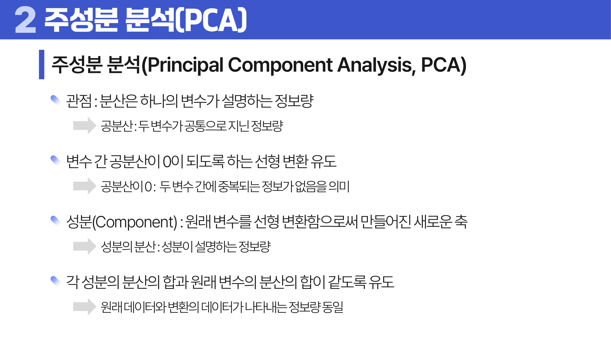
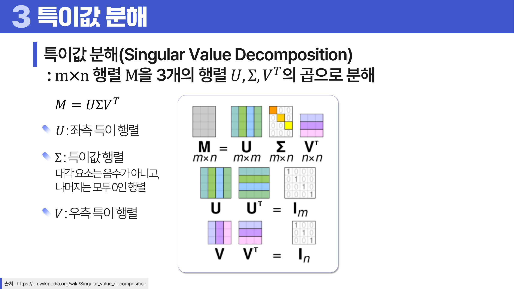
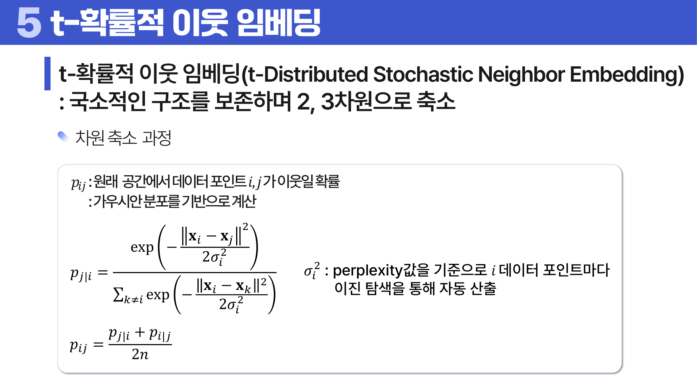
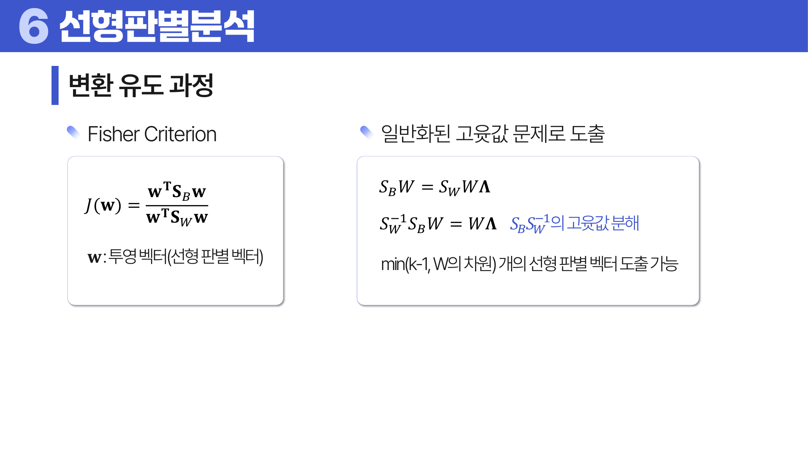

# 17. 차원 축소

## 학습 목표

이 차시를 마치면 다음을 쉬운 말로 설명할 수 있으면 충분하다.

- PCA가 분산을 가장 많이 보존하는 방향을 찾는다는 점을 이해한다.
- MDS와 t-SNE는 거리 구조를 낮은 차원에 보이게 하는 방법임을 설명한다.
- LDA와 PLS처럼 지도 정보가 들어가는 차원 축소를 구분한다.

## 오늘의 한 줄

차원 축소는 많은 변수의 정보를 가능한 보존하면서 더 적은 축으로 데이터를 표현하는 방법이다.

## 오늘 반드시 이해할 3가지

1. PCA가 분산을 가장 많이 보존하는 방향을 찾는다는 점을 이해한다.
2. MDS와 t-SNE는 거리 구조를 낮은 차원에 보이게 하는 방법임을 설명한다.
3. LDA와 PLS처럼 지도 정보가 들어가는 차원 축소를 구분한다.

## 이 차시 전에 알면 좋은 것

- **분산**: PCA가 많이 퍼진 방향을 정보로 보는 관점
- **공분산**: 변수들이 함께 움직이는 정도
- **시각화**: 고차원 구조를 낮은 차원에 보여 주는 목적 ([처음 설명된 차시](../01-data-understanding/README.md#8-시각화는-변수-타입과-질문의-함수다))

## 개념 지도

```text
차원 축소
├── PCA
├── SVD
├── MDS와 t-SNE
├── LDA와 PLS
└── 확인 문제와 해설
```

## 학습 우선순위

- **필수**: PCA는 변수 선택이 아니라 새 축을 만드는 것, 설명분산비로 남길 성분 수 판단, t-SNE 축 자체를 과해석하지 않기
- **심화**: SVD와 PCA의 연결
- **나중**: LDA와 PLS의 지도 정보 활용

## 이 차시에서 꼭 붙잡을 설명 방식

<a id="ref-17-pca"></a>[PCA](#note-17-pca)는 “<a id="ref-17-변수"></a>[변수](#note-17-변수)를 그냥 버리는 것”이 아니다. 데이터가 가장 많이 퍼진 방향을 새 축으로 만들고, 그 축을 앞에서부터 사용한다. 그래서 원래 변수 여러 개가 섞인 새 변수, 즉 주성분이 생긴다.

## 핵심 이론

### 먼저 잡는 직관

- **PCA**: PCA는 데이터가 가장 많이 퍼진 방향을 새 축으로 삼아 정보를 많이 남기며 차원을 줄인다.
- **SVD**: SVD는 행렬을 중요한 방향과 크기로 분해해 PCA와 추천, 압축의 기반이 된다.
- **MDS와 t-SNE**: MDS와 t-SNE는 점들 사이의 거리나 이웃 관계가 낮은 차원에서도 비슷하게 보이도록 배치한다.
- **LDA와 PLS**: LDA는 클래스 분리를 잘 보이게 하고, PLS는 입력과 출력의 공분산을 잘 설명하는 축을 찾는다.

### 1. PCA

공분산 구조를 이용해 분산을 많이 설명하는 축을 찾는다. 고유값은 각 주성분이 설명하는 분산의 크기이고, 고유벡터는 방향이다.



> **그림 읽기**: 데이터가 가장 많이 퍼진 방향을 새 축으로 잡는 모습을 본다. 정보 보존은 설명분산으로 판단한다.

### 2. SVD

행렬을 세 부분으로 분해해 중요한 구조를 추출한다. PCA와 연결되며 큰 데이터의 저차원 표현에 자주 쓰인다.



> **그림 읽기**: 행렬을 방향과 크기의 곱으로 분해하는 구조를 본다. 큰 특이값이 중요한 구조를 나타낸다.

### 3. MDS와 t-SNE

MDS는 거리 관계를 낮은 차원에 보존하려 하고, t-SNE는 가까운 이웃 구조를 시각화하는 데 강하다. t-SNE는 새 데이터 변환과 재현성에 주의해야 한다.



> **그림 읽기**: 원래 공간의 가까운 이웃 관계를 낮은 차원에서도 가깝게 보이게 하는 흐름을 본다. 축 자체보다 이웃 구조가 중요하다.

### 4. LDA와 PLS

LDA는 클래스 구분이 잘 되는 축을 찾고, PLS는 X와 y의 공분산을 잘 설명하는 성분을 찾는다. 지도 정보가 들어간다는 점이 PCA와 다르다.



> **그림 읽기**: 클래스 사이 거리는 크게, 클래스 안 퍼짐은 작게 만드는 방향을 본다. PCA와 달리 라벨 정보를 사용한다.

## 판단 기준

1. <a id="ref-17-차원-축소"></a>[차원 축소](#note-17-차원-축소) 목적이 시각화인지, 압축인지, 예측 전처리인지 구분한다.
2. PCA 전에는 변수 스케일이 주성분을 지배하지 않도록 <a id="ref-17-표준화"></a>[표준화](#note-17-표준화)를 확인한다.
3. 설명분산비로 몇 개 성분을 남길지 판단한다.
4. t-SNE 결과의 축 숫자와 군집 간 거리를 과도하게 해석하지 않는다.
5. 지도 정보를 쓰는 LDA/PLS와 비지도 방법인 PCA를 구분한다.

## 오해와 반례

### 오해 1. PCA는 중요한 원래 변수만 고르는 방법이다.

PCA는 원래 변수의 조합으로 새 축을 만든다. 변수 선택과 다르다.

### 오해 2. t-SNE 축의 숫자는 직접 해석하면 된다.

t-SNE의 축 자체보다 가까운 점들의 국소 구조를 해석해야 한다.

### 오해 3. 차원 축소는 항상 정보 손실이 없다.

차원을 줄이면 일부 정보는 버린다. 얼마나 보존되는지 확인해야 한다.

## 예시 풀이

### 예시 1. 설문 문항 50개 줄이기

서로 비슷한 문항들이 많다면 PCA로 몇 개의 성분으로 요약해 전체 경향을 볼 수 있다.

### 예시 2. 손글씨 데이터를 2차원으로 보기

t-SNE는 고차원 이미지 벡터의 이웃 구조를 2차원에 보여 주어 숫자별 군집을 시각화할 수 있다.

## 오늘의 요약 5줄

1. 차원 축소는 많은 변수의 정보를 가능한 보존하면서 더 적은 축으로 표현하는 방법이다.
2. PCA의 주성분은 원래 변수 하나가 아니라 여러 변수를 섞은 새 방향이다.
3. SVD는 행렬을 중요한 구조로 분해해 압축과 추천 등에 쓰인다.
4. t-SNE는 가까운 이웃 구조를 시각화하는 데 강하지만 축 자체의 의미는 약하다.
5. 차원을 줄이면 해석과 계산은 쉬워지지만 정보 손실 가능성은 항상 남는다.

## 확인 문제

1. PCA의 주성분이 무엇인지 설명하라.
2. PCA에서 설명분산비를 보는 이유를 설명하라.
3. PCA 전에 표준화가 필요한 이유를 설명하라.
4. SVD가 차원 축소와 연결되는 이유를 설명하라.
5. t-SNE 결과를 해석할 때 조심할 점을 설명하라.
6. LDA와 PCA의 차이를 설명하라.
7. 왜 PCA는 원래 변수 하나를 고르는 방법이 아닌가?
8. 왜 t-SNE 그림에서 군집 사이 거리를 과하게 해석하면 위험한가?

## 개념 주석

본문에서 연결된 개념을 잠깐 확인하는 공간이다. 용어를 누르면 본문에서 처음 표시된 위치로 돌아간다.

- <a id="note-17-pca"></a>[PCA](#ref-17-pca): 분산을 가장 많이 보존하는 새 축을 찾는 방법.
- <a id="note-17-변수"></a>[변수](#ref-17-변수): 관측 대상의 특징을 적어 둔 열. ([처음 설명된 차시](../01-data-understanding/README.md#4-단위-변수-관측치))
- <a id="note-17-차원-축소"></a>[차원 축소](#ref-17-차원-축소): 많은 변수를 더 적은 축으로 표현하는 방법.
- <a id="note-17-표준화"></a>[표준화](#ref-17-표준화): 평균을 0, 표준편차를 1 기준으로 맞추는 변환. ([처음 설명된 차시](../03-data-transformation/README.md#2-정규화와-표준화))
