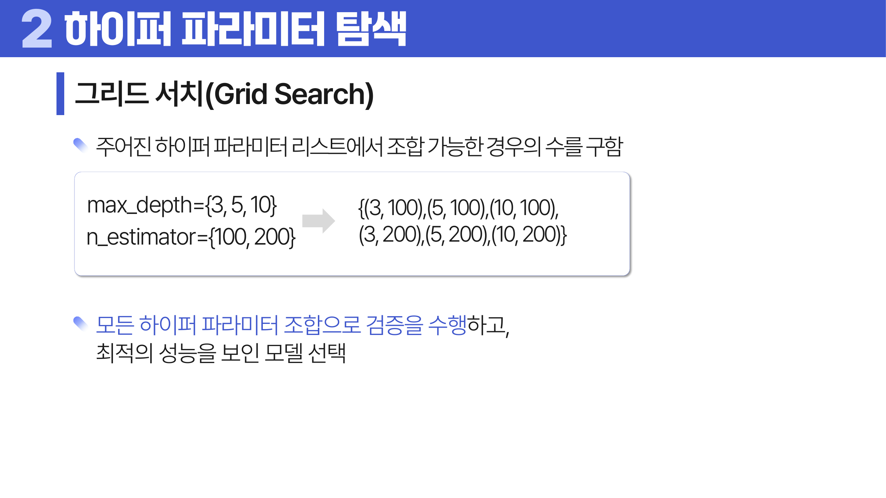
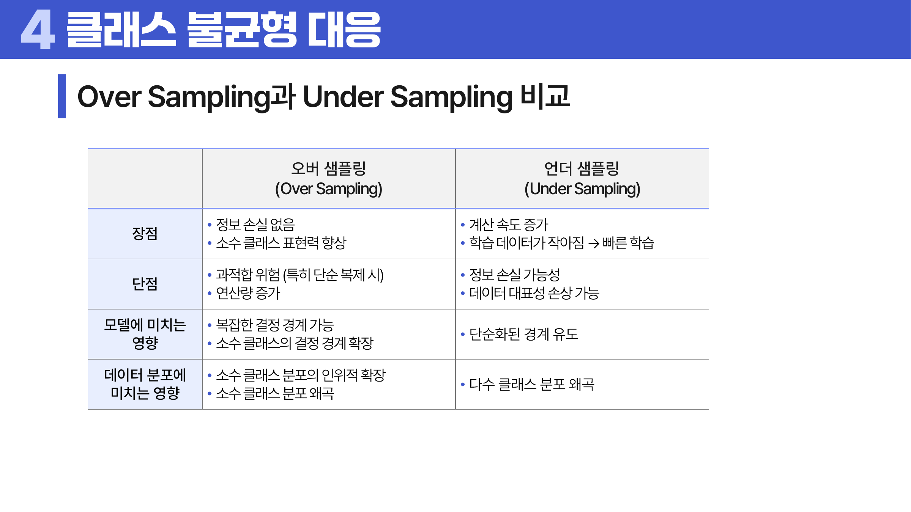
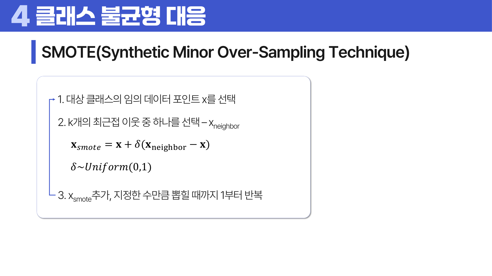
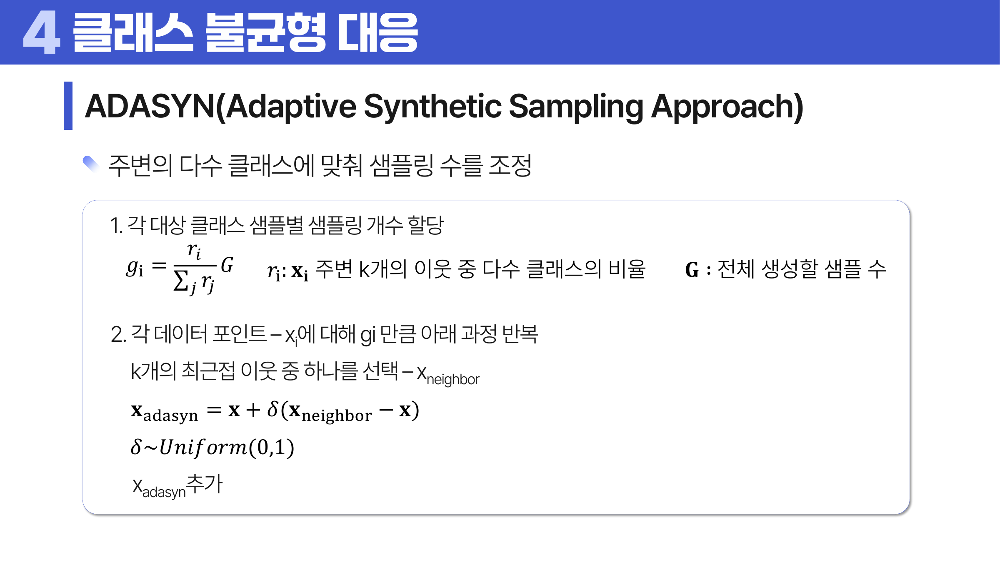

# 18. 일반화 기법

## 학습 목표

이 차시를 마치면 다음을 쉬운 말로 설명할 수 있으면 충분하다.

- 하이퍼파라미터 탐색이 모델 바깥 설정을 고르는 과정임을 이해한다.
- 속성 선택 방법을 Filter, Wrapper, Embedded로 구분한다.
- 클래스 불균형에서는 정확도보다 재현율, 정밀도, 임계값, 샘플링을 함께 봐야 함을 이해한다.

## 오늘의 한 줄

일반화 기법은 모델이 훈련 데이터가 아니라 새 데이터에서도 잘 작동하도록 조정하는 방법이다.

## 오늘 반드시 이해할 3가지

1. 하이퍼파라미터 탐색이 모델 바깥 설정을 고르는 과정임을 이해한다.
2. 속성 선택 방법을 Filter, Wrapper, Embedded로 구분한다.
3. 클래스 불균형에서는 정확도보다 재현율, 정밀도, 임계값, 샘플링을 함께 봐야 함을 이해한다.

## 이 차시 전에 알면 좋은 것

- **검증**: 튜닝을 테스트 데이터가 아닌 검증 데이터로 한다는 원칙
- **성능 지표**: 불균형에서 정확도만 보면 위험한 이유
- **샘플링**: 훈련 데이터 안에서만 분포를 바꿔야 하는 이유

## 처음 보는 단어

| 용어 | 먼저 이렇게 이해하기 |
|---|---|
| 일반화 | 새 데이터에서도 잘 작동하는 성질 |
| [하이퍼파라미터](#1-하이퍼파라미터-탐색) | 모델이 학습하기 전에 사람이 정하는 설정 |
| [그리드 서치](#1-하이퍼파라미터-탐색) | 후보 조합을 격자처럼 모두 탐색하는 방법 |
| 랜덤 서치 | 후보 조합을 무작위로 뽑아 탐색하는 방법 |
| [속성 선택](#2-속성-선택) | 모델에 사용할 변수를 고르는 과정 |
| [클래스 불균형](#3-클래스-불균형-지표) | 어떤 클래스의 표본 수가 다른 클래스보다 매우 적은 상태 |
| [SMOTE](#4-샘플링과-가중치) | 소수 클래스의 합성 표본을 만드는 오버샘플링 방법 |
| [ADASYN](#4-샘플링과-가중치) | 분류가 어려운 소수 클래스 주변에 합성 표본을 더 만드는 방법 |

## 핵심 개념 링크

- [하이퍼파라미터](#1-하이퍼파라미터-탐색): 모델이 학습하기 전에 사람이 정하는 설정
- [그리드 서치](#1-하이퍼파라미터-탐색): 후보 조합을 격자처럼 모두 탐색하는 방법
- [속성 선택](#2-속성-선택): 모델에 사용할 변수를 고르는 과정
- [클래스 불균형](#3-클래스-불균형-지표): 어떤 클래스의 표본 수가 다른 클래스보다 매우 적은 상태
- [SMOTE](#4-샘플링과-가중치): 소수 클래스의 합성 표본을 만드는 오버샘플링 방법
- [ADASYN](#4-샘플링과-가중치): 분류가 어려운 소수 클래스 주변에 합성 표본을 더 만드는 방법

## 용어 이름 먼저 풀기

| 용어 | 이름의 뉘앙스 |
|---|---|
| Hyper-parameter | 학습으로 자동 결정되는 값이 아니라 사람이 바깥에서 정하는 설정이다. |
| Grid Search | 격자처럼 모든 조합을 훑어본다는 뜻이다. |
| Random Search | 무작위로 조합을 뽑아 탐색한다는 뜻이다. |
| Feature Selection | 쓸 변수를 고르는 과정이다. |
| [SMOTE](#4-샘플링과-가중치) | 소수 클래스 사이를 보간해 synthetic, 즉 합성 표본을 만든다. |

## 개념 지도

```text
일반화 기법
├── 하이퍼파라미터 탐색
├── 속성 선택
├── 클래스 불균형 지표
├── 샘플링과 가중치
└── 확인 문제와 해설
```

## 학습 우선순위

- **필수**: 하이퍼파라미터와 파라미터 구분, 속성 선택의 세 방식, 불균형 데이터에서 지표와 샘플링 선택
- **심화**: SMOTE와 ADASYN의 합성 표본 차이
- **나중**: 중첩 교차검증과 임계값 최적화

## 이 차시에서 꼭 붙잡을 설명 방식

정확도는 클래스 불균형에서 쉽게 속인다. 전체의 99%가 정상인 데이터에서 전부 정상이라고 예측해도 정확도는 99%다. 하지만 우리가 찾고 싶은 사기나 질병 같은 소수 클래스는 하나도 못 찾는다. 그래서 재현율, 정밀도, F1 같은 지표가 필요하다.

## 앞뒤 연결

- **이전에서 이어지는 점**: 17차시까지 모델과 표현 방법을 봤다면, 18차시는 새 데이터 성능을 지키는 운영 규칙을 다룬다.
- **다음으로 이어지는 점**: 19차시에서는 신경망의 가장 단순한 단위인 퍼셉트론으로 넘어간다.

## 핵심 이론

### 먼저 잡는 직관

- **하이퍼파라미터 탐색**: 모델이 스스로 배우는 값이 아니라 사람이 정하는 설정을 검증 데이터로 고르는 과정이다.
- **속성 선택**: 모든 변수를 넣기보다 예측에 도움이 되는 변수만 남기면 해석과 일반화가 좋아질 수 있다.
- **클래스 불균형 지표**: 소수 클래스가 중요한 문제에서는 정확도보다 정밀도, 재현율, F1을 더 중요하게 봐야 할 수 있다.
- **샘플링과 가중치**: 소수 클래스를 더 자주 보게 하거나 더 큰 손실을 주어 모델이 무시하지 않게 만든다.

### 1. 하이퍼파라미터 탐색

그리드 서치는 후보 조합을 모두 본다. 랜덤 서치는 넓은 공간을 빠르게 탐색한다. 탐색은 검증 데이터나 교차검증으로 평가해야 한다.



> **그림 읽기**: 하이퍼파라미터 후보 조합을 격자처럼 모두 확인하는 흐름을 본다. 넓고 촘촘할수록 비용이 커진다.

### 2. 속성 선택

Filter는 변수와 타깃의 관계를 빠르게 점수화한다. Wrapper는 모델 성능을 보며 변수를 넣고 뺀다. Embedded는 모델 학습 과정에서 변수를 선택한다.

### 3. 클래스 불균형 지표

정확도보다 재현율, 정밀도, F1, 특이도, AUC 등을 본다. 어떤 오류가 더 비싼지에 따라 임계값도 조정한다.

AUC는 ROC curve 아래 면적이다. 정밀도와 재현율은 각각 “양성이라고 한 것 중 실제 양성이 얼마나 되는가”와 “실제 양성 중 얼마나 찾아냈는가”를 보므로, 불균형 데이터에서 정확도보다 더 직접적인 판단 기준이 될 수 있다.



> **그림 읽기**: 다수 클래스와 소수 클래스의 표본 수 차이가 지표를 왜곡하는 모습을 본다. 정확도만 보면 소수 클래스를 놓칠 수 있다.

### 4. 샘플링과 가중치

오버샘플링은 소수 클래스를 늘리고 언더샘플링은 다수 클래스를 줄인다. SMOTE와 ADASYN은 합성 표본을 만든다. 샘플링은 훈련 데이터 안에서만 해야 누수를 막을 수 있다.



> **그림 읽기**: 소수 클래스 이웃 사이를 이어 합성 표본을 만드는 방식을 본다. 단순 복제가 아니라 보간이 핵심이다.



> **그림 읽기**: 분류가 어려운 소수 클래스 주변에 더 많은 합성 표본을 만드는 흐름을 본다. 어려운 영역을 더 보강한다.

## 판단 기준

1. 튜닝은 검증 데이터에서 하고 테스트 데이터는 마지막 평가에만 사용한다.
2. 탐색 범위가 너무 좁거나 넓어 결과를 왜곡하지 않는지 확인한다.
3. 속성 선택은 교차검증 안에서 수행해 데이터 누수를 막는다.
4. 불균형 문제에서는 혼동행렬과 소수 클래스 성능을 함께 본다.
5. 오버샘플링은 훈련 데이터에만 적용한다.

## 오해와 반례

### 오해 1. 하이퍼파라미터 탐색은 테스트 데이터로 해도 된다.

테스트 데이터는 마지막 평가용이다. 탐색에 쓰면 성능 추정이 낙관적으로 변한다.

### 오해 2. 정확도가 높으면 불균형 문제는 없다.

다수 클래스만 맞혀도 정확도가 높을 수 있다. 소수 클래스 지표를 따로 봐야 한다.

### 오해 3. 오버샘플링은 전체 데이터에 먼저 적용해도 된다.

검증/테스트 정보가 훈련에 섞이는 누수가 생긴다. 훈련 데이터 안에서만 해야 한다.

## 예시 풀이

### 예시 1. 랜덤 포레스트 max_depth 고르기

여러 max_depth와 n_estimators 조합을 교차검증으로 비교해 새 데이터 성능이 좋은 설정을 고른다.

### 예시 2. 사기 탐지의 클래스 불균형

사기 거래가 1%라면 정확도보다 재현율, 정밀도, F1, AUC를 보고 클래스 가중치나 SMOTE를 검토한다.

## 오늘의 요약 5줄

1. 일반화 기법은 모델이 훈련 데이터가 아니라 새 데이터에서도 잘 작동하도록 돕는다.
2. 하이퍼파라미터는 학습 전에 정하는 설정이고 파라미터는 모델이 학습하는 값이다.
3. 그리드, 랜덤, 베이지안 탐색은 후보를 고르는 방식이 다르다.
4. 속성 선택은 불필요한 변수를 줄여 과대적합과 해석 부담을 낮출 수 있다.
5. 클래스 불균형에서는 정확도보다 소수 클래스의 놓침 비용을 기준으로 판단한다.

## 확인 문제

1. 하이퍼파라미터와 파라미터의 차이를 설명하라.
2. 그리드 탐색과 랜덤 탐색의 차이를 설명하라.
3. 테스트 데이터로 하이퍼파라미터를 고르면 안 되는 이유를 설명하라.
4. 속성 선택이 과대적합을 줄일 수 있는 이유를 설명하라.
5. 클래스 불균형에서 정확도가 위험한 이유를 설명하라.
6. 오버샘플링을 훈련 데이터에만 적용해야 하는 이유를 설명하라.
7. 왜 테스트 데이터로 하이퍼파라미터를 고르면 안 되는가?
8. 왜 오버샘플링은 훈련 데이터 안에서만 해야 하는가?
