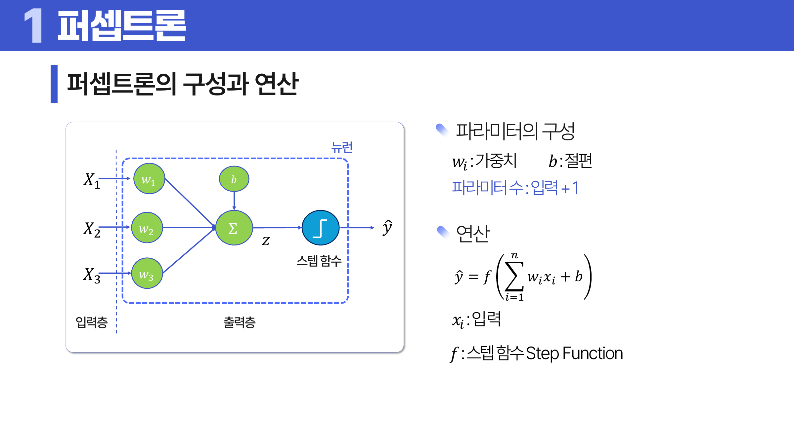
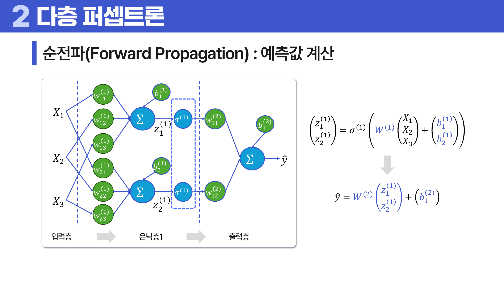
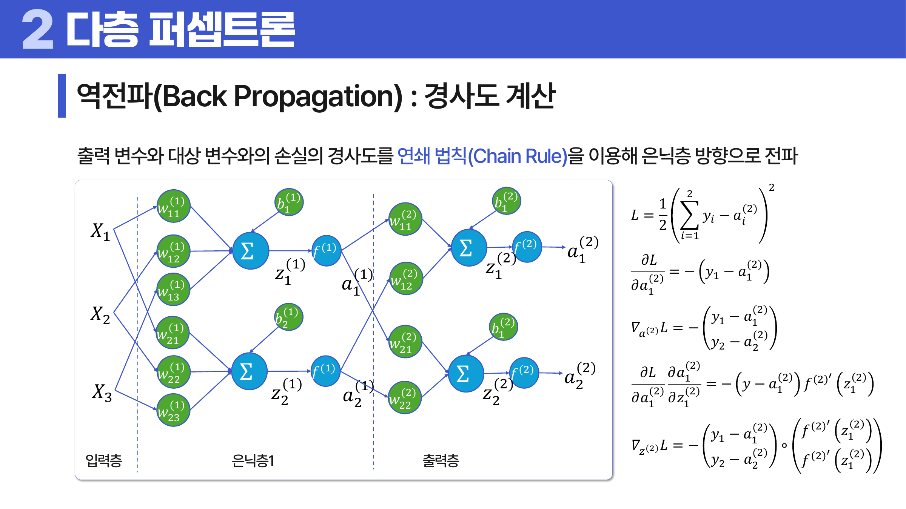
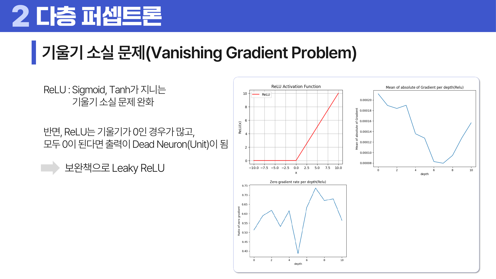

# 19. 퍼셉트론

## 학습 목표

이 차시를 마치면 다음을 쉬운 말로 설명할 수 있으면 충분하다.

- 입력, 가중치, 편향, 출력의 흐름을 이해한다.
- 단층 퍼셉트론의 한계와 다층 퍼셉트론이 필요한 이유를 설명한다.
- 순전파와 역전파, 활성화 함수, 기울기 소실을 직관적으로 이해한다.

## 오늘의 한 줄

퍼셉트론은 입력에 가중치를 곱해 더한 뒤 활성화 함수로 판단하는 가장 기본적인 신경망 단위다.

## 오늘 반드시 이해할 3가지

1. 입력, 가중치, 편향, 출력의 흐름을 이해한다.
2. 단층 퍼셉트론의 한계와 다층 퍼셉트론이 필요한 이유를 설명한다.
3. 순전파와 역전파, 활성화 함수, 기울기 소실을 직관적으로 이해한다.

## 이 차시 전에 알면 좋은 것

- **가중치**: 입력의 중요도를 숫자로 표현하는 값
- **경사하강법**: 가중치를 조금씩 고치는 방식 ([처음 설명된 차시](../12-parametric-models/README.md#2-경사하강법과-학습률))
- **분류**: 출력을 기준으로 클래스를 나누는 문제

## 개념 지도

```text
퍼셉트론
├── 단층 퍼셉트론
├── 다층 퍼셉트론
├── 활성화 함수
├── 역전파와 기울기 소실
└── 확인 문제와 해설
```

## 학습 우선순위

- **필수**: 입력-가중치-편향-활성화-출력 흐름, 비선형 활성화가 필요한 이유, 순전파와 역전파의 역할 차이
- **심화**: 기울기 소실의 원인
- **나중**: 다층 네트워크의 표현력 이론

## 이 차시에서 꼭 붙잡을 설명 방식

은닉층이 필요한 이유는 단순한 직선 경계로 나눌 수 없는 패턴이 많기 때문이다. 은닉층은 원래 입력을 다른 표현으로 바꿔서, 출력층이 더 쉽게 판단할 수 있는 특징을 만든다.

## 핵심 이론

### 먼저 잡는 직관

- **단층 퍼셉트론**: 입력에 가중치를 곱해 더한 값이 기준을 넘는지 보고 하나의 판단을 만든다.
- **다층 퍼셉트론**: 여러 층을 쌓으면 단순 직선으로 나누기 어려운 패턴도 조합해 표현할 수 있다.
- **활성화 함수**: 활성화 함수는 층 사이에 비선형성을 넣어 여러 층을 쌓는 의미를 만든다.
- **역전파와 기울기 소실**: 출력의 오차를 뒤로 전달해 가중치를 고치지만, 깊은 층에서는 기울기가 작아져 학습이 어려울 수 있다.

### 1. 단층 퍼셉트론

입력에 <a id="ref-19-가중치"></a>[가중치](#note-19-가중치)를 곱해 더하고 <a id="ref-19-편향"></a>[편향](#note-19-편향)을 더한 뒤 스텝 함수로 0/1을 판단한다. 선형 분리가 가능한 문제에 적합하다.



> **그림 읽기**: 입력, 가중치, 편향, 합산, 활성화의 순서를 본다. 단순한 흐름이 신경망의 기본 계산 단위다.

### 2. 다층 퍼셉트론

입력층과 출력층 사이에 은닉층을 추가하면 더 복잡한 비선형 패턴을 표현할 수 있다.

### 3. 활성화 함수

Sigmoid, tanh, ReLU는 신호를 비선형으로 바꾼다. 비선형성이 없으면 여러 층을 쌓아도 결국 하나의 선형 변환과 비슷해진다.

### 4. 역전파와 기울기 소실

순전파는 입력에서 출력 방향으로 계산을 흘려 예측값과 손실을 구하는 과정이다. 역전파는 그 손실의 기울기를 출력층에서 입력 쪽으로 되돌려 보내 각 가중치를 얼마나 고쳐야 하는지 계산한다. Sigmoid나 tanh는 양끝에서 기울기가 작아져 깊은 층에서 학습 신호가 약해질 수 있다.



> **그림 읽기**: 입력에서 출력 방향으로 예측값과 손실을 계산하는 흐름을 본다. 각 층의 출력이 다음 층의 입력이 된다.



> **그림 읽기**: 손실의 기울기를 출력층에서 앞쪽으로 전달하는 흐름을 본다. 연쇄 법칙으로 각 가중치의 수정 방향을 찾는다.



> **그림 읽기**: 깊은 층으로 갈수록 기울기가 작아져 학습 신호가 약해지는 상황을 본다. 활성화 함수 선택과 구조가 영향을 준다.

### 5. 층과 활성화 함수 비교

입력층, 은닉층, 출력층의 역할은 구분한다. 입력층은 데이터를 받아 다음 층으로 넘기고, 은닉층은 입력을 중간 표현으로 바꾸며, 출력층은 문제 유형에 맞는 최종 형태를 만든다. 이진 분류는 sigmoid 출력 하나, 다중 클래스 분류는 softmax 출력, 회귀는 선형 출력처럼 목적에 따라 마지막 층이 달라진다.

활성화 함수는 출력 범위와 기울기 특성이 다르다. Sigmoid는 0과 1 사이 확률처럼 해석하기 좋지만 양끝에서 기울기가 작다. tanh는 -1과 1 사이로 중심이 0에 가까워 sigmoid보다 나은 경우가 있지만 역시 포화 문제가 있다. ReLU는 양수 구간에서 기울기가 일정해 학습이 빠르지만 음수 구간에서 죽은 뉴런이 생길 수 있다.

다층 퍼셉트론의 파라미터 수는 층마다 `입력 수 x 출력 수 + 출력 수`로 계산한다. 마지막의 `출력 수`는 각 뉴런의 편향이다. 구조 그림이 복잡해 보여도 층별 입력과 출력 개수를 세면 된다.

## 판단 기준

1. 입력, 가중치, 편향, 활성화, 출력의 흐름을 순서대로 그린다.
2. <a id="ref-19-활성화-함수"></a>[활성화 함수](#note-19-활성화-함수)가 없으면 여러 층도 결국 하나의 선형식이 됨을 확인한다.
3. 은닉층이 어떤 중간 표현을 만들 수 있는지 예로 설명한다.
4. 역전파가 오차를 각 가중치의 책임으로 나누는 과정임을 이해한다.
5. <a id="ref-19-기울기-소실"></a>[기울기 소실](#note-19-기울기-소실)이 깊은 네트워크 학습을 어렵게 하는 이유를 본다.

## 오해와 반례

### 오해 1. 입력층도 학습 연산을 한다.

입력층은 데이터를 전달하는 역할이고, 보통 학습 파라미터는 다음 층의 가중치에 있다.

### 오해 2. 활성화 함수 없이 층을 많이 쌓아도 복잡한 모델이 된다.

비선형 활성화가 없으면 여러 선형 변환을 합쳐도 선형 변환과 비슷해진다.

### 오해 3. ReLU는 항상 문제를 해결한다.

ReLU는 기울기 소실을 줄이지만 음수 구간에서 죽은 뉴런 문제가 생길 수 있다.

## 예시 풀이

### 예시 1. 스팸 여부 단층 판단

단어 빈도에 가중치를 곱해 합산하고 기준보다 크면 스팸으로 판단하는 구조를 <a id="ref-19-퍼셉트론"></a>[퍼셉트론](#note-19-퍼셉트론)처럼 볼 수 있다.

### 예시 2. XOR 문제가 어려운 이유

직선 하나로 나눌 수 없는 패턴은 단층 퍼셉트론으로 표현하기 어렵다. 은닉층이 필요하다.

## 오늘의 요약 5줄

1. 퍼셉트론은 입력에 가중치를 곱해 더하고 활성화 함수로 판단하는 기본 신경망 단위다.
2. 단층 퍼셉트론은 선형으로 나눌 수 있는 문제에 강하지만 XOR 같은 문제는 어렵다.
3. 다층 퍼셉트론은 은닉층을 통해 더 복잡한 경계를 만들 수 있다.
4. 활성화 함수는 신경망에 비선형 표현력을 넣는다.
5. 역전파는 오차를 뒤로 보내 가중치를 조정하지만 깊어지면 기울기 소실이 생길 수 있다.

## 확인 문제

1. 퍼셉트론의 입력, 가중치, 편향, 출력 흐름을 설명하라.
2. 단층 퍼셉트론이 XOR 문제를 풀기 어려운 이유를 설명하라.
3. 은닉층이 필요한 이유를 설명하라.
4. 활성화 함수가 없으면 생기는 문제를 설명하라.
5. 역전파의 기본 직관을 설명하라.
6. 기울기 소실이 학습을 어렵게 하는 이유를 설명하라.
7. 왜 활성화 함수가 없으면 층을 많이 쌓아도 의미가 약한가?
8. 왜 역전파는 오차를 뒤로 보낸다고 표현하는가?
9. Sigmoid, tanh, ReLU의 장단점을 비교하라.
10. 다층 퍼셉트론의 파라미터 수를 계산하는 방법을 설명하라.

## 개념 주석

본문에서 연결된 개념을 잠깐 확인하는 공간이다. 용어를 누르면 본문에서 처음 표시된 위치로 돌아간다.

- <a id="note-19-가중치"></a>[가중치](#ref-19-가중치): 입력의 중요도를 나타내는 숫자.
- <a id="note-19-편향"></a>[편향](#ref-19-편향): 판단 기준을 이동시키는 상수.
- <a id="note-19-활성화-함수"></a>[활성화 함수](#ref-19-활성화-함수): 출력 신호를 비선형으로 바꾸는 함수.
- <a id="note-19-기울기-소실"></a>[기울기 소실](#ref-19-기울기-소실): 앞쪽 층으로 갈수록 학습 신호가 약해지는 현상.
- <a id="note-19-퍼셉트론"></a>[퍼셉트론](#ref-19-퍼셉트론): 입력에 가중치를 곱해 판단하는 기본 신경망 단위.
