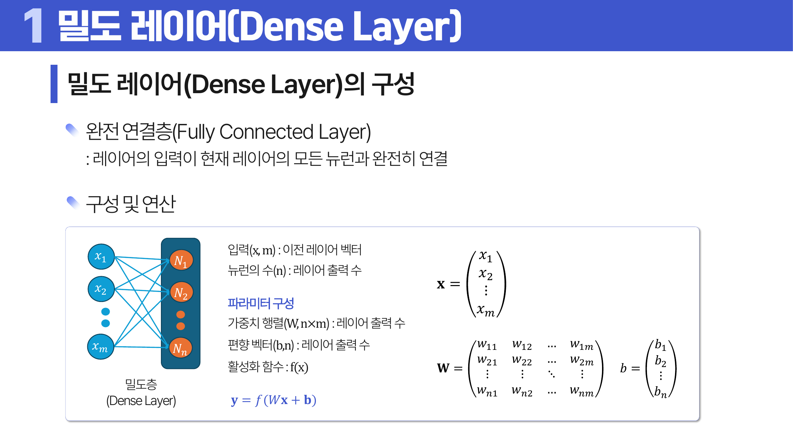
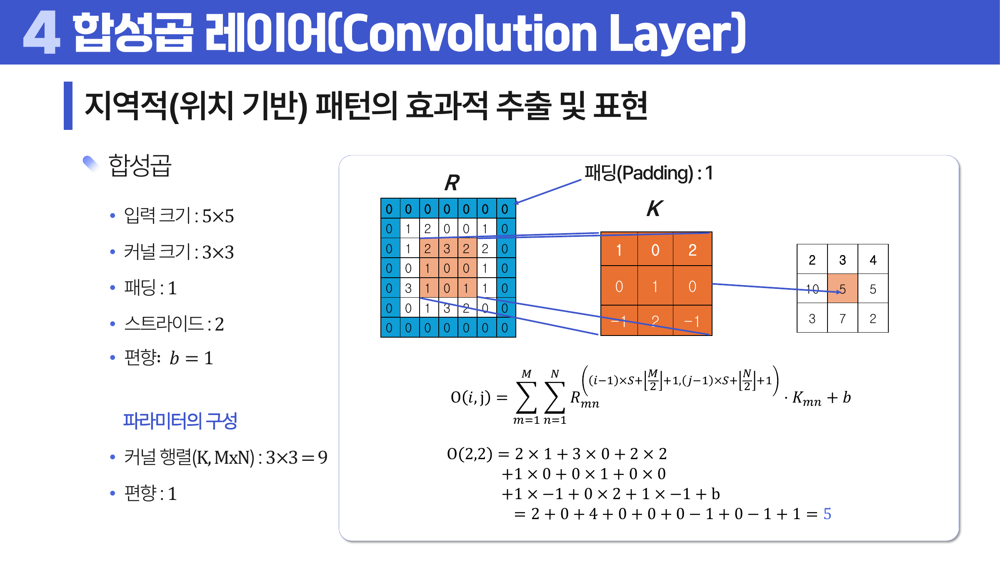
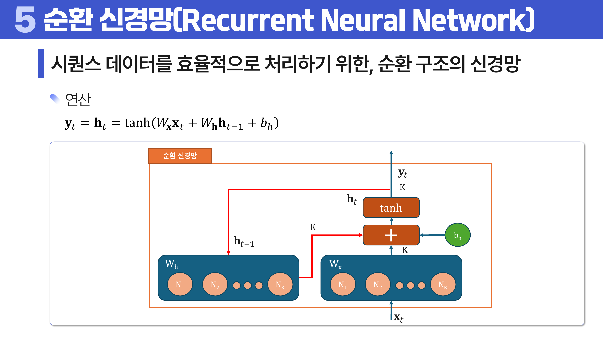
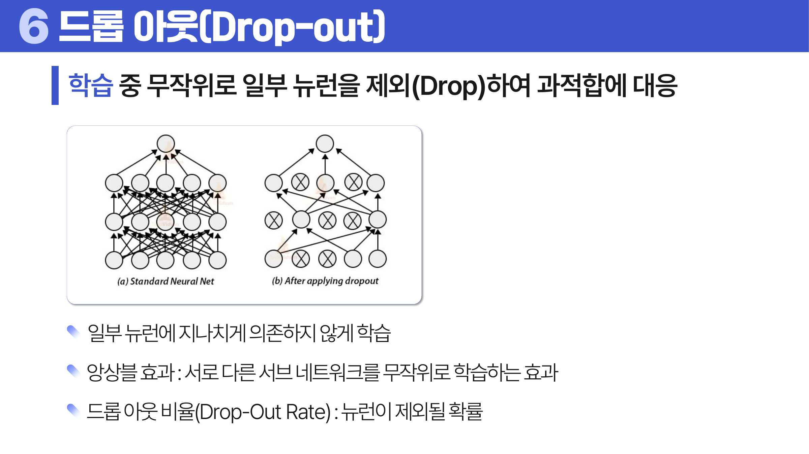

# 20. 신경망의 구성

## 학습 목표

이 차시를 마치면 다음을 쉬운 말로 설명할 수 있으면 충분하다.

- Dense, Embedding, CNN, RNN 계열 레이어의 역할을 구분한다.
- 합성곱과 풀링이 이미지의 지역 패턴을 다루는 이유를 설명한다.
- LSTM과 GRU가 RNN의 장기 의존성 문제를 줄이기 위한 구조임을 이해한다.

## 오늘의 한 줄

신경망의 레이어는 데이터의 형태에 맞춰 정보를 표현하고 압축하는 부품이다.

## 오늘 반드시 이해할 3가지

1. Dense, Embedding, CNN, RNN 계열 레이어의 역할을 구분한다.
2. 합성곱과 풀링이 이미지의 지역 패턴을 다루는 이유를 설명한다.
3. LSTM과 GRU가 RNN의 장기 의존성 문제를 줄이기 위한 구조임을 이해한다.

## 이 차시 전에 알면 좋은 것

- **퍼셉트론**: 뉴런 하나의 계산 흐름 ([처음 설명된 차시](../19-perceptron/README.md#1-단층-퍼셉트론))
- **활성화 함수**: 층을 쌓는 의미를 만드는 비선형성 ([처음 설명된 차시](../19-perceptron/README.md#3-활성화-함수))
- **데이터 형태**: 표, 이미지, 시퀀스가 필요한 레이어를 바꾼다

## 개념 지도

```text
신경망의 구성
├── Dense와 Embedding
├── CNN
├── RNN, LSTM, GRU
├── 보조 레이어
└── 확인 문제와 해설
```

## 학습 우선순위

- **필수**: Dense와 Embedding의 역할, CNN이 지역 패턴을 보는 이유, RNN/LSTM/GRU가 순서를 다루는 이유
- **심화**: Dropout과 BatchNorm의 훈련/추론 차이
- **나중**: 레이어별 파라미터 수 계산 최적화

## 이 차시에서 꼭 붙잡을 설명 방식

이미지는 가까운 픽셀끼리 의미가 연결되는 경우가 많다. <a id="ref-20-dense"></a>[Dense](#note-20-dense) 층은 모든 픽셀을 한꺼번에 연결해 위치 구조를 약하게 만들지만, 합성곱은 작은 필터로 주변 패턴을 반복해서 찾는다. 그래서 이미지에는 <a id="ref-20-cnn"></a>[CNN](#note-20-cnn)이 자연스럽다.

## 핵심 이론

### 먼저 잡는 직관

- **Dense와 Embedding**: Dense는 모든 입력을 가중치로 연결하고, Embedding은 범주나 단어를 의미 있는 벡터로 바꾼다.
- **CNN**: CNN은 작은 필터를 움직이며 이미지나 시계열의 지역 패턴을 잡는다.
- **RNN, LSTM, GRU**: 순서가 있는 데이터에서는 이전 정보가 다음 판단에 영향을 주므로 순환 구조가 필요하다.
- **보조 레이어**: Dropout, BatchNorm, Pooling 같은 레이어는 학습 안정성, 일반화, 정보 압축을 돕는다.

### 1. Dense와 Embedding

Dense는 일반적인 수치 벡터를 처리하는 기본 층이다. <a id="ref-20-embedding"></a>[Embedding](#note-20-embedding)은 단어, 사용자, 상품 같은 범주를 연속 벡터로 바꿔 의미적 관계를 학습한다.



> **그림 읽기**: 이전 층의 모든 입력이 현재 층의 모든 뉴런과 연결되는 구조를 본다. 파라미터 수가 빠르게 늘 수 있다.

### 2. CNN

합성곱은 필터로 지역 패턴을 찾고, 풀링은 영역별 대표값으로 정보를 압축한다. 위치 기반 패턴을 잘 다룬다.



> **그림 읽기**: 작은 필터가 입력 위를 이동하며 지역 패턴을 찾는 흐름을 본다. 같은 필터를 여러 위치에 공유한다.

### 3. RNN, LSTM, GRU

<a id="ref-20-rnn"></a>[RNN](#note-20-rnn)은 순서 데이터를 처리하지만 긴 의존성을 잘 보존하기 어렵다. <a id="ref-20-lstm"></a>[LSTM](#note-20-lstm)과 <a id="ref-20-gru"></a>[GRU](#note-20-gru)는 게이트 구조로 어떤 정보를 유지하고 버릴지 조절한다.



> **그림 읽기**: 현재 입력과 이전 상태를 함께 사용해 순서 정보를 유지하는 구조를 본다. 긴 의존성은 LSTM/GRU가 보완한다.

### 4. 보조 레이어

<a id="ref-20-dropout"></a>[Dropout](#note-20-dropout)은 과적합을 줄이고, <a id="ref-20-pooling"></a>[Pooling](#note-20-pooling)은 공간 크기를 줄이며, Batch Normalization은 학습 안정화와 연결된다.



> **그림 읽기**: 학습 중 일부 뉴런을 무작위로 제외하는 모습을 본다. 특정 뉴런에 과하게 의존하지 않게 만드는 장치다.

## 판단 기준

1. 데이터가 표 형태, 이미지, 텍스트, 시계열 중 무엇인지 먼저 확인한다.
2. 레이어가 입력 형태를 어떤 출력 형태로 바꾸는지 차원을 추적한다.
3. 파라미터 수가 너무 커져 과대적합 위험이 생기지 않는지 본다.
4. Embedding은 단순 번호가 아니라 학습되는 표현임을 구분한다.
5. Dropout과 BatchNorm의 훈련 시 동작과 추론 시 동작 차이를 확인한다.

## 오해와 반례

### 오해 1. Dense Layer는 모든 데이터에 항상 최선이다.

이미지나 시퀀스처럼 구조가 있는 데이터는 CNN이나 RNN 계열이 더 자연스러울 수 있다.

### 오해 2. Embedding은 단순한 번호 붙이기다.

번호가 아니라 학습되는 연속 벡터다. 범주 사이 관계를 표현할 수 있다.

### 오해 3. Dropout은 예측할 때도 뉴런을 계속 버린다.

훈련 중 과적합을 줄이기 위해 사용하고, 추론 시에는 보정된 전체 네트워크를 사용한다.

## 예시 풀이

### 예시 1. 상품 ID를 모델에 넣기

상품 번호를 그대로 수치로 쓰면 크기 의미가 생긴다. Embedding은 상품을 의미 있는 벡터로 바꿔 학습한다.

### 예시 2. 문장 감성 분석

단어 순서가 의미에 영향을 주므로 RNN, LSTM, GRU 같은 시퀀스 구조를 고려할 수 있다.

## 오늘의 요약 5줄

1. 신경망 레이어는 데이터 형태에 맞춰 정보를 표현하고 압축하는 부품이다.
2. Dense Layer는 모든 입력과 출력을 연결하므로 파라미터 수를 계산할 수 있어야 한다.
3. Embedding은 범주나 단어를 모델이 학습할 수 있는 dense vector로 바꾼다.
4. CNN은 지역 패턴을 찾고, RNN 계열은 순서 정보를 다룬다.
5. 보조 레이어는 성능을 직접 예측하기보다 학습 안정성과 일반화를 돕는다.

## 확인 문제

1. Dense Layer의 파라미터 수를 설명하라.
2. Embedding이 단순 라벨 인코딩과 다른 이유를 설명하라.
3. CNN의 필터가 하는 일을 설명하라.
4. RNN이 순서 데이터에 적합한 이유를 설명하라.
5. LSTM과 GRU가 단순 RNN의 어떤 문제를 줄이려는지 설명하라.
6. Dropout이 과대적합을 줄이는 직관을 설명하라.
7. 왜 이미지에는 Dense보다 CNN이 자연스러운 경우가 많은가?
8. 왜 Dropout은 과적합을 줄이는 데 도움이 되는가?

## 개념 주석

본문에서 연결된 개념을 잠깐 확인하는 공간이다. 용어를 누르면 본문에서 처음 표시된 위치로 돌아간다.

- <a id="note-20-dense"></a>[Dense](#ref-20-dense): 이전 층의 모든 입력이 현재 층의 모든 뉴런과 연결되는 층. 이름: 모든 입력과 뉴런이 빽빽하게 연결된 층이다.
- <a id="note-20-cnn"></a>[CNN](#ref-20-cnn): 필터로 지역 패턴을 찾는 합성곱 신경망.
- <a id="note-20-embedding"></a>[Embedding](#ref-20-embedding): 범주를 연속 벡터로 바꾸는 층. 이름: 범주를 의미 있는 연속 벡터 공간에 심는다는 뜻이다.
- <a id="note-20-rnn"></a>[RNN](#ref-20-rnn): 이전 상태를 다음 계산에 사용하는 순환 신경망.
- <a id="note-20-lstm"></a>[LSTM](#ref-20-lstm): 장기 정보를 보존하기 위한 게이트 구조 RNN.
- <a id="note-20-gru"></a>[GRU](#ref-20-gru): LSTM보다 단순한 게이트 구조 RNN.
- <a id="note-20-dropout"></a>[Dropout](#ref-20-dropout): 학습 중 일부 뉴런을 무작위로 제외하는 기법. 이름: 일부 뉴런을 잠시 떨어뜨려 의존을 줄인다.
- <a id="note-20-pooling"></a>[Pooling](#ref-20-pooling): 영역별 대표값으로 정보를 압축하는 연산.
