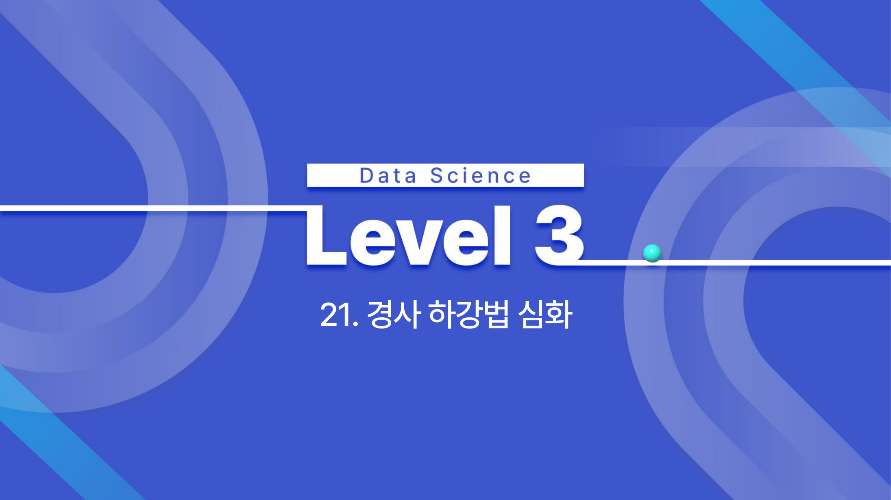

# 21. 경사 하강법 심화

## 학습 목표

이 차시를 마치면 다음을 쉬운 말로 설명할 수 있으면 충분하다.

- Batch, Stochastic, Mini-batch 경사하강법의 차이를 설명한다.
- Momentum, NAG, Adagrad, RMSProp, Adam의 직관을 이해한다.
- 학습률과 배치 크기가 안정성과 속도에 미치는 영향을 설명한다.

## 오늘의 한 줄

경사 하강법 심화는 손실을 줄이는 방향으로 얼마나 안정적이고 빠르게 움직일지 조절하는 방법을 다룬다.

## 오늘 반드시 이해할 3가지

1. Batch, Stochastic, Mini-batch 경사하강법의 차이를 설명한다.
2. Momentum, NAG, Adagrad, RMSProp, Adam의 직관을 이해한다.
3. 학습률과 배치 크기가 안정성과 속도에 미치는 영향을 설명한다.

## 처음 보는 단어

| 용어 | 먼저 이렇게 이해하기 |
|---|---|
| 배치 | 한 번에 묶어 계산하는 데이터 단위 |
| 에폭 | 전체 훈련 데이터를 한 번 모두 사용한 학습 단위 |
| SGD | 일부 표본으로 기울기를 추정해 업데이트하는 방식 |
| 미니배치 | 여러 표본을 작은 묶음으로 나눠 학습하는 방식 |
| Momentum | 이전 이동 방향을 일부 유지하는 관성 기법 |
| NAG | 미리 이동해 볼 위치에서 기울기를 보는 모멘텀 개선법 |
| Adagrad | 파라미터별 누적 기울기에 따라 학습률을 조정하는 방법 |
| RMSProp | 최근 기울기 크기를 기준으로 학습률을 조정하는 방법 |
| Adadelta | 누적 기울기 문제를 줄이도록 Adagrad를 보완한 방법 |
| Adam | 모멘텀과 적응형 학습률을 결합한 최적화 방법 |

## 용어 이름 먼저 풀기

| 용어 | 이름의 뉘앙스 |
|---|---|
| Batch | 한 번에 묶어 계산하는 데이터 묶음이다. |
| Epoch | 전체 데이터를 한 바퀴 학습한 단위다. |
| Stochastic | 무작위성이 들어간다는 뜻이다. |
| Momentum | 관성이다. 이전 이동 방향을 일부 유지한다. |
| RMSProp | root mean square propagation의 줄임말로, 최근 기울기 제곱 평균을 이용한다. |
| Adadelta | delta, 즉 변화량을 조절한다는 이름처럼 업데이트 크기를 안정화하려는 방법이다. |
| Adam | Adaptive Moment Estimation의 줄임말로, 모멘텀과 적응형 학습률을 함께 쓴다. |

## 개념 지도

```text
경사 하강법 심화
├── 배치 방식
├── Momentum과 NAG
├── Adagrad, RMSProp, Adadelta
├── Adam
└── 확인 문제와 해설
```

## 이 차시에서 꼭 붙잡을 설명 방식

SGD의 손실이 매번 부드럽게 내려가지 않는 이유는 매번 일부 표본만 보기 때문이다. 작은 배치는 계산이 빠르고 자주 업데이트하지만 방향이 noisy하다. 큰 배치는 안정적이지만 느리고 메모리를 많이 쓴다. 그래서 미니배치가 절충안으로 자주 쓰인다.

## 핵심 이론

### 먼저 잡는 직관

- **배치 방식**: 전체 데이터를 한 번에 볼지, 한 개씩 볼지, 작은 묶음으로 볼지에 따라 업데이트의 안정성과 속도가 달라진다.
- **Momentum과 NAG**: 이전 이동 방향을 기억하면 지그재그를 줄이고 완만한 방향으로 더 빠르게 갈 수 있다.
- **Adagrad, RMSProp, Adadelta**: 특징마다 기울기 크기가 다를 때 학습률을 자동으로 조절해 업데이트 균형을 맞춘다.
- **Adam**: Momentum의 방향 기억과 RMSProp의 학습률 조절을 함께 쓰는 대표 옵티마이저다.

### 1. 배치 방식

Batch GD는 전체 데이터를 보고 한 번 업데이트한다. SGD는 표본 하나 또는 작은 묶음으로 업데이트한다. Mini-batch는 안정성과 속도 사이의 절충이다.

에폭은 전체 훈련 데이터를 한 번 모두 사용한 단위다. 같은 에폭 수라도 배치 크기가 작으면 업데이트 횟수가 많아지고, 배치 크기가 크면 업데이트 횟수가 줄어든다.



### 2. Momentum과 NAG

Momentum은 이전 방향의 관성을 더해 좁은 골짜기에서 흔들림을 줄인다. NAG는 먼저 가볼 위치의 기울기를 보고 보정한다.

### 3. Adagrad, RMSProp, Adadelta

Adagrad는 자주 업데이트된 파라미터의 학습률을 줄인다. RMSProp은 최근 기울기 제곱 평균을 사용해 Adagrad의 과도한 감소 문제를 완화한다. Adadelta도 같은 문제의식에서 출발해 업데이트 크기가 지나치게 작아지는 현상을 줄이려는 방법이다.

### 4. Adam

Momentum과 RMSProp의 장점을 결합한다. 기본값으로 잘 작동하는 경우가 많지만, 빠른 수렴이 항상 좋은 일반화를 보장하지는 않는다.


## 판단 기준

1. 데이터 크기와 메모리에 맞는 batch size를 선택한다.
2. 손실이 흔들리는 것이 SGD의 자연스러운 변동인지, 학습률 문제인지 구분한다.
3. Momentum 계열은 이전 방향을 얼마나 반영하는지 확인한다.
4. Adaptive optimizer는 특징별 학습률이 어떻게 달라지는지 이해한다.
5. Adam을 쓰더라도 기본 학습률과 스케줄링 점검은 필요하다.

## 오해와 반례

### 오해 1. SGD는 손실이 매번 줄어야 정상이다.

작은 배치로 기울기를 추정하므로 손실이 흔들릴 수 있다. 전체 추세를 봐야 한다.

### 오해 2. 배치 크기는 클수록 항상 좋다.

크면 안정적이지만 메모리와 계산 비용이 커지고 업데이트가 덜 자주 일어난다.

### 오해 3. Adam을 쓰면 학습률 고민이 사라진다.

Adam도 학습률과 하이퍼파라미터에 영향을 받으며 빠른 수렴이 항상 좋은 일반화를 뜻하지 않는다.

## 예시 풀이

### 예시 1. 손실이 지그재그로 내려갈 때

미니배치 노이즈 때문일 수 있다. 배치 크기를 키우거나 학습률을 낮추면 안정성이 올라갈 수 있다.

### 예시 2. 희소한 단어 특징 학습

Adagrad는 자주 등장하지 않는 특징의 학습률을 상대적으로 크게 유지해 희소 특징 학습에 도움이 될 수 있다.

## 오늘의 요약 5줄

1. 경사 하강법 심화는 손실을 줄이는 방향으로 더 안정적이고 빠르게 이동하는 방법을 다룬다.
2. Batch GD는 안정적이지만 느릴 수 있고, SGD는 빠르지만 손실이 흔들릴 수 있다.
3. Mini-batch는 실제 딥러닝에서 속도와 안정성의 균형으로 가장 자주 쓰인다.
4. Momentum은 이전 이동 방향을 기억해 지그재그를 줄인다.
5. Adam은 방향 기억과 적응적 학습률을 결합하지만 만능 해답은 아니다.

## 확인 문제

1. Batch GD와 SGD의 차이를 설명하라.
2. Mini-batch가 실제 학습에서 자주 쓰이는 이유를 설명하라.
3. Momentum이 지그재그 이동을 줄이는 직관을 설명하라.
4. NAG가 Momentum을 어떻게 보완하는지 설명하라.
5. Adagrad와 RMSProp이 학습률을 조절하는 이유를 설명하라.
6. Adam을 써도 학습률을 점검해야 하는 이유를 설명하라.
