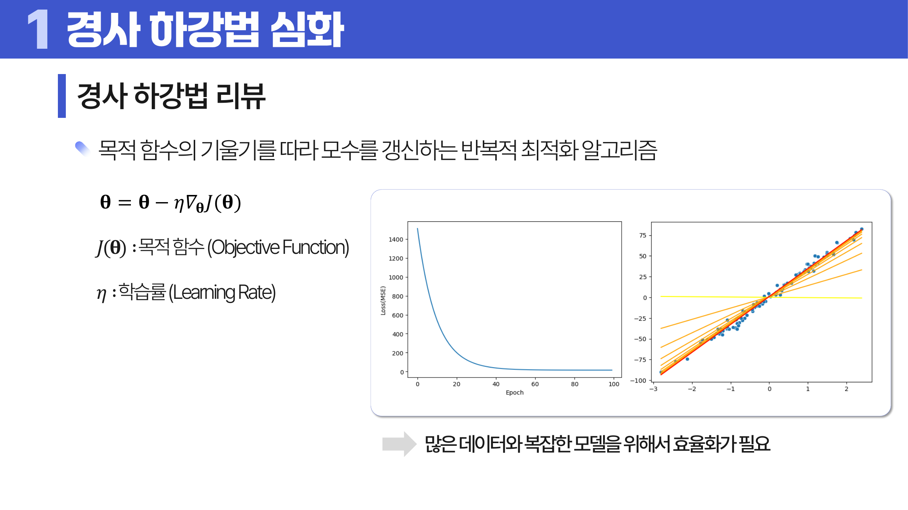
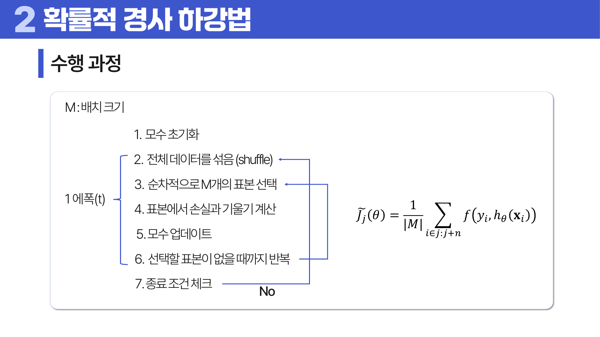
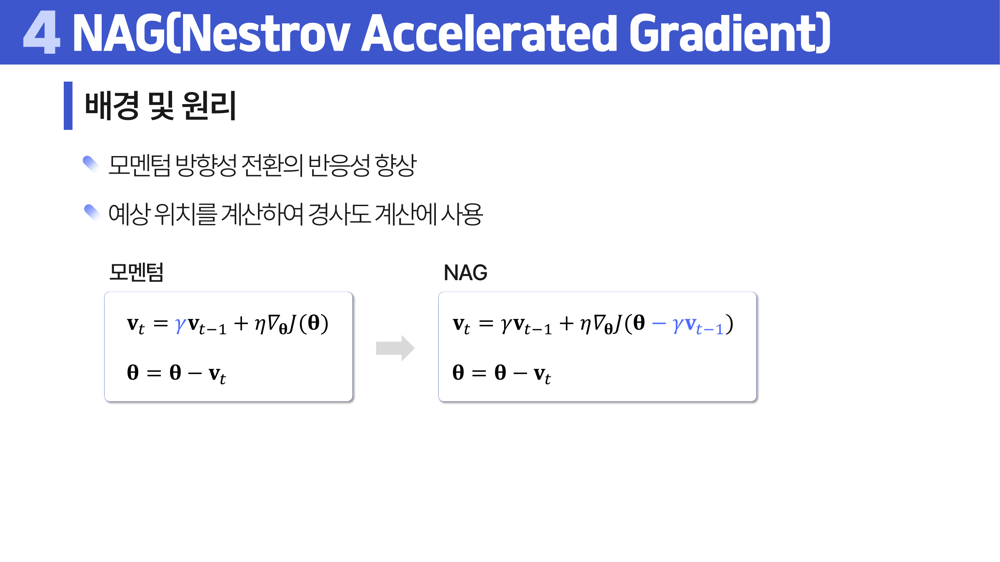
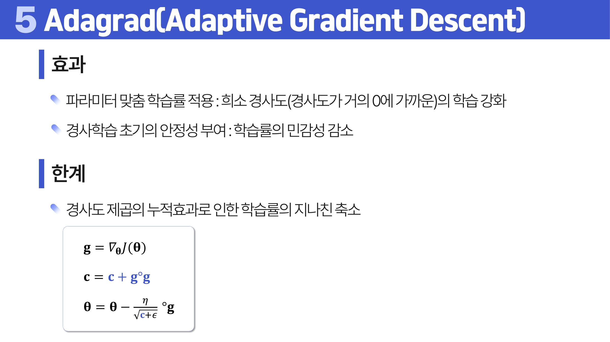
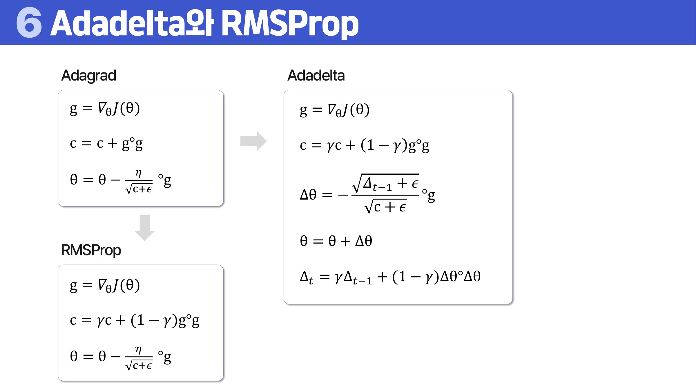
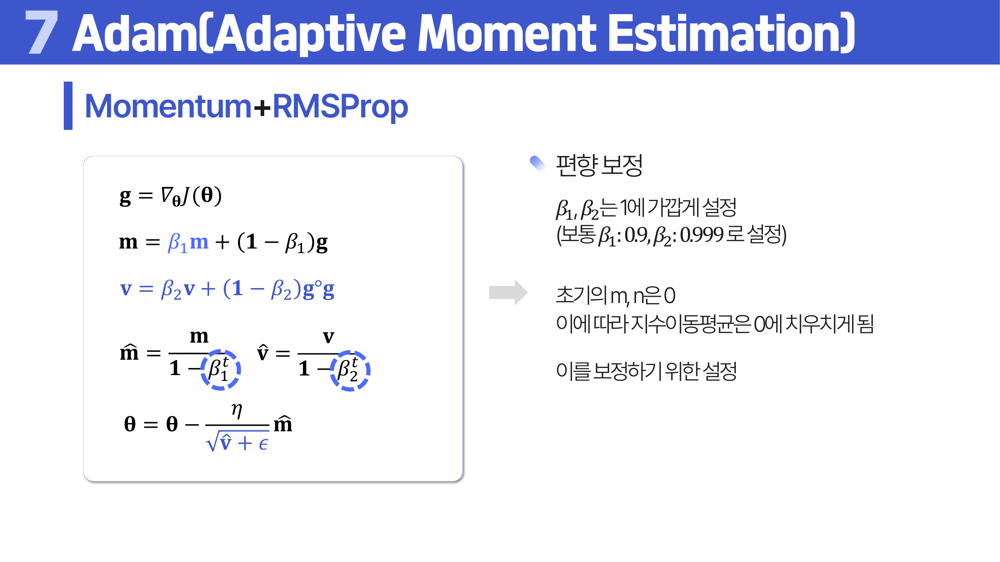

# 21. 경사 하강법 심화

## 학습 목표

이 차시를 마치면 다음을 쉬운 말로 설명할 수 있으면 충분하다.

- Batch, Stochastic, Mini-batch 경사하강법의 차이를 설명한다.
- Momentum, NAG, Adagrad, RMSProp, Adam의 직관을 이해한다.
- 학습률과 배치 크기가 안정성과 속도에 미치는 영향을 설명한다.
- 에폭, 배치, iteration, 업데이트 횟수를 구분해 학습 로그를 읽는다.

## 오늘의 한 줄

경사 하강법 심화는 손실을 줄이는 방향으로 얼마나 안정적이고 빠르게 움직일지 조절하는 방법을 다룬다.

## 오늘 반드시 이해할 3가지

1. Batch, Stochastic, Mini-batch 경사하강법의 차이를 설명한다.
2. Momentum, NAG, Adagrad, RMSProp, Adam의 직관을 이해한다.
3. 학습률과 배치 크기가 안정성과 속도에 미치는 영향을 설명한다.

## 이 차시 전에 알면 좋은 것

- **경사하강법**: 기울기 반대 방향으로 손실을 줄이는 기본 원리 ([처음 설명된 차시](../12-parametric-models/README.md#2-경사하강법과-학습률))
- **학습률**: 한 번에 움직이는 보폭
- **미니배치**: 일부 표본으로 기울기를 추정하는 방식
- **에폭**: 전체 훈련 데이터를 한 번 모두 사용한 단위

## 개념 지도

```text
경사 하강법 심화
├── 배치 방식
├── Momentum과 NAG
├── Adagrad, RMSProp, Adadelta
├── Adam
└── 확인 문제와 해설
```

## 학습 우선순위

- **필수**: Batch/SGD/Mini-batch 차이, Momentum과 NAG의 방향 기억, Adam이 Momentum과 적응 학습률을 결합한다는 점
- **심화**: Adagrad, RMSProp, Adadelta의 수식 차이
- **확장**: 스케줄러와 일반화 성능의 관계

## 이 차시에서 꼭 붙잡을 설명 방식

<a id="ref-21-sgd"></a>[SGD](#note-21-sgd)의 손실이 매번 부드럽게 내려가지 않는 이유는 매번 일부 <a id="ref-21-표본"></a>[표본](#note-21-표본)만 보기 때문이다. 작은 배치는 계산이 빠르고 자주 업데이트하지만 기울기 방향이 흔들리기 쉽다. 큰 배치는 안정적이지만 느리고 메모리를 많이 쓴다. 그래서 미니배치가 절충안으로 자주 쓰인다.

## 핵심 이론

### 먼저 잡는 직관

- **배치 방식**: 전체 데이터를 한 번에 볼지, 한 개씩 볼지, 작은 묶음으로 볼지에 따라 업데이트의 안정성과 속도가 달라진다.
- **Momentum과 NAG**: 이전 이동 방향을 기억하면 지그재그를 줄이고 완만한 방향으로 더 빠르게 갈 수 있다.
- **Adagrad, RMSProp, Adadelta**: 특징마다 기울기 크기가 다를 때 학습률을 자동으로 조절해 업데이트 균형을 맞춘다.
- **Adam**: Momentum의 방향 기억과 RMSProp의 학습률 조절을 함께 쓰는 대표 옵티마이저다.

### 1. 배치 방식

기본 경사하강법은 목적함수 \(J(\theta)\)의 기울기를 따라 모수를 반복 갱신한다.

```text
theta = theta - eta * grad_theta J(theta)
```

여기서 \(eta\)는 학습률이다. 데이터가 많거나 모델이 복잡하면 전체 데이터를 매번 모두 계산하는 방식이 비효율적이므로, 어떤 데이터 묶음으로 손실과 기울기를 계산할지 정해야 한다.

Batch GD는 전체 데이터를 보고 한 번 업데이트한다. 수행 흐름은 **모수 초기화 → 전체 데이터에서 손실과 기울기 계산 → 모수 업데이트 → 종료 조건 확인**이다. 한 번의 업데이트는 안정적이지만 데이터가 커질수록 무겁다.

Stochastic GD는 전체 데이터에서 일부를 샘플링해 손실을 근사한다. 전체 손실이 \(N\)개 표본의 평균이라면, 실제 업데이트에서는 배치 \(B\)에 들어온 표본만으로 평균 손실과 기울기를 계산한다. 그래서 계산은 가벼워지지만 배치가 전체를 잘 대표하도록 샘플링하는 것이 중요하다.

손실 근사 흐름은 다음 식으로 읽으면 된다.

```text
J(theta) = (1 / N) * sum_{i=1..N} f(y_i, h_theta(x_i))
J_tilde(theta) = (1 / |B|) * sum_{i in B} f(y_i, h_theta(x_i))
B subset {1, 2, ..., N}
J_tilde(theta) ~= J(theta)
```

즉 전체 손실 `J(theta)`를 매번 정확히 계산하지 않고, 배치 `B`의 평균 손실 `J_tilde(theta)`로 대신 추정한다. 이 추정이 전체를 잘 대표하려면 전체 데이터를 섞고(shuffle), 순차적으로 배치 크기 `M`만큼 표본을 고르는 과정이 필요하다.

실제 학습에서는 보통 다음 흐름을 쓴다.

1. 전체 데이터를 섞는다.
2. 배치 크기 \(M\)만큼 순서대로 표본을 고른다.
3. 그 표본 묶음에서 손실과 기울기를 계산한다.
4. 모수를 업데이트한다.
5. 고를 표본이 없을 때까지 반복한다.

한 에폭 안에서 `j`번째 미니배치의 손실은 다음처럼 쓸 수 있다.

```text
J_tilde_j(theta) = (1 / M) * sum_{i in j번째 배치} f(y_i, h_theta(x_i))
```

이 값을 이용해 기울기를 계산하고 모수를 업데이트한다. 배치 크기 `M`이 작으면 업데이트가 자주 일어나지만 추정 분산이 커져 손실이 더 흔들리고, `M`이 크면 더 안정적이지만 한 번의 업데이트 비용이 커진다.

에폭은 전체 훈련 데이터를 한 번 모두 사용한 단위다. 같은 에폭 수라도 배치 크기가 작으면 업데이트 횟수가 많아지고, 배치 크기가 크면 업데이트 횟수가 줄어든다. 배치가 너무 작으면 손실이 불안정하게 튈 수 있으므로, 손실이 크게 진동할 때는 배치 크기를 키우고 학습률을 낮추는 식으로 안정성을 높인다.

용어를 구분하면 학습 로그를 읽기 쉬워진다. 배치(batch)는 한 번에 손실과 기울기를 계산하는 표본 묶음이고, iteration 또는 step은 보통 그 배치 하나로 모수를 한 번 업데이트한 횟수다. 훈련 데이터가 1,000개이고 배치 크기가 100이면 한 에폭에는 10번의 업데이트가 있다. 배치 크기를 50으로 줄이면 한 에폭의 업데이트는 20번이 되지만, 각 업데이트의 기울기 추정은 더 흔들릴 수 있다.

Mini-batch는 안정성과 속도 사이의 절충이다. 원래 의미의 Stochastic GD는 전체 데이터 중 일부를 샘플링해 업데이트하는 넓은 뜻으로 쓰였지만, 많은 문헌에서는 배치 크기가 1이면 SGD, 1보다 크면 Mini-batch GD라고 부른다. 그래서 문맥상 "SGD"가 표본 하나를 뜻하는지, 작은 배치 전체를 뜻하는지 확인해야 한다.



> **그림 읽기**: 기울기 반대 방향으로 모수를 반복 갱신하는 기본 구조를 본다. 학습률이 보폭을 정한다.



> **그림 읽기**: 전체 데이터 대신 작은 묶음으로 손실과 기울기를 계산하는 흐름을 본다. 안정성과 속도의 절충이다.

### 2. Momentum과 NAG

Momentum은 진동(Oscillation)을 줄이기 위해 이전 업데이트 방향을 일정 비율 기억한다. 좁고 긴 골짜기에서는 좌우로 흔들리는 성분은 줄이고, 계속 같은 방향으로 향하는 성분은 관성처럼 이어 갈 수 있다.

```text
v_t = gamma * v_(t-1) + eta * grad_theta J(theta)
theta = theta - v_t
```

효과는 두 가지로 정리할 수 있다. 첫째, 좁은 골짜기에서 진동을 완화해 안정적으로 수렴한다. 둘째, 기울기가 거의 0에 가까운 정체 구간에서도 이전 관성 덕분에 빠져나올 수 있다. 대신 \(gamma\)를 튜닝해야 하고, 속도 벡터를 저장하므로 연산량과 메모리가 늘어난다.

NAG(Nesterov Accelerated Gradient)는 지금 위치의 기울기만 보는 대신, 모멘텀으로 먼저 가게 될 예상 위치의 기울기를 본다.

```text
v_t = gamma * v_(t-1) + eta * grad_theta J(theta - gamma * v_(t-1))
theta = theta - v_t
```

즉 "일단 관성대로 간 뒤의 위치"를 미리 보고 방향을 보정한다. 특히 볼록한 문제에서 빠른 수렴을 기대할 수 있고, 최적점 근처에서는 모멘텀보다 더 정밀하게 방향을 바꾸는 데 도움이 된다.



> **그림 읽기**: 먼저 가볼 위치의 기울기를 보고 보정하는 차이를 본다. 모멘텀보다 방향 전환에 더 민감하게 반응한다.

### 3. Adagrad, RMSProp, Adadelta

모든 파라미터에 같은 전역 학습률을 쓰면 어떤 파라미터에는 너무 크고, 어떤 파라미터에는 너무 작을 수 있다. 파라미터 수가 많아질수록 이 차이는 더 커진다. Adagrad는 각 파라미터의 과거 기울기 제곱을 누적해 파라미터별 학습률을 다르게 만든다.

```text
g = grad_theta J(theta)
c = c + g * g
theta = theta - eta / (sqrt(c) + epsilon) * g
```

여기서 곱셈, 제곱근, 나눗셈은 파라미터별 원소 단위 계산으로 이해하면 된다. Adagrad는 희소한 기울기처럼 자주 움직이지 않는 파라미터의 학습을 상대적으로 강화하고, 학습 초기에 학습률 민감도를 낮춰 안정성을 준다. 반대로 \(c\)가 계속 누적되면 분모가 커져 후반 학습률이 지나치게 작아질 수 있다.

안장점(saddle point) 예시인 \(z=x^2-y^2\)에서는 한 축으로는 잘 움직이지만 다른 축으로는 거의 움직이지 않는 상황이 생길 수 있다. 이때 전체 학습률을 무작정 키우면 불안정해지므로, 이동이 적었던 축에 상대적으로 큰 학습률을 주는 적응형 방식이 더 적절하다.

RMSProp은 최근 기울기 제곱 <a id="ref-21-평균"></a>[평균](#note-21-평균)을 사용해 Adagrad의 과도한 감소 문제를 완화한다.

```text
c = gamma * c + (1 - gamma) * g * g
theta = theta - eta / (sqrt(c) + epsilon) * g
```

Adadelta도 같은 문제의식에서 출발한다. 누적값을 끝없이 키우지 않고 지수이동평균을 쓰며, 이전 업데이트 크기 정보까지 함께 반영해 업데이트 크기가 지나치게 작아지는 현상을 줄이려는 방법이다.

세 방법은 모두 원소별 계산을 사용하지만, 무엇을 누적하고 어떻게 보정하는지가 다르다. 핵심 갱신식은 다음처럼 정리할 수 있다.

```text
Adagrad
g = grad_theta J(theta)
c = c + g * g
theta = theta - eta / (c + epsilon) * g

RMSProp
g = grad_theta J(theta)
c = gamma * c + (1 - gamma) * g * g
theta = theta - eta / (c + epsilon) * g

Adadelta
g = grad_theta J(theta)
c = gamma * c + (1 - gamma) * g * g
Delta_theta = - (Delta_{t-1} + epsilon) / (c + epsilon) * g
theta = theta + Delta_theta
Delta_t = gamma * Delta_{t-1} + (1 - gamma) * Delta_theta * Delta_theta
```

실무 구현에서는 분모에 `sqrt(c)`를 두는 표기도 자주 보지만, 이 차시에서는 “누적 제곱 기울기가 커질수록 해당 파라미터의 보폭이 줄어든다”는 구조를 먼저 잡으면 된다. Adagrad는 누적이 계속 커지는 방식이고, RMSProp과 Adadelta는 지수이동평균으로 최근 기울기에 더 큰 비중을 둔다.



> **그림 읽기**: 파라미터별로 학습률이 달라지는 효과를 본다. 자주 업데이트된 파라미터는 보폭이 점점 작아진다.



> **그림 읽기**: 기울기 누적 방식에 따라 학습률 조절이 달라지는지 비교한다. 희소 특징과 안정성에 영향을 준다.

### 4. Adam

Adam은 Momentum과 RMSProp의 장점을 결합한다. 기울기의 이동평균 \(m\)은 방향 기억을 담당하고, 기울기 제곱의 이동평균 \(v\)는 파라미터별 학습률 조절을 담당한다.

```text
g = grad_theta J(theta)
m = beta1 * m + (1 - beta1) * g
v = beta2 * v + (1 - beta2) * g * g
m_hat = m / (1 - beta1^t)
v_hat = v / (1 - beta2^t)
theta = theta - eta / (sqrt(v_hat) + epsilon) * m_hat
```

\(beta1\)과 \(beta2\)는 보통 1에 가깝게 둔다. 대표 기본값은 \(beta1=0.9\), \(beta2=0.999\)이다. 초기 \(m\)과 \(v\)가 0에서 시작하면 이동평균이 초기에 0 쪽으로 치우치므로, \(m_hat\), \(v_hat\)처럼 편향 보정을 한다.

Adam은 모수별 학습률을 자동으로 조절하고 하이퍼파라미터 설정에 비교적 덜 민감해 자주 쓰인다. 하지만 빠른 수렴이 오히려 과적합으로 이어질 수 있고, \(m\)과 \(v\)를 저장해야 하므로 SGD보다 메모리와 연산량이 크다. 기본값으로 잘 작동하는 경우가 많지만, 빠른 수렴이 항상 좋은 일반화를 보장하지는 않는다.



> **그림 읽기**: Momentum의 방향 기억과 RMSProp식 적응 학습률이 결합되는 구조를 본다. 기본값이 좋아도 검증은 필요하다.

### 5. 옵티마이저별 장단점

배치 크기에 따른 학습 추이와 여러 옵티마이저의 장단점을 비교한다. Batch GD는 기울기가 안정적이지만 한 번 업데이트가 무겁다. SGD는 빠르고 자주 업데이트하지만 손실이 많이 흔들린다. Mini-batch는 실제 딥러닝에서 둘 사이의 균형점으로 가장 자주 쓰인다.

Momentum은 좁고 긴 골짜기에서 좌우 진동을 줄이는 데 도움이 되지만, 관성이 너무 크면 최적점을 지나칠 수 있다. saddle point처럼 평평한 안장점이나 비볼록 표면에서는 기울기가 작아도 좋은 지점이라고 단정하기 어렵다. NAG는 먼저 이동할 위치를 보고 기울기를 계산해 이런 지나침을 줄이려 한다. Adagrad는 희소 특징에서 유용하지만 누적 제곱 기울기가 계속 커져 학습률이 너무 작아질 수 있다. RMSProp과 Adadelta는 최근 기울기에 더 무게를 두어 이 문제를 완화한다.

Adam은 Momentum의 1차 모멘트와 RMSProp식 2차 모멘트 조절을 결합한다. 빠르게 잘 수렴해 자주 쓰이지만, 일반화 성능이 항상 최고라는 뜻은 아니다. 학습률 스케줄, weight decay, 검증 손실을 함께 확인해야 한다.

저장해야 하는 보조 변수도 알고리즘마다 다르다. SGD는 별도 누적 변수가 거의 없고, Momentum은 속도 `v`를 저장한다. Adagrad와 RMSProp은 기울기 제곱 누적량 `c`를 저장한다. Adadelta는 `c`와 이전 업데이트 크기 누적량 `Delta`를 함께 둔다. Adam은 1차 모멘트 `m`과 2차 모멘트 `v`를 모두 저장하므로 편리한 대신 메모리와 연산량이 늘어난다.

학습 곡선을 볼 때는 훈련 손실, 검증 손실, 업데이트의 흔들림을 함께 해석한다. 훈련 손실과 검증 손실이 모두 내려가지 않으면 학습률이 너무 작거나 모델 표현력이 부족할 수 있다. 훈련 손실이 크게 튀고 발산하면 학습률이 너무 크거나 배치가 지나치게 작을 수 있다. 훈련 손실은 내려가는데 검증 손실이 올라가면 옵티마이저보다 과적합, 규제, 데이터 분리 문제를 먼저 의심한다.

## 판단 기준

1. 데이터 크기와 메모리에 맞는 batch size를 선택한다.
2. 손실이 흔들리는 것이 SGD의 자연스러운 변동인지, 학습률 문제인지 구분한다.
3. Momentum 계열은 이전 방향을 얼마나 반영하는지 확인한다.
4. Adaptive optimizer는 특징별 학습률이 어떻게 달라지는지 이해한다.
5. <a id="ref-21-adam"></a>[Adam](#note-21-adam)을 쓰더라도 기본 학습률과 스케줄링 점검은 필요하다.

## 오해와 반례

### 오해 1. SGD는 손실이 매번 줄어야 정상이다.

작은 배치로 기울기를 추정하므로 손실이 흔들릴 수 있다. 전체 추세를 봐야 한다.

### 오해 2. 배치 크기는 클수록 항상 좋다.

크면 안정적이지만 메모리와 계산 비용이 커지고 업데이트가 덜 자주 일어난다.

### 오해 3. Adam을 쓰면 학습률 고민이 사라진다.

Adam도 학습률과 <a id="ref-21-하이퍼파라미터"></a>[하이퍼파라미터](#note-21-하이퍼파라미터)에 영향을 받으며 빠른 수렴이 항상 좋은 일반화를 뜻하지 않는다.

## 예시 풀이

### 예시 1. 손실이 지그재그로 내려갈 때

미니배치 노이즈 때문일 수 있다. 배치 크기를 키우거나 학습률을 낮추면 안정성이 올라갈 수 있다.

### 예시 2. 희소한 단어 특징 학습

Adagrad는 자주 등장하지 않는 특징의 학습률을 상대적으로 크게 유지해 희소 특징 학습에 도움이 될 수 있다.

## 오늘의 요약 5줄

1. 경사 하강법 심화는 손실을 줄이는 방향으로 더 안정적이고 빠르게 이동하는 방법을 다룬다.
2. Batch GD는 안정적이지만 느릴 수 있고, SGD는 빠르지만 손실이 흔들릴 수 있다.
3. Mini-batch는 실제 딥러닝에서 속도와 안정성의 균형으로 가장 자주 쓰인다.
4. Momentum은 이전 이동 방향을 기억해 지그재그를 줄인다.
5. Adam은 방향 기억과 적응적 학습률을 결합하지만 만능 해답은 아니다.

## 확인 문제

1. Batch GD와 SGD의 차이를 설명하라.
2. Mini-batch가 실제 학습에서 자주 쓰이는 이유를 설명하라.
3. Momentum이 지그재그 이동을 줄이는 직관을 설명하라.
4. NAG가 Momentum을 어떻게 보완하는지 설명하라.
5. Adagrad와 RMSProp이 학습률을 조절하는 이유를 설명하라.
6. Adam을 써도 학습률을 점검해야 하는 이유를 설명하라.
7. 왜 미니배치 손실은 매번 부드럽게 내려가지 않을 수 있는가?
8. 왜 Momentum은 지그재그 움직임을 줄일 수 있는가?
9. Adagrad의 장점과 한계를 설명하라.
10. Adam이 Momentum과 RMSProp을 결합한다는 뜻을 설명하라.
11. 확률적 경사하강법에서 손실이 크게 튈 때 배치 크기와 학습률을 어떻게 조정하는 것이 적절한가?
12. NAG가 모멘텀을 개선하는 핵심 아이디어를 설명하라.
13. 안장점에서 특정 축의 이동이 거의 없을 때 적응형 학습률이 도움이 되는 이유를 설명하라.
14. 전체 손실 `J(theta)`와 미니배치 손실 `J_tilde(theta)`의 관계를 식으로 설명하라.
15. 원래 의미의 Stochastic GD와 문헌에서 자주 쓰는 SGD/Mini-batch 구분을 설명하라.
16. Adagrad, RMSProp, Adadelta가 기울기 제곱 정보를 쓰는 방식의 차이를 설명하라.
17. Adam에서 편향 보정이 필요한 이유를 설명하라.
18. 에폭, 배치, iteration의 차이를 예로 설명하라.
19. 배치 크기를 줄이면 한 에폭의 업데이트 횟수와 기울기 추정의 흔들림이 어떻게 달라지는지 설명하라.
20. 훈련 손실은 내려가는데 검증 손실이 올라갈 때 먼저 의심해야 할 문제를 설명하라.

## 개념 주석

본문에서 연결된 개념을 잠깐 확인하는 공간이다. 용어를 누르면 본문에서 처음 표시된 위치로 돌아간다.

- <a id="note-21-sgd"></a>[SGD](#ref-21-sgd): 일부 표본으로 기울기를 추정해 업데이트하는 방식.
- <a id="note-21-표본"></a>[표본](#ref-21-표본): 전체 대신 관찰한 일부 대상. ([처음 설명된 차시](../04-statistics-probability/README.md#2-모집단과-표본))
- <a id="note-21-평균"></a>[평균](#ref-21-평균): 모든 값을 더해 개수로 나눈 대표값. ([처음 설명된 차시](../04-statistics-probability/README.md#4-중심-경향))
- <a id="note-21-adam"></a>[Adam](#ref-21-adam): 모멘텀과 적응형 학습률을 결합한 최적화 방법. 이름: Adaptive Moment Estimation의 줄임말로, 모멘텀과 적응형 학습률을 함께 쓴다.
- <a id="note-21-하이퍼파라미터"></a>[하이퍼파라미터](#ref-21-하이퍼파라미터): 모델이 학습하기 전에 사람이 정하는 설정. ([처음 설명된 차시](../18-generalization-techniques/README.md#1-하이퍼파라미터-탐색))
