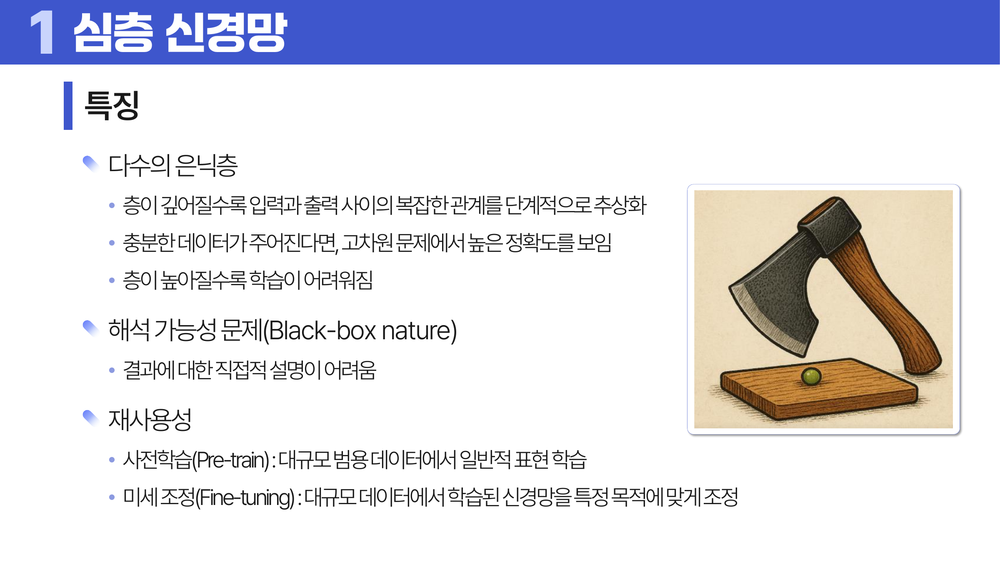
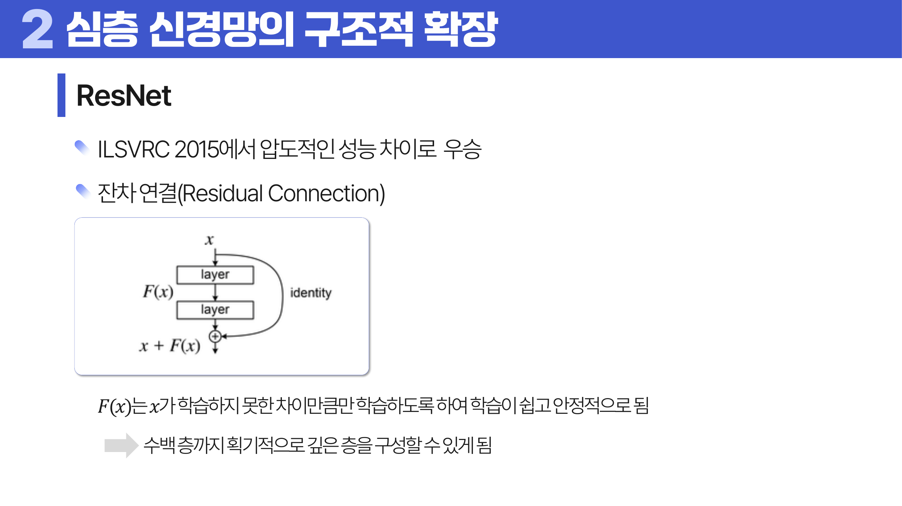
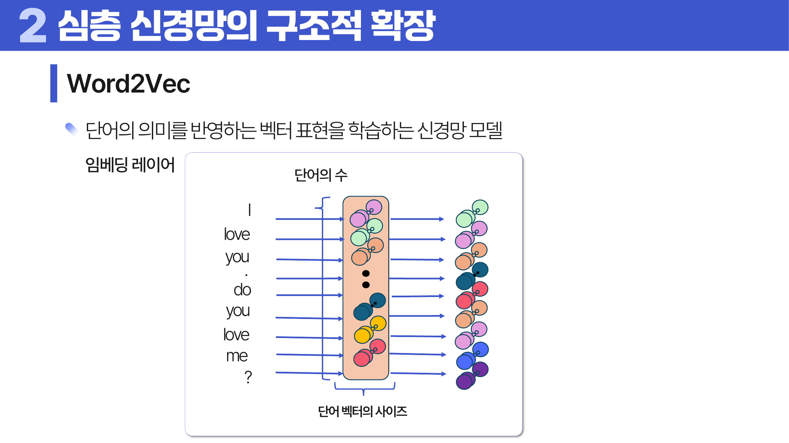
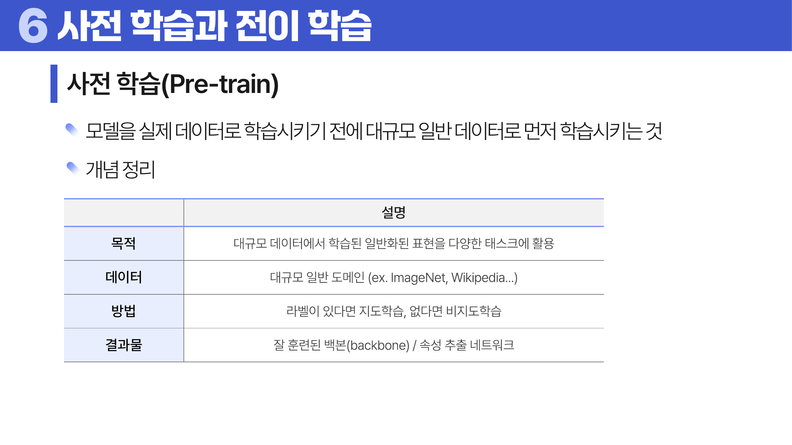

# 22. 심층 신경망

## 학습 목표

이 차시를 마치면 다음을 쉬운 말로 설명할 수 있으면 충분하다.

- 깊은 층이 단계적 추상화를 만든다는 점을 이해한다.
- 대표 구조인 AlexNet, VGG, Inception, ResNet의 이름과 핵심 아이디어를 구분한다.
- 사전학습, 전이학습, 미세조정이 왜 재사용성을 높이는지 설명한다.

## 오늘의 한 줄

심층 신경망은 여러 은닉층을 통해 낮은 수준의 신호를 점점 더 추상적인 표현으로 바꾼다.

## 오늘 반드시 이해할 3가지

1. 깊은 층이 단계적 추상화를 만든다는 점을 이해한다.
2. 대표 구조인 AlexNet, VGG, Inception, ResNet의 이름과 핵심 아이디어를 구분한다.
3. 사전학습, 전이학습, 미세조정이 왜 재사용성을 높이는지 설명한다.

## 이 차시 전에 알면 좋은 것

- **신경망 레이어**: 깊은 구조를 이루는 기본 블록
- **역전파**: 깊은 층까지 학습 신호가 전달되는 원리 ([처음 설명된 차시](../19-perceptron/README.md#4-역전파와-기울기-소실))
- **일반화**: 깊은 모델의 과적합과 전이학습 판단 기준

## 개념 지도

```text
심층 신경망
├── 대표 CNN 구조
├── Batch Normalization
├── Word2Vec과 표현 학습
├── 사전학습과 전이학습
└── 확인 문제와 해설
```

## 학습 우선순위

- **필수**: 깊은 층이 표현을 단계적으로 만든다는 점, BatchNorm과 잔차 연결이 학습 안정화를 돕는 이유, Word2Vec과 전이학습의 큰 그림
- **심화**: ResNet의 잔차 학습 직관
- **확장**: 대규모 사전학습 모델의 미세조정 전략

## 이 차시에서 꼭 붙잡을 설명 방식

깊은 네트워크가 특별한 이유는 층마다 표현이 달라지기 때문이다. 이미지에서는 앞쪽 층이 선이나 모서리를 보고, 뒤쪽 층이 눈, 얼굴, 물체 같은 더 추상적인 패턴을 볼 수 있다. 이 단계적 추상화가 깊은 모델의 힘이다.

## 핵심 이론

### 먼저 잡는 직관

- **대표 CNN 구조**: 깊은 CNN은 낮은 수준의 선과 색에서 시작해 점점 더 복잡한 패턴을 조합한다.
- **Batch Normalization**: 층마다 입력 분포가 크게 흔들리지 않도록 조정해 학습을 안정적으로 만든다.
- **Word2Vec과 표현 학습**: 단어의 의미를 주변 단어와의 관계 속에서 벡터 공간의 위치로 학습한다.
- **사전학습과 전이학습**: 큰 데이터에서 배운 표현을 새 문제에 가져와 적은 데이터에서도 시작점을 좋게 만든다.

### 1. 대표 CNN 구조

AlexNet은 깊은 <a id="ref-22-cnn"></a>[CNN](#note-22-cnn)의 가능성을 크게 보였고, VGG는 작은 필터를 깊게 쌓는 단순한 구조를 강조했다. GoogLeNet/Inception은 여러 필터 크기를 병렬로 쓰고, ResNet은 <a id="ref-22-잔차"></a>[잔차](#note-22-잔차) 연결로 매우 깊은 모델을 학습하기 쉽게 했다.



> **그림 읽기**: 층이 깊어질수록 표현이 단계적으로 추상화되는 모습을 본다. 깊이는 성능과 학습 난이도를 함께 키운다.



> **그림 읽기**: 입력을 몇 개 층 뒤의 출력에 다시 더하는 지름길 연결을 본다. ResNet의 residual은 회귀 잔차 진단이 아니라 깊은 층이 배워야 할 차이를 뜻한다.

### 2. Batch Normalization

층 입력의 <a id="ref-22-분포"></a>[분포](#note-22-분포)를 안정화해 학습을 돕는다. 내부 분포 변화가 너무 크면 각 층이 계속 새 입력 환경에 적응해야 하므로 학습이 불안정해진다.

### 3. Word2Vec과 표현 학습

단어를 원-핫이 아니라 의미 있는 벡터로 표현한다. CBOW는 주변 단어로 중심 단어를, Skip-gram은 중심 단어로 주변 단어를 예측한다.

CBOW는 Continuous Bag of Words의 줄임말로, 주변 단어들을 한 묶음처럼 보고 가운데 단어를 맞힌다. Skip-gram은 반대로 중심 단어에서 주변 단어들을 건너뛰며 예측한다는 느낌이다. 두 방식 모두 “비슷한 문맥에 나오는 단어는 의미도 비슷하다”는 생각을 벡터로 학습한다.



> **그림 읽기**: 단어를 주변 문맥으로부터 벡터로 배우는 흐름을 본다. 비슷한 문맥의 단어가 가까운 벡터가 된다.

### 4. 사전학습과 전이학습

큰 데이터에서 먼저 배운 표현을 새 문제에 가져오면 적은 데이터에서도 시작점이 좋아진다. 이것이 Transfer Learning, 즉 전이학습이다. 일부 층은 고정하고 일부 층만 미세조정할 수 있다.



> **그림 읽기**: 큰 데이터에서 배운 표현을 새 문제에 가져오는 흐름을 본다. 적은 데이터에서도 더 좋은 시작점을 준다.

### 5. 표현 관찰과 오토인코더

깊은 층이 무엇을 보는지 확인하기 위해 복원 이미지를 만드는 관점도 다룬다. 특정 층의 표현을 유지하도록 이미지를 복원하면, 낮은 층은 선과 질감 같은 세부 신호를 많이 보이고 높은 층은 물체의 형태나 의미에 가까운 정보를 더 보인다. 이 생각은 “깊은 층일수록 추상화된다”는 말을 눈으로 확인하는 방법이다.

Style 표현에서는 Gram matrix라는 요약이 자주 등장한다. Gram matrix는 여러 필터 반응이 서로 얼마나 함께 나타나는지를 담는다. 그래서 이미지의 정확한 위치보다 질감과 스타일 같은 통계적 패턴을 잡는 데 쓰인다.

오토인코더는 입력을 압축했다가 다시 복원하도록 학습하는 신경망이다. 인코더는 입력을 작은 표현으로 줄이고, 디코더는 그 표현에서 원래 입력을 재구성한다. 잡음 제거 오토인코더는 일부러 손상된 입력을 넣고 깨끗한 출력을 복원하게 해, 더 안정적인 표현을 배우게 한다. 이 구조는 차원 축소, 이상 탐지, 사전학습, 잡음 제거에 연결된다.

## 판단 기준

1. 깊은 층이 실제로 더 좋은 표현을 만드는지 검증 성능으로 확인한다.
2. <a id="ref-22-batch-normalization"></a>[Batch Normalization](#note-22-batch-normalization)이 훈련과 추론에서 다른 통계를 쓴다는 점을 확인한다.
3. 사전학습 모델의 입력 형태와 원래 학습 도메인이 새 문제와 맞는지 본다.
4. 미세조정할 층과 고정할 층을 데이터 크기와 유사도에 맞춰 고른다.
5. 깊은 모델은 성능뿐 아니라 계산 비용과 해석 난이도도 함께 고려한다.

## 오해와 반례

### 오해 1. 깊으면 무조건 좋다.

깊어질수록 계산 비용, 과적합, 기울기 문제, 해석 어려움이 커질 수 있다.

### 오해 2. 전이학습은 새 문제 학습이 필요 없다.

기존 표현을 가져오지만 새 데이터에 맞게 분류기 학습이나 미세조정이 필요하다.

### 오해 3. Batch Normalization은 단순히 데이터를 표준화하는 전처리다.

네트워크 내부 층의 활성값을 안정화하는 학습 과정의 구성요소다.

## 예시 풀이

### 예시 1. 이미지 분류 전이학습

ImageNet으로 학습된 CNN의 앞쪽 특징 추출 층을 가져오고, 새 데이터의 클래스에 맞게 마지막 층을 학습할 수 있다.

### 예시 2. ResNet의 잔차 연결

층이 배워야 할 전체 변환 대신 입력에서 얼마나 달라져야 하는지인 잔차를 배우게 해 깊은 모델 학습을 돕는다.

## 오늘의 요약 5줄

1. 심층 신경망은 여러 은닉층을 통해 신호를 점점 더 추상적인 표현으로 바꾼다.
2. CNN 구조는 지역 패턴을 층층이 조합해 이미지 특징을 학습한다.
3. Batch Normalization은 층 입력 분포를 안정화해 학습을 돕는다.
4. Word2Vec은 단어를 주변 맥락이 비슷하면 가까운 벡터로 표현한다.
5. 전이학습은 이미 배운 표현을 새 문제의 출발점으로 활용하는 방법이다.

## 확인 문제

1. 심층 신경망의 단계적 추상화를 설명하라.
2. CNN에서 깊은 층이 더 복잡한 특징을 잡는다는 뜻을 설명하라.
3. Batch Normalization이 학습을 안정화하는 이유를 설명하라.
4. Word2Vec이 단어를 벡터로 표현하는 직관을 설명하라.
5. 사전학습과 전이학습의 차이를 설명하라.
6. 미세조정할 때 일부 층을 고정하는 이유를 설명하라.
7. 왜 깊은 신경망은 단순히 층이 많다는 것 이상으로 이해해야 하는가?
8. 왜 전이학습은 적은 데이터 문제에 도움이 되는가?
9. Gram matrix가 스타일 표현에서 어떤 정보를 담는지 설명하라.
10. 오토인코더와 잡음 제거 오토인코더의 차이를 설명하라.

## 개념 주석

본문에서 연결된 개념을 잠깐 확인하는 공간이다. 용어를 누르면 본문에서 처음 표시된 위치로 돌아간다.

- <a id="note-22-cnn"></a>[CNN](#ref-22-cnn): 필터로 지역 패턴을 찾는 합성곱 신경망. ([처음 설명된 차시](../20-neural-network-architecture/README.md#2-cnn))
- <a id="note-22-잔차"></a>[잔차](#ref-22-잔차): 실제값과 예측값의 차이. ([처음 설명된 차시](../09-linear-regression/README.md#2-주요-가정))
- <a id="note-22-분포"></a>[분포](#ref-22-분포): 값들이 어떤 모양으로 흩어져 있는지 나타내는 구조. ([처음 설명된 차시](../05-probability-distributions/README.md#1-확률변수와-분포))
- <a id="note-22-batch-normalization"></a>[Batch Normalization](#ref-22-batch-normalization): 층 입력 분포를 안정화하는 기법.
